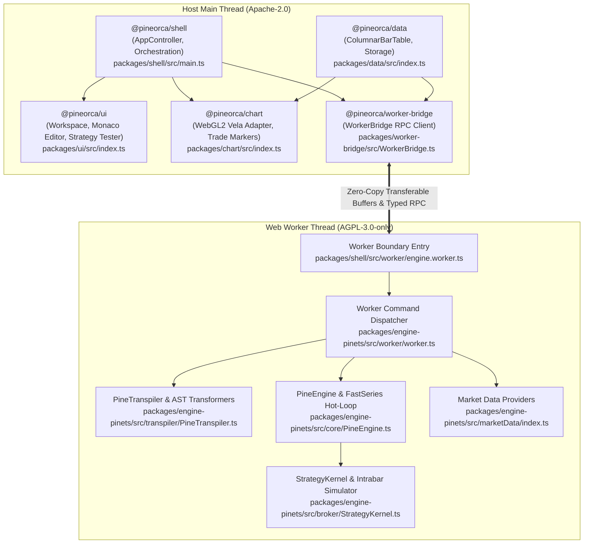

# PineOrca Architecture

This document describes the architectural decisions, system boundaries, memory model, execution pipeline, and licensing constraints of PineOrca.

## Licensing Boundary

PineOrca implements a dual-license architecture designed to preserve the commercial flexibility of client presentation layers while honoring copyleft obligations for the calculation engine:

- **Host & Client Packages (Apache-2.0):** User interface elements, chart rendering, data caching layers, and communication utilities (`@pineorca/shell`, `@pineorca/chart`, `@pineorca/ui`, `@pineorca/data`, `@pineorca/worker-bridge`) are licensed under Apache-2.0.
- **Engine Package (AGPL-3.0-only):** The Pine Script v5/v6 parsing, AST transformation, mathematical series runtime, and broker emulation subsystem (`@pineorca/engine-pinets`) are licensed under AGPL-3.0-only.

### Rationale and Isolation Seam

To prevent copyleft contamination across permissive packages, direct runtime dependencies and static or dynamic source imports from Apache-2.0 packages into `@pineorca/engine-pinets` are strictly prohibited.

The isolation boundary is established via an asynchronous Web Worker process:

1. **RPC Dispatcher:** The host application communicates with the engine exclusively via typed RPC messages defined in [`packages/worker-bridge/src/protocol.ts`](../packages/worker-bridge/src/protocol.ts) and orchestrated by [`packages/worker-bridge/src/WorkerBridge.ts`](../packages/worker-bridge/src/WorkerBridge.ts).
2. **Worker Bridge Script:** The Web Worker entry point at [`packages/shell/src/worker/engine.worker.ts`](../packages/shell/src/worker/engine.worker.ts) is the sole permitted bridge between host runtime environments and `@pineorca/engine-pinets`.
3. **Automated Enforcement:** CI and local verification runs execute [`packages/shell/test/licensing-boundary.test.ts`](../packages/shell/test/licensing-boundary.test.ts), which inspects all package manifests for prohibited runtime dependencies and performs static analysis over client source code to guarantee zero imports of `@pineorca/engine-pinets`.

## Columnar Memory & Zero-Copy Worker IPC

Financial backtesting engines process tens or hundreds of thousands of historical OHLCV bars across multi-year datasets. Representing each bar as an individual JavaScript heap object (`{ time, open, high, low, close, volume }`) creates severe bottlenecks:

- **Memory Fragmentation & Boxing Overhead:** Millions of allocated object headers exhaust browser heap memory and cause major garbage collection (GC) pauses during execution hot-loops.
- **IPC Serialization Latency:** Standard Web Worker `postMessage` transfers serialize JavaScript object trees via structured cloning, taking 50–200ms for large datasets.

### Struct-of-Arrays (SoA) Layout

PineOrca replaces object arrays with a continuous 64-byte aligned struct-of-arrays representation implemented in [`packages/data/src/columnar/ColumnarBarTable.ts`](../packages/data/src/columnar/ColumnarBarTable.ts):

- Six contiguous `Float64Array` slices (`time`, `open`, `high`, `low`, `close`, `volume`) reside within a single pre-allocated `ArrayBuffer`.
- Memory is transferred between the main thread and Web Worker in sub-millisecond time ($<1\text{ms}$) by passing the underlying `ArrayBuffer` in the `Transferable` list of `postMessage`.
- Engine calculations access bar series via [`packages/engine-pinets/src/core/FastSeries.ts`](../packages/engine-pinets/src/core/FastSeries.ts), providing $O(1)$ reverse-indexed access (`series[0]` current bar, `series[1]` previous bar) directly against contiguous numeric typed arrays with zero heap allocation during execution loops.

## Execution & Transpilation Pipeline

Pine Script is a domain-specific time-series language requiring specialized execution semantics: historical bar roll-forward, cross-series historical referencing (`series[n]`), secondary timeframe lookups (`request.security`), and intrabar order fill evaluation.

### Two-Stage Transpilation

Execution logic in [`packages/engine-pinets/src/transpiler/`](../packages/engine-pinets/src/transpiler/) operates in two discrete compilation stages:

1. **Pine Script to JavaScript Intermediate Representation (IR):** Source scripts are parsed and transformed into valid JavaScript syntax via [`packages/engine-pinets/src/transpiler/pineToJS/`](../packages/engine-pinets/src/transpiler/pineToJS/).
2. **AST Transformation & Scope Resolution:** Acorn AST passes ([`packages/engine-pinets/src/transpiler/PineTranspiler.ts`](../packages/engine-pinets/src/transpiler/PineTranspiler.ts)) inject context objects (`$`), bind variables to stateful scope managers, normalize persistent variables (`var`, `varip`), and generate the executable execution function.

### Synchronous Hot-Loop Execution

Standard dynamic script evaluation often invokes secondary timeframes (`request.security`) via asynchronous network or cache calls inside the loop, degrading throughput. PineOrca eliminates this overhead:

- The transpiler scans all `request.security` declarations upfront using `PineTranspiler.scanSecurityRequests`.
- Secondary timeframe data is pre-fetched, aligned to primary bar timestamps, and injected prior to script execution.
- This allows historical bars to execute in a purely synchronous numeric hot loop without microtask queue scheduling or Promise overhead.

### TradingView-Parity Broker Emulation

Strategy execution in [`packages/engine-pinets/src/broker/StrategyKernel.ts`](../packages/engine-pinets/src/broker/StrategyKernel.ts) emulates TradingView execution mechanics:

- **Order Matching:** [`packages/engine-pinets/src/broker/OrderMatcher.ts`](../packages/engine-pinets/src/broker/OrderMatcher.ts) evaluates market, limit, stop, and stop-limit orders across tick or bar boundaries with slippage and commission models.
- **Intrabar Simulation:** [`packages/engine-pinets/src/broker/IntrabarSimulator.ts`](../packages/engine-pinets/src/broker/IntrabarSimulator.ts) models intrabar price movement trajectories to resolve order execution sequence within historical bars.
- **Position & FIFO Ledger:** [`packages/engine-pinets/src/broker/FIFOLedger.ts`](../packages/engine-pinets/src/broker/FIFOLedger.ts) maintains open trade lots and computes realized trade profit and loss according to strict FIFO accounting.
- **Margin Calls & Metrics:** [`packages/engine-pinets/src/broker/MarginCallEngine.ts`](../packages/engine-pinets/src/broker/MarginCallEngine.ts) enforces margin liquidation rules, while [`packages/engine-pinets/src/broker/MetricsCalculator.ts`](../packages/engine-pinets/src/broker/MetricsCalculator.ts) computes Sharpe, Sortino, drawdown, and win-rate metrics upon backtest completion.

## Market Data Architecture

The market data layer in [`packages/engine-pinets/src/marketData/`](../packages/engine-pinets/src/marketData/) provides a unified provider interface for historical bar loading and real-time streaming:

- **Binance Provider (`BinanceProvider`):** Implemented in [`packages/engine-pinets/src/marketData/Binance/BinanceProvider.class.ts`](../packages/engine-pinets/src/marketData/Binance/BinanceProvider.class.ts), this provider fetches spot and futures klines via REST and connects to Binance WebSocket trade streams for sub-second live tick updates.
- **Yahoo Finance Provider (`YahooFinanceProvider`):** Implemented in [`packages/engine-pinets/src/marketData/Yahoo/YahooFinanceProvider.class.ts`](../packages/engine-pinets/src/marketData/Yahoo/YahooFinanceProvider.class.ts), supporting multi-asset historical bars for global equities and foreign exchange.
- **CORS Dev Proxy:** Browser environments restrict direct cross-origin HTTP calls to Yahoo Finance. The local development environment resolves this by routing queries through a Vite dev proxy (`/api/yahoo`) configured in [`packages/shell/vite.config.ts`](../packages/shell/vite.config.ts).

## Component Boundary Map

The following map illustrates the structural separation and interaction patterns between host and calculation subsystems:

### Subsystem Boundaries and Entry Points

| Subsystem | Primary Boundary Owner | Responsibilities |
|---|---|---|
| Main Application Shell | [`packages/shell/src/controller/AppController.ts`](../packages/shell/src/controller/AppController.ts) | Coordinates user events, feeds market data to the chart, and triggers backtest runs via the worker bridge. |
| Financial Chart Rendering | [`packages/chart/src/VelaChartAdapter.ts`](../packages/chart/src/VelaChartAdapter.ts) | Bridges columnar market data and engine plot/marker outputs to the WebGL2 rendering surface. |
| User Interface Components | [`packages/ui/src/workspace/PineOrcaWorkspace.ts`](../packages/ui/src/workspace/PineOrcaWorkspace.ts) | Manages editor layout, top bar controls, and the dockable Strategy Tester panel. |
| Columnar Data Buffers | [`packages/data/src/columnar/ColumnarBarTable.ts`](../packages/data/src/columnar/ColumnarBarTable.ts) | Allocates and serializes contiguous binary OHLCV buffers for zero-copy IPC transport. |
| Typed Worker Bridge | [`packages/worker-bridge/src/WorkerBridge.ts`](../packages/worker-bridge/src/WorkerBridge.ts) | Multiplexes commands, manages timeout handlers, and dispatches responses over Web Worker `postMessage`. |
| Calculation & Backtest Engine | [`packages/engine-pinets/src/core/PineEngine.ts`](../packages/engine-pinets/src/core/PineEngine.ts) | Orchestrates script execution, broker simulation, and performance metrics generation inside the worker. |
