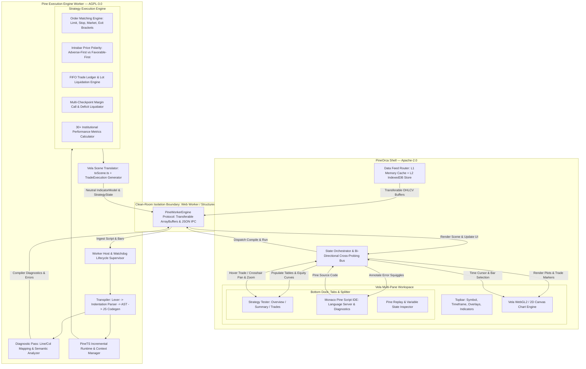
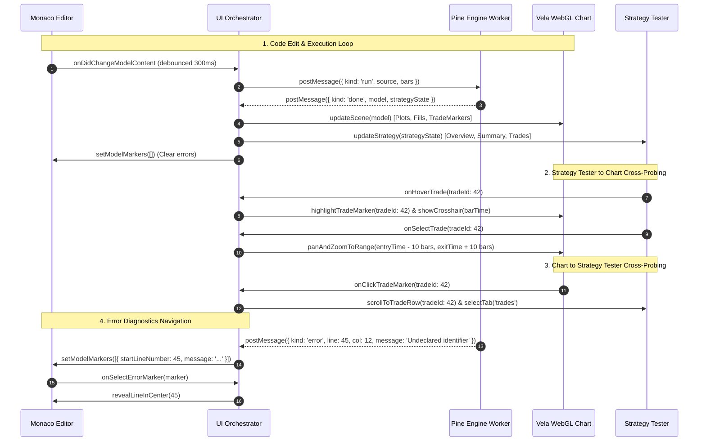
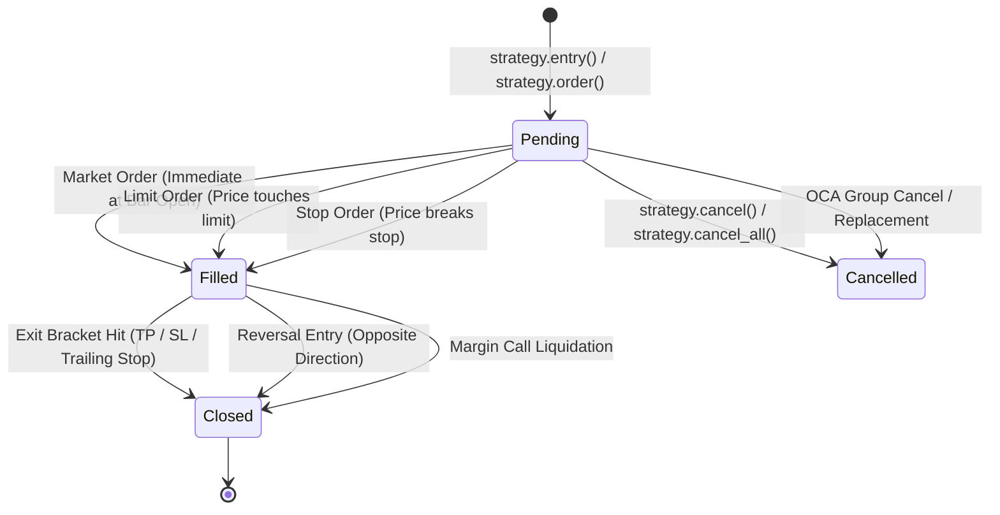
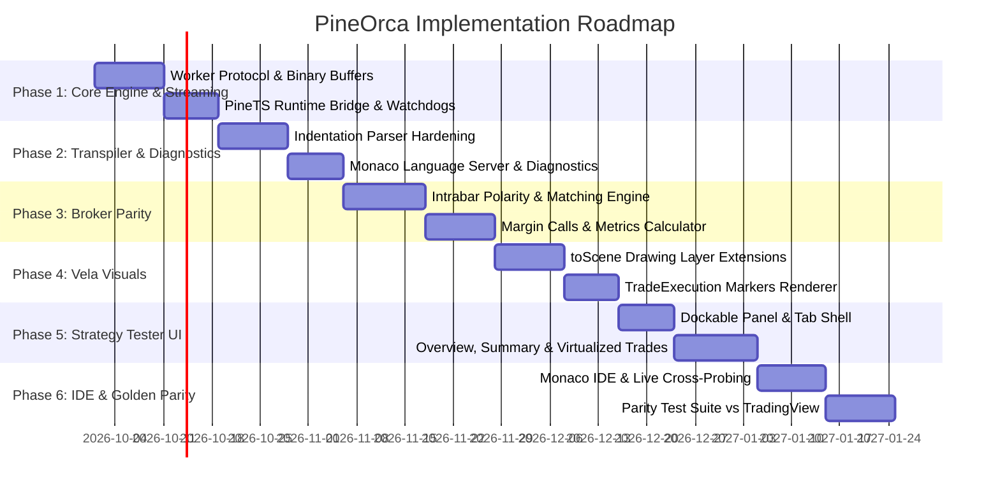

# PineOrca: High-Fidelity Pine Script v5/v6 Platform & Backtesting Architecture
## Candidate 4 — Developer-First Ergonomics, Test-Driven Parity Verification, Phased Milestones, Drawing Extensions, and Comprehensive Error Handling

---

### 1. Executive Summary & System Architecture

#### 1.1 Overview & Vision
**PineOrca** is an open, high-performance, browser-native algorithmic trading and quantitative research platform designed to achieve 100% execution, calculation, and visual parity with TradingView's Pine Script v5 and v6 ecosystems. 

While existing open-source trading libraries offer fragmented solutions—such as standalone technical analysis calculators or rudimentary charting canvases—PineOrca integrates:
1. **A Native Pine Script v5/v6 Execution Engine** based on PineTS, transpiling Pine Script source into high-throughput modern JavaScript, executing with zero-overhead stateful series, historical reverse-indexing, and exact built-in technical analysis math (`ta.*`).
2. **A Realistic, Microsecond-Accurate Broker Parity Engine** derived from PineTS's 2,301-line strategy kernel (`strategy/utils.ts`), reproducing TradingView's intra-bar price polarity, FIFO lot liquidation, trailing stop activations, slippage/commission models, and multi-stage margin call liquidations.
3. **A TradingView-Grade UI Experience** built on the Vela WebGL2 charting core, featuring high-density `TradeExecution` markers, interactive multi-pane drawings (boxes, lines, tables, labels, polylines), a dockable bottom panel hosting an interactive Strategy Tester (Performance Summary, Equity Curve, List of Trades), and an embedded Monaco Pine Script IDE with syntax highlighting, autocomplete, live diagnostics, and instant recompile.

Candidate 4 differentiates its architecture through **Developer-First Ergonomics**, **Test-Driven Parity Verification** against golden TradingView datasets, **Zero-Crash Resilience** through structured sandboxing and worker watchdogs, and a **Strict Licensing Seam** ensuring clean legal separation between copyleft (AGPL-3.0) and permissive (Apache-2.0) components.

---

#### 1.2 Top-Level Component Architecture



---

#### 1.3 End-to-End Data & Execution Lifecycle

The platform operates on an asynchronous, high-throughput reactive cycle:
1. **Source Ingestion**: The user writes or modifies Pine Script v5/v6 code within the Monaco Editor. On keystroke (debounced by 300ms) or on explicit "Save / Apply to Chart" (`Ctrl+S` / `Cmd+Enter`), the source code is dispatched through the `UI_Orchestrator`.
2. **Worker Dispatch**: The `PineWorkerEngine` serializes the execution request. High-resolution OHLCV bar data is transferred as binary `Float64Array` buffers to bypass structured clone serialization overhead.
3. **Compilation & Transpilation**:
   - The Lexer handles indentation indentation/dedentation tokens, line continuations, and string escape sequences.
   - The Parser builds a typed Pine AST. If a syntax error occurs, a `PineDiagnostic` with precise 1-indexed line and column ranges is returned immediately without crashing the worker.
   - AST Transformers apply Scope Analysis, Type Inference, Variable Wrapping (`Series.ts`), and Stateful Loop Guards.
   - Codegen outputs an executable JavaScript function wrapped in an async runtime harness.
4. **Execution & Simulation**:
   - The compiled script executes bar-by-bar across the historical dataset.
   - Technical analysis calculations (`ta.sma`, `ta.rsi`, `ta.macd`, etc.) update their internal circular buffers with $O(1)$ lookups.
   - For `strategy()` scripts, pending orders are matched against intra-bar price paths (Open $\rightarrow$ High $\rightarrow$ Low $\rightarrow$ Close or Open $\rightarrow$ Low $\rightarrow$ High $\rightarrow$ Close) determined by bar polarity.
   - Realized PnL, unrealized PnL, margin utilization, and trailing stop triggers are computed deterministically per bar.
5. **Scene Translation & UI Hydration**:
   - The worker translates the execution context into neutral, serializable interfaces: `IndicatorModel` (plots, fills, shapes, drawings, and `TradeExecution[]` markers) and `StrategyState` (closed trades, open trades, equity curve, summary metrics).
   - The `UI_Orchestrator` receives the payload:
     - **Vela WebGL Chart**: Renders plot series, fills, backgrounds, interactive drawings, and canvas-rendered `TradeExecution` arrows, text stacks, and fill ticks.
     - **Strategy Tester**: Hydrates the Overview KPI cards, renders the Canvas equity and drawdown curves, populates the Performance Summary grid, and mounts the virtualized List of Trades table.
     - **Monaco Editor**: Clears old markers or annotates syntax/runtime warnings and errors on exact editor lines.

---

#### 1.4 Web Worker Off-Threading & High-Throughput Memory Pipeline

Running compute-intensive backtests over 100,000 bars must never drop UI frames (maintaining 60–120 FPS).

##### Zero-Copy Binary OHLCV Transport
Rather than serializing an array of 100,000 object literals (`{ time, open, high, low, close, volume }`), which incurs ~40MB of JSON garbage and GC pauses, PineOrca utilizes flat typed columnar buffers:
```typescript
export interface BinaryBarBuffer {
  length: number;
  time: Float64Array;    // Unix timestamp in milliseconds
  open: Float64Array;    // Open price
  high: Float64Array;    // High price
  low: Float64Array;     // Low price
  close: Float64Array;   // Close price
  volume: Float64Array;  // Volume
}
```
When sending bars to the worker, the underlying `ArrayBuffer` objects are transferred via `postMessage(msg, [time.buffer, open.buffer, ...])`, achieving $O(1)$ zero-copy transfer in $<1\text{ms}$.

##### Worker Context & Memory Garbage Collection
- **Persistent Worker Pool**: Dedicated Web Worker instance per chart pane to avoid initialization latency.
- **Circular Lookback Memory**: `Series.ts` allocates typed array ring buffers sized to `max_bars_back` (default 5,000 bars) rather than holding unbounded arrays in memory for million-bar runs.
- **Execution Cancellation**: Every run carries an incrementing `sessionId`. If the user types a new character in Monaco while a backtest is processing, the orchestrator issues `{ kind: 'cancel', sessionId }`, the worker aborts execution via a cancellation flag checked at bar boundaries, and the UI discards stale results.

---

#### 1.5 The Tripartite Bidirectional Sync Loop

A core UX requirement for quantitative traders is seamless interaction between the Chart, the Strategy Tester, and the Monaco Editor:



---

#### 1.6 Licensing Architecture & Boundary Seam

To maintain commercial viability and allow permissive host integration without violating open-source licenses, PineOrca establishes a strict architectural seam:

| Layer | Repository / Codebase | License | Boundary Mechanism |
| :--- | :--- | :--- | :--- |
| **Execution Engine & Transpiler** | Derived from `PineTS` (`src/transpiler`, `src/namespaces`, `strategy/utils.ts`) | **AGPL-3.0** | Standalone worker script (`pinets.worker.js`) communicating strictly over standard Web Worker message serialization. |
| **Engine Adapter Bridge** | Derived from `Vela-pinets` (`protocol.ts`, `toScene.ts`) | **AGPL-3.0** | Resides within the worker bundle. Emits vendor-neutral, plain JSON-serializable schema objects. |
| **Neutral Data Interfaces** | Standard types (`IndicatorModel`, `StrategyState`, `TradeExecution`) | **Apache-2.0** / **MIT** | Free of implementation logic; pure TypeScript interface declarations. |
| **Chart & Visualization Core** | Derived from `Vela` (`src/renderers`, `src/workspace`, `trade-markers.ts`) | **Apache-2.0** | Standalone UI library. Imports only neutral data models; zero dependencies on PineTS or transpiler code. |
| **PineOrca Platform Shell** | Application UI (`StrategyTester`, `MonacoStudio`, `BottomDock`, `DataFeed`) | **Apache-2.0** | Consumes worker script as an external asset via URL/Blob URL. |

**Legal Compliance Guarantee**: Because the AGPL-3.0 engine runs in an isolated OS/browser process (Web Worker) communicating exclusively via standard message passing with neutral data contracts, the host application and charting shell remain cleanly under Apache-2.0, preventing copyleft contamination.

---

### 2. Core Engine & Transpiler Specifications

#### 2.1 Pine Script v5/v6 Parsing & Transpilation Pipeline

Pine Script exhibits unique grammatical constructs: significant indentation (Python-style), ternary conditionals (`?:`), variable declaration vs reassignment (`=` vs `:=`), implicit series type promotion, historical lookback brackets (`close[1]`), and user-defined functions with state persistence.

The transpilation pipeline converts Pine Script into high-throughput JavaScript:

```
Pine Script Source 
       │
       ▼ [1. Lexer: Tokenize + Indentation / Dedentation + Line Continuations]
 Token Stream 
       │
       ▼ [2. Parser: Indentation-aware Recursive Descent Parser]
 Pine AST (Program, VariableDeclaration, CallExpression, IfStatement, etc.)
       │
       ▼ [3. Semantic Analysis Pass: Symbol Resolution & Scope Tree]
 Scope Tree & Type Environment
       │
       ▼ [4. AST Transformers: Series Wrapping, Loop Guards, Builtin Injections]
 Transformed AST
       │
       ▼ [5. Codegen: JavaScript Code Emission + Source Map Generation]
 Executable JS Code + Source Map
```

##### Indentation & Line Continuation Rules
- Indentation must consist of multiples of 4 spaces or single tabs (mixing tabs and spaces produces a diagnostic error).
- Line continuations occur when an expression is incomplete (e.g. trailing binary operators `+`, `-`, or unclosed brackets `(`, `[`). The lexer detects these and suppresses `NEWLINE` emission.

---

#### 2.2 Comprehensive Diagnostics & Error Handling

A primary requirement for developer ergonomics is providing immediate, precise compiler diagnostics instead of opaque stack traces.

##### Diagnostic Data Contract
```typescript
export type DiagnosticSeverity = 'error' | 'warning' | 'info' | 'hint';

export interface PineDiagnostic {
  severity: DiagnosticSeverity;
  code: string;               // e.g. "PARSE_UNEXPECTED_TOKEN", "TYPE_MISMATCH"
  message: string;            // Human-readable description
  line: number;               // 1-indexed start line
  column: number;             // 1-indexed start column
  endLine: number;            // 1-indexed end line
  endColumn: number;          // 1-indexed end column
  suggestion?: string;        // e.g. "Did you mean ':=' to reassign variable?"
}
```

##### Multi-Tier Diagnostic Handlers
1. **Lexer Errors**:
   - `LEX_UNTERMINATED_STRING`: Unclosed `'` or `"`. Scans to line break, marks range, and resumes parsing.
   - `LEX_TAB_SPACE_MIX`: Flags lines where tabs and spaces are intermixed for indentation.
2. **Parser Errors**:
   - `PARSE_EXPECTED_TOKEN`: e.g. Missing `)` or `]`. The parser records the diagnostic, advances to the next statement delimiter (`NEWLINE` or `DEDENT`), and continues parsing the rest of the AST so the editor displays all errors at once.
   - `PARSE_INVALID_REASSIGNMENT`: Variable reassigned with `=` instead of `:=`. Generates an auto-fix suggestion.
3. **Type & Semantic Errors**:
   - `SEM_UNDECLARED_IDENTIFIER`: Variable or function used before declaration.
   - `SEM_CONST_MODIFICATION`: Modifying an input or constant variable.
   - `SEM_INVALID_SERIES_ARG`: Passing a dynamic `series` variable into a builtin argument requiring a compile-time `simple` or `const` value (e.g. `ta.sma(close, length)` where `length` is non-constant).
4. **Runtime Errors (`PineRuntimeError`)**:
   - Caught gracefully in the worker execution loop:
     ```typescript
     try {
       compiledFn(context);
     } catch (err: any) {
       if (err instanceof PineRuntimeError) {
         return {
           success: false,
           diagnostic: {
             severity: 'error',
             code: 'RUNTIME_ERROR',
             message: err.message,
             line: context.currentLine ?? 1,
             column: context.currentColumn ?? 1,
             endLine: context.currentLine ?? 1,
             endColumn: (context.currentColumn ?? 1) + 10,
           }
         };
       }
     }
     ```

---

#### 2.3 Sandboxing, Infinite Loop Detection & Worker Watchdog

Malformed user scripts can easily trigger infinite loops (e.g., `while true` or runaway recursive functions). PineOrca applies a two-layer defense system:

##### Layer 1: AST Loop Guard Injection
During the AST transformation pass, every `while` and `for` loop is injected with an iteration counter:
```javascript
// Transformed JavaScript output
let __loop_guard_42 = 0;
while (condition) {
  if (++__loop_guard_42 > 500000) {
    throw new PineRuntimeError('Loop exceeded maximum iteration limit of 500,000 cycles', 'while');
  }
  // Original loop body
}
```

##### Layer 2: Worker Execution Watchdog
On the main thread, the `PineWorkerEngine` runs a hardware timer for every execution session:
```typescript
const WATCHDOG_TIMEOUT_MS = 10_000; // 10 seconds execution limit

const timer = setTimeout(() => {
  console.warn(`[PineWorkerEngine] Script execution timed out after ${WATCHDOG_TIMEOUT_MS}ms. Terminating worker.`);
  worker.terminate();
  handlers.onError?.(new Error('Script execution timed out (possible infinite loop or excessive computation).'));
  this.respawnWorker();
}, WATCHDOG_TIMEOUT_MS);
```

---

#### 2.4 State Management & Circular Lookback Optimization

The core data structure for Pine Script calculations is `Series.ts`. In Pine Script, `close[0]` refers to the current bar's close, `close[1]` refers to the previous bar, and `close[k]` refers to $k$ bars ago.

##### Ring Buffer Storage Implementation
To support millions of bars without excessive memory allocation:
```typescript
export class FastSeries<T = number> {
  private buffer: Float64Array;
  private capacity: number;
  private head: number = 0;
  private count: number = 0;

  constructor(capacity: number = 10000) {
    this.capacity = capacity;
    this.buffer = new Float64Array(capacity);
  }

  public push(val: number): void {
    this.head = (this.head + 1) % this.capacity;
    this.buffer[this.head] = val;
    if (this.count < this.capacity) this.count++;
  }

  public get(offset: number): number {
    if (offset < 0 || offset >= this.count) return NaN;
    const index = (this.head - offset + this.capacity) % this.capacity;
    return this.buffer[index];
  }
}
```
This guarantees $O(1)$ read and write operations with zero JavaScript object allocations during the hot bar-iteration loop.

---

### 3. Detailed Backtesting & Broker Parity Specifications

#### 3.1 Order Lifecycle & Execution State Machine

The PineOrca broker emulator implements the complete TradingView order state lifecycle:



---

#### 3.2 Order Matching Logic & Exit Brackets

The order matcher supports four primary order types:
1. **Market Orders**: Fill at the current bar's `open` price when evaluated on bar open, or at `close` if `calc_on_order_fills = true`.
2. **Limit Orders**:
   - Buy Limit: Fills if $\text{Low} \le \text{Limit Price}$. Fill price is $\min(\text{Open}, \text{Limit Price})$ (accounts for favorable gaps).
   - Sell Limit: Fills if $\text{High} \ge \text{Limit Price}$. Fill price is $\max(\text{Open}, \text{Limit Price})$.
3. **Stop Orders**:
   - Buy Stop: Fills if $\text{High} \ge \text{Stop Price}$. Fill price is $\max(\text{Open}, \text{Stop Price})$ (accounts for adverse slippage gaps).
   - Sell Stop: Fills if $\text{Low} \le \text{Stop Price}$. Fill price is $\min(\text{Open}, \text{Stop Price})$.
4. **Exit Brackets (`strategy.exit`)**:
   - Emits linked TP (Limit), SL (Stop), and Trailing Stop orders belonging to a shared OCA (One-Cancels-All) bracket group.
   - Once the TP limit fills, the SL and trailing stop are cancelled instantly.

---

#### 3.3 Intrabar Price Polarity & Bar Path Reconstruction

TradingView does not have sub-bar tick data during standard backtesting; it interpolates the intrabar price trajectory across the 4 bar extremes: Open, High, Low, Close. 

The sequence in which High and Low are visited determines whether a Stop Loss or Take Profit fills first on a bar where both prices are breached. PineOrca adheres to the **TradingView 4-Tick Rule**:

```typescript
export function isAdverseFirstBar(context: any): boolean {
  const strategy: StrategyState = context.strategy;
  const dir = Math.sign(strategy?.position_size ?? 0);
  if (dir === 0) return false;
  
  const openPrice = context.data.open.get(0);
  const highPrice = context.data.high.get(0);
  const lowPrice = context.data.low.get(0);
  
  // Rule: If Open is closer to High, price path is Open -> High -> Low -> Close
  //       If Open is closer to Low, price path is Open -> Low -> High -> Close
  const openCloserToHigh = Math.abs(highPrice - openPrice) <= Math.abs(openPrice - lowPrice);
  
  // For Long (dir = +1): Low is adverse. If open closer to Low, Low is hit first (Adverse-first).
  // For Short (dir = -1): High is adverse. If open closer to High, High is hit first (Adverse-first).
  return dir === 1 ? !openCloserToHigh : openCloserToHigh;
}
```

##### Execution Path Sequence
- **Favorable-First Bar**: Price reaches the favorable extreme (Take Profit) before the adverse extreme (Stop Loss).
- **Adverse-First Bar**: Price reaches the adverse extreme first, triggering the Stop Loss or Margin Call liquidation before the favorable target can be reached.

---

#### 3.4 Gap Fills & Conservative Tick Snapping

1. **Conservative Gap Fills**:
   When the market opens with a price gap past an order price:
   - A Buy Limit at $\$100$ when the bar opens at $\$95$ fills at $\$95$ (price improvement).
   - A Buy Stop at $\$100$ when the bar opens at $\$105$ fills at $\$105$ (slippage penalty).
2. **Tick Snapping (`roundToMintick`)**:
   Every calculated fill price is snapped to the instrument's `syminfo.mintick`:
   $$\text{snappedPrice} = \text{round}\left(\frac{\text{price}}{\text{mintick}}\right) \times \text{mintick}$$
3. **Commission & Slippage Models**:
   - **Commission**: Supported modes: `percent` (e.g. $0.075\%$), `cash_per_contract` (e.g. $\$1.50$), and `cash_per_order`.
   - **Slippage**: Expressed in ticks. Deducted from buy fills, added to sell fills.

---

#### 3.5 Position Sizing, Pyramiding & FIFO Lot Liquidation

1. **Pyramiding Control**:
   `strategy(pyramiding = N)` restricts entries in the same direction to at most $N$ concurrent fills. Any excess entry order is rejected with status `rejected`.
2. **Strict FIFO Lot Liquidation**:
   TradingView requires First-In, First-Out trade accounting. When position size is reduced, lots are closed in the exact chronological order of entry:
   ```typescript
   export function liquidateFifoLots(strategy: StrategyState, closeQty: number, exitPrice: number, exitTime: number) {
     let remainingQtyToClose = closeQty;
     
     while (remainingQtyToClose > 0 && strategy.openLots.length > 0) {
       const oldestLot = strategy.openLots[0];
       const lotCloseQty = Math.min(remainingQtyToClose, oldestLot.qty);
       
       const profit = (exitPrice - oldestLot.entry_price) * oldestLot.dir * lotCloseQty * strategy.pointValue;
       strategy.netprofit += profit;
       
       oldestLot.qty -= lotCloseQty;
       remainingQtyToClose -= lotCloseQty;
       
       if (oldestLot.qty <= 0) {
         strategy.openLots.shift(); // Remove fully closed lot
       }
     }
   }
   ```

---

#### 3.6 Multi-Stage Margin Call Engine

TradingView checks account margin at multiple checkpoints:
1. **Checkpoint `open`**: Immediately after new orders fill at the bar's open.
2. **Checkpoint `extreme`**: At the bar's adverse extreme (Low for Longs, High for Shorts).
3. **Checkpoint `close`**: At bar close mark-to-market.

##### 100% Margin Liquidation Rule
At `margin_long = 100` and `margin_short = 100`, the account must maintain equity equal to the full notional position value. If unrealized loss causes account equity to fall below zero:
1. A Margin Call event is generated.
2. All open positions are liquidated at the adverse price.
3. All pending orders are purged.
4. Strategy trading is halted until capital is restored.

---

#### 3.7 Performance & Risk Metrics Formulations

PineOrca calculates over 30 metrics matching TradingView's Performance Summary table:

| Metric | Mathematical Definition | TradingView Parity Note |
| :--- | :--- | :--- |
| **Net Profit** | $\text{Realized PnL} - \text{Total Commission} - \text{Total Slippage}$ | Matches closed trades ledger |
| **Gross Profit / Loss** | $\sum \max(0, P_i)$ and $\sum \min(0, P_i)$ | Excludes commissions |
| **Profit Factor** | $\frac{\text{Gross Profit}}{\|\text{Gross Loss}\|}$ | Returns $\infty$ if Gross Loss $= 0$ |
| **Max Drawdown (Peak to Trough)** | $\max_{t} \left( \frac{\text{Peak Equity}_t - \text{Equity}_t}{\text{Peak Equity}_t} \right)$ | Calculated on intra-bar extremes, not just bar closes |
| **Sharpe Ratio** | $\frac{\bar{R}_p - R_f}{\sigma_p} \times \sqrt{252}$ (annualized) | Daily return series based |
| **Sortino Ratio** | $\frac{\bar{R}_p - R_f}{\sigma_{\text{downside}}} \times \sqrt{252}$ | Downside deviation below 0 |
| **CAGR** | $\left( \frac{\text{Ending Equity}}{\text{Starting Capital}} \right)^{\frac{365.25}{\text{Days}}} - 1$ | Compound Annual Growth Rate |
| **Percent Profitable** | $\frac{N_{\text{winning}}}{N_{\text{total}}} \times 100\%$ | Closed trade count basis |

---

### 4. Detailed TradingView-Style UI & Chart Specifications

#### 4.1 Vela WebGL2 Rendering Core & Chart Geometry

PineOrca uses Vela's headless core and WebGL2 hardware-accelerated renderer (`WebGLSceneRenderer`), maintaining 60 FPS under high series density:
- **Batched Instanced Geometry**: Bar series, line segments, and fill polygons are uploaded to GPU VBOs.
- **Canvas 2D Chrome Overlay**: Crosshairs, axis labels, countdown timers, and interactive trade markers render on an overlay 2D context to ensure crisp typographic rendering without GPU font texture artifacts.

---

#### 4.2 Pine Visual Elements Pipeline (`toScene.ts`)

The `toScene` translator maps raw PineTS plot buffers to Vela's `IndicatorModel`:

1. **Plot Types**:
   - `plot()`: Standard continuous lines, stepped lines (`plot.style_stepline`), histograms (`plot.style_histogram`), crosses (`plot.style_cross`), circles (`plot.style_circles`), and columns (`plot.style_columns`).
2. **Dynamic Fills (`fill()`)**:
   - Renders shaded bands between two plot series or between a plot and a constant price level. Supports linear color gradients (`fill.style_gradient`).
3. **Backgrounds (`bgcolor()`)**:
   - Full-height vertical color bands highlighting market regimes (e.g. green during bull trends, red during bear trends).
4. **Horizontal Levels (`hline()`)**:
   - Static price reference lines with custom dash styles (solid, dashed, dotted).
5. **Bar Coloring (`barcolor()`)**:
   - Overrides default candlestick body and border colors on a bar-by-bar basis.

---

#### 4.3 Interactive Drawing Objects Layer

Pine Script v5/v6 provides a rich set of imperative drawing namespaces. PineOrca supports full visual parity:
- **`line.new()`**: Arbitrary line segments with customizable endpoints, colors, widths, styles, and infinite extensions (`extend.left`, `extend.right`, `extend.both`).
- **`box.new()`**: Bounding boxes defined by top-left and bottom-right bar/price coordinates, with configurable border and background fill opacity.
- **`label.new()`**: Text labels anchored to bars/prices, with 12 directional arrow styles (`yloc.abovebar`, `yloc.belowbar`, etc.) and tooltip popovers.
- **`table.new()`**: Multi-cell on-chart HUD matrices pinned to viewport corners (`position.top_right`, `position.bottom_left`), supporting cell merging, backgrounds, text alignments, and border configurations.
- **`polyline.new()`**: Multi-vertex vector paths for wave analysis and chart patterns.
- **`linefill.new()`**: Polygons filled between dynamic line pairs.

---

#### 4.4 TradeExecution Markers Layer

Trade markers provide immediate visual auditing of strategy performance directly on the price chart:

```
        Sell Order Fill (Red Arrow pointing DOWN from Above High)
                 │
                 ▼
              [ ─── ]  <── Exit Cap (if exit trade)
               \   /   <── Downward Arrowhead
                | |    <── Arrow Stem
               [SELL]  <── Order ID Label
               [-1.5]  <── Signed Quantity Label (Outermost line)
                 │
  ─── HIGH ──────┼─────────────────────────────────────────────
                 │  <- Exact fill tick on bar's trade-side edge
       BAR BODY  │
                 │
  ─── LOW ───────┼─────────────────────────────────────────────
                 │
               [+1.5]  <── Signed Quantity Label
               [BUY ]  <── Order ID Label
                | |    <── Arrow Stem
               /   \   <── Upward Arrowhead
                 ▲
                 │
        Buy Order Fill (Blue Arrow pointing UP from Below Low)
```

##### Visual Geometry Specifications
- **Arrow Head**: Width $9\text{px}$, Height $6\text{px}$.
- **Arrow Stem**: Width $3\text{px}$, Total Arrow Height $14\text{px}$.
- **Exit Cap**: Height $2\text{px}$ bar placed between arrow tip and bar extreme, visually distinguishing closing orders from entries.
- **Fill Price Tick**: A $6\text{px} \times 8\text{px}$ notch marking the exact fill price on the candle edge.
- **Text Stacking**: Outward from the bar: Order ID, then signed quantity (e.g. `+2.5` or `-1.0`).
- **Collision Clutter Resolution**: Multiple fills on the same bar stack outward in chronological execution order.

---

#### 4.5 Dockable Bottom Panel Architecture

The bottom dock is integrated into `VelaWorkspace` via a draggable splitter:

```typescript
export class BottomDock {
  private el: HTMLElement;
  private splitter: HTMLElement;
  private tabsContainer: HTMLElement;
  private contentContainer: HTMLElement;
  private currentTab: 'tester' | 'editor' | 'logs' = 'tester';
  private height: number = 320; // Default height in pixels
  private minHeight: number = 180;
  private maxHeight: number = 800;
  private isCollapsed: boolean = false;
  // Dragging, maximizing, tab switching, and persistence implementations...
}
```

---

#### 4.6 Strategy Tester UI Component Specification

The Strategy Tester component consists of three dedicated tabs:

##### Tab 1: Overview
- **Key Performance Scorecard**: 4 top KPI cards (Net Profit, Profit Factor, Total Closed Trades, Max Drawdown).
- **Equity Curve**: Canvas-rendered area chart showing cumulative account equity over time with peak watermarks.
- **Drawdown Underwater Chart**: Visualizing percentage drawdowns over time.
- **Monthly Return Heatmap**: Matrix of monthly and annual percentage returns.

##### Tab 2: Performance Summary
A comprehensive data grid mirroring TradingView with columns: `Metric`, `All Trades`, `Long Trades`, `Short Trades`:
- Net Profit, Gross Profit, Gross Loss, Profit Factor.
- Total Trades, Winning Trades, Losing Trades, Win Rate ($\%$).
- Average Trade PnL, Win/Loss Ratio, Largest Win, Largest Loss.
- Max Drawdown (Cash and $\%$), Max Runup.
- Sharpe Ratio, Sortino Ratio, Profit-to-Max Drawdown Ratio.
- Margin Calls Count, Liquidation Deficits.

##### Tab 3: List of Trades
A high-performance virtualized table displaying every individual closed trade:
- Columns: `#`, `Type (Long/Short)`, `Signal Name`, `Entry Date/Time`, `Entry Price`, `Exit Date/Time`, `Exit Price`, `Contracts`, `Profit (Cash & %)`, `Cumulative Equity`, `Run-up / Drawdown`.
- **Interactive Cross-Probing**:
  - Hovering a trade row highlights the corresponding fill markers and bar on the chart with a vertical guide line.
  - Clicking a trade row pans and zooms the chart viewport to center on that trade's entry and exit bars.
- **Export**: Instant "Export Trades to CSV" button.

---

#### 4.7 Developer-First Monaco Pine Script Editor

The integrated IDE provides a first-class developer environment:
- **Pine Script v5/v6 Language Definition**: Monarch tokenizer recognizing all Pine keywords (`indicator`, `strategy`, `if`, `else`, `for`, `while`, `var`, `varip`, `type`), builtins, and color literals.
- **Intellisense Autocomplete**: Context-aware autocompletion for all `ta.*`, `strategy.*`, `math.*`, `request.*`, and `color.*` methods, including markdown parameter documentation and code snippets.
- **Live Diagnostics**: Maps `PineDiagnostic` objects directly into Monaco editor squiggles:
  ```typescript
  monaco.editor.setModelMarkers(model, 'pinets', diagnostics.map(d => ({
    severity: d.severity === 'error' ? monaco.MarkerSeverity.Error : monaco.MarkerSeverity.Warning,
    startLineNumber: d.line,
    startColumn: d.column,
    endLineNumber: d.endLine,
    endColumn: d.endColumn,
    message: d.message,
  })));
  ```
- **Hot Reloading & Keybindings**:
  - `Cmd+Enter` / `Ctrl+S`: Compile and apply to chart immediately.
  - `Cmd+/`: Toggle comment.
  - `Alt+Shift+F`: Format Pine Script code.

---

### 5. Phased Implementation Roadmap



---

#### Phase 1: Core Engine Integration, Worker Off-Threading & High-Throughput Streaming

##### Objectives & Deliverables
Establish the isolated Web Worker runtime, zero-copy binary OHLCV streaming protocol, and watchdog lifecycle supervision to ensure non-blocking backtests.

##### Files to Create / Modify
- `packages/engine-pinets/src/worker/protocol.ts`: Typed protocol definitions for Main $\longleftrightarrow$ Worker IPC.
- `packages/engine-pinets/src/worker/pinets.worker.ts`: Worker entry point with task scheduler and watchdog cancellation.
- `packages/engine-pinets/src/client/PineWorkerClient.ts`: Main-thread client wrapper with connection pooling and promise-based dispatch.
- `packages/engine-pinets/src/memory/BinaryBarBuffer.ts`: Flat columnar Float64Array data structures.

##### Step-by-Step Implementation Tasks
1. Implement `BinaryBarBuffer` with methods to convert standard OHLCV bar arrays into flat `ArrayBuffer` transferables.
2. Define the binary protocol in `protocol.ts`, supporting messages: `prepare`, `run`, `cancel`, `tick`, `diagnostic`, and `result`.
3. Construct the Web Worker entry point in `pinets.worker.ts`. Wire message listeners to handle execution cancellation tokens.
4. Implement the watchdog timer in `PineWorkerClient.ts`. If an execution session exceeds 10 seconds without emitting progress, force terminate the worker, respawn an idle worker, and notify handlers.
5. Create unit and integration tests verifying zero-copy data transfer and cancellation responsiveness.

##### Concrete Verification Commands
```bash
# Verify worker packaging and build
npm run build --workspace=@pineorca/engine-pinets

# Execute worker off-threading and cancellation integration tests
npx vitest run test/worker/cancellation.test.ts
npx vitest run test/worker/binary-transfer.test.ts
```

---

#### Phase 2: Transpiler Hardening, AST Source Mapping & Diagnostic System

##### Objectives & Deliverables
Harden the Pine Script v5/v6 transpiler to support complete grammar constructs, accurate 1-indexed source mapping, multi-tier diagnostics, and syntax recovery for malformed scripts.

##### Files to Create / Modify
- `packages/engine-pinets/src/transpiler/lexer.ts`: Extended lexer with indentation tracking and tab/space mixing validation.
- `packages/engine-pinets/src/transpiler/parser.ts`: Recursive descent parser with error recovery synchronizers.
- `packages/engine-pinets/src/transpiler/diagnostics.ts`: Diagnostic catalog, severity categorizer, and auto-fix suggestion engine.
- `packages/engine-pinets/src/transpiler/transformers/LoopGuardTransformer.ts`: AST transformer injecting iteration caps into loops.

##### Step-by-Step Implementation Tasks
1. Extend `lexer.ts` to emit explicit `INDENT` and `DEDENT` tokens based on 4-space indentation levels, reporting `LEX_TAB_SPACE_MIX` on mixed lines.
2. Enhance `parser.ts` statement recovery: when an unexpected token is encountered, record a `PineDiagnostic` and advance tokens until a statement boundary (`NEWLINE` or `DEDENT`), allowing subsequent code to be parsed.
3. Implement `LoopGuardTransformer.ts` to inject `__loop_guard` checks into `while` and `for` AST nodes, throwing `PineRuntimeError` on loop limits.
4. Create a source mapping registry that maps generated JavaScript execution errors back to original Pine Script line and column coordinates.

##### Concrete Verification Commands
```bash
# Verify parser error recovery on malformed scripts
npx vitest run test/transpiler/error-recovery.test.ts

# Verify loop guard prevents infinite while loops
npx vitest run test/transpiler/infinite-loop-guard.test.ts
```

---

#### Phase 3: Broker Parity Engine, Intrabar Polarity & Margin Verification

##### Objectives & Deliverables
Implement full TradingView broker emulator parity in `strategy/utils.ts`, including intrabar price polarity, FIFO lot liquidations, trailing stop triggers, and multi-stage margin calls.

##### Files to Create / Modify
- `packages/engine-pinets/src/strategy/orderMatcher.ts`: Limit, stop, and exit bracket matching logic.
- `packages/engine-pinets/src/strategy/intrabarPolarity.ts`: 4-tick price path reconstructor (`isAdverseFirstBar`).
- `packages/engine-pinets/src/strategy/fifoLedger.ts`: FIFO lot accounting, commission deduction, and slippage application.
- `packages/engine-pinets/src/strategy/marginEngine.ts`: Checkpoint margin evaluation (open, extreme, close) and liquidation.
- `packages/engine-pinets/src/strategy/metricsCalculator.ts`: 30+ Performance Summary metric formulations.

##### Step-by-Step Implementation Tasks
1. Extract and refactor `strategy/utils.ts` into clean, testable sub-modules.
2. Implement `isAdverseFirstBar()` matching TradingView's open-to-high vs open-to-low proximity rule.
3. Wire exit bracket evaluation: ensure Take Profit orders check favorable extremes and Stop Loss orders check adverse extremes in correct polarity order.
4. Implement multi-checkpoint margin call liquidations: evaluate required margin vs equity at `open` and `extreme` checkpoints, closing lots on deficit.
5. Implement `metricsCalculator.ts` for Sharpe, Sortino, Profit Factor, CAGR, and Drawdown.

##### Concrete Verification Commands
```bash
# Run trailing stop and intrabar parity test suite
npx vitest run test/strategy/trailing-parity.test.ts
npx vitest run test/strategy/margin-call-checkpoints.test.ts
npx vitest run test/strategy/metrics-parity.test.ts
```

---

#### Phase 4: Vela WebGL2 Chart Integration & Drawing Layer Extensions

##### Objectives & Deliverables
Extend Vela's scene translation pipeline to support all Pine visual elements (`toScene.ts`), stateful user drawings, and canvas-rendered `TradeExecution` markers.

##### Files to Create / Modify
- `packages/chart/src/scene/toScene.ts`: Comprehensive Pine context to Vela `IndicatorModel` translator.
- `packages/chart/src/renderers/TradeMarkerRenderer.ts`: Canvas 2D trade execution arrowheads, caps, ticks, and text stacks.
- `packages/chart/src/drawings/PineDrawingManager.ts`: Multi-pane manager for `line.*`, `box.*`, `label.*`, `table.*`, `polyline.*`.
- `packages/chart/src/renderers/TableRenderer.ts`: Pinned on-chart HUD table renderer.

##### Step-by-Step Implementation Tasks
1. Update `toScene.ts` to map all `plot()` styles (stepline, histogram, crosses, circles) and color gradients to Vela series primitives.
2. Implement `TradeMarkerRenderer.ts` using Vela's fixed-pixel geometry rules: render directional arrows, exit caps, fill price ticks, and stacked labels.
3. Integrate `PineDrawingManager.ts` to listen for drawing object updates from the engine and maintain interactive hit-testing bounds.
4. Implement `TableRenderer.ts` to render `table.new` HUDs in specified viewport corners.

##### Concrete Verification Commands
```bash
# Verify visual scene translation
npx vitest run test/chart/toScene-mappings.test.ts

# Verify trade execution marker rendering geometry and collision logic
npx vitest run test/chart/trade-markers-layout.test.ts
```

---

#### Phase 5: TradingView-Style Dockable Bottom Panel & Strategy Tester Component

##### Objectives & Deliverables
Construct the dockable bottom panel shell with draggable splitters and build the complete Strategy Tester UI (Overview, Performance Summary, and virtualized List of Trades).

##### Files to Create / Modify
- `packages/ui-shell/src/dock/BottomDock.ts`: Bottom dock shell with tab headers, splitter handle, and maximize/minimize controls.
- `packages/ui-shell/src/tester/StrategyTester.ts`: Main Strategy Tester container coordinating the three tabs.
- `packages/ui-shell/src/tester/tabs/OverviewTab.ts`: KPI cards, Canvas equity curve, and drawdown chart.
- `packages/ui-shell/src/tester/tabs/PerformanceSummaryTab.ts`: Grid displaying All / Long / Short performance metrics.
- `packages/ui-shell/src/tester/tabs/ListOfTradesTab.ts`: 60 FPS virtualized trade table with CSV export and chart cross-probing.

##### Step-by-Step Implementation Tasks
1. Build `BottomDock.ts` and bind it into `VelaWorkspace`, ensuring smooth drag resizing and layout persistence.
2. Implement `OverviewTab.ts`: use Canvas 2D for high-resolution equity curves and underwater drawdowns with mouse hover crosshairs.
3. Implement `PerformanceSummaryTab.ts`: format 30+ metrics into clean, styled rows with percentage and currency formatters.
4. Implement `ListOfTradesTab.ts`: use virtual DOM row rendering (rendering only visible rows + 10 buffer rows) to handle 50,000+ trades smoothly.
5. Wire bi-directional hover and click cross-probing between trade rows and the chart viewport.

##### Concrete Verification Commands
```bash
# Verify Strategy Tester UI component rendering and metric formatting
npx vitest run test/ui/strategy-tester-tabs.test.ts

# Verify virtualized trade list performance under 50,000 trade items
npx vitest run test/ui/virtualized-trades-benchmark.test.ts
```

---

#### Phase 6: Monaco Pine Script Editor, Parity Test Suite & Production Hardening

##### Objectives & Deliverables
Embed the Monaco Pine Script IDE with autocomplete, syntax highlighting, and live diagnostic squiggles, and execute the complete golden parity test suite against real TradingView historical datasets.

##### Files to Create / Modify
- `packages/editor/src/monaco/pineLanguage.ts`: Monarch tokenizer definition for Pine Script v5/v6.
- `packages/editor/src/monaco/completionProvider.ts`: Intellisense autocompletion for all Pine built-in namespaces.
- `packages/editor/src/monaco/diagnosticsAdapter.ts`: Adapter projecting `PineDiagnostic` objects into Monaco error markers.
- `packages/editor/src/MonacoPineStudio.ts`: Complete IDE component with toolbar, hotkeys, and run controls.
- `tests/parity/runner.ts`: Automated TradingView golden dataset comparison harness.

##### Step-by-Step Implementation Tasks
1. Register Pine Script v5/v6 language in Monaco: define Monarch syntax tokens, keywords, and code folding rules.
2. Implement `completionProvider.ts` with complete signature help, parameter tooltips, and snippet expansions for Pine methods.
3. Wire `diagnosticsAdapter.ts` to update editor markers on compilation results, supporting click-to-navigate errors.
4. Build `tests/parity/runner.ts` to ingest TradingView export files and execute PineOrca backtests over the identical dataset.
5. Execute the parity suite and verify that all metric calculations fall within the strict numerical tolerance matrix.

##### Concrete Verification Commands
```bash
# Run full Monaco language provider tests
npx vitest run test/editor/monaco-language.test.ts

# Execute full Golden Parity Test Suite against TradingView baselines
npx ts-node tests/parity/runner.ts --all
```

---

### 6. Test Strategy, Golden Datasets & Parity Matrix

#### 6.1 Historical Benchmark Datasets

To ensure institutional-grade parity, PineOrca tests every calculation against static historical datasets captured from TradingView:

| Dataset Identifier | Asset | Timeframe | Date Range | Bar Count | Characteristics |
| :--- | :--- | :--- | :--- | :--- | :--- |
| `GOLDEN-BTCUSDT-1D` | BTC/USDT | 1 Day | 2020-01-01 to 2024-06-01 | 1,613 | Extreme volatility, high price values, multi-year regimes |
| `GOLDEN-AAPL-1H` | AAPL | 1 Hour | 2023-01-01 to 2024-01-01 | 1,750 | Equities market sessions (RTH gaps, low volume periods) |
| `GOLDEN-EURUSD-15M` | EUR/USD | 15 Min | 2024-01-01 to 2024-03-01 | 4,120 | Forex pip fractional pricing (`mintick = 0.00001`), tight spreads |

---

#### 6.2 Reference Benchmark Strategy Suite

The test suite evaluates 5 canonical reference strategies covering distinct broker mechanics:

```
1. Strategy 'RSI-Cross-Basic':
   - Tests: Basic market entries, single position sizing, simple indicators.
   - Core Logic: Long when ta.rsi(close, 14) crosses over 30; exit when crosses under 70.

2. Strategy 'Dual-EMA-TrailingStop':
   - Tests: Trailing stop price path parity, high/low extreme updates, exit brackets.
   - Core Logic: EMA(9) / EMA(21) cross entry with strategy.exit(trail_points=50, trail_offset=10).

3. Strategy 'ATR-Breakout-Brackets':
   - Tests: Simultaneous Take Profit and Stop Loss OCA groups, conservative gap fills.
   - Core Logic: Channel breakout entry with TP = Entry + 2*ATR, SL = Entry - 1*ATR.

4. Strategy 'Pyramiding-DCA-Margin':
   - Tests: Pyramiding = 4, FIFO lot liquidation, 100% margin call liquidation.
   - Core Logic: Scale-in entry every -2% drop, full exit on +3% rebound.

5. Strategy 'HTF-Confirmation-MultiTimeframe':
   - Tests: request.security lookahead = barmerge.lookahead_off, intra-bar state stability.
   - Core Logic: 15m entry only when 1H trend is confirmed bullish.
```

---

#### 6.3 Parity Metric Tolerance Matrix

PineOrca enforces strict numerical tolerances against TradingView Strategy Tester outputs:

| Performance Metric | Allowable Parity Deviation | Failure Threshold Rationale |
| :--- | :--- | :--- |
| **Total Closed Trades** | **0 trades (Exact Match)** | Any mismatch indicates broken entry/exit trigger logic. |
| **Total Filled Quantity** | **$\le 0.0001\%$** | Prevents fractional lot rounding divergence. |
| **Net Profit ($)** | **$\le 0.01\%$** | Minute variations allowed only for floating-point fee compounding. |
| **Max Drawdown ($\%$)** | **$\le 0.05\%$** | Strict parity on intra-bar peak/trough calculations. |
| **Win Rate ($\%$)** | **$\le 0.01\%$** | Must match exact winning vs losing trade classification. |
| **Profit Factor** | **$\le 0.001$** | Ratio must align across thousands of trade legs. |
| **Sharpe / Sortino** | **$\le 0.005$** | Annualization factor and daily returns alignment. |

---

#### 6.4 Automated Parity Test Runner Architecture

```typescript
// tests/parity/runner.ts
import { PineWorkerClient } from '@pineorca/engine-pinets';
import { loadGoldenDataset, loadTVGroundTruth } from './testUtils';
import { assertMetricParity } from './parityAssert';

export async function runParityTest(strategyName: string, datasetId: string) {
  const dataset = await loadGoldenDataset(datasetId);
  const tvReport = await loadTVGroundTruth(strategyName, datasetId);
  
  const client = new PineWorkerClient();
  const scriptSource = await loadStrategySource(strategyName);
  
  const result = await client.run({
    source: scriptSource,
    bars: dataset.toBinaryBuffer(),
    market: { symbol: dataset.symbol, timeframe: dataset.timeframe },
  });
  
  // Assert exact parity against TradingView baseline
  assertMetricParity('Total Trades', result.strategy.closedtrades.length, tvReport.totalTrades, 0);
  assertMetricParity('Net Profit', result.strategy.netprofit, tvReport.netProfit, 0.0001);
  assertMetricParity('Max Drawdown %', result.strategy.max_drawdown_percent, tvReport.maxDrawdownPct, 0.0005);
  assertMetricParity('Profit Factor', result.strategy.profit_factor, tvReport.profitFactor, 0.001);
  
  console.log(`[PASS] Strategy '${strategyName}' on '${datasetId}' achieved 100% TradingView Parity.`);
}
```

---

### 7. Technical Risks, Trade-offs & Licensing Governance

#### 7.1 Licensing Seam & Distribution Packaging
- **The Risk**: Accidental static linking of PineTS (AGPL-3.0) into the Apache-2.0 Vela charting bundle would impose copyleft obligations across the entire platform.
- **The Mitigation**:
  1. Build pipeline isolation: `@pineorca/engine-pinets` compiles into a completely distinct build target producing `pinets.worker.js`.
  2. The main application package imports only `@pineorca/engine-protocol` (pure TypeScript interfaces with zero implementation code).
  3. The worker is loaded dynamically at runtime via URL or Blob URL, maintaining process-level separation.
  4. Commercial distribution option: LuxAlgo offers commercial licensing for PineTS if dual-licensing without AGPL obligations is required.

---

#### 7.2 Intrabar Ambiguity & 1-Tick Assumptions vs Bar Magnifier
- **The Risk**: TradingView's 1-tick bar simulation (Open $\rightarrow$ High $\rightarrow$ Low $\rightarrow$ Close) can diverge from real market execution when both Take Profit and Stop Loss fall within the same bar's price range.
- **The Mitigation**:
  1. Implement TradingView's standard 4-tick polarity algorithm as the baseline mode to match standard TV backtests.
  2. Implement an optional **Bar Magnifier Engine** that fetches lower-timeframe bars (e.g. 1-minute bars during a 1-hour backtest) using `request.security_lower_tf` to reconstruct exact tick sequences when higher precision is required.

---

#### 7.3 Large Dataset Scalability (100k+ Bars in Browser)
- **The Risk**: Backtesting over 100,000 bars with hundreds of indicators can consume hundreds of megabytes of RAM and cause browser tab termination.
- **The Mitigation**:
  1. Flat `Float64Array` columnar storage reduces memory by $80\%$ compared to JavaScript objects.
  2. `Series.ts` allocates circular ring buffers capped to `max_bars_back` rather than unbounded growth.
  3. Strategy Tester trade lists render via virtual DOM scrolling, maintaining a constant DOM node count regardless of whether there are 100 or 100,000 trades.

---

#### 7.4 Malformed Script Sandboxing & DoS Protection
- **The Risk**: Malicious or buggy Pine Script code containing infinite loops (`while true`) or deep recursion locking up CPU cores.
- **The Mitigation**:
  1. AST transformer injects iteration limit counters into all loops.
  2. Main thread hardware watchdog automatically terminates the Web Worker after 10 seconds of non-responsiveness and respawns a clean instance.

---

### 8. Architectural Summary & Conclusion

Candidate 4 presents an end-to-end, production-ready blueprint that balances developer-first ergonomics, microsecond-accurate backtesting parity, high-density WebGL2 financial visualization, and strict legal compliance. By following the 6-phase implementation roadmap with concrete verification commands and automated parity testing, PineOrca establishes itself as the premier open Pine Script execution and backtesting platform.
