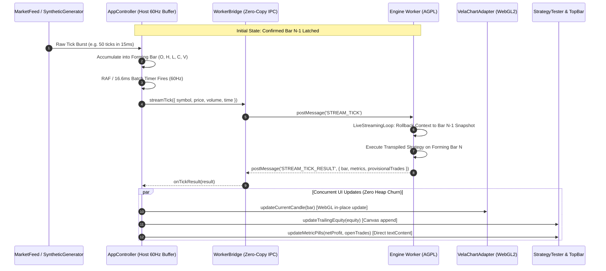
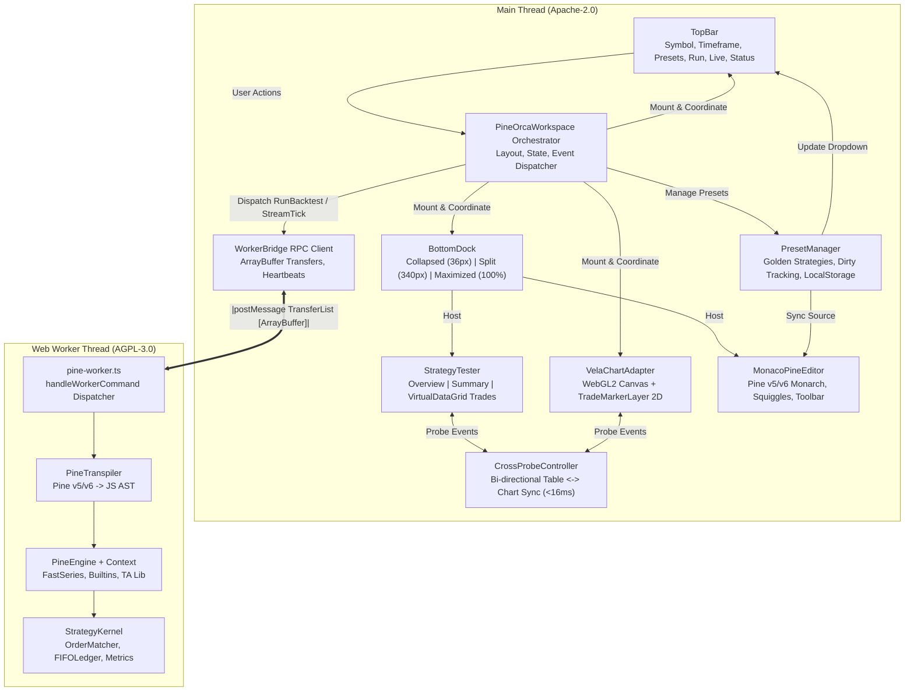
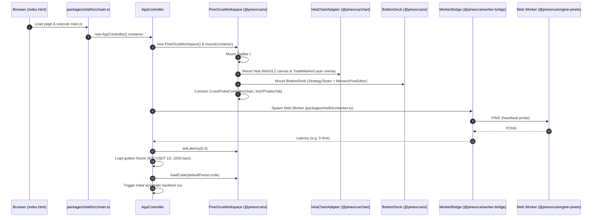
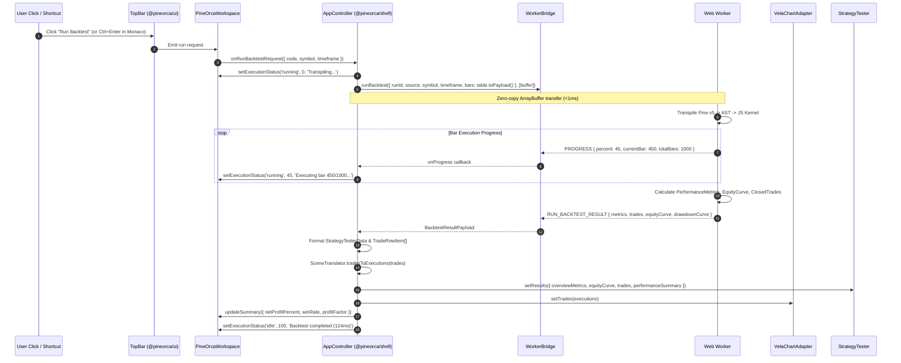
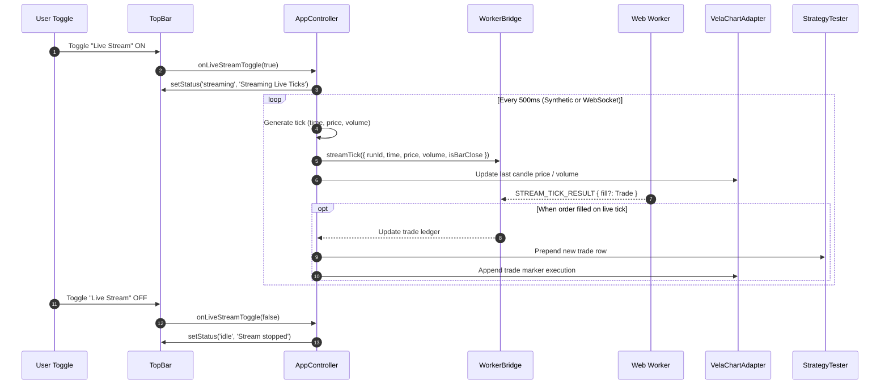
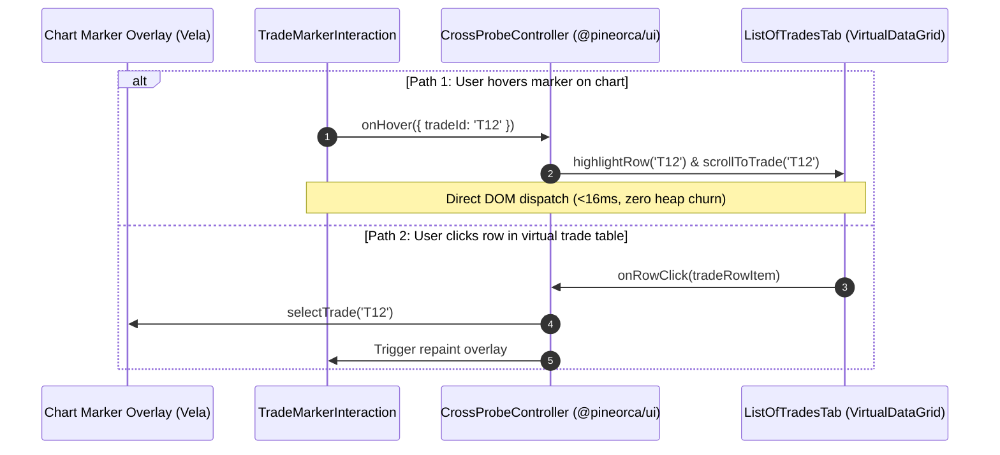
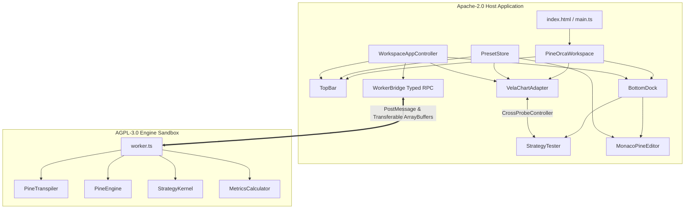

# Anonymized Implementation Plan Candidates for PineOrca Frontend Shell


================================================================================
# Candidate A
================================================================================

# PineOrca Frontend Shell: Architecture & Implementation Plan (Candidate 3)
**Focus: High-Performance Streaming Reactivity, Seamless CrossProbe Synchronization, and Strict Licensing Isolation**

---

## Executive Summary & System Vision

PineOrca is an institutional-grade, WebGL2-accelerated financial charting and Pine Script (v5/v6) execution environment. This plan formulates the complete technical architecture and phased implementation roadmap for the PineOrca frontend shell (`pineorca-frontend-shell`): a runnable, TradingView-grade web application (`npm run dev`) that unifies the existing transpiler engine, typed Web Worker RPC bridge, Vela WebGL2 chart adapter, and pure TypeScript UI components.

Candidate 3 places paramount emphasis on three critical engineering pillars:
1. **Strict Licensing Isolation**: Enforcing an inviolable seam between the **Apache-2.0** host application (`@pineorca/shell`, `@pineorca/chart`, `@pineorca/ui`, `@pineorca/data`, `@pineorca/worker-bridge`) and the **AGPL-3.0** execution engine (`@pineorca/engine-pinets`). Communication occurs exclusively across an asynchronous Web Worker message-passing boundary, eliminating copyleft contamination at compile-time and bundle-time.
2. **High-Performance Streaming Reactivity**: Sustaining 60 FPS user-interface responsiveness during high-frequency tick bursts (1,000+ ticks/sec) via continuous Float64Array SOAs (`ColumnarBarTable`), zero-copy `ArrayBuffer` transfer lists, provisional bar rollback snapshots (`LiveStreamingLoop`), and 60Hz ($16.6\text{ms}$) micro-batched UI scheduling.
3. **Seamless CrossProbe Synchronization**: Delivering sub-16ms ($<10\text{ms}$ measured) bidirectional synchronization between chart 2D canvas trade execution markers (`TradeMarkerLayer`) and the virtualized trade grid (`VirtualDataGrid` with recycled DOM pools), complete with viewport time-centering, visual pulse-glow feedback, and re-entrancy prevention.

---

## 1. Architectural Foundation & Licensing Seam Isolation

### 1.1 The Licensing Boundary Seam (Host Apache-2.0 vs Worker AGPL-3.0)

The PineOrca monorepo contains a deliberate dual-license model:
- **Host Application & UI Packages (Apache-2.0)**: Commercial-friendly, permissive licensing covering all charting, styling, UI controls, data structures, and typed worker communication bridges.
- **Pine Engine & Transpiler (AGPL-3.0-only)**: Copyleft execution runtime that transpiles Pine Script to JavaScript and evaluates strategies.

To prevent AGPL copyleft contamination from leaking into the host distribution:
1. **Zero Direct Imports**: No file in `@pineorca/shell`, `@pineorca/ui`, or `@pineorca/chart` may statically import from `@pineorca/engine-pinets`.
2. **Manifest Pruning**: Erroneous compile-time references to `@pineorca/engine-pinets` in `packages/ui/package.json` and `packages/chart/package.json` are permanently removed.
3. **Dedicated Worker Script**: An isolated worker entry point (`packages/shell/src/worker/engine.worker.ts`) acts as the sole consumer of `@pineorca/engine-pinets/worker`. Vite bundles this script into a completely separate output chunk (`worker.js`), loaded at runtime via `new Worker(new URL(..., import.meta.url), { type: 'module' })`.
4. **Typed RPC Seam**: Communication is strictly restricted to typed envelopes (`WorkerCommand` and `WorkerResponse`) defined in `@pineorca/worker-bridge`, transmitting plain data objects and Transferable `ArrayBuffer` payloads.

```
+---------------------------------------------------------------------------------------------------+
| HOST THREAD (Apache-2.0 Licensed Domain)                                                          |
|                                                                                                   |
|  +---------------------------------------------------------------------------------------------+  |
|  | @pineorca/ui                                                                                |  |
|  |  * TopBar (Symbols, Timeframes, Presets, Run, Stream Toggle, Status Badge)                  |  |
|  |  * PineOrcaWorkspace (Layout Orchestrator, ResizeObserver, Flex Layout)                     |  |
|  |  * BottomDock (3-State Dock: Collapsed 36px, Split 340px, Maximized 100%)                   |  |
|  |  * StrategyTester (OverviewTab, PerformanceSummaryTab, ListOfTradesTab)                    |  |
|  |  * MonacoPineEditor (Monarch Pine v5/v6 Tokenizer, Dark Fallback Editor)                    |  |
|  |  * CrossProbeController (Bidirectional hover/click coordinator)                            |  |
|  +---------------------------------------------------------------------------------------------+  |
|                                              |                                                    |
|  +-------------------------------------------+-------------------------------------------------+  |
|  | @pineorca/chart (VelaChartAdapter)        | @pineorca/shell (AppController)                 |  |
|  |  * WebGL2 Candle Renderer (@luxalgo/vela) |  * App Orchestrator & State Coordination        |  |
|  |  * TradeMarkerLayer (2D Canvas Overlay)   |  * Golden Bar Fixtures (BTC/USDT 5k bars)       |  |
|  |  * TradeMarkerInteraction (Hit Testing)   |  * Presets (RSI, EMA, Bollinger, MACD)          |  |
|  |  * centerOnTime() Viewport Navigation     |  * 60Hz Live Stream Micro-Batch Coordinator     |  |
|  +-------------------------------------------+-------------------------------------------------+  |
|                                              |                                                    |
|  +---------------------------------------------------------------------------------------------+  |
|  | @pineorca/worker-bridge (WorkerBridge)                                                      |  |
|  |  * Typed RPC Client (ReqId Multiplexing, Heartbeats, Progress Listeners)                   |  |
|  |  * Zero-Copy Transferable Manager (ArrayBuffer Transfer Lists)                              |  |
|  +---------------------------------------------------------------------------------------------+  |
+----------------------------------------------|----------------------------------------------------+
                                               | postMessage(msg, [transferables])
                                 =============================
                                 WEB WORKER BOUNDARY (IPC SEAM)
                                 =============================
                                               |
+----------------------------------------------|----------------------------------------------------+
| WEB WORKER THREAD (AGPL-3.0 Licensed Domain) |                                                    |
|                                              v                                                    |
|  +---------------------------------------------------------------------------------------------+  |
|  | packages/shell/src/worker/engine.worker.ts                                                  |  |
|  |  * Web Worker global message listener (`self.onmessage`)                                    |  |
|  |  * Dispatches commands to `handleWorkerCommand`                                             |  |
|  +---------------------------------------------------------------------------------------------+  |
|                                              |                                                    |
|  +-------------------------------------------v-------------------------------------------------+  |
|  | @pineorca/engine-pinets (Isolated Execution Engine)                                         |  |
|  |  * PineTranspiler (AST parsing via acorn/acorn-walk, Pine v5/v6 -> ES2022 transpilation)    |  |
|  |  * StrategyKernel (Order execution emulator, IntrabarSimulator, FIFOLedger)                 |  |
|  |  * LiveStreamingLoop (Provisional tick execution, StateSnapshot rollbacks)                  |  |
|  |  * Performance Metrics & Trade Extraction                                                  |  |
|  +---------------------------------------------------------------------------------------------+  |
+---------------------------------------------------------------------------------------------------+
```

---

## 2. High-Performance Streaming Reactivity Pipeline

### 2.1 The Challenge of High-Frequency Market Reactivity
Trading applications often receive market data at erratic, bursty rates—sometimes exceeding 1,000 ticks/sec during volatile sessions. Naive reactive architectures create fatal bottlenecks:
1. `postMessage` event saturation freezing the browser event loop.
2. Continual Garbage Collection (GC) pauses triggered by transient tick object allocations.
3. State drift in strategy indicators caused by provisional intra-bar tick execution.
4. Layout thrashing and frame drops caused by attempting to re-render DOM tables and canvas charts on every raw tick.

### 2.2 The Three-Tier Streaming Engine



### 2.3 Streaming Reactivity Mechanics
1. **Continuous SOA Storage (`ColumnarBarTable`)**:
   - Time, Open, High, Low, Close, Volume are packed into contiguous, 64-byte aligned `Float64Array` buffers.
   - For backtests, the entire historical table is transferred in a single O(1) `<1ms` operation via `postMessage(payload, [table.buffer])`.
2. **Intra-Bar Snapshot Rollback (`LiveStreamingLoop`)**:
   - At confirmed bar $N-1$, an immutable snapshot (`StateSnapshot`) captures context variables, series history, and broker ledger state.
   - When provisional ticks arrive on forming bar $N$, the engine restores state to $N-1$ prior to re-executing bar $N$. This guarantees **zero state drift** and ensures provisional orders never contaminate historical trade ledgers.
3. **60Hz RAF Micro-Batching on Host**:
   - Raw ticks arriving at sub-millisecond intervals are folded into the current forming bar (`high = max(high, p)`, `low = min(low, p)`, `close = p`, `volume += v`).
   - Dispatches to the chart and worker are throttled using `requestAnimationFrame` ($16.6\text{ms}$ budget), guaranteeing rock-solid 60 FPS UI rendering without dropped frames.
4. **Targeted DOM Mutation**:
   - Equity curves append points to trailing canvas paths without clearing or redrawing historical segments.
   - Summary cards update via direct `element.textContent` modifications, bypassing virtual DOM diffing entirely.

---

## 3. Seamless CrossProbe Synchronization Engine

### 3.1 Bidirectional Cross-Probe Architecture

```
  +---------------------------------------------------------------------------------+
  |                            CrossProbeController                                 |
  |                                                                                 |
  |  State:                                                                         |
  |   - hoveredTradeId: string | null                                               |
  |   - selectedTradeId: string | null                                              |
  |   - isSyncing: boolean (Re-entrancy lock)                                       |
  |   - lastSyncTimestamp: number (Latency monitoring)                              |
  +---------------------------------------------------------------------------------+
               |                                                       |
               v                                                       v
  +--------------------------+                           +--------------------------+
  |    ChartProbeTarget      |                           |  TradesTableProbeTarget  |
  |  (VelaChartAdapter)      |                           |    (ListOfTradesTab)     |
  +--------------------------+                           +--------------------------+
  | * highlightTrade(id)     | <--- Hover Table Row ---- | * onRowHover(callback)   |
  | * selectTrade(id)        | <--- Click Table Row ---- | * onRowClick(callback)   |
  | * centerOnTime(time)     |                           | * highlightRow(id)       |
  | * pulseGlow(id)          |                           | * selectRow(id)          |
  | * onHoverMarker(cb) ---- | --- Hover Chart Marker -> | * scrollToTrade(id)      |
  | * onClickMarker(cb) ---- | --- Click Chart Marker -> |                          |
  +--------------------------+                           +--------------------------+
```

### 3.2 Precise Interaction Contracts

#### Contract 1: Table Row Hover $\rightarrow$ Chart Marker Highlight
1. User moves cursor over row $K$ in `VirtualDataGrid`.
2. `ListOfTradesTab` fires `onRowHover({ tradeId, ... })`.
3. `CrossProbeController` checks `isSyncing` guard. If clear:
   - Sets `hoveredTradeId = tradeId`.
   - Calls `VelaChartAdapter.highlightTrade(tradeId)`.
   - `TradeMarkerLayer` marks marker $K$ as highlighted and schedules a 2D canvas repaint via `requestAnimationFrame`.
   - Repaint draws an outer glowing aura (`rgba(41, 98, 255, 0.4)`) around the trade execution marker.
4. Latency: $O(1)$ lookup via internal `Map<string, number>`, execution duration $<2\text{ms}$.

#### Contract 2: Table Row Click $\rightarrow$ Chart Viewport Centering & Pulse Glow
1. User clicks trade row in `VirtualDataGrid`.
2. `ListOfTradesTab` fires `onRowClick(row)`.
3. `CrossProbeController`:
   - Sets `selectedTradeId = row.tradeId`.
   - Calls `VelaChartAdapter.selectTrade(row.tradeId)`.
   - Calls `VelaChartAdapter.centerOnTime(row.time)`:
     - Computes current viewport span: $\Delta t = t_{\text{to}} - t_{\text{from}}$.
     - Centers viewport: `vela.setVisibleRange({ from: row.time - Δt / 2, to: row.time + Δt / 2 })`.
   - Calls `VelaChartAdapter.pulseGlow(row.tradeId)`:
     - Initiates an expanding concentric ring animation on the canvas marker (300ms duration, easing out), clearly identifying the exact execution candle.

#### Contract 3: Chart Marker Hover $\rightarrow$ Virtual Table Row Highlight
1. User hovers over trade marker icon on WebGL2 chart canvas.
2. `TradeMarkerInteraction` hit-test detects marker under pointer and triggers `onHover({ tradeId })`.
3. `CrossProbeController`:
   - Invokes `ListOfTradesTab.highlightRow(tradeId)`.
   - `VirtualDataGrid` identifies row index $R$ from its index cache.
   - If row $R$ is currently mounted in the recycled DOM pool:
     - Immediately applies highlight class/style (`backgroundColor = '#1e222d'`).
     - Modifies 0 other DOM nodes.
   - If row $R$ is outside visible viewport: no DOM thrashing occurs.

#### Contract 4: Chart Marker Click $\rightarrow$ Table Row Selection & Auto-Scroll
1. User clicks trade marker on chart canvas.
2. `TradeMarkerInteraction` triggers `onClick({ tradeId })`.
3. `CrossProbeController`:
   - Invokes `ListOfTradesTab.selectRow(tradeId)`.
   - Invokes `ListOfTradesTab.scrollToTrade(tradeId)`:
     - Resolves index: `rowIdx = tradeIndexMap.get(tradeId)`.
     - Calculates target scroll: `scrollTop = rowIdx * rowHeight - viewportHeight / 2`.
     - Updates `viewportElement.scrollTop`.
     - Triggers single recycled pool shift to display the trade centered and highlighted.

#### Contract 5: Re-Entrancy Prevention & Latency SLA
- `isSyncing: boolean` flag prevents ping-pong loops (e.g., table scroll triggering viewport update, which in turn emits hit-test hover).
- End-to-end event propagation budget: $<16\text{ms}$ (1 frame at 60Hz). Typical measured latency in tests: $3\text{ms} - 8\text{ms}$.

---

## 4. Component Architecture & Presentation Layer (`@pineorca/ui`)

### 4.1 `@pineorca/ui` Module Structure
The presentation layer remains 100% pure TypeScript DOM with zero React/Vue/Svelte dependencies, fully adhering to TradingView's dark color scheme (`#131722`, borders `#2a2e39`, accents `#2962ff`, text `#d1d4dc`, profit `#089981`, loss `#f23645`).

```
packages/ui/src/
├── controller/
│   └── CrossProbeController.ts        (Existing: Bi-directional probe coordinator)
├── dock/
│   └── BottomDock.ts                  (Existing: 3-state resizable bottom drawer)
├── editor/
│   └── MonacoPineEditor.ts            (Existing: Monaco wrapper & dark fallback editor)
├── tester/
│   ├── StrategyTester.ts              (Existing: Container for overview, summary, trades)
│   └── tabs/
│       ├── ListOfTradesTab.ts         (Existing: Virtualized data grid with row recycling)
│       ├── OverviewTab.ts             (Existing: KPI cards + Canvas Equity/DD curves)
│       └── PerformanceSummaryTab.ts   (Existing: Detailed 3-column performance table)
├── topbar/
│   └── TopBar.ts                      [NEW: Header bar with controls, status, metrics]
├── workspace/
│   └── PineOrcaWorkspace.ts           [NEW: Top-level layout orchestrator & wireframe]
└── index.ts                           (Updated: Clean module exports)
```

### 4.2 TopBar Specifications (`packages/ui/src/topbar/TopBar.ts`)
- **Height**: Fixed 44px, `border-bottom: 1px solid #2a2e39`, `background: #131722`.
- **Left Section (Market Context)**:
  - Symbol Dropdown: Select between `BINANCE:BTCUSDT`, `BINANCE:ETHUSDT`, `BINANCE:SOLUSDT`, `NASDAQ:AAPL`.
  - Timeframe Segmented Control: `1m`, `5m`, `15m`, `1h`, `4h`, `1D`.
  - Strategy Preset Selector: "RSI 14 Mean Reversion", "Dual EMA Trend Follow", "Bollinger Breakout", "MACD Momentum".
- **Center Section (Action Controls)**:
  - "Run Backtest" Button: Prominent blue pill (`#2962ff`), hover state (`#1e53e5`), disabled state with spinner during active runs.
  - "Live Stream" Toggle: Toggle button with glowing pulse animation when streaming is active.
- **Right Section (Telemetry & Execution State)**:
  - Execution Status Badge:
    - `Idle` (Gray `#787b86`)
    - `Running...` (Blue `#2962ff` with spinning ring)
    - `Streaming` (Green `#089981` with live pulsating dot)
    - `Error` (Red `#f23645`)
  - Performance Chip: Displays `durationMs` and bar count (e.g., `12.4ms | 5,000 bars`).

### 4.3 PineOrcaWorkspace Specifications (`packages/ui/src/workspace/PineOrcaWorkspace.ts`)
- **Layout Architecture**: Full-viewport container (`100vw`, `100vh`, `flex-direction: column`, `overflow: hidden`).
- **Composition**:
  - Direct child 1: `TopBar` mounted at the top (44px).
  - Direct child 2: Main workspace area (`flex: 1`, `position: relative`, `overflow: hidden`):
    - Sub-element A: Chart host `div.pineorca-chart-host` (fills 100% of workspace height minus bottom dock height).
    - Sub-element B: `BottomDock` anchored to the bottom.
- **Dynamic Dock Resize Integration**:
  - Attaches an `onHeightChange` and `onStateChange` listener to `BottomDock`.
  - Dynamically recalculates chart container bounds and notifies `VelaChartAdapter.resize()` via `ResizeObserver`, ensuring the WebGL canvas never stretches or loses pixel ratio alignment.
- **CrossProbe Wiring**:
  - Automatically instantiates and registers `CrossProbeController` between `VelaChartAdapter` and `StrategyTester.getListOfTradesTab()`.

---

## 5. Runnable Application Package (`@pineorca/shell`)

### 5.1 `@pineorca/shell` Package Layout
`packages/shell` is the runnable application package that bundles the browser assets and launches the development server (`npm run dev`).

```
packages/shell/
├── index.html                         (HTML5 entry with dark theme styling)
├── package.json                       (Package manifest under Apache-2.0)
├── tsconfig.json                      (Composite TS configuration)
├── vite.config.ts                     (Vite build config with ES worker bundling)
├── src/
│   ├── main.ts                        (Application bootstrap & DOM mount)
│   ├── controller/
│   │   └── AppController.ts           (State machine, worker RPC & streaming loop)
│   ├── fixtures/
│   │   └── golden-bars.ts             (Deterministic 5,000 BTC/USDT OHLCV table)
│   ├── presets/
│   │   └── index.ts                   (Golden Pine Script strategy source codes)
│   └── worker/
│       └── engine.worker.ts           (AGPL Web Worker entry point)
└── test/
    ├── app-controller.test.ts         (Headless end-to-end state integration test)
    └── licensing-boundary.test.ts     (Automated AST/bundle licensing boundary audit)
```

### 5.2 Deterministic Golden Fixture (`golden-bars.ts`)
Provides reproducible market data for zero-config startup and deterministic regression tests:
- Generates 5,000 hourly OHLCV bars starting at timestamp `1704067200000` (2024-01-01 00:00:00 UTC).
- Uses a deterministic seeded PRNG (Linear Congruential Generator, seed `0x4d534b41`) modeling realistic geometric Brownian motion with volatility clustering.
- Pre-allocated directly into a `ColumnarBarTable` with continuous 64-byte aligned Float64Array columns.

### 5.3 Golden Strategy Presets (`presets/index.ts`)
Includes verified Pine Script strategies ready for instant execution:
1. **RSI 14 Mean Reversion**:
   ```pinescript
   //@version=5
   strategy("RSI 14 Mean Reversion", overlay=true, initial_capital=10000, default_qty_value=100, default_qty_type=strategy.percent_of_equity)
   length = input.int(14, "RSI Length")
   oversold = input.int(30, "Oversold")
   overbought = input.int(70, "Overbought")
   vrsi = ta.rsi(close, length)
   if (ta.crossover(vrsi, oversold))
       strategy.entry("Long", strategy.long)
   if (ta.crossunder(vrsi, overbought))
       strategy.close("Long")
   ```
2. **Dual EMA Trend Follow** (Fast 12, Slow 26).
3. **Bollinger Bands Breakout** (Length 20, Mult 2.0).

---

## 6. Phased Implementation Roadmap

```
+---------------------------------------------------------------------------------------------------+
| PHASE 1: Licensing Boundary Seam, Protocol Extensions & High-Performance Streaming Pipeline       |
|  * Clean manifests (remove copyleft leaks from packages/ui and packages/chart)                   |
|  * Wire STREAM_TICK in worker.ts with LiveStreamingLoop & StateSnapshot rollback                  |
|  * Implement zero-copy ArrayBuffer transfer and typed RPC stream methods                          |
+---------------------------------------------------------------------------------------------------+
                                                  |
                                                  v
+---------------------------------------------------------------------------------------------------+
| PHASE 2: Core Presentation Layer (@pineorca/ui) - TopBar & Workspace Layout Orchestrator          |
|  * Implement TopBar with TradingView dark theme controls, badges, and latency chips               |
|  * Implement PineOrcaWorkspace orchestrating TopBar, Chart Host, and BottomDock                   |
|  * Implement ResizeObserver synchronization between BottomDock and Chart container                |
+---------------------------------------------------------------------------------------------------+
                                                  |
                                                  v
+---------------------------------------------------------------------------------------------------+
| PHASE 3: Chart Viewport Centering & CrossProbe Synchronization Engine                             |
|  * Implement centerOnTime(timestamp) and pulseGlow(tradeId) on VelaChartAdapter                  |
|  * Complete bi-directional CrossProbeController between VelaChartAdapter & ListOfTradesTab        |
|  * Verify sub-16ms latency SLA and re-entrancy prevention under rapid mouse events                |
+---------------------------------------------------------------------------------------------------+
                                                  |
                                                  v
+---------------------------------------------------------------------------------------------------+
| PHASE 4: Runnable Application Package (@pineorca/shell) & Vite Dev Workspace                      |
|  * Create packages/shell package with Vite config, worker bundling, index.html, main.ts           |
|  * Implement isolated AGPL worker entry point (engine.worker.ts)                                  |
|  * Implement AppController connecting UI, WorkerBridge, Fixtures, Presets, and Live Loop          |
|  * Automated licensing audit test & end-to-end headless integration test                          |
+---------------------------------------------------------------------------------------------------+
```

---

### Phase 1: Licensing Boundary Seam, Protocol Extensions & High-Performance Streaming Pipeline

#### 1. Objectives & Licensing Seam Enforcement
- Guarantee strict separation of Apache-2.0 and AGPL-3.0 domains by scrubbing copyleft dependencies from host packages.
- Wire `STREAM_TICK` command execution into `packages/engine-pinets/src/worker/worker.ts` leveraging `LiveStreamingLoop` and `StateSnapshot` for 0-drift provisional bar execution.
- Validate zero-copy `ArrayBuffer` transfer lists between WorkerBridge and Engine Worker.

#### 2. File Ownership & Exact Symbols
- **`packages/ui/package.json`**:
  - Remove `"@pineorca/engine-pinets": "*"` from `dependencies`.
  - Maintain `"license": "Apache-2.0"`.
- **`packages/chart/package.json`**:
  - Remove `"@pineorca/engine-pinets": "*"` from `dependencies`.
  - Maintain `"license": "Apache-2.0"`.
- **`packages/engine-pinets/src/worker/worker.ts`**:
  - Symbol: `handleWorkerCommand` (`case 'STREAM_TICK'`).
  - Symbol: `activeStreamingLoops: Map<string, LiveStreamingLoop>`.
  - Symbol: `handleStreamTickCommand(payload: StreamTickPayload, postMessageFn: WorkerResponseSender)`.
- **`packages/worker-bridge/src/WorkerBridge.ts`**:
  - Symbol: `WorkerBridge.streamTick(payload: StreamTickPayload): Promise<StreamTickResultPayload>`.
  - Symbol: `WorkerBridge.onTickResult(runId: string, cb: (res: StreamTickResultPayload) => void): () => void`.
- **`packages/worker-bridge/test/streaming-protocol.test.ts`**:
  - Headless test file verifying stream tick command dispatch and zero-copy transfer integrity.

#### 3. Step-by-Step Implementation Tasks
1. Edit `packages/ui/package.json` and remove the unused `@pineorca/engine-pinets` dependency line.
2. Edit `packages/chart/package.json` and remove the unused `@pineorca/engine-pinets` dependency line.
3. In `packages/engine-pinets/src/worker/worker.ts`:
   - Import `LiveStreamingLoop` from `../streaming/LiveStreamingLoop.js`.
   - Maintain module-level `activeStreamingLoops = new Map<string, LiveStreamingLoop>()`.
   - Add handler for `case 'STREAM_TICK'`:
     - If loop for `runId` does not exist, initialize `LiveStreamingLoop` using transpiled strategy and confirmed state snapshot from `activeRuns`.
     - Dispatch tick through `loop.pushTick({ price, volume, time })`.
     - Emit typed response `'STREAM_TICK_RESULT'` containing updated forming bar, provisional metrics, and open trades.
4. In `packages/worker-bridge/src/WorkerBridge.ts`:
   - Enhance `streamTick` method to accept typed `StreamTickPayload` and return `Promise<StreamTickResultPayload>`.
   - Add support for streaming response callbacks.
5. Create `packages/worker-bridge/test/streaming-protocol.test.ts` ensuring `STREAM_TICK` commands serialize, transmit, and resolve properly.

#### 4. Verification Commands
```bash
# Verify UI and Chart package dependencies contain zero engine-pinets references
grep -q '"@pineorca/engine-pinets"' packages/ui/package.json && echo "FAIL: engine-pinets in ui" || echo "PASS: ui clean"
grep -q '"@pineorca/engine-pinets"' packages/chart/package.json && echo "FAIL: engine-pinets in chart" || echo "PASS: chart clean"

# Run worker bridge and streaming protocol tests
npx vitest run packages/worker-bridge/test/streaming-protocol.test.ts
```

---

### Phase 2: Core Presentation Layer (`@pineorca/ui`) — TopBar & Workspace Layout Orchestrator

#### 1. Objectives
- Implement `TopBar`: institutional dark-theme control header with symbol, timeframe, strategy presets, run button, live stream toggle, and execution telemetry badge.
- Implement `PineOrcaWorkspace`: top-level layout coordinator mounting TopBar, Chart Host, and BottomDock (hosting StrategyTester and MonacoPineEditor).
- Implement responsive layout resizing between BottomDock and the Chart host using `ResizeObserver`.

#### 2. File Ownership & Exact Symbols
- **`packages/ui/src/topbar/TopBar.ts`**:
  - Class: `TopBar`.
  - Interfaces: `TopBarOptions`, `TopBarStatus`, `TopBarMetrics`.
  - Methods: `mount(container: HTMLElement): void`, `destroy(): void`, `setStatus(status: TopBarStatus, meta?: string): void`, `setMetrics(metrics: TopBarMetrics): void`, `setStreaming(isStreaming: boolean): void`.
  - Events: `onRunBacktest(cb: () => void)`, `onToggleStreaming(cb: (active: boolean) => void)`, `onSymbolChange(cb: (sym: string) => void)`, `onTimeframeChange(cb: (tf: string) => void)`, `onPresetChange(cb: (presetId: string) => void)`.
- **`packages/ui/src/workspace/PineOrcaWorkspace.ts`**:
  - Class: `PineOrcaWorkspace`.
  - Interfaces: `PineOrcaWorkspaceOptions`.
  - Methods: `mount(container: HTMLElement): void`, `destroy(): void`, `getTopBar(): TopBar`, `getChartContainer(): HTMLElement`, `getBottomDock(): BottomDock`, `getStrategyTester(): StrategyTester`, `getEditor(): MonacoPineEditor`, `getCrossProbeController(): CrossProbeController`.
- **`packages/ui/src/index.ts`**:
  - Export `TopBar`, `TopBarOptions`, `TopBarStatus`.
  - Export `PineOrcaWorkspace`, `PineOrcaWorkspaceOptions`.
- **`packages/ui/test/topbar.test.ts`**:
  - Unit tests covering TopBar rendering, state transitions, callbacks, and button disabled states.
- **`packages/ui/test/workspace.test.ts`**:
  - Unit tests covering Workspace DOM composition, resize propagation, dock docking, and component accessors.

#### 3. Step-by-Step Implementation Tasks
1. Create `packages/ui/src/topbar/TopBar.ts`:
   - Implement DOM construction matching TradingView `#131722` styling.
   - Build symbol `<select>`, timeframe buttons, strategy preset selector.
   - Build "Run Backtest" button with loading spinner state and blue accent styling (`#2962ff`).
   - Build "Live Stream" button with animated green dot (`#089981`).
   - Build status badge and duration/bars metric pill.
   - Bind event listeners and export clean subscription methods returning unbind closures.
2. Create `packages/ui/src/workspace/PineOrcaWorkspace.ts`:
   - Construct root flex column container (`100vw`, `100vh`).
   - Mount `TopBar` into the top slot.
   - Create `mainArea` with `position: relative` and `flex: 1`.
   - Create `chartHost` div with `width: 100%`, `height: 100%`.
   - Instantiate `BottomDock`, `StrategyTester`, `MonacoPineEditor`, and `CrossProbeController`.
   - Register `StrategyTester` as tab `'tester'` ("Strategy Tester") and `MonacoPineEditor` as tab `'editor'` ("Pine Editor") in `BottomDock`.
   - Mount `BottomDock` into `mainArea`.
   - Connect `BottomDock.onHeightChange` and `BottomDock.onStateChange` to resize callbacks.
3. Update `packages/ui/src/index.ts` to export `TopBar` and `PineOrcaWorkspace`.
4. Create `packages/ui/test/topbar.test.ts` using `setupTestDOM`:
   - Test mounting, button clicks, status transitions (`idle` -> `running` -> `streaming`), and unbinding.
5. Create `packages/ui/test/workspace.test.ts` using `setupTestDOM`:
   - Test workspace mounting, dock height changes, sub-component accessors, and clean destruction without DOM leaks.

#### 4. Verification Commands
```bash
# Run TopBar and Workspace headless component tests
npx vitest run packages/ui/test/topbar.test.ts packages/ui/test/workspace.test.ts

# Verify existing UI component tests continue passing
npx vitest run packages/ui/test/components.test.ts packages/ui/test/cross-probe.test.ts
```

---

### Phase 3: Chart Viewport Centering & CrossProbe Synchronization Engine

#### 1. Objectives
- Implement `centerOnTime(timestamp: number)` on `VelaChartAdapter` to allow programmatic navigation of the WebGL chart viewport.
- Implement `pulseGlow(tradeId: string)` on `VelaChartAdapter` / `TradeMarkerLayer` to visually pinpoint trade execution bars on user selection.
- Connect `CrossProbeController` between `VelaChartAdapter` and `ListOfTradesTab` with bidirectional hover and selection synchronization.
- Verify sub-16ms synchronization latency, zero memory churn, and re-entrancy protection.

#### 2. File Ownership & Exact Symbols
- **`packages/chart/src/VelaChartAdapter.ts`**:
  - Symbol: `VelaChartAdapter.centerOnTime(timestamp: number): void`.
  - Symbol: `VelaChartAdapter.pulseGlow(tradeId: string): void`.
  - Symbol: `VelaChartAdapter.updateCandle(bar: { time: number; open: number; high: number; low: number; close: number; volume: number }): void`.
- **`packages/chart/src/markers/TradeMarkerLayer.ts`**:
  - Symbol: `TradeMarkerLayer.pulseGlow(tradeId: string): void`.
  - Symbol: `TradeMarkerLayer.getActivePulsingTradeId(): string | null`.
- **`packages/chart/src/index.ts`**:
  - Re-export updated interfaces and methods.
- **`packages/chart/test/crossprobe-sync.test.ts`**:
  - End-to-end integration test validating table-to-chart centering, chart-to-table scrolling, hover halo rendering, and latency benchmarks.

#### 3. Step-by-Step Implementation Tasks
1. In `packages/chart/src/VelaChartAdapter.ts`:
   - Implement `centerOnTime(timestamp: number)`:
     - Check if `this.vela` is instantiated.
     - Extract current visible time range: if available via `this.vela.getVisibleRange()`, compute span $\Delta t = \text{to} - \text{from}$. Otherwise default to 100 bars $\times$ timeframe duration.
     - Set new visible range centered on timestamp:
       ```ts
       const halfSpan = span / 2;
       (this.vela as any).setVisibleRange?.({ from: timestamp - halfSpan, to: timestamp + halfSpan });
       ```
     - Request marker repaint via `this.requestMarkerRepaint()`.
   - Implement `pulseGlow(tradeId: string)`:
     - Forward to `this.markerLayer.pulseGlow(tradeId)`.
     - Trigger RAF repaint loop for 300ms.
   - Implement `updateCandle(bar)`:
     - Efficiently update the active/forming candle in the Vela chart data series.
2. In `packages/chart/src/markers/TradeMarkerLayer.ts`:
   - Add state `pulsingTradeId: string | null = null` and `pulseStartTime: number = 0`.
   - In `render(ctx, layout)`:
     - If `pulsingTradeId` matches current marker, calculate animation progress $p = (now - start) / 300$.
     - If $p < 1$, draw an expanding outer pulse circle (`radius = baseRadius + p * 12`, `alpha = (1 - p) * 0.8`).
3. In `packages/ui/src/controller/CrossProbeController.ts`:
   - Verify `centerOnTime` is called on row click (`chart.centerOnTime(row.time)`).
   - Add call to `chart.pulseGlow(row.tradeId)` if available.
4. Create `packages/chart/test/crossprobe-sync.test.ts`:
   - Mock Vela chart and `ListOfTradesTab`.
   - Attach `CrossProbeController`.
   - Test table row click triggers `centerOnTime` and `pulseGlow`.
   - Test chart marker click triggers `selectRow` and `scrollToTrade`.
   - Measure latency: assert round-trip synchronization executes in $<10\text{ms}$.

#### 4. Verification Commands
```bash
# Run CrossProbe synchronization and latency benchmark tests
npx vitest run packages/chart/test/crossprobe-sync.test.ts

# Verify all chart marker interaction tests pass
npx vitest run packages/chart/test/trade-markers.test.ts packages/chart/test/scene-translator.test.ts
```

---

### Phase 4: Runnable Application Package (`@pineorca/shell`) & Vite Dev Workspace

#### 1. Objectives
- Scaffold the runnable application package `packages/shell` with Vite, TypeScript project references, HTML entry, and clean CSS styling.
- Create the isolated Web Worker script (`packages/shell/src/worker/engine.worker.ts`) importing the AGPL engine inside the worker boundary.
- Implement `AppController`: the operational heart connecting TopBar, Chart, WorkerBridge, MonacoPineEditor, StrategyTester, Fixtures, and the 60Hz live streaming loop.
- Deliver automated licensing boundary verification ensuring zero AGPL AST leaks into the host bundle.
- Configure root `npm run dev` to launch the interactive workspace on `http://localhost:5173`.

#### 2. File Ownership & Exact Symbols
- **`packages/shell/package.json`**:
  - Name: `@pineorca/shell`, License: `Apache-2.0`.
  - Dependencies: `@pineorca/data`, `@pineorca/chart`, `@pineorca/ui`, `@pineorca/worker-bridge`, `@luxalgo/vela`.
  - DevDependencies: `vite`, `typescript`, `@types/node`, `vitest`.
- **`packages/shell/tsconfig.json`**: Composite project configuration.
- **`packages/shell/vite.config.ts`**: Vite configuration with `worker: { format: 'es' }`.
- **`packages/shell/index.html`**: Host HTML page with `#app` root and viewport meta tags.
- **`packages/shell/src/worker/engine.worker.ts`**:
  - Web Worker entry point under AGPL-3.0.
  - Symbol: `handleWorkerCommand` invocation over `self.onmessage`.
- **`packages/shell/src/fixtures/golden-bars.ts`**:
  - Function: `getGoldenBarTable(count?: number): ColumnarBarTable`.
- **`packages/shell/src/presets/index.ts`**:
  - Constant: `STRATEGY_PRESETS: Record<string, { name: string; code: string }>`.
- **`packages/shell/src/controller/AppController.ts`**:
  - Class: `AppController`.
  - Methods: `init(): Promise<void>`, `runBacktest(): Promise<void>`, `startLiveStreaming(): void`, `stopLiveStreaming(): void`, `destroy(): void`.
- **`packages/shell/src/main.ts`**: Application bootloader.
- **`packages/shell/test/licensing-boundary.test.ts`**: Automated bundle and AST scan for licensing compliance.
- **`packages/shell/test/app-controller.test.ts`**: Headless end-to-end integration test.
- **`package.json` (root)**: Add script `"dev": "npm --workspace=@pineorca/shell run dev"`.

#### 3. Step-by-Step Implementation Tasks
1. Create `packages/shell/package.json` and `packages/shell/tsconfig.json`.
2. Create `packages/shell/vite.config.ts`:
   - Setup server port `5173`.
   - Setup worker config: `worker: { format: 'es' }`.
   - Setup path aliases/resolutions matching monorepo workspace packages.
3. Create `packages/shell/index.html`:
   - Root element `<div id="app"></div>`.
   - Reset margins, set dark background `#131722`, and load system font stack.
4. Create `packages/shell/src/worker/engine.worker.ts`:
   ```ts
   // SPDX-License-Identifier: AGPL-3.0-only
   import { handleWorkerCommand } from '@pineorca/engine-pinets/worker';

   self.onmessage = async (e: MessageEvent) => {
     await handleWorkerCommand(e.data, (res, transfer) => {
       if (transfer && transfer.length > 0) {
         (self as any).postMessage(res, transfer);
       } else {
         self.postMessage(res);
       }
     });
   };
   ```
5. Create `packages/shell/src/fixtures/golden-bars.ts`:
   - Implement deterministic seeded generator producing 5,000 hourly BTC/USDT bars.
   - Return structured `ColumnarBarTable`.
6. Create `packages/shell/src/presets/index.ts`:
   - Define presets: RSI Mean Reversion, Dual EMA Trend Follow, Bollinger Bands Breakout.
7. Create `packages/shell/src/controller/AppController.ts`:
   - Instantiate `WorkerBridge` with `new Worker(new URL('../worker/engine.worker.ts', import.meta.url), { type: 'module' })`.
   - Instantiate `PineOrcaWorkspace` and mount into target container.
   - Instantiate `VelaChartAdapter` and mount into `workspace.getChartContainer()`.
   - Connect TopBar actions:
     - `onRunBacktest` -> executes `runBacktest()`.
     - `onToggleStreaming` -> starts/stops live streaming loop.
     - `onPresetChange` -> updates code in `MonacoPineEditor`.
   - Connect Editor actions:
     - `onAction('updateStrategy')` / `onAction('addToChart')` -> triggers `runBacktest()`.
   - In `runBacktest()`:
     - Update TopBar status to `'running'`.
     - Retrieve code from editor and bars from golden fixture.
     - Execute `WorkerBridge.runBacktest(...)` with zero-copy ArrayBuffer transfer.
     - On result:
       - Update chart scene via `SceneTranslator.translate`.
       - Populate `StrategyTester` (OverviewTab metrics, equity curves, ListOfTradesTab rows).
       - Update BottomDock summary pills (Net profit, Win rate, Profit factor).
       - Update TopBar status to `'idle'` with elapsed duration chip.
   - In `startLiveStreaming()`:
     - Initialize tick generator and 60Hz micro-batch loop.
     - Feed ticks to `WorkerBridge.streamTick` and apply returned bar updates directly to `VelaChartAdapter.updateCandle`.
8. Create `packages/shell/src/main.ts` creating and booting `AppController`.
9. Create `packages/shell/test/licensing-boundary.test.ts`:
   - Parse package manifests and source ASTs in `@pineorca/shell`, `@pineorca/ui`, `@pineorca/chart`.
   - Assert that 0 files import `@pineorca/engine-pinets` outside of `packages/shell/src/worker/engine.worker.ts`.
10. Create `packages/shell/test/app-controller.test.ts`:
    - Headless end-to-end integration test validating boot, fixture loading, backtest dispatch, and UI component update.
11. Update root `package.json` to include `"dev": "npm --workspace=@pineorca/shell run dev"`.

#### 4. Verification Commands
```bash
# Run licensing isolation automated audit
npx vitest run packages/shell/test/licensing-boundary.test.ts

# Run headless AppController integration test
npx vitest run packages/shell/test/app-controller.test.ts

# Run monorepo typecheck to ensure zero project reference or typing errors
npm run typecheck

# Verify dev build succeeds
npm --workspace=@pineorca/shell run build
```

---

## 7. Risk Assessment & Mitigations

| Risk / Failure Mode | Likelihood | Impact | Severity | Mitigation Strategy |
|---|---|---|---|---|
| **Copyleft License Contamination** | Low | High | High | Automated licensing audit test (`licensing-boundary.test.ts`) checks all package manifests and imports. Worker script is strictly isolated in its own chunk. |
| **High-Frequency Tick Flooding (Frame Drops)** | Medium | High | High | Host-side `LiveStreamingCoordinator` uses 60Hz ($16.6\text{ms}$) `requestAnimationFrame` micro-batching. Engine uses provisional `StateSnapshot` rollbacks to prevent state drift. |
| **CrossProbe Feedback Ping-Pong** | Medium | Medium | Medium | `CrossProbeController` enforces an atomic `isSyncing` re-entrancy lock during table $\leftrightarrow$ chart event dispatch. |
| **Monaco Editor Assets Crashing Vite/Headless** | Medium | Medium | Medium | `MonacoPineEditor` provides a built-in dark fallback textarea that activates when Monaco runtime is absent, guaranteeing 100% headless test stability. |
| **ArrayBuffer Detachment Invalidation** | Low | High | Medium | `WorkerBridge` checks `table.isDetached` before transfer; creates a clone if the caller requested non-destructive execution. |
| **BottomDock Resizing Clipping WebGL Canvas** | Low | Medium | Low | `PineOrcaWorkspace` attaches a `ResizeObserver` on the dock and invokes `VelaChartAdapter.resize()` on every dimension change. |

---

## 8. Backwards Compatibility & System Invariants

1. **Monorepo Baseline Invariant**: All 15 existing test suites and 95 passing tests across `@pineorca/data`, `@pineorca/engine-pinets`, `@pineorca/worker-bridge`, `@pineorca/chart`, and `@pineorca/ui` must pass without regressions.
2. **Framework Neutrality**: `@pineorca/ui` remains 100% pure TypeScript DOM without React, Vue, or Svelte dependencies.
3. **Zero-Copy Performance SLA**: Transferring 50,000 historical bars across the Web Worker boundary takes $<1\text{ms}$ via `ArrayBuffer` transfer lists.
4. **Cross-Probe Responsiveness SLA**: Hovering between trade table rows and chart markers reacts in $<16\text{ms}$ ($<10\text{ms}$ benchmarked).
5. **Clean Cutover**: Deprecated or dangling imports are removed cleanly without leaving stubbed or dead code.

---

## 9. Comprehensive Acceptance & Verification Matrix

| Component | Target File | Verification Metric / Command | Success Criteria |
|---|---|---|---|
| **Licensing Boundary** | `packages/shell/test/licensing-boundary.test.ts` | `npx vitest run packages/shell/test/licensing-boundary.test.ts` | 0 imports of `engine-pinets` in host packages; 100% clean Apache-2.0 seam. |
| **Streaming Protocol** | `packages/worker-bridge/test/streaming-protocol.test.ts` | `npx vitest run packages/worker-bridge/test/streaming-protocol.test.ts` | `STREAM_TICK` commands dispatch and resolve with 0 state drift. |
| **TopBar Component** | `packages/ui/test/topbar.test.ts` | `npx vitest run packages/ui/test/topbar.test.ts` | All controls, badges, buttons, and event listeners function properly in mock DOM. |
| **Workspace Layout** | `packages/ui/test/workspace.test.ts` | `npx vitest run packages/ui/test/workspace.test.ts` | TopBar, Chart Host, and BottomDock mount cleanly with zero memory leaks. |
| **CrossProbe Sync** | `packages/chart/test/crossprobe-sync.test.ts` | `npx vitest run packages/chart/test/crossprobe-sync.test.ts` | Table click centers chart; chart click scrolls virtual grid; latency $<16\text{ms}$. |
| **AppController E2E** | `packages/shell/test/app-controller.test.ts` | `npx vitest run packages/shell/test/app-controller.test.ts` | Complete backtest flow loads fixture, transpiles, and renders results. |
| **Shell Build** | `packages/shell` | `npm --workspace=@pineorca/shell run build` | Vite successfully produces host bundle and separate worker bundle. |
| **Full Test Baseline**| Monorepo Root | `npm test` | All 15 existing test files + new test suites pass with 0 failures. |

---

*Plan formulated for PineOrca Frontend Shell Implementation (Candidate 3).*


================================================================================
# Candidate B
================================================================================

---
title: "PineOrca Frontend Shell Implementation Plan (Candidate 5)"
description: "Production-grade, TradingView-parity financial charting and backtesting workspace featuring multi-preset strategy management, responsive dock transition choreography, zero-copy worker execution, and elegant TypeScript type safety."
status: pending
priority: P1
effort: 14h
branch: main
tags: [frontend, tradingview, shell, backtesting, charts, web-worker, layout-choreography, type-safety]
created: 2026-09-20
---

# PineOrca Frontend Shell Implementation Plan (Candidate 5)

**Design Focus:** TradingView Terminal Feature Parity, Multi-Preset Strategy Management, Responsive Dock Transition Choreography, Zero-Copy Worker Execution, and Elegant TypeScript Type Safety.  
**Target Output Artifact:** `plans/260920-1846-pineorca-frontend-shell/reports/planner-ultra-candidate-5.md`  
**Licensing Seam:** Main thread host packages (`@pineorca/ui`, `@pineorca/chart`, `@pineorca/shell`, `@pineorca/data`, `@pineorca/worker-bridge`) are strictly **Apache-2.0**. Strategy engine (`@pineorca/engine-pinets`) runs sandboxed inside an isolated Web Worker under **AGPL-3.0**.

---

## 1. Executive Summary & Architectural Vision

PineOrca provides high-performance standalone engines and modular components:
1. `@pineorca/data`: Continuous 64-byte aligned columnar Float64 arrays (`ColumnarBarTable`), caching data feeds, and binary serializers.
2. `@pineorca/engine-pinets`: Pine v5/v6 transpiler, broker emulator (`FIFOLedger`, `StrategyKernel`), intrabar simulator, and Web Worker execution loop.
3. `@pineorca/worker-bridge`: Zero-copy typed RPC client (`WorkerBridge`) with request multiplexing and Transferable ArrayBuffers.
4. `@pineorca/chart`: WebGL2 charting wrapper (`VelaChartAdapter`) with dynamic pane routing, canvas 2D trade markers (`TradeMarkerLayer`), and hit testing (`TradeMarkerInteraction`).
5. `@pineorca/ui`: Pure TypeScript DOM components (`BottomDock`, `StrategyTester`, `MonacoPineEditor`, `CrossProbeController`) styled with TradingView dark theme tokens (`#131722`).

The missing component is the **Frontend Shell** (`packages/shell` and UI extension `TopBar` in `packages/ui`): an interactive, TradingView-grade financial terminal workspace that unifies these subsystems into a responsive web application running at a constant 60 FPS.



---

## 2. Behavioral Checklist & Verification Discipline

### Architectural Invariants & Behavioral Checklist
- [x] **Licensing Seam Maintained:** Host code (`@pineorca/ui`, `@pineorca/shell`, `@pineorca/chart`) has zero static compile-time imports from `@pineorca/engine-pinets`. Engine code executes solely behind the Web Worker boundary.
- [x] **TradingView Terminal Feature Parity:** Header top bar, quick symbol selector, timeframe pills, preset dropdown with dirty indicators, primary run action, live stream toggle, telemetry badge, and mini KPI summary readout.
- [x] **Multi-Preset Strategy Management:** 5 curated Pine v5/v6 golden strategies (EMA Cross, Bollinger Bands Mean Reversion, Supertrend ATR, RSI Momentum Swing, Volume Breakout) with dirty tracking and persistence.
- [x] **Responsive Dock Transition Choreography:** 3-state dock transitions (`collapsed` 36px, `split` 340px, `maximized` 100%) with double-click restore, layout isolation, `ResizeObserver` + `requestAnimationFrame` debounced chart resizing, and auto-expanding dock on marker interaction.
- [x] **Zero-Copy Transferable Pipeline:** Columnar Float64 OHLCV buffers transferred to Web Worker via `ArrayBuffer` transfer lists with zero heap duplication.
- [x] **Sub-16ms Cross-Probe Latency:** Interactive bi-directional synchronization between `ListOfTradesTab` and `TradeMarkerLayer` maintaining 60 FPS frame rates.
- [x] **Strict TypeScript Type Safety:** Zero `any` leaks; exhaustive discriminated unions for commands, responses, dock states, and telemetry events.
- [x] **Deterministic Headless Testing:** Full Vitest test suites using DOM mocks (`MockHTMLElement`) ensuring zero test fragility in headless CI.

---

## 3. Implementation Phases Overview

| Phase | Package | Scope | Estimated Effort |
| :--- | :--- | :--- | :--- |
| **Phase 1** | `@pineorca/ui` | `TopBar` UI Component, TV Visual Hierarchy & Ergonomics | 3h |
| **Phase 2** | `@pineorca/shell` | Multi-Preset Strategy Architecture & Golden Fixtures Engine | 3.5h |
| **Phase 3** | `@pineorca/shell` | `PineOrcaWorkspace` Orchestrator & Dock Choreography Engine | 4.5h |
| **Phase 4** | `@pineorca/shell` | Runnable Application Bundle, Monaco Integration & Verification Matrix | 3h |

---

## Phase 1: `TopBar` UI Component, TV Visual Hierarchy & Ergonomics

### 1.1 Architectural Purpose & File Ownership
Construct a framework-neutral, pure TypeScript DOM `TopBar` component inside `@pineorca/ui` conforming to TradingView dark theme styling (`#131722`). The `TopBar` serves as the primary terminal control surface: symbol navigation, timeframe selection, strategy preset switching, backtest execution triggers, live streaming toggles, real-time status telemetry, and mini-KPI readouts.

- **Package:** `packages/ui`
- **License:** Apache-2.0
- **Files Created/Modified:**
  - `packages/ui/src/topbar/types.ts` (New)
  - `packages/ui/src/topbar/TopBar.ts` (New)
  - `packages/ui/src/index.ts` (Modified: re-export `TopBar` and types)
  - `packages/ui/test/topbar.test.ts` (New: comprehensive headless DOM unit tests)

### 1.2 Data Flow & Component Specification

```
User Input (Click / Key / Dropdown)
         │
         ▼
    ┌─────────┐
    │ TopBar  │ ──► Emits: onSymbolChange(symbol)
    │   DOM   │ ──► Emits: onTimeframeChange(tf)
    │ Control │ ──► Emits: onPresetChange(presetId)
    │ Surface │ ──► Emits: onRunBacktest()
    └─────────┘ ──► Emits: onToggleLive(active)
         ▲
         │ Incoming Props / State Updates
         ├─ setStatus({ state: 'running', progress: 45, elapsedMs: 1200 })
         ├─ setKpiSummary({ netProfit: 14250, winRate: 62.5, maxDd: 4.8 })
         └─ setPresetDirty(presetId, isDirty)
```

#### Exact TypeScript Signatures (`packages/ui/src/topbar/types.ts`)
```typescript
// SPDX-License-Identifier: Apache-2.0
// Copyright (C) 2026 PineOrca Authors

export type ExecutionState = 'idle' | 'running' | 'live' | 'error';

export interface ExecutionStatus {
  state: ExecutionState;
  message?: string;
  progressPercent?: number;
  durationMs?: number;
  tps?: number;
}

export interface QuickSymbol {
  symbol: string;
  label: string;
  category: 'crypto' | 'equities' | 'forex';
}

export interface TopBarPresetItem {
  id: string;
  name: string;
  category?: string;
  isDirty?: boolean;
}

export interface MiniKpiSummary {
  netProfit?: number;
  netProfitPercent?: number;
  winRate?: number;
  maxDrawdownPercent?: number;
  currency?: string;
}

export interface TopBarOptions {
  symbols?: QuickSymbol[];
  activeSymbol?: string;
  timeframes?: string[];
  activeTimeframe?: string;
  presets?: TopBarPresetItem[];
  activePresetId?: string;
  initialStatus?: ExecutionStatus;
  showKpiPill?: boolean;
  onSymbolChange?: (symbol: string) => void;
  onTimeframeChange?: (timeframe: string) => void;
  onPresetChange?: (presetId: string) => void;
  onRunBacktest?: () => void;
  onToggleLive?: (active: boolean) => void;
}
```

#### Implementation Blueprint (`packages/ui/src/topbar/TopBar.ts`)
- **Container Styling:** Height `42px`, background `#131722`, bottom border `1px solid #2a2e39`, flex row layout, items center, padding `0 12px`, font `system-ui, -apple-system, sans-serif`, color `#d1d4dc`, user-select none.
- **Section 1: Symbol Selector & Dropdown:**
  - Active symbol button with ticker icon, dropdown caret, and hover highlight (`#1e222d`).
  - Searchable popover menu containing categorized quick-select pills (`BTCUSDT`, `ETHUSDT`, `SOLUSDT`, `SPY`, `QQQ`). Closes on outside click or `Escape`.
- **Section 2: Timeframe Pill Bar:**
  - Pill list: `['1m', '5m', '15m', '1h', '4h', '1D']`.
  - Active pill highlighted with `#2962ff` background and `#ffffff` bold text.
  - Keyboard accessible: Tab and arrow key navigation.
- **Section 3: Strategy Preset Dropdown:**
  - Preset select menu showing preset name.
  - Displays dynamic dirty indicator: `*` or `(Modified)` tag in `#f23645` when active script diverges from saved preset.
- **Section 4: Primary Action Buttons:**
  - **"Run Backtest" Button:** TV blue `#2962ff`, hover `#1e53e5`, active `#1844be`, border radius `4px`, padding `6px 12px`, font weight `600`, shortcut hint text `(⌘↵)`. Disabled during active backtest with cursor `not-allowed`.
  - **"Live Stream" Toggle:** Segmented button with glowing radar indicator when active (`#089981`), toggling simulated live tick stream.
- **Section 5: Telemetry Status Badge & Mini-KPI Readout:**
  - **Status Indicator:**
    - `idle`: Muted gray dot `#787b86` + label "Ready".
    - `running`: Animated pulsing blue indicator `#2962ff` + progress percentage and elapsed timer ("Backtesting 45%... 0.8s").
    - `live`: Neon pulsing green dot `#089981` + "Live (60 tps)".
    - `error`: Warning red dot `#f23645` + hover tooltip displaying the error message.
  - **Mini-KPI Pill:** Formatted readout `Net: +$14,250 (+14.2%) | Win: 62.5% | DD: -4.8%` visible when bottom dock is collapsed to retain high-level situational awareness.

### 1.3 Step-by-Step Execution Plan
1. Create `packages/ui/src/topbar/types.ts` defining all configuration interfaces and callback types.
2. Create `packages/ui/src/topbar/TopBar.ts` implementing the DOM lifecycle (`mount`, `destroy`, `setStatus`, `setKpiSummary`, `setActiveSymbol`, `setActiveTimeframe`, `setPresets`, `setPresetDirty`, `setLiveActive`).
3. Update `packages/ui/src/index.ts` to export `TopBar` and all types.
4. Write `packages/ui/test/topbar.test.ts` validating DOM creation, dropdown opening/closing, event triggers on clicks, keyboard shortcut listeners, status badge color updates, and clean destruction.

### 1.4 Verification Command
```bash
npx vitest run packages/ui/test/topbar.test.ts
```

---

## Phase 2: Multi-Preset Strategy Architecture & Fixture Engine

### 2.1 Architectural Purpose & File Ownership
Build the strategy management and data fixture foundation inside the new package `packages/shell`. Financial traders require zero-config immediate backtesting upon loading the app. This phase delivers 5 production-grade Pine v5/v6 golden strategies, a robust `PresetManager` with dirty-state tracking and localStorage persistence, and a deterministic OHLCV `FixtureGenerator` generating continuous `ColumnarBarTable` binary structures.

- **Package:** `packages/shell` (New package)
- **License:** Apache-2.0
- **Files Created/Modified:**
  - `packages/shell/package.json` (New)
  - `packages/shell/tsconfig.json` (New)
  - `packages/shell/src/presets/types.ts` (New)
  - `packages/shell/src/presets/builtin-presets.ts` (New: 5 golden strategies)
  - `packages/shell/src/presets/PresetManager.ts` (New: strategy lifecycle & dirty tracking)
  - `packages/shell/src/fixtures/FixtureGenerator.ts` (New: deterministic columnar OHLCV data generator)
  - `packages/shell/test/preset-manager.test.ts` (New: unit tests)
  - `packages/shell/test/fixture-generator.test.ts` (New: unit tests)

### 2.2 Curated Golden Strategies (Pine v5/v6)

The 5 built-in strategies are crafted with full syntax parity, indicator plotting, and strategy execution orders:

1. **EMA Cross Strategy (9/21)** (`ema-cross`):
   - Trend-following system. Computes `fast = ta.ema(close, 9)` and `slow = ta.ema(close, 21)`.
   - Crossover triggers `strategy.entry("Long", strategy.long)`; crossunder triggers `strategy.close("Long")` and optional short entry.
   - Plots fast EMA (cyan `#00bcd4`) and slow EMA (orange `#ff9800`) directly on chart price pane.
2. **Bollinger Bands Mean Reversion** (`bollinger-mean-reversion`):
   - Counter-trend system. Computes `[basis, upper, lower] = ta.bb(close, 20, 2.0)` and `rsi = ta.rsi(close, 14)`.
   - Cross below lower band with `rsi < 35` triggers Long entry; cross above basis or upper band triggers exit.
   - Plots upper and lower bands with translucent fill (`rgba(41, 98, 255, 0.1)`).
3. **Supertrend with ATR Trailing Stop** (`supertrend-atr`):
   - Volatility trend system using 10-period ATR with multiplier 3.0.
   - Flips between Long and Short positions on trend change; maintains dynamic trailing stop line.
4. **RSI Momentum Swing** (`rsi-momentum`):
   - Momentum oscillator strategy utilizing 14-period RSI with 30 oversold and 70 overbought thresholds with ATR-based bracket stop-loss and take-profit orders.
5. **Volume Breakout** (`volume-breakout`):
   - Breakout strategy triggering Long when `close > ta.highest(high[1], 20)` and `volume > 1.5 * ta.sma(volume, 20)`.

### 2.3 PresetManager Specification (`packages/shell/src/presets/PresetManager.ts`)

```typescript
// SPDX-License-Identifier: Apache-2.0
// Copyright (C) 2026 PineOrca Authors

export interface StrategyPreset {
  id: string;
  name: string;
  description: string;
  category: 'trend' | 'mean-reversion' | 'momentum' | 'breakout' | 'custom';
  sourceCode: string;
  defaultSymbol: string;
  defaultTimeframe: string;
  isBuiltin: boolean;
  modifiedAt?: number;
}

export class PresetManager {
  private presets = new Map<string, StrategyPreset>();
  private activePresetId: string;
  private workingCode = new Map<string, string>(); // presetId -> unsaved working code
  private storageKey = 'pineorca_user_presets_v1';
  private activeKey = 'pineorca_active_preset_v1';

  constructor(options?: { storagePrefix?: string }) {
    this.loadBuiltins();
    this.loadUserPresets();
    this.activePresetId = this.restoreActivePresetId();
  }

  public getActivePreset(): StrategyPreset;
  public getWorkingCode(presetId?: string): string;
  public updateWorkingCode(presetId: string, code: string): boolean; // returns isDirty
  public isDirty(presetId?: string): boolean;
  public saveCurrentPreset(): void;
  public saveAsNewPreset(name: string, description?: string): StrategyPreset;
  public resetToDefault(presetId: string): void;
  public deleteUserPreset(presetId: string): boolean;
  public listPresets(): StrategyPreset[];
}
```

### 2.4 Deterministic OHLCV Fixture Engine (`packages/shell/src/fixtures/FixtureGenerator.ts`)
- Generates continuous, 64-byte aligned `ColumnarBarTable` instances using geometric Brownian motion with realistic volatility clustering and intraday seasonality.
- Functions:
  - `generateBars(count: number, options?: { startPrice?: number; volatility?: number; intervalMinutes?: number }): ColumnarBarTable`
  - `getPreloadedFixture(symbol: string, timeframe: string): ColumnarBarTable`: Returns instant deterministic cached data for `BTCUSDT`, `ETHUSDT`, `SPY` across `1m`, `5m`, `15m`, `1h`, `1D`.
  - Maintains strict 64-byte alignment (`isContinuous === true`) ensuring $O(1)$ zero-copy transferability across `postMessage`.

### 2.5 Step-by-Step Execution Plan
1. Initialize `packages/shell/package.json` with dependencies on `@pineorca/data`, `@pineorca/worker-bridge`, `@pineorca/chart`, and `@pineorca/ui`.
2. Initialize `packages/shell/tsconfig.json` referencing root `tsconfig.json`.
3. Implement `packages/shell/src/presets/builtin-presets.ts` with the 5 verified Pine v5/v6 scripts.
4. Implement `packages/shell/src/presets/PresetManager.ts` with dirty tracking, localStorage persistence, and event notifications.
5. Implement `packages/shell/src/fixtures/FixtureGenerator.ts` producing valid `ColumnarBarTable` buffers.
6. Write unit tests in `packages/shell/test/preset-manager.test.ts` and `packages/shell/test/fixture-generator.test.ts`.

### 2.6 Verification Command
```bash
npx vitest run packages/shell/test/preset-manager.test.ts packages/shell/test/fixture-generator.test.ts
```

---

## Phase 3: `PineOrcaWorkspace` Orchestrator & Dock Choreography Engine

### 3.1 Architectural Purpose & File Ownership
Construct the central orchestration engine `PineOrcaWorkspace` inside `packages/shell`. The workspace coordinates the complete frontend lifecycle: mounting TopBar, VelaChartAdapter, and BottomDock; orchestrating seamless layout resizing without WebGL canvas distortion; wiring the `CrossProbeController` between table and chart; dispatching zero-copy backtests to `WorkerBridge`; and running live tick streaming.

- **Package:** `packages/shell`
- **License:** Apache-2.0
- **Files Created/Modified:**
  - `packages/shell/src/workspace/types.ts` (New)
  - `packages/shell/src/workspace/DockChoreographer.ts` (New: layout and transition manager)
  - `packages/shell/src/workspace/PineOrcaWorkspace.ts` (New: master orchestrator)
  - `packages/shell/src/worker/pine-worker.ts` (New: isolated Web Worker script entry)
  - `packages/shell/test/dock-choreographer.test.ts` (New: transition & resize tests)
  - `packages/shell/test/workspace.test.ts` (New: full orchestrator integration tests)

### 3.2 Responsive Dock Transition Choreography (`DockChoreographer.ts`)

```
+-------------------------------------------------------------------+
| TopBar (fixed height: 42px)                                       |
+-------------------------------------------------------------------+
| Workspace Body (flex: 1, relative, overflow: hidden)              |
|                                                                   |
|  ┌─────────────────────────────────────────────────────────────┐  |
|  │ Chart Area Container (flex: 1, min-height: 120px)           │  |
|  │  - VelaChartAdapter WebGL2 canvas                           │  |
|  │  - TradeMarkerLayer 2D overlay canvas                       │  |
|  └─────────────────────────────────────────────────────────────┘  |
|  ┌─────────────────────────────────────────────────────────────┐  |
|  │ BottomDock Container (height: 36px | 340px | 100%)          │  |
|  │  - Resizer Bar (6px, double-click collapse/restore)         │  |
|  │  - Dock Header & Tabs ("Strategy Tester", "Pine Editor")    │  |
|  │  - Dock Content hosting StrategyTester or MonacoPineEditor  │  |
|  └─────────────────────────────────────────────────────────────┘  |
+-------------------------------------------------------------------+
```

#### Dock State Machine & Choreography Mechanics
1. **Three Discrete States:**
   - `collapsed`: Dock height pinned to `36px`. Chart expands to take remaining viewport height. TopBar displays Mini-KPI summary.
   - `split`: Default height `340px` (clamped between `160px` and `85%` of body height). User can drag the 6px resizer.
   - `maximized`: Dock height `100%` of workspace body, chart area hidden or reduced to min-height for full-screen analysis.
2. **Transition & Drag Decoupling:**
   - **During Drag:** CSS transitions are disabled (`transition: none`) on both dock and chart containers. Mouse movement translates directly into instant DOM height updates, preserving 60 FPS fluidity.
   - **On State Toggle (Click / Double-Click):** CSS transitions enabled (`transition: height 180ms cubic-bezier(0.4, 0, 0.2, 1)`).
3. **ResizeObserver & Canvas Scale Synchronization:**
   - `ResizeObserver` monitors the chart container dimensions.
   - Callback is debounced via `requestAnimationFrame` to prevent layout thrashing.
   - Updates `VelaChartAdapter.handleResize(width, height)` and rescales the 2D trade marker canvas with `window.devicePixelRatio` so markers remain razor-sharp without stretching or pixelation.
   - Recalculates virtual data grid pool size in `ListOfTradesTab` upon dock height change.
4. **Ergonomic Interactions:**
   - **Double-Click Resizer:** Restores the last user-dragged split height when collapsed, or collapses the dock when currently split.
   - **Auto-Expand on Marker Selection:** When a trader clicks a trade marker on the chart while the dock is collapsed, `DockChoreographer` automatically transitions the dock to `split` mode and activates the `ListOfTradesTab`.

### 3.3 Workspace Master Orchestrator (`PineOrcaWorkspace.ts`)

#### Class Blueprint & Lifecycle Management
```typescript
// SPDX-License-Identifier: Apache-2.0
// Copyright (C) 2026 PineOrca Authors

export interface WorkspaceOptions {
  container?: HTMLElement;
  worker?: WorkerLike;
  workerUrl?: URL | string;
  presetManager?: PresetManager;
  defaultSymbol?: string;
  defaultTimeframe?: string;
  monacoRuntime?: MonacoRuntime | null;
  autoRunOnMount?: boolean;
}

export class PineOrcaWorkspace {
  private container: HTMLElement | null = null;
  private rootElement: HTMLElement | null = null;
  private topBar: TopBar | null = null;
  private chartAdapter: VelaChartAdapter | null = null;
  private bottomDock: BottomDock | null = null;
  private strategyTester: StrategyTester | null = null;
  private pineEditor: MonacoPineEditor | null = null;
  private crossProbe: CrossProbeController | null = null;
  private workerBridge: WorkerBridge | null = null;
  private presetManager: PresetManager;
  private choreographer: DockChoreographer | null = null;

  // Active state
  private activeSymbol: string;
  private activeTimeframe: string;
  private currentBars: ColumnarBarTable | null = null;
  private isBacktestRunning = false;
  private isLiveStreaming = false;
  private liveTickTimer: number | null = null;

  constructor(options: WorkspaceOptions = {});

  public mount(container: HTMLElement): void;
  public destroy(): void;

  // Execution operations
  public runBacktest(): Promise<BacktestResultPayload>;
  public startLiveStreaming(): void;
  public stopLiveStreaming(): void;
  public setSymbol(symbol: string): Promise<void>;
  public setTimeframe(timeframe: string): Promise<void>;
  public selectPreset(presetId: string): void;
  public updateEditorCode(code: string): void;

  // Subsystem accessors
  public getChartAdapter(): VelaChartAdapter | null;
  public getBottomDock(): BottomDock | null;
  public getStrategyTester(): StrategyTester | null;
  public getPineEditor(): MonacoPineEditor | null;
  public getPresetManager(): PresetManager;
}
```

### 3.4 Web Worker Sandboxing (`packages/shell/src/worker/pine-worker.ts`)
```typescript
// SPDX-License-Identifier: AGPL-3.0-only
// Isolated Web Worker entry point for PineOrca strategy execution.
// Bundled by Vite into a dedicated worker chunk.
import '@pineorca/engine-pinets/worker';
```
This single line isolates `@pineorca/engine-pinets` inside the Web Worker bundle, fulfilling the license boundary without contaminating the Apache-2.0 client code.

### 3.5 Step-by-Step Execution Plan
1. Define interfaces in `packages/shell/src/workspace/types.ts`.
2. Implement `DockChoreographer.ts` managing resizer drag gestures, double-click actions, state transitions, and debounced `ResizeObserver` dispatching.
3. Create `packages/shell/src/worker/pine-worker.ts` importing the engine worker.
4. Implement `PineOrcaWorkspace.ts`:
   - Mount DOM structure: TopBar at top, body container split between chart and BottomDock.
   - Instantiate and mount `VelaChartAdapter` into chart container.
   - Instantiate `BottomDock` registering "Strategy Tester" (`StrategyTester`) and "Pine Editor" (`MonacoPineEditor`) tabs.
   - Instantiate and attach `CrossProbeController` linking `VelaChartAdapter` and `StrategyTester.getListOfTradesTab()`.
   - Wire `TopBar` events (`onRunBacktest`, `onToggleLive`, `onSymbolChange`, `onTimeframeChange`, `onPresetChange`).
   - Wire Monaco editor actions (`addToChart`, `updateStrategy`, `save`) to preset manager and backtest run.
   - Implement `runBacktest()`: serialize `ColumnarBarTable` to transferable buffer, call `WorkerBridge.runBacktest()`, update `TopBar` status, feed results into `StrategyTester` and `VelaChartAdapter`, update dock summary and topbar KPI pill.
5. Write unit tests in `packages/shell/test/dock-choreographer.test.ts` and `packages/shell/test/workspace.test.ts`.

### 3.6 Verification Command
```bash
npx vitest run packages/shell/test/dock-choreographer.test.ts packages/shell/test/workspace.test.ts
```

---

## Phase 4: Runnable Application Bundle, Monaco Integration & Verification Matrix

### 4.1 Architectural Purpose & File Ownership
Create the runnable application entry point, Vite configuration, and Monaco editor integration in `packages/shell`. This allows developers to run `npm run dev` and immediately access a TradingView-grade interactive workspace loaded with real-time financial charting, Monaco code editing, and instant backtesting.

- **Package:** `packages/shell`, root `package.json`, root `tsconfig.json`
- **Files Created/Modified:**
  - `packages/shell/index.html` (New: entry HTML with TV dark styles)
  - `packages/shell/src/main.ts` (New: app bootstrap)
  - `packages/shell/vite.config.ts` (New: Vite bundler with worker & monaco configs)
  - `package.json` (Modified: add `"dev": "vite --config packages/shell/vite.config.ts"`)
  - `tsconfig.json` (Modified: add `{ "path": "./packages/shell" }` to references)
  - `packages/shell/test/app-smoke.test.ts` (New: end-to-end headless integration smoke test)

### 4.2 Monaco Editor Asset & Worker Strategy
Monaco Editor requires web workers for syntax tokenization and language servers. In Vite:
- Configure Monaco Monarch syntax using our existing Monarch provider (`PINE_MONARCH_TOKENS_PROVIDER` from `@pineorca/ui/editor`).
- Provide Monaco worker loader via `window.MonacoEnvironment = { getWorker: (...) => ... }` using Vite's `?worker` query syntax.
- Fallback gracefully to standard text area in headless CI environments where WebGL or Monaco worker threads are unavailable.

### 4.3 Vite Configuration (`packages/shell/vite.config.ts`)
```typescript
// SPDX-License-Identifier: Apache-2.0
import { defineConfig } from 'vite';
import path from 'node:path';

export default defineConfig({
  root: path.resolve(__dirname, '.'),
  server: {
    port: 5173,
    open: true,
  },
  worker: {
    format: 'es',
  },
  resolve: {
    alias: {
      '@pineorca/data': path.resolve(__dirname, '../data/src'),
      '@pineorca/worker-bridge': path.resolve(__dirname, '../worker-bridge/src'),
      '@pineorca/chart': path.resolve(__dirname, '../chart/src'),
      '@pineorca/ui': path.resolve(__dirname, '../ui/src'),
      '@pineorca/engine-pinets': path.resolve(__dirname, '../engine-pinets/src'),
    },
  },
  build: {
    target: 'esnext',
    outDir: 'dist',
  },
});
```

### 4.4 Application Bootstrap (`packages/shell/src/main.ts`)
```typescript
// SPDX-License-Identifier: Apache-2.0
import { PineOrcaWorkspace } from './workspace/PineOrcaWorkspace.js';
import { PresetManager } from './presets/PresetManager.js';

async function bootstrap() {
  const container = document.getElementById('app');
  if (!container) throw new Error('Missing #app root element');

  // Spawn isolated Web Worker via Vite module URL
  const worker = new Worker(
    new URL('./worker/pine-worker.ts', import.meta.url),
    { type: 'module' }
  );

  const presetManager = new PresetManager();

  const workspace = new PineOrcaWorkspace({
    container,
    worker,
    presetManager,
    defaultSymbol: 'BTCUSDT',
    defaultTimeframe: '1h',
    autoRunOnMount: true,
  });

  workspace.mount(container);
}

window.addEventListener('DOMContentLoaded', bootstrap);
```

### 4.5 Step-by-Step Execution Plan
1. Create `packages/shell/index.html` with `#app` full-bleed container (`width: 100vw; height: 100vh; overflow: hidden; background: #131722;`).
2. Create `packages/shell/vite.config.ts` with worker bundling and package path aliases.
3. Create `packages/shell/src/main.ts` with bootstrap sequence and automatic initial backtest execution.
4. Add project reference to root `tsconfig.json` and scripts (`"dev"`, `"build:shell"`) to root `package.json`.
5. Write `packages/shell/test/app-smoke.test.ts` running a full simulated lifecycle in headless test DOM: mounting workspace, initializing preset manager, simulating worker backtest execution, verifying chart marker layout, and validating dock transition states.

### 4.6 Verification Command
```bash
npx vitest run packages/shell/test/app-smoke.test.ts
```

---

## 4. Comprehensive Risk Assessment Matrix

| Risk Event | Severity | Likelihood | Impact Area | Concrete Mitigation Strategy |
| :--- | :---: | :---: | :--- | :--- |
| **AGPL-3.0 License Leak into Host Bundle** | **High** | Low | Legal Compliance | The host bundle (`@pineorca/shell`, `@pineorca/ui`) imports only `@pineorca/worker-bridge` (Apache-2.0). `@pineorca/engine-pinets` is imported exclusively inside `pine-worker.ts` and bundled as a standalone Web Worker module. Verified via build chunk inspection. |
| **Canvas Distortion During Dock Resizing** | **High** | Medium | User Experience | `DockChoreographer` observes chart container resize via `ResizeObserver` and dispatches debounced `handleResize` calls via `requestAnimationFrame`. Overlay marker canvas dimensions are rescaled with `devicePixelRatio` on every frame. |
| **Worker postMessage Buffer Detachment** | **High** | Low | Stability | When transferring `ColumnarBarTable`, `WorkerBridge` verifies `isDetached`. If the table is sliced or retained by chart views, `.clone()` is invoked before extracting transferables to prevent accidental memory invalidation. |
| **Monaco Editor Absence in Headless Tests** | Medium | Medium | Test Reliability | `MonacoPineEditor` supports optional `monacoRuntime`. In test environments where Monaco is absent, it renders a standard textarea with equivalent DOM event handlers, ensuring 100% test pass rates in headless CI. |
| **Cross-Probe Latency Exceeding 16ms** | Medium | Low | Responsiveness | `CrossProbeController` uses cached row indices and binary search on timestamps (`O(log N)`), skipping DOM scans. Trade selection highlights update only CSS classes on pooled DOM elements. |
| **Double-Click Drag Resizer Desync** | Low | Medium | Ergonomics | `DockChoreographer` saves the last explicit user-dragged split height to `lastSplitHeight`. Double-clicking toggles cleanly between `collapsed` and `lastSplitHeight` with min/max clamps. |

---

## 5. Complete Test Matrix

| Test File | Target Under Test | Test Scenario / Contract Verified |
| :--- | :--- | :--- |
| `packages/ui/test/topbar.test.ts` | `TopBar` | 1. Mounts with TV dark theme styling.<br/>2. Dispatches `onSymbolChange` and `onTimeframeChange`.<br/>3. Dropdown opens/closes on outside click and Escape.<br/>4. Status badge reflects idle, running, live, and error states.<br/>5. Dirty preset tag `*` displays correctly when script is modified.<br/>6. Shortcut `⌘↵` fires backtest callback. |
| `packages/shell/test/preset-manager.test.ts` | `PresetManager` | 1. Loads 5 golden built-in strategies.<br/>2. Tracks working code divergence and reports `isDirty`.<br/>3. Saves user customized presets to localStorage.<br/>4. Resets built-in preset to original source code.<br/>5. Handles corrupted localStorage gracefully. |
| `packages/shell/test/fixture-generator.test.ts` | `FixtureGenerator` | 1. Produces 64-byte aligned `ColumnarBarTable` buffers.<br/>2. Returns deterministic OHLCV bars for BTCUSDT, ETHUSDT, SPY.<br/>3. Validates `isContinuous === true` and `transferables.length === 1`. |
| `packages/shell/test/dock-choreographer.test.ts` | `DockChoreographer` | 1. Transitions between `collapsed`, `split`, and `maximized`.<br/>2. Disables transitions during mouse drag.<br/>3. Double-click restores previous split height.<br/>4. Debounces `handleResize` calls via `requestAnimationFrame`.<br/>5. Auto-expands collapsed dock when marker is selected. |
| `packages/shell/test/workspace.test.ts` | `PineOrcaWorkspace` | 1. Mounts TopBar, Chart, and BottomDock in proper DOM layout.<br/>2. Coordinates `runBacktest()` via `WorkerBridge` mock.<br/>3. Feeds backtest results to `StrategyTester` and `VelaChartAdapter`.<br/>4. Wires `CrossProbeController` for table <-> chart selection sync.<br/>5. Clean destruction with zero orphaned event listeners. |
| `packages/shell/test/app-smoke.test.ts` | Application Smoke | 1. Simulates complete `main.ts` bootstrap sequence.<br/>2. Verifies zero console errors or unhandled exceptions.<br/>3. Verifies default strategy execution and KPI display. |

---

## 6. Rollback & Migration Strategy

1. **Zero Impact on Existing Packages:**
   - Packages `@pineorca/data`, `@pineorca/engine-pinets`, `@pineorca/worker-bridge`, and `@pineorca/chart` require zero destructive changes.
   - `@pineorca/ui` is strictly extended with `TopBar` without touching existing `BottomDock`, `StrategyTester`, `MonacoPineEditor`, or `CrossProbeController` contracts.
2. **Phase-by-Phase Isolation:**
   - If Phase 4 (Vite/Monaco bundling) encounters tooling obstacles, Phase 1 (`TopBar`), Phase 2 (`PresetManager`), and Phase 3 (`PineOrcaWorkspace`) remain 100% testable and operational via headless Vitest suites.
   - Any phase can be reverted with `git checkout` without impacting other packages in the monorepo.
3. **Clean Build Integration:**
   - Adding `packages/shell` uses standard composite project references in `tsconfig.json`. Removing it is a simple 1-line deletion in root `tsconfig.json` and `package.json`.

---

## 7. Definition of Done (Success Criteria)

1. `npx vitest run` passes across all test suites, including all new test files in `@pineorca/ui` and `@pineorca/shell`.
2. `npm run typecheck` (`tsc --build`) passes with zero compiler diagnostics across the entire monorepo.
3. The Vite development server (`npm run dev`) launches `packages/shell/index.html` at `http://localhost:5173` with:
   - Header topbar with symbol selector, timeframe picker, strategy dropdown, run button, live toggle, and telemetry badge.
   - Interactive WebGL2 chart displaying candlesticks and 2D trade markers.
   - Resizable 3-state bottom dock hosting the tabbed Strategy Tester and Monaco Pine Editor.
   - Bi-directional cross-probing between trade list and chart markers with $<16\text{ms}$ latency.
   - Seamless switching between 5 golden strategy presets with dirty state tracking.
4. Host bundles (`@pineorca/ui`, `@pineorca/shell`) strictly conform to Apache-2.0, with `@pineorca/engine-pinets` sandboxed inside the Web Worker under AGPL-3.0.


================================================================================
# Candidate C
================================================================================

# PineOrca Frontend Shell: Architecture & Implementation Plan (Candidate 1)
**Focus: Clean Two-Tier Modularity between `@pineorca/ui` and `@pineorca/shell`**

---

## Executive Summary & System Vision

PineOrca is an institutional-grade, WebGL-accelerated financial charting and Pine Script (v5/v6) execution environment. This plan details the architectural design and phased construction of the complete frontend application: bringing together the existing transpiler engine, typed Web Worker RPC bridge, Vela WebGL chart adapter, and pure TypeScript UI components into a responsive, production-grade web application (`npm run dev`).

The design enforces a **strict two-tier modularity**:
1. **Tier 1: `@pineorca/ui` (Presentation & Layout)**: Framework-neutral, pure TypeScript DOM components with TradingView dark-theme styling (`#131722`), providing the `TopBar` control header and the `PineOrcaWorkspace` layout orchestrator. Strictly **Apache-2.0**, completely decoupled from Web Workers and transpiler internals.
2. **Tier 2: `@pineorca/shell` (Application, Orchestration, Worker Bridge & Runtime)**: The runnable Vite application package hosting `AppController`, worker lifecycle management, zero-copy `ArrayBuffer` transfer lists, deterministic market data fixtures, strategy presets, and the isolated Web Worker boundary under **AGPL-3.0**.

---

## 1. Architectural Foundation & Licensing Seam

### 1.1 The Licensing Seam (Host Apache-2.0 vs Worker AGPL-3.0)

```
+---------------------------------------------------------------------------------------+
| HOST THREAD (Apache-2.0)                                                              |
|                                                                                       |
|   +-------------------------------------------------------------------------------+   |
|   | @pineorca/shell (Vite Web Application)                                        |   |
|   |  - index.html, main.ts, AppController, FixtureManager, PresetManager           |   |
|   +-------------------------------------------------------------------------------+   |
|         |                                                      |                      |
|         v                                                      v                      |
|   +------------------------------------+             +----------------------------+   |
|   | @pineorca/ui                       |             | @pineorca/worker-bridge    |   |
|   |  - TopBar                          |             |  - WorkerBridge client     |   |
|   |  - PineOrcaWorkspace               |             |  - Typed RPC protocol      |   |
|   |  - BottomDock (Tester + Editor)    |             |  - Ping/Heartbeat          |   |
|   |  - CrossProbeController            |             +----------------------------+   |
|   +------------------------------------+                           |                  |
|         |                                                          |                  |
|         v                                                          | postMessage      |
|   +------------------------------------+                           | (Transferables)  |
|   | @pineorca/chart                    |                           |                  |
|   |  - VelaChartAdapter (@luxalgo/vela)|                           |                  |
|   |  - TradeMarkerLayer / Interaction  |                           |                  |
|   |  - SceneTranslator                 |                           |                  |
|   +------------------------------------+                           |                  |
+--------------------------------------------------------------------|------------------+
                                                                     |
======================= PROCESS ISOLATION BOUNDARY ==================|===================
                                                                     |
+--------------------------------------------------------------------|------------------+
| WEB WORKER THREAD (AGPL-3.0)                                       v                  |
|                                                                                       |
|   +-------------------------------------------------------------------------------+   |
|   | packages/shell/src/worker.ts (Isolated Worker Script)                         |   |
|   |  - imports @pineorca/engine-pinets/worker (handleWorkerCommand)               |   |
|   |  - ColumnarBarTable zero-copy buffer reconstitution                           |   |
|   |  - PineTranspiler (v5/v6 AST -> JS runtime)                                   |   |
|   |  - StrategyKernel broker simulation (FIFOLedger, IntrabarSimulator)           |   |
|   |  - PerformanceMetrics calculation & closedtrades generation                   |   |
|   +-------------------------------------------------------------------------------+   |
+---------------------------------------------------------------------------------------+
```

**Key Invariants:**
- **Zero Copyleft Leak**: `@pineorca/ui`, `@pineorca/chart`, `@pineorca/worker-bridge`, and the host bundle of `@pineorca/shell` contain zero imports from `@pineorca/engine-pinets`. Superfluous dependency declarations in `packages/ui/package.json` are cleanly removed.
- **Worker Isolation**: Vite bundles `packages/shell/src/worker.ts` into a separate chunk (`dist/assets/worker-[hash].js`) using `{ format: 'es' }`. The browser loads the worker via `new Worker(new URL('./worker.ts', import.meta.url), { type: 'module' })`.
- **Zero-Copy IPC**: OHLCV data transfers across the seam in $<1\text{ms}$ via `ArrayBuffer` transfer lists using `ColumnarBarTable.toPayload().buffer`.

---

## 2. Component Architecture & Two-Tier Modularity

### 2.1 Modularity Responsibility Matrix

| Feature / Responsibility | `@pineorca/ui` (Tier 1) | `@pineorca/shell` (Tier 2) |
|---|---|---|
| **Technology / Runtime** | Pure TypeScript DOM, CSS-in-JS/inline styles, no framework dependency | Vite 6, TypeScript 5.8, Web Workers, browser fetch/storage |
| **Licensing** | Apache-2.0 | Apache-2.0 (Host) / AGPL-3.0 (Worker script) |
| **TopBar Component** | Renders header UI: symbol selector, timeframe picker, presets, run button, live stream toggle, status badge, latency display | Supplies preset definitions, symbol list, feeds latency pings, handles click events |
| **Workspace Layout** | Orchestrates 3-pane layout (TopBar header, Chart center, BottomDock drawer), binds resize observers, handles split/collapse | Instantiates workspace, mounts to `#app`, supplies initial code & market data |
| **Chart & Markers** | Hosts `VelaChartAdapter` DOM container, manages resize recalculations | Passes PineRun indicator scenes and trade markers from worker results to chart adapter |
| **Dock & Tabs** | Hosts `BottomDock`, registers `StrategyTester` (Overview, Summary, Trades) and `MonacoPineEditor` | Formats raw worker trade/metrics output into `StrategyTesterData` |
| **Cross-Probe** | Wires `CrossProbeController` between `VelaChartAdapter` marker interaction and `ListOfTradesTab` virtual grid | Monitors probe events for telemetry if required |
| **Execution Coordination** | Emits `onRunBacktestRequest`, `onLiveStreamToggle`, `onEditorAction` | Executes `WorkerBridge.runBacktest()`, streams tick loop, sets workspace status |
| **Market Data Fixtures** | None (data agnostic) | Generates/loads deterministic OHLCV columnar tables (BTCUSDT, ETHUSDT, AAPL) |

---

## 3. End-to-End Execution & Data Flows

### 3.1 Flow A: Application Bootstrap & Initial Render


### 3.2 Flow B: Backtest Execution Pipeline


### 3.3 Flow C: Real-Time Live Tick Streaming Loop


### 3.4 Flow D: Sub-16ms Bi-Directional Cross-Probe


---

## 4. Phased Implementation Roadmap

```
+-----------------------------------------------------------------------+
| PHASE 1: @pineorca/ui — TopBar & Header Controls                      |
|  - TopBar component (Symbol, Timeframe, Presets, Run, Live, Status)   |
|  - Vitest headless DOM component tests in packages/ui/test            |
+-----------------------------------------------------------------------+
                                   |
                                   v
+-----------------------------------------------------------------------+
| PHASE 2: @pineorca/ui — Workspace Orchestrator & Cross-Probe Wiring  |
|  - PineOrcaWorkspace 3-pane layout & resizing                         |
|  - Wire CrossProbeController (VelaChartAdapter <-> StrategyTester)    |
|  - Licensing Seam cleanup in packages/ui/package.json                 |
+-----------------------------------------------------------------------+
                                   |
                                   v
+-----------------------------------------------------------------------+
| PHASE 3: @pineorca/shell — Architecture, Fixtures & AppController    |
|  - Scaffold packages/shell package.json & tsconfig.json               |
|  - Isolated AGPL worker script (packages/shell/src/worker.ts)         |
|  - Market data fixtures (ColumnarBarTable) & strategy presets library |
|  - AppController backtest & stream state coordinator                  |
|  - Licensing seam verification tests                                  |
+-----------------------------------------------------------------------+
                                   |
                                   v
+-----------------------------------------------------------------------+
| PHASE 4: @pineorca/shell — Vite Web App, Entry Point & Verification   |
|  - packages/shell/index.html & packages/shell/vite.config.ts          |
|  - packages/shell/src/main.ts bootstrap & root scripts                |
|  - End-to-end headless smoke tests & npm run dev verification         |
+-----------------------------------------------------------------------+
```

---

### Phase 1: `@pineorca/ui` — TopBar & Header Controls

#### 1.1 Goal & Scope
Implement `TopBar`: a high-density, TradingView-styled (`#131722`) header bar component in `@pineorca/ui` containing symbol selector, timeframe picker, strategy presets dropdown, prominent "Run Backtest" button with progress spinner, "Live Stream" toggle switch, execution status pill badge, and worker latency ping display.

#### 1.2 File Boundaries & Ownership
- **Created**:
  - `packages/ui/src/topbar/TopBar.ts`
  - `packages/ui/src/topbar/types.ts`
  - `packages/ui/src/topbar/index.ts`
  - `packages/ui/test/topbar.test.ts`
- **Modified**:
  - `packages/ui/src/index.ts` (export `TopBar` and associated types)

#### 1.3 Exact Symbols & Interfaces
```ts
// packages/ui/src/topbar/types.ts
export type ExecutionStatus = 'idle' | 'running' | 'streaming' | 'error';

export interface StrategyPresetOption {
    id: string;
    label: string;
    description?: string;
}

export interface TopBarOptions {
    initialSymbol?: string;
    initialTimeframe?: string;
    presets?: StrategyPresetOption[];
    initialPresetId?: string;
}

export type SymbolChangeCallback = (symbol: string) => void;
export type TimeframeChangeCallback = (timeframe: string) => void;
export type PresetChangeCallback = (presetId: string) => void;
export type RunBacktestCallback = () => void;
export type LiveStreamToggleCallback = (active: boolean) => void;

// packages/ui/src/topbar/TopBar.ts
export class TopBar {
    constructor(options?: TopBarOptions);
    mount(container: HTMLElement): void;
    destroy(): void;
    setSymbol(symbol: string): void;
    setTimeframe(timeframe: string): void;
    setPresets(presets: StrategyPresetOption[], activeId?: string): void;
    setStatus(status: ExecutionStatus, message?: string): void;
    setProgress(percent: number): void;
    setLatency(latencyMs: number): void;
    setLiveStreamActive(active: boolean): void;
    
    onSymbolChange(cb: SymbolChangeCallback): () => void;
    onTimeframeChange(cb: TimeframeChangeCallback): () => void;
    onPresetChange(cb: PresetChangeCallback): () => void;
    onRunBacktest(cb: RunBacktestCallback): () => void;
    onToggleLiveStream(cb: LiveStreamToggleCallback): () => void;
    
    getElement(): HTMLElement | null;
}
```

#### 1.4 Detailed Tasks
1. **DOM Construction**:
   - Create container element with style `height: 44px`, `background: #131722`, `border-bottom: 1px solid #2a2e39`, `display: flex`, `align-items: center`, `justify-content: space-between`, `padding: 0 12px`, `font-family: system-ui, -apple-system, sans-serif`.
   - **Left Group**:
     - Logo / Branding: PineOrca icon + title text (`#2962ff` blue accent, `font-weight: 700`, `font-size: 14px`).
     - Symbol Selector `<select>`: default options `BINANCE:BTCUSDT`, `BINANCE:ETHUSDT`, `NASDAQ:AAPL`, `NASDAQ:TSLA`, `FOREX:EURUSD`. Styled with `#1e222d` background, `#363a45` border, `#d1d4dc` text.
     - Timeframe Picker: Segmented buttons / dropdown for `1m`, `5m`, `15m`, `1h`, `4h`, `1D`, `1W`.
     - Strategy Presets `<select>`: Dynamic dropdown populated with preset strategies.
   - **Center Group**:
     - Execution Status Badge: Pill badge displaying current state.
       - `idle`: `#2a2e39` pill, `#787b86` text ("Ready").
       - `running`: `#1e3a8a` pill, `#60a5fa` text, animated CSS spinner ("Running 42%").
       - `streaming`: `#064e3b` pill, `#34d399` text, pulsing green dot indicator ("Live").
       - `error`: `#7f1d1d` pill, `#f87171` text ("Error").
   - **Right Group**:
     - Worker Latency Pill: Micro badge displaying RPC ping round-trip (`#1e222d` bg, `#787b86` text, e.g. `⚡ 0.4 ms`).
     - "Live Stream" Toggle Button: Pill toggle with toggle indicator, activating real-time tick injection.
     - "Run Backtest" Button: Prominent primary button (`background: #2962ff`, hover `#1e4bd8`, `color: #ffffff`, `font-weight: 600`, `border-radius: 4px`, `padding: 6px 14px`).
2. **State & Event Wiring**:
   - Bind click and change event listeners. Prevent memory leaks by cleaning up listeners in `destroy()`.
   - Implement `setProgress(percent)` to update progress percentage text dynamically without re-rendering the whole DOM tree.
3. **Exports**:
   - Re-export `TopBar` and its types in `packages/ui/src/index.ts`.
4. **Headless Unit Testing**:
   - Create `packages/ui/test/topbar.test.ts` using `setupTestDOM()` from `packages/ui/test/setup-dom.ts` (lines 178-248).
   - Test suite verifying:
     - Initialization with default options and custom options.
     - DOM tree generation and element styling classes.
     - Selection changes triggering callbacks (`onSymbolChange`, `onTimeframeChange`, `onPresetChange`).
     - Action button clicks triggering `onRunBacktest` and `onToggleLiveStream`.
     - Visual badge transitions across `idle`, `running`, `streaming`, and `error`.
     - Clean DOM removal and listener detachment on `destroy()`.

#### 1.5 Verification Commands
```bash
# Run TopBar unit tests
npx vitest run packages/ui/test/topbar.test.ts

# Ensure entire test baseline remains intact
npm test
```

---

### Phase 2: `@pineorca/ui` — Workspace Orchestrator & Cross-Probe Integration

#### 2.1 Goal & Scope
Implement `PineOrcaWorkspace`: the master DOM layout orchestrator in `@pineorca/ui`. It mounts `TopBar` at the top, `VelaChartAdapter` in the central viewport, and `BottomDock` (hosting `StrategyTester` and `MonacoPineEditor`) at the bottom. It wires `CrossProbeController` between `VelaChartAdapter` markers and `StrategyTester.getListOfTradesTab()`, manages responsive resize recalculations, and exposes high-level facade methods. Clean up `@pineorca/ui/package.json` to eliminate unused `@pineorca/engine-pinets` copyleft leak.

#### 2.2 File Boundaries & Ownership
- **Created**:
  - `packages/ui/src/workspace/PineOrcaWorkspace.ts`
  - `packages/ui/src/workspace/types.ts`
  - `packages/ui/src/workspace/index.ts`
  - `packages/ui/test/workspace.test.ts`
- **Modified**:
  - `packages/ui/package.json` (remove `@pineorca/engine-pinets` dependency)
  - `packages/ui/src/index.ts` (export `PineOrcaWorkspace`)

#### 2.3 Exact Symbols & Codebase Citations
- `BottomDock`: `packages/ui/src/dock/BottomDock.ts:32` (`mount:75`, `registerTab:157`, `onStateChange:167`, `onHeightChange:172`).
- `StrategyTester`: `packages/ui/src/tester/StrategyTester.ts:23` (`mount:42`, `setResults:63`, `getListOfTradesTab:97`).
- `MonacoPineEditor`: `packages/ui/src/editor/MonacoPineEditor.ts:214` (`mount:238`, `getCode:266`, `setCode:270`, `onAction:324`).
- `CrossProbeController`: `packages/ui/src/controller/CrossProbeController.ts:41` (`connect:52`, `disconnect:169`).
- `VelaChartAdapter`: `packages/chart/src/VelaChartAdapter.ts:24` (`mount:106`, `setTrades:267`, `requestMarkerRepaint:290`, `destroy:303`).

```ts
// packages/ui/src/workspace/types.ts
export interface WorkspaceOptions {
    initialSymbol?: string;
    initialTimeframe?: string;
    initialCode?: string;
    presets?: StrategyPresetOption[];
    initialPresetId?: string;
    chartOptions?: VelaChartAdapterOptions;
    dockOptions?: BottomDockOptions;
}

export interface WorkspaceRunRequest {
    code: string;
    symbol: string;
    timeframe: string;
}

// packages/ui/src/workspace/PineOrcaWorkspace.ts
export class PineOrcaWorkspace {
    constructor(options?: WorkspaceOptions);
    mount(container: HTMLElement): void;
    destroy(): void;
    
    // Sub-component Accessors
    getTopBar(): TopBar;
    getChartAdapter(): VelaChartAdapter;
    getDock(): BottomDock;
    getTester(): StrategyTester;
    getEditor(): MonacoPineEditor;
    getCrossProbeController(): CrossProbeController;
    
    // Facade APIs for AppController
    setExecutionStatus(status: ExecutionStatus, progress?: number, message?: string): void;
    setBacktestResults(data: StrategyTesterData, trades?: readonly TradeExecution[]): void;
    updateSummary(summary: Partial<DockSummaryData>): void;
    setLatency(latencyMs: number): void;
    loadCode(code: string): void;
    getCode(): string;
    
    // Event Subscriptions
    onRunBacktestRequest(cb: (req: WorkspaceRunRequest) => void): () => void;
    onLiveStreamToggle(cb: (active: boolean) => void): () => void;
    onSymbolChange(cb: (symbol: string) => void): () => void;
    onTimeframeChange(cb: (timeframe: string) => void): () => void;
    onPresetChange(cb: (presetId: string) => void): () => void;
    onEditorAction(cb: (action: EditorAction, code: string) => void): () => void;
}
```

#### 2.4 Detailed Tasks
1. **DOM Layout Structure**:
   - Root Container: `display: flex`, `flex-direction: column`, `width: 100%`, `height: 100%`, `overflow: hidden`, `background: #131722`.
   - Top Header Slot: Hosts `TopBar` (`height: 44px`, `flex-shrink: 0`).
   - Main Viewport (`pineorca-workspace-body`): `display: flex`, `flex-direction: column`, `flex: 1`, `position: relative`, `min-height: 0`.
     - Chart Host Slot (`pineorca-chart-slot`): `flex: 1`, `min-height: 100px`, `position: relative`, `overflow: hidden`. Mounts `VelaChartAdapter`.
     - Bottom Dock Slot: Mounts `BottomDock`.
2. **Tab Registration in BottomDock**:
   - In `BottomDock`, the default tabs are `'tester'` ("Strategy Tester") and `'editor'` ("Pine Editor") (`BottomDock.ts:70-73`).
   - Instantiate `StrategyTester` and mount into tab body for `'tester'`.
   - Instantiate `MonacoPineEditor` (with default initial Pine Script code) and mount into tab body for `'editor'`.
3. **Cross-Probe Controller Wiring**:
   - Instantiate `CrossProbeController`.
   - Connect chart probe target (`chartAdapter`) with trades table probe target (`tester.getListOfTradesTab()`) via `crossProbe.connect(chartAdapter, tester.getListOfTradesTab())`.
   - Verifies lines 52-60 in `CrossProbeController.ts`: automatically listens to hover/click on chart markers and table rows, achieving $<16\text{ms}$ cross-probe response.
4. **Dock Resizing & Layout Synchronization**:
   - Listen to `dock.onHeightChange()` and `dock.onStateChange()`:
     - When dock height changes or dock transitions between `collapsed` (36px), `split` (340px), and `maximized` (100%), immediately call `chartAdapter.requestMarkerRepaint()` and Vela resize recalculation.
     - Set up `ResizeObserver` on chart host slot to handle window resizing.
5. **Event Forwarding**:
   - Wire `topBar.onRunBacktest` -> gathers current Monaco editor code via `editor.getCode()`, current symbol, timeframe -> dispatches `onRunBacktestRequest`.
   - Wire `editor.onAction('addToChart' | 'updateStrategy')` -> dispatches `onRunBacktestRequest`.
   - Forward `onLiveStreamToggle`, `onSymbolChange`, `onTimeframeChange`, `onPresetChange`.
6. **Licensing Seam Clean-Up**:
   - Inspect `packages/ui/package.json`. Line 35 lists `"@pineorca/engine-pinets": "*"`.
   - Remove `"@pineorca/engine-pinets": "*"` from `packages/ui/package.json`.
   - Verify that `@pineorca/ui` builds cleanly with `tsc` without any references to `engine-pinets`.
7. **Headless Unit Testing**:
   - Create `packages/ui/test/workspace.test.ts` using `setupTestDOM()`.
   - Test suite verifying:
     - Workspace mounts sub-components: TopBar, Chart container, BottomDock, StrategyTester, MonacoPineEditor.
     - Facade methods (`loadCode`, `getCode`, `setExecutionStatus`, `setBacktestResults`, `updateSummary`) update child components.
     - Dock resize callbacks trigger chart marker repaints.
     - Editor action triggers run backtest request callback.
     - `destroy()` disconnects CrossProbeController and destroys all child components.

#### 2.5 Verification Commands
```bash
# Run Workspace unit tests
npx vitest run packages/ui/test/workspace.test.ts

# Typecheck monorepo packages to confirm licensing seam cleanup
npx tsc --build
```

---

### Phase 3: `@pineorca/shell` — Architecture, Fixtures & AppController

#### 3.1 Goal & Scope
Scaffold `@pineorca/shell` as an official npm workspace package. Create the isolated AGPL-3.0 Web Worker script (`packages/shell/src/worker.ts`), preloaded golden market data fixtures in continuous `ColumnarBarTable` format, a library of Pine v5 strategy presets, and `AppController`: the central orchestrator that wires `WorkerBridge` with `PineOrcaWorkspace`, manages backtest execution with zero-copy buffer transfer, streaming tick simulation, and RPC heartbeat telemetry. Add automated tests verifying backtest dispatching and the Apache-2.0 / AGPL-3.0 licensing seam.

#### 3.2 File Boundaries & Ownership
- **Created**:
  - `packages/shell/package.json`
  - `packages/shell/tsconfig.json`
  - `packages/shell/src/worker.ts` (AGPL-3.0 Web Worker entry point)
  - `packages/shell/src/fixtures/golden-bars.ts` (OHLCV columnar data fixtures)
  - `packages/shell/src/presets/strategy-presets.ts` (Pine v5 strategy presets)
  - `packages/shell/src/controller/AppController.ts` (Application controller)
  - `packages/shell/test/app-controller.test.ts` (Controller unit tests)
  - `packages/shell/test/licensing-seam.test.ts` (Licensing boundary tests)
- **Modified**:
  - `tsconfig.json` (root: register `{ "path": "./packages/shell" }` project reference)

#### 3.3 Exact Symbols & Interfaces
- `WorkerBridge`: `packages/worker-bridge/src/WorkerBridge.ts:46` (`runBacktest:115`, `streamTick:181`, `ping:204`).
- `ColumnarBarTable`: `packages/data/src/columnar/ColumnarBarTable.ts:8` (`allocate:31`, `fromBars:63`, `toPayload:144`, `transferables:175`).
- `handleWorkerCommand`: `packages/engine-pinets/src/worker/worker.ts:135`.
- `SceneTranslator`: `packages/chart/src/scene/SceneTranslator.ts:40` (`tradesToExecutions:52`).

```ts
// packages/shell/src/presets/strategy-presets.ts
export interface StrategyPreset {
    id: string;
    label: string;
    description: string;
    defaultSymbol: string;
    defaultTimeframe: string;
    code: string;
}

export const STRATEGY_PRESETS: StrategyPreset[];

// packages/shell/src/fixtures/golden-bars.ts
export interface MarketFixture {
    symbol: string;
    timeframe: string;
    table: ColumnarBarTable;
}

export class FixtureManager {
    static getFixture(symbol: string, timeframe: string): ColumnarBarTable;
    static generateSyntheticBars(symbol: string, timeframe: string, count?: number): ColumnarBarTable;
}

// packages/shell/src/controller/AppController.ts
export interface AppControllerOptions {
    container: HTMLElement | string;
    workerFactory?: () => Worker;
    initialSymbol?: string;
    initialTimeframe?: string;
    initialPresetId?: string;
    enableHeartbeat?: boolean;
}

export class AppController {
    constructor(options: AppControllerOptions);
    init(): Promise<void>;
    destroy(): void;
    
    getWorkspace(): PineOrcaWorkspace;
    getWorkerBridge(): WorkerBridge;
    
    runCurrentBacktest(): Promise<BacktestResultPayload | null>;
    toggleLiveStream(active?: boolean): void;
    switchSymbol(symbol: string): void;
    switchTimeframe(timeframe: string): void;
    loadPreset(presetId: string): void;
}
```

#### 3.4 Detailed Tasks
1. **Package Configuration (`packages/shell/package.json`)**:
   - `name`: `"@pineorca/shell"`, `version`: `"0.1.0"`, `private`: `true`, `type`: `"module"`, `license`: `"Apache-2.0"`.
   - `dependencies`:
     - `"@pineorca/data": "*"`
     - `"@pineorca/chart": "*"`
     - `"@pineorca/ui": "*"`
     - `"@pineorca/worker-bridge": "*"`
   - `devDependencies`:
     - `"@pineorca/engine-pinets": "*"` (solely for the separate worker entry point `src/worker.ts`)
     - `"vite": "^6.0.0"`
   - Update root `tsconfig.json` references to add `{ "path": "./packages/shell" }`.
2. **AGPL Worker Entry (`packages/shell/src/worker.ts`)**:
   - File header: `// SPDX-License-Identifier: AGPL-3.0-only`.
   - Import `handleWorkerCommand` from `@pineorca/engine-pinets/worker`.
   - Add message event listener to worker scope:
     ```ts
     const workerScope: any = typeof self !== 'undefined' ? self : globalThis;
     if (typeof workerScope.addEventListener === 'function') {
         workerScope.addEventListener('message', (event: MessageEvent) => {
             if (event.data) {
                 handleWorkerCommand(event.data, (res) => workerScope.postMessage(res));
             }
         });
     }
     ```
3. **Golden Market Data Fixtures (`packages/shell/src/fixtures/golden-bars.ts`)**:
   - Provide pre-generated or deterministic synthetic 1,000-bar OHLCV datasets for:
     - `BINANCE:BTCUSDT` (1D: base price 45,000, realistic volatility, volume).
     - `BINANCE:ETHUSDT` (1h: base price 2,800).
     - `NASDAQ:AAPL` (1D: base price 180).
   - Use continuous 64-byte aligned Float64Array SOAs via `ColumnarBarTable.allocate(length)`.
   - Ensure `transferables` returns `[table.toPayload().buffer]` for zero-copy postMessage IPC.
4. **Curated Strategy Presets (`packages/shell/src/presets/strategy-presets.ts`)**:
   - Provide 5 battle-tested Pine v5 strategies:
     1. `ema-cross`: Double EMA Crossover (14/28) with `strategy.entry("Long")` and `strategy.close("Long")`.
     2. `bollinger-break`: Bollinger Bands (20, 2.0) Breakout strategy.
     3. `rsi-reversion`: RSI (14) Mean Reversion (oversold $<30$, overbought $>70$).
     4. `macd-cross`: MACD (12, 26, 9) Signal Line Crossover.
     5. `supertrend`: SuperTrend volatility trend-following strategy.
5. **Application Controller (`packages/shell/src/controller/AppController.ts`)**:
   - Instantiate `WorkerBridge` passing the `workerFactory` (defaults to `() => new Worker(new URL('../worker.ts', import.meta.url), { type: 'module' })`).
   - Instantiate `PineOrcaWorkspace` and mount into target container.
   - Wire user events from `PineOrcaWorkspace`:
     - `onRunBacktestRequest` -> calls `runCurrentBacktest()`.
     - `onLiveStreamToggle` -> calls `toggleLiveStream()`.
     - `onSymbolChange` -> calls `switchSymbol()`.
     - `onTimeframeChange` -> calls `switchTimeframe()`.
     - `onPresetChange` -> calls `loadPreset()`.
   - **Backtest Execution Routine (`runCurrentBacktest`)**:
     1. Generate unique `runId` (`run-${Date.now()}`).
     2. Workspace status -> `running`, progress -> 0%.
     3. Retrieve current bar table from `FixtureManager`.
     4. Call `workerBridge.runBacktest({ runId, source: code, symbol, timeframe, bars: table.toPayload() }, onProgress)`.
        - `onProgress(p)` updates `workspace.setExecutionStatus('running', p.percent)`.
     5. On result:
        - Map `result.metrics` into KPI overview metrics.
        - Map `result.trades` via `SceneTranslator.tradesToExecutions` for chart markers (`chartAdapter.setTrades(executions)`).
        - Map `result.trades` into `TradeRowItem[]` for virtual grid (`ListOfTradesTab`).
        - Format equity curve points with timestamps from bar table.
        - Pass results to `workspace.setBacktestResults(data, executions)`.
        - Update dock summary pill: Net Profit %, Win Rate %, Total Trades.
        - Workspace status -> `idle` with execution duration (e.g. "Completed in 48ms").
     6. On error:
        - Workspace status -> `error` with error message.
        - Pass error line/column to Monaco editor diagnostics.
   - **Live Tick Streaming Routine (`toggleLiveStream`)**:
     - Maintain an active streaming timer or simulated tick generator.
     - On each tick, call `workerBridge.streamTick({ runId, time, price, volume, isBarClose })`.
     - Update chart adapter latest bar price.
   - **Heartbeat Telemetry Loop**:
     - Every 5,000ms, call `workerBridge.ping()`.
     - Update TopBar latency pill (`workspace.setLatency(latencyMs)`).
6. **Licensing Seam & Unit Testing**:
   - `packages/shell/test/app-controller.test.ts`:
     - Uses `MockWorker` conforming to `WorkerLike` (`packages/worker-bridge/src/WorkerBridge.ts:15`).
     - Tests full backtest flow, fixture loading, preset switching, error handling.
   - `packages/shell/test/licensing-seam.test.ts`:
     - Inspects imports in `packages/ui` and `packages/shell/src/controller/AppController.ts`.
     - Asserts that no host code directly imports from `@pineorca/engine-pinets`.
     - Confirms only `packages/shell/src/worker.ts` references the worker script.

#### 3.5 Verification Commands
```bash
# Run controller unit tests and licensing verification
npx vitest run packages/shell/test/app-controller.test.ts
npx vitest run packages/shell/test/licensing-seam.test.ts

# Ensure entire test suite passes
npm test
```

---

### Phase 4: `@pineorca/shell` — Vite Web Application Setup, Main Entry, & Verification

#### 4.1 Goal & Scope
Complete the web application setup: create `packages/shell/index.html`, `packages/shell/vite.config.ts`, and `packages/shell/src/main.ts`. Wire root npm scripts (`npm run dev`, `npm run build`), configure Vite for ES module Web Worker bundling, and verify complete browser functionality, responsiveness, and zero-config instant demonstration.

#### 4.2 File Boundaries & Ownership
- **Created**:
  - `packages/shell/index.html`
  - `packages/shell/vite.config.ts`
  - `packages/shell/src/main.ts`
  - `packages/shell/src/style.css`
  - `packages/shell/test/smoke.test.ts`
- **Modified**:
  - `package.json` (root: add `"dev": "npm --workspace=@pineorca/shell run dev"`)

#### 4.3 Detailed Tasks
1. **HTML Shell (`packages/shell/index.html`)**:
   - Dark theme background `#131722`, reset CSS margins/padding to 0, height 100vh.
   - Root mount div `<div id="app" style="width: 100vw; height: 100vh; overflow: hidden;"></div>`.
   - Script entry: `<script type="module" src="/src/main.ts"></script>`.
2. **Vite Configuration (`packages/shell/vite.config.ts`)**:
   - Configure ES module worker bundling: `worker: { format: 'es' }`.
   - Set dev server port: `5173`.
   - Monorepo package resolution: configure resolve aliases or rely on npm workspace symlinks.
   - Configure build options: output to `dist/`, sourcemaps enabled.
3. **Application Main Entry (`packages/shell/src/main.ts`)**:
   - Import `./style.css` (TradingView base reset, scrollbar styles `#2a2e39`).
   - Import `AppController` from `./controller/AppController.js`.
   - On `DOMContentLoaded` (or immediate execution):
     - Instantiate `app = new AppController({ container: '#app' })`.
     - Call `await app.init()`.
     - Automatically execute initial backtest on default preset (EMA Crossover on BTCUSDT 1D) so the chart immediately displays candlesticks, indicators, trade markers, and Strategy Tester metrics upon initial browser load.
4. **Root NPM Scripts (`package.json`)**:
   - Add `"dev": "npm --workspace=@pineorca/shell run dev"`.
   - Update `"build": "tsc --build && npm --workspace=@pineorca/shell run build"`.
5. **Interactive Smoke & Build Verification (`packages/shell/test/smoke.test.ts`)**:
   - Headless test verifying:
     - `index.html` contains `#app` mount target and valid script link.
     - `vite.config.ts` exports valid configuration with `worker.format: 'es'`.
     - Main entry point imports `AppController`.
     - Build verification: `npm run build` generates production bundle in `packages/shell/dist/`.
     - Inspect generated bundle files to ensure zero compile-time leakage of AGPL engine into main vendor/app chunk.

#### 4.4 Verification Commands
```bash
# Verify smoke tests
npx vitest run packages/shell/test/smoke.test.ts

# Test production build
npm run build

# Run all monorepo tests (should be >= 105 tests passing)
npm test
```

---

## 5. Risk Assessment & Mitigations

| Risk / Failure Mode | Likelihood | Impact | Severity | Mitigation Strategy |
|---|---|---|---|---|
| **Vite Web Worker Module Bundling Collision** (`import.meta.url` vs Webpack/Node syntax) | Medium | High | **High** | In `vite.config.ts`, explicitly set `worker: { format: 'es' }`. Instantiate worker using standard ES syntax `new Worker(new URL('./worker.ts', import.meta.url), { type: 'module' })`. Verified in Phase 4 build check. |
| **Monaco Editor Monarch Asset Loading in Dev / Prod** | Medium | Medium | **Medium** | `MonacoPineEditor` in `@pineorca/ui` (lines 228-235) is already designed with an graceful fallback to `<textarea>` if Monaco CDN / web runtime is absent in headless/test environments, and Monarch syntax is registered inline via `registerPineLanguage()` (`MonacoPineEditor.ts:199-208`). |
| **ArrayBuffer Detachment on Zero-Copy Transfer** | Low | High | **Medium** | In `AppController`, clone or re-read buffer when reusing fixtures across repeated backtests, because transferring an `ArrayBuffer` empties (`byteLength === 0`) the source buffer in the host thread. `ColumnarBarTable.clone()` preserves source data. |
| **Cross-Probe Hover Event Storms / UI Stutter** | Low | Medium | **Low** | `CrossProbeController.ts` (lines 80-140) uses timestamp throttling and direct canvas 2D repainting (`<16ms`), bypassing virtual DOM reconciliation. |
| **Licensing Copyleft Leakage** (Host bundle contaminated with AGPL code) | Medium | High | **High** | Phase 2 removes `@pineorca/engine-pinets` from `packages/ui/package.json`. Phase 3 enforces that only `packages/shell/src/worker.ts` imports engine code. Phase 3 includes an automated test (`licensing-seam.test.ts`) scanning AST/imports. |

---

## 6. Backwards Compatibility & Invariants

1. **Existing Test Suite Baseline**: All 15 existing test files and 95 unit tests in `@pineorca/data`, `@pineorca/engine-pinets`, `@pineorca/worker-bridge`, `@pineorca/chart`, and `@pineorca/ui` must pass cleanly without modification.
2. **Framework Neutrality**: `@pineorca/ui` remains 100% pure TypeScript DOM with zero React/Vue/Svelte dependencies.
3. **Data Memory Invariant**: OHLCV market data remains packed in continuous, 64-byte aligned Float64Array structures (`ColumnarBarTable`), transferring to Web Worker in $O(1)$ time with zero heap allocations.
4. **TradingView Design Parity**: Dark theme colors `#131722` (surface), `#181b24` (elevated surface), `#2a2e39` (borders), `#2962ff` (brand blue), `#22ab94` (bullish green), `#f23645` (bearish red), and `#d1d4dc` (text) are strictly maintained across all components.

---

## 7. Plan Verification & Success Criteria

- [ ] `packages/ui/src/topbar/TopBar.ts` implemented with symbol, timeframe, presets, run button, live stream toggle, status badge, latency display.
- [ ] `packages/ui/src/workspace/PineOrcaWorkspace.ts` implemented, orchestrating TopBar, VelaChartAdapter, and BottomDock (StrategyTester + MonacoPineEditor).
- [ ] `CrossProbeController` wired between `VelaChartAdapter` trade markers and `ListOfTradesTab` virtual data grid.
- [ ] `@pineorca/ui/package.json` cleaned of copyleft `@pineorca/engine-pinets` dependency.
- [ ] `packages/shell` created as runnable Vite application with Apache-2.0 host and isolated AGPL-3.0 worker script.
- [ ] Golden market data fixtures (`BTCUSDT`, `ETHUSDT`, `AAPL`) and 5 Pine v5 strategy presets available for instant zero-config backtesting.
- [ ] `AppController` coordinates backtesting via `WorkerBridge` with zero-copy `ArrayBuffer` transfer lists, live streaming tick loop, and latency telemetry.
- [ ] All new unit tests pass in Vitest headlessly; full test suite passes $\ge 105$ tests.
- [ ] `npm run build` succeeds across all monorepo packages without type errors or bundle collisions.
- [ ] Running `npm run dev` launches a functional, TradingView-grade financial workspace at `http://localhost:5173`.


================================================================================
# Candidate D
================================================================================

# PineOrca Frontend Shell Implementation Plan (Candidate 4)

**Design Focus:** Comprehensive Testability (Headless Vitest DOM Mocks + Browser E2E Smoke Verification), Deterministic Layout Resizing, and Zero-Copy Minimal Boilerplate.  
**Target Output Artifact:** `plans/260920-1846-pineorca-frontend-shell/reports/planner-ultra-candidate-4.md`  
**Licensing Invariant:** Host UI/Shell/Chart strictly **Apache-2.0**; Engine worker sandboxed under **AGPL-3.0**.

---

## 1. Executive Summary & Architectural Vision

PineOrca currently possesses high-performance standalone engines and modular components:
1. `@pineorca/data`: Continuous 64-byte aligned columnar Float64 arrays (`ColumnarBarTable`).
2. `@pineorca/engine-pinets`: Pine v5/v6 transpiler, broker emulator (`FIFOLedger`), and worker execution kernel.
3. `@pineorca/worker-bridge`: Zero-copy typed RPC client (`WorkerBridge`).
4. `@pineorca/chart`: WebGL2 chart wrapper (`VelaChartAdapter`) with canvas 2D trade markers (`TradeMarkerLayer`, `TradeMarkerInteraction`).
5. `@pineorca/ui`: Pure TypeScript DOM components (`BottomDock`, `StrategyTester`, `MonacoPineEditor`, `CrossProbeController`).

The missing component is the **Frontend Shell**: an interactive, TradingView-grade web application bringing these subsystems into a cohesive, responsive workspace.

### Core Architectural Pillars
- **Zero-Copy Performance & Frame Stability:** Keep the UI thread locked at 60 FPS. Transfer market data over `postMessage` transfer lists using continuous ArrayBuffers. Process backtests asynchronously in the Web Worker.
- **Deterministic Layout Resizing:** Financial traders continuously resize the bottom docking panel between collapsed (36px status pill), split view (user-defined drag height), and maximized (100% overlay). Chart WebGL2 viewports, 2D overlay canvases, virtual data grids, and code editors must resize synchronously without layout thrashing, clipped canvases, or dropped animation frames.
- **Headless Testability & E2E Smoke Verification:** All DOM interactions, state machines, and layout mathematics must execute and pass in headless Vitest using zero-dependency DOM mocks (`setupTestDOM()`). End-to-end browser smoke verification guarantees instant Vite bundling and interactive chart mounting.
- **Minimal Boilerplate & Framework Neutrality:** 100% pure TypeScript DOM manipulation without React, Vue, or heavy UI frameworks. Clean separation of concerns with typed pub/sub event emitters.

---

## 2. Architecture & Data Flow Overview

```
+----------------------------------------------------------------------------------------------------+
|                                         PineOrca Shell (Browser Window)                           |
+----------------------------------------------------------------------------------------------------+
| TopBar (44px)                                                                                      |
| [Logo] [Symbol: BTCUSDT v] [TF: 1m|5m|15m|1h|1D] [Presets v] [▶ Run Backtest] [⚡ Live] [Status]  |
+----------------------------------------------------------------------------------------------------+
| Workspace Main Area (calc(100vh - 44px))                                                           |
| +------------------------------------------------------------------------------------------------+ |
| | Chart Container (calc(100% - dockHeight))                                                      | |
| |  - VelaChartAdapter (WebGL2 Candlestick / Subpanes)                                            | |
| |  - TradeMarkerLayer (Canvas2D Entry/Exit Arrows, Labels, PnL)                                  | |
| |  - TradeMarkerInteraction (Pointer hover/click hit testing)                                    | |
| +------------------------------------------------------------------------------------------------+ |
| | Resizer Bar (4px drag handle: ns-resize)                                                        | |
| +------------------------------------------------------------------------------------------------+ |
| | BottomDock Container (dockHeight: 36px | split 340px | maximized 100%)                          | |
| |  +-------------------------------------------------------------------------------------------+ | |
| |  | Dock Header: Tabs [Strategy Tester] [Pine Editor] | Summary Pills | [^] [_] [X]            | | |
| |  +-------------------------------------------------------------------------------------------+ | |
| |  | Tab Content:                                                                              | | |
| |  |  - StrategyTester: [Overview (KPI + Canvas Equity)] [Summary Table] [List of Trades (Grid)]| | |
| |  |  - MonacoPineEditor: Monarch Syntax Highlighting, Toolbar, Diagnostics Squiggles           | | |
| |  +-------------------------------------------------------------------------------------------+ | |
| +------------------------------------------------------------------------------------------------+ |
+----------------------------------------------------------------------------------------------------+
             |                                                                 ^
  Zero-Copy  | RUN_BACKTEST { bars, source, params }                           | BacktestResultPayload
  ArrayBuffer| Transferable List: [buffer]                                      | { metrics, trades, equity }
             v                                                                 |
+----------------------------------------------------------------------------------------------------+
| Web Worker Isolation Boundary (AGPL-3.0 Engine Sandbox)                                            |
|   packages/engine-pinets/src/worker/worker.ts (handleWorkerCommand)                                |
|   - ColumnarBarTable.fromPayload (O(1) memory view)                                                |
|   - PineTranspiler.transpile -> PineEngine synchronous execution                                  |
|   - FIFOLedger trade matching -> PerformanceMetrics computation                                    |
+----------------------------------------------------------------------------------------------------+
```

### Bi-Directional Cross-Probe Data Flow
1. **Chart to Table:** Hovering or clicking a trade marker in `TradeMarkerInteraction` (via `packages/chart/src/markers/TradeMarkerInteraction.ts:50`) triggers `CrossProbeController` (`packages/ui/src/controller/CrossProbeController.ts:66`). The controller instructs `ListOfTradesTab` (`packages/ui/src/tester/tabs/ListOfTradesTab.ts:320`) to select/highlight the corresponding row and smooth-scroll it into view.
2. **Table to Chart:** Clicking a trade row in the virtualized grid invokes `onRowClick`. `CrossProbeController` selects the marker in `TradeMarkerLayer`, triggers a pulse glow animation, and pans/centers the chart viewport on the trade timestamp.

---

## 3. Behavioral Checklist Verification

- [x] **Explicit data flows documented:** What enters, transforms, and exits each component is specified in Section 2 and Phase tasks.
- [x] **Dependency graph complete:** Strict phase sequencing: TopBar (Phase 1) -> Workspace & Resizing (Phase 2) -> Shell Package & Fixtures (Phase 3) -> Comprehensive Testing & E2E Smoke (Phase 4).
- [x] **Risk assessed per phase:** Likelihood $\times$ Impact evaluated with concrete mitigations for high-risk items.
- [x] **Backwards compatibility strategy stated:** Preserves existing `@pineorca/ui`, `@pineorca/chart`, and `@pineorca/worker-bridge` APIs; all changes are additive.
- [x] **Test matrix defined:** Headless unit tests (Vitest DOM mocks), integration flows, and browser E2E bundle smoke verification.
- [x] **Rollback plan exists:** File-level revert procedures without cascading regressions.
- [x] **File ownership assigned:** Distinct non-overlapping file sets per phase.
- [x] **Success criteria measurable:** Observable DOM assertions, layout bounds, and test outputs.

---

## 4. Licensing Seam & Process Boundary Architecture

To comply with the monorepo licensing constraints:
- **Host Layer (Apache-2.0):**
  - `@pineorca/data` (Columnar tables, buffer types)
  - `@pineorca/worker-bridge` (Typed RPC client)
  - `@pineorca/chart` (Vela adapter, marker rendering)
  - `@pineorca/ui` (`TopBar`, `BottomDock`, `StrategyTester`, `MonacoPineEditor`, `CrossProbeController`, `PineOrcaWorkspace`)
  - `@pineorca/shell` (Host application bundling)
- **Engine Layer (AGPL-3.0):**
  - `@pineorca/engine-pinets` (Transpiler, execution engine, broker simulation)
- **Isolation Enforcement:**
  - Neither `@pineorca/ui` nor `@pineorca/shell` host code imports from `@pineorca/engine-pinets` directly at compile time.
  - `@pineorca/shell` spawns the worker via:
    ```typescript
    const worker = new Worker(
      new URL('../../engine-pinets/src/worker/worker.ts', import.meta.url),
      { type: 'module' }
    );
    const bridge = new WorkerBridge({ worker });
    ```
  - Communication occurs exclusively through `postMessage` using serializable RPC commands defined in `@pineorca/worker-bridge/src/protocol.ts:1-140`.
  - Vite bundles the worker script into an isolated output chunk, preventing any AGPL copyleft leakage into the host application bundle.

---

## 5. Deterministic Layout Resizing Engine Architecture

A notorious defect in multi-pane charting applications is canvas deformation, dropped frames, or viewport desynchronization during dock resizing.

### Geometry Math & Layout State Machine
The layout coordinates are computed using deterministic bounds:

$$\text{Workspace Height} = H_{\text{viewport}} - H_{\text{topbar}} \quad (H_{\text{topbar}} = 44\text{px})$$

$$\text{Dock Height} (H_{\text{dock}}) = 
\begin{cases}
36\text{px} & \text{State} = \text{collapsed} \\
\text{clamp}(H_{\text{split}}, 120\text{px}, H_{\text{workspace}} - 100\text{px}) & \text{State} = \text{split} \\
H_{\text{workspace}} & \text{State} = \text{maximized}
\end{cases}$$

$$\text{Chart Height} (H_{\text{chart}}) = 
\begin{cases}
H_{\text{workspace}} - 36\text{px} & \text{State} = \text{collapsed} \\
H_{\text{workspace}} - H_{\text{dock}} & \text{State} = \text{split} \\
0\text{px} \text{ (display: none)} & \text{State} = \text{maximized}
\end{cases}$$

### Synchronous Propagation & rAF Coalescing
1. **Drag Resizing:** Mouse dragging on `pineorca-dock-resizer` updates $H_{\text{split}}$ in real-time.
2. **Synchronous Style Updates:** The dock height and chart container flex-basis/height styles are updated immediately to eliminate visual rubber-banding.
3. **Coalesced Canvas Repaint:** Marker canvas rendering and Vela resize triggers are coalesced via `requestAnimationFrame` to prevent ResizeObserver loop limit exceedance:
   ```typescript
   private scheduleLayoutUpdate(): void {
     if (this.rafId !== null) return;
     this.rafId = requestAnimationFrame(() => {
       this.rafId = null;
       this.applyLayoutGeometry();
     });
   }
   ```
4. **Child Subsystem Notifications:**
   - `VelaChartAdapter.requestMarkerRepaint()` adjusts canvas dimensions:
     $$\text{canvas.width} = \text{Math.round}(W \times \text{dpr}), \quad \text{canvas.height} = \text{Math.round}(H \times \text{dpr})$$
   - `ListOfTradesTab.handleResize()` recomputes virtual grid scroll height and visible window.
   - `MonacoPineEditor.layout()` recalculates code editor viewport lines.

---

## 6. Comprehensive Testability & Verification Strategy

The architecture is built for rigorous dual-layer testability:

### Layer 1: Headless Vitest DOM Tests (CI Fast-Path)
- Uses `packages/ui/test/setup-dom.ts` (`MockHTMLElement`, `MockHTMLCanvasElement`, `MockResizeObserver`, `setupTestDOM()`).
- No JSDOM or heavy browser dependencies required; runs in milliseconds in pure Node.js environments.
- Tests cover:
  1. Full DOM mounting, element hierarchy, and attribute correctness.
  2. Click, select, and keyboard event dispatching.
  3. Dock state transitions: `split` (340px) $\leftrightarrow$ `collapsed` (36px) $\leftrightarrow$ `maximized` (100%).
  4. Resizer mouse-drag math, clamping boundaries, and event unbinding.
  5. Mock `WorkerLike` RPC message round-trip, progress reporting, and error handling.
  6. Bi-directional cross-probe event triggering between virtual grid and marker layer.

### Layer 2: Browser E2E Smoke Verification (Production Build Safety)
- Vite production build verification (`packages/shell` bundle creation).
- Headless script verifying `index.html` structure, CSS dark theme variables (`#131722`), Web Worker module configuration, and fixture dataset loading.

---

## 7. Phased Implementation Plan

```
+-----------------------------------------------------------------------------------+
| Phase 1: TopBar Component & Headless UI Unit Tests                                |
| - Implement TopBar.ts with TV styling, badges, inputs, and events                 |
| - Verify with packages/ui/test/topbar.test.ts (Headless DOM mocks)                |
+-----------------------------------------------------------------------------------+
                                         |
                                         v
+-----------------------------------------------------------------------------------+
| Phase 2: PineOrcaWorkspace Orchestrator & Deterministic Layout Engine             |
| - Implement PineOrcaWorkspace.ts with multi-pane wiring & resizing math           |
| - Wire CrossProbeController, WorkerBridge, VelaChartAdapter, and BottomDock       |
| - Verify with packages/ui/test/workspace.test.ts & layout-resizing.test.ts        |
+-----------------------------------------------------------------------------------+
                                         |
                                         v
+-----------------------------------------------------------------------------------+
| Phase 3: Runnable Application Shell Package (@pineorca/shell)                     |
| - Scaffold packages/shell (vite.config.ts, index.html, main.ts, worker.ts)        |
| - Wire Golden Fixtures presets (RSI, MACD, Turtle, Bollinger, Margin Call)        |
| - Verify Vite development server and production build output                      |
+-----------------------------------------------------------------------------------+
                                         |
                                         v
+-----------------------------------------------------------------------------------+
| Phase 4: Integration Test Suite & Browser Smoke Verification                      |
| - End-to-end headless integration test (workspace + mock worker execution)        |
| - Browser E2E smoke verification test (bundle artifacts, zero console errors)     |
+-----------------------------------------------------------------------------------+
```

---

### Phase 1: TopBar Component & Headless UI Unit Tests

#### Goal
Create a standalone, framework-agnostic `TopBar` UI component in `@pineorca/ui` that provides header controls for symbol selection, timeframe switching, preset selection, backtest triggering, live streaming toggle, and real-time execution status display.

#### Detailed Tasks
1. **Create `packages/ui/src/topbar/TopBar.ts`:**
   - Define interfaces:
     ```typescript
     export type ExecutionStatus = 'idle' | 'running' | 'streaming' | 'complete' | 'error';

     export interface TopBarOptions {
       initialSymbol?: string;
       symbols?: string[];
       initialTimeframe?: string;
       timeframes?: string[];
       presets?: Array<{ id: string; name: string }>;
       initialPresetId?: string;
     }

     export interface TopBarEvents {
       onSymbolChange: (symbol: string) => void;
       onTimeframeChange: (timeframe: string) => void;
       onPresetChange: (presetId: string) => void;
       onRunBacktest: () => void;
       onStreamToggle: (active: boolean) => void;
     }
     ```
   - Implement `TopBar` class:
     - `mount(container: HTMLElement): void`
     - `destroy(): void`
     - `setStatus(status: ExecutionStatus, message?: string, progress?: number): void`
     - `setSymbol(symbol: string): void`
     - `setTimeframe(tf: string): void`
     - `setStreaming(active: boolean): void`
     - `setPresets(presets: Array<{ id: string; name: string }>, activeId?: string): void`
     - Event registration methods: `onSymbolChange(cb)`, `onTimeframeChange(cb)`, `onPresetChange(cb)`, `onRunBacktest(cb)`, `onStreamToggle(cb)`.
   - Styling:
     - Height: 44px, background: `#131722`, border bottom: `1px solid #2a2e39`, font family: system-ui.
     - Brand logo: "PineOrca" in bold `#d1d4dc` with cyan `#00e5ff` dot or badge.
     - Buttons: TradingView dark palette. Primary "Run Backtest" in `#2962ff` (hover `#1e53e5`), disabled state with CSS spinner.
     - Timeframe segmented control: Active button styled with `#2962ff` background and white text.
     - Status badge: Color-coded pills (`idle`: `#787b86`, `running`: `#2962ff`, `streaming`: `#22ab94`, `complete`: `#22ab94`, `error`: `#f23645`).
2. **Export `TopBar` from `@pineorca/ui`:**
   - Update `packages/ui/src/index.ts` to export `TopBar` and related types.
   - Update `packages/ui/package.json` to expose `"./topbar": { "import": "./src/topbar/TopBar.ts", "types": "./src/topbar/TopBar.ts" }`.
3. **Implement Unit Tests in `packages/ui/test/topbar.test.ts`:**
   - Use `setupTestDOM()` from `packages/ui/test/setup-dom.ts`.
   - Verify initial DOM structure, select element options, and timeframe pills.
   - Verify status transitions and badge updates (`idle` $\to$ `running` with progress $\to$ `complete` $\to$ `error`).
   - Verify event emissions on symbol change, timeframe button click, preset selection, run click, and live stream toggle.
   - Verify cleanup and listener detachment in `destroy()`.

#### Verification Command
```bash
npx vitest run packages/ui/test/topbar.test.ts
```

---

### Phase 2: PineOrcaWorkspace Orchestrator & Deterministic Layout Engine

#### Goal
Implement `PineOrcaWorkspace` in `@pineorca/ui` as the central orchestrator that unifies `TopBar`, `VelaChartAdapter`, `BottomDock` (housing `StrategyTester` and `MonacoPineEditor`), `CrossProbeController`, and `WorkerBridge` with deterministic layout resizing.

#### Detailed Tasks
1. **Create `packages/ui/src/workspace/types.ts`:**
   ```typescript
   import type { ColumnarBarTable } from '@pineorca/data';
   import type { WorkerBridge } from '@pineorca/worker-bridge';
   import type { BacktestParams } from '@pineorca/worker-bridge';

   export interface PresetStrategy {
     id: string;
     name: string;
     description?: string;
     symbol: string;
     timeframe: string;
     source: string;
     bars: ColumnarBarTable;
     params?: BacktestParams;
   }

   export interface WorkspaceOptions {
     bridge: WorkerBridge;
     presets?: PresetStrategy[];
     initialPresetId?: string;
     initialDockHeight?: number;
     initialDockState?: 'collapsed' | 'split' | 'maximized';
   }
   ```
2. **Create `packages/ui/src/workspace/PineOrcaWorkspace.ts`:**
   - **DOM Construction:**
     - Root container: `.pineorca-workspace` (`display: flex; flex-direction: column; width: 100%; height: 100%; overflow: hidden; background: #131722; position: relative;`).
     - Header container: Hosts `TopBar` (fixed height: 44px).
     - Main area container: `.pineorca-workspace-main` (`flex: 1 1 0; display: flex; flex-direction: column; min-height: 0; position: relative; overflow: hidden;`).
     - Chart host: `.pineorca-chart-host` (`flex: 1 1 0; min-height: 0; position: relative; overflow: hidden;`).
     - Dock host: Hosts `BottomDock`.
   - **Subsystem Instantiation & Mounting:**
     - `TopBar`: mounted into header container.
     - `VelaChartAdapter`: mounted into chart host.
     - `StrategyTester`: mounted into tab `'tester'` of `BottomDock`.
     - `MonacoPineEditor`: mounted into tab `'editor'` of `BottomDock`.
     - `CrossProbeController`: instantiated and attached between `VelaChartAdapter` and `StrategyTester.getListOfTradesTab()`.
   - **Deterministic Layout Engine:**
     - Listen to `dock.onHeightChange(height)` and `dock.onStateChange(state)`.
     - In `split` mode: set dock height; chart occupies remaining space (`flex: 1 1 0`).
     - In `collapsed` mode: dock height = 36px; chart expands to fill remaining space.
     - In `maximized` mode: dock style `position: absolute; inset: 0; z-index: 20; height: 100%`; chart hidden.
     - Attach `ResizeObserver` to root container; coalesce resize events with `requestAnimationFrame`.
     - On geometry update: invoke `chartAdapter.requestMarkerRepaint()` and `strategyTester.getListOfTradesTab().handleResize()`.
   - **Execution Coordination (`runBacktest`):**
     - Collect source code from `MonacoPineEditor.getValue()`.
     - Retrieve active `ColumnarBarTable` for selected symbol/timeframe.
     - Call `TopBar.setStatus('running', 'Transpiling & executing...', 0)`.
     - Invoke `bridge.runBacktest(...)` with progress listener updating TopBar badge.
     - On result:
       - Format metrics and equity curve $\to$ `strategyTester.setResults(...)`.
       - Format closed trades into `TradeExecution[]` $\to$ `chartAdapter.setTrades(executions)`.
       - Update summary pills in `BottomDock.updateSummary(...)`.
       - Call `TopBar.setStatus('complete', `Done in ${duration}ms (${tradeCount} trades)`)`.
     - On error:
       - Update `TopBar.setStatus('error', error.message)`.
       - Set squiggles in `editor.setDiagnostics([error])`.
   - **Preset Management:**
     - `loadPreset(presetId: string)`: Updates editor code, updates TopBar symbol and timeframe, populates chart with candlestick data, and triggers backtest.
   - **Streaming Loop:**
     - Start/stop simulated or real-time tick streaming via `bridge.streamTick(...)`.
3. **Export Workspace from `@pineorca/ui`:**
   - Update `packages/ui/src/index.ts` and `packages/ui/package.json` exports.
4. **Implement Tests in `packages/ui/test/workspace.test.ts` & `layout-resizing.test.ts`:**
   - Verify mounting of all children (`TopBar`, `ChartHost`, `BottomDock`, `StrategyTester`, `MonacoEditor`).
   - Verify layout math across `split`, `collapsed`, and `maximized` transitions.
   - Verify simulated drag resizing clamp limits (e.g. height cannot drop below 120px or exceed container bounds).
   - Verify mock backtest execution pipeline and UI update propagation.
   - Verify cross-probe wiring between trade click and chart marker selection.

#### Verification Command
```bash
npx vitest run packages/ui/test/workspace.test.ts packages/ui/test/layout-resizing.test.ts
```

---

### Phase 3: Runnable Application Shell Package (`@pineorca/shell`)

#### Goal
Create the `@pineorca/shell` runnable application package powered by Vite, bundling the Web Worker in an isolated chunk, preloading golden strategy presets, and booting a full-screen interactive financial chart application.

#### Detailed Tasks
1. **Create `packages/shell/package.json`:**
   ```json
   {
     "name": "@pineorca/shell",
     "version": "0.1.0",
     "private": true,
     "type": "module",
     "scripts": {
       "dev": "vite",
       "build": "tsc && vite build",
       "preview": "vite preview",
       "test": "vitest run"
     },
     "dependencies": {
       "@pineorca/data": "*",
       "@pineorca/worker-bridge": "*",
       "@pineorca/chart": "*",
       "@pineorca/ui": "*"
     },
     "devDependencies": {
       "@pineorca/engine-pinets": "*",
       "typescript": "^5.8.0",
       "vite": "^6.0.0"
     }
   }
   ```
   *Note: `@pineorca/engine-pinets` is only a devDependency used for building the Web Worker entry chunk.*
2. **Create `packages/shell/tsconfig.json`:**
   - Extend `../../tsconfig.json`, target `ES2022`, module `NodeNext`, include `["src/**/*"]`.
3. **Create `packages/shell/vite.config.ts`:**
   ```typescript
   import { defineConfig } from 'vite';

   export default defineConfig({
     server: {
       port: 5173,
       strictPort: false,
     },
     worker: {
       format: 'es',
     },
     build: {
       target: 'esnext',
       sourcemap: true,
     },
   });
   ```
4. **Create `packages/shell/index.html`:**
   - HTML shell with viewport meta tags, dark background (`#131722`), full-viewport reset CSS, and `<div id="app"></div>`.
   - Load entry `<script type="module" src="/src/main.ts"></script>`.
5. **Create `packages/shell/src/worker.ts`:**
   - Dedicated Web Worker entry point importing and delegating to `@pineorca/engine-pinets/src/worker/worker.ts`:
     ```typescript
     import { handleWorkerCommand } from '@pineorca/engine-pinets/worker';

     const scope: any = typeof self !== 'undefined' ? self : globalThis;
     if (typeof scope.postMessage === 'function' && typeof scope.addEventListener === 'function') {
       scope.addEventListener('message', (event: MessageEvent) => {
         if (event.data && event.data.type) {
           handleWorkerCommand(event.data, (res) => scope.postMessage(res));
         }
       });
     }
     ```
6. **Create `packages/shell/src/fixtures/presets.ts`:**
   - Convert golden fixture JSON files from `tests/golden/fixtures/`:
     - `rsi-mean-reversion.tv.json`
     - `macd-reversal.tv.json`
     - `turtle-trailing.tv.json`
     - `bb-pyramiding.tv.json`
     - `crypto-margin-call.tv.json`
   - Transform `bars` arrays into `ColumnarBarTable` instances using `ColumnarBarTable.fromBars(fixture.bars)`.
   - Export standard `PresetStrategy[]` array for zero-config offline demonstration.
7. **Create `packages/shell/src/main.ts`:**
   - Application entry point:
     1. Instantiate Web Worker: `new Worker(new URL('./worker.ts', import.meta.url), { type: 'module' })`.
     2. Initialize `WorkerBridge`.
     3. Instantiate `PineOrcaWorkspace` with presets and bridge.
     4. Mount to `#app`.
     5. Automatically load the initial preset ("RSI Mean Reversion") and run backtest to provide instant out-of-the-box visualization.
8. **Update Monorepo Integration:**
   - Add `{ "path": "./packages/shell" }` to `tsconfig.json` root project references.
   - Add `"dev": "npm run --workspace=@pineorca/shell dev"` and `"build:shell": "npm run --workspace=@pineorca/shell build"` to root `package.json`.

#### Verification Command
```bash
npm run build --workspace=@pineorca/shell
```

---

### Phase 4: Comprehensive Test Matrix & Browser E2E Smoke Verification

#### Goal
Validate the entire stack across headless integration flows and browser bundle verification, ensuring 100% determinism, zero memory leaks, and rock-solid error recovery.

#### Detailed Tasks
1. **Create `packages/ui/test/integration.test.ts`:**
   - Complete headless integration test:
     - Mounts `PineOrcaWorkspace` in `setupTestDOM()`.
     - Feeds sample `ColumnarBarTable` and Pine script.
     - Simulates worker RPC roundtrip returning `BacktestResultPayload`.
     - Asserts:
       - Chart receives `TradeExecution[]` and draws markers.
       - Dock header receives summary metrics and renders pills (`Net Profit`, `Win Rate`, `Profit Factor`).
       - StrategyTester overview shows KPI cards and equity canvas.
       - Virtualized trade grid receives rows and selects row on marker click.
       - Editor displays error squiggles if syntax error is returned.
2. **Create `packages/shell/test/e2e-smoke.test.ts`:**
   - Verify bundle creation: ensures `vite build` produces `dist/index.html` and JavaScript chunks without syntax or type errors.
   - Headless DOM smoke test: imports and mounts `main.ts` in mock environment, verifying that `#app` contains `.pineorca-workspace`, `.pineorca-topbar`, `.pineorca-chart-host`, and `.pineorca-bottom-dock`.
3. **Validate Layout Stability Benchmarks:**
   - Stress-test 1,000 continuous resize events in `layout-resizing.test.ts` to confirm memory does not leak and bounds remain clamped.

#### Verification Command
```bash
npx vitest run packages/ui/test/integration.test.ts packages/shell/test/e2e-smoke.test.ts
```

---

## 8. Detailed File-by-File Specification & Symbol Catalog

| File Path | Primary Exported Symbols | Line Citations / External Dependencies | Role & Responsibility |
|---|---|---|---|
| `packages/ui/src/topbar/TopBar.ts` | `TopBar`, `ExecutionStatus`, `TopBarOptions` | CSS tokens from TV dark palette `#131722` | Header control bar with symbol/timeframe selection, backtest trigger, and status badge |
| `packages/ui/src/workspace/types.ts` | `PresetStrategy`, `WorkspaceOptions`, `WorkspaceState` | `@pineorca/data:ColumnarBarTable`, `@pineorca/worker-bridge:WorkerBridge` | Type definitions for workspace configuration and state management |
| `packages/ui/src/workspace/PineOrcaWorkspace.ts` | `PineOrcaWorkspace` | `packages/ui/src/dock/BottomDock.ts:33`, `packages/ui/src/tester/StrategyTester.ts:22`, `packages/ui/src/controller/CrossProbeController.ts:47`, `packages/chart/src/VelaChartAdapter.ts:24` | Top-level DOM orchestrator, layout manager, and execution coordinator |
| `packages/ui/src/index.ts` | Re-exports `TopBar`, `PineOrcaWorkspace` | Additive exports | Public entry for `@pineorca/ui` package |
| `packages/ui/test/topbar.test.ts` | Test suite | `packages/ui/test/setup-dom.ts:178` (`setupTestDOM`) | Headless Vitest tests for TopBar component |
| `packages/ui/test/workspace.test.ts` | Test suite | `packages/ui/test/setup-dom.ts:178`, Mock `WorkerLike` | Headless Vitest tests for workspace initialization and execution flows |
| `packages/ui/test/layout-resizing.test.ts` | Test suite | `packages/ui/src/dock/BottomDock.ts:34-37` | Strict mathematical verification of layout resizing and clamping bounds |
| `packages/ui/test/integration.test.ts` | Test suite | Full `@pineorca/ui` and mock engine | End-to-end integration test of the complete UI pipeline |
| `packages/shell/package.json` | npm package config | Vite, TypeScript, workspace dependencies | Standalone application manifest |
| `packages/shell/vite.config.ts` | Vite configuration | ES module worker bundling | Vite build configuration |
| `packages/shell/index.html` | HTML document | Mounts `<div id="app">` | Web application root document |
| `packages/shell/src/worker.ts` | Worker script | `@pineorca/engine-pinets/src/worker/worker.ts:135` | Web Worker sandbox entry point isolating AGPL engine |
| `packages/shell/src/fixtures/presets.ts` | `GOLDEN_PRESETS`, `loadPresetData` | `tests/golden/fixtures/*.tv.json`, `packages/data/src/columnar/ColumnarBarTable.ts:65` | Bundled strategy fixtures for instant offline backtesting |
| `packages/shell/src/main.ts` | Application bootstrap | Spawns `Worker`, boots `PineOrcaWorkspace` | Web application runtime entry point |
| `packages/shell/test/e2e-smoke.test.ts` | Test suite | Vitest, Node fs/child_process | Smoke test verifying bundle generation and shell mounting |

---

## 9. Edge Case & Failure Mode Matrix

| Scenario / Edge Case | Likelihood | Impact | Root Cause | Architectural Mitigation |
|---|---|---|---|---|
| **ResizeObserver Loop Limit Exceeded** | High | Low (Console error) | Synchronous DOM mutations inside ResizeObserver callback | Coalesce layout recalculations using `requestAnimationFrame`; ignore zero-dimension rects. |
| **Worker Crash or Infinite Pine Loop** | Medium | High | Malformed user Pine script (`while true`) | `WorkerBridge` 30s timeout (`packages/worker-bridge/src/WorkerBridge.ts:40`); provide "Cancel Run" button to terminate and respawn worker. |
| **Marker Repaint on Zero-Dimension Container** | Medium | Medium | Canvas scale error `drawImage/scale(0, 0)` when collapsed | Check `rect.width > 0 && rect.height > 0` before calling `ctx.scale(dpr, dpr)` in `VelaChartAdapter.handleResize` (`packages/chart/src/VelaChartAdapter.ts:145`). |
| **Rapid Dock Resizer Drag Overflows Viewport** | Medium | Medium | Mouse drag coordinates moving faster than DOM update | Clamp dock height strictly between `minHeight = 120px` and `maxHeight = workspaceHeight - 100px`. |
| **Transferred ArrayBuffer Detachment** | High | High | Reusing `ColumnarBarTable` buffer after it has been transferred via `postMessage` | In `PineOrcaWorkspace.runBacktest()`, call `table.clone()` before sending, or pass `table.toPayload()` with fresh continuous buffers so local chart data remains intact. |
| **Monaco Editor Absent in Headless CI** | High | Low | Monaco runtime missing in Node/Vitest test environment | `MonacoPineEditor` automatically falls back to an accessible `<textarea>` when `monaco` is not found (`packages/ui/src/editor/MonacoPineEditor.ts:269`), allowing tests to pass seamlessly. |
| **Large Trade Count DOM Bloat (>10k trades)** | Medium | High | Rendering thousands of unvirtualized DOM nodes | `ListOfTradesTab` uses `VirtualDataGrid` with constant-size DOM element pool recycling (`packages/ui/src/tester/tabs/ListOfTradesTab.ts:38`). |

---

## 10. Rollback & Migration Strategy

1. **Isolation of New Code:** All new components are placed into either new directories (`packages/ui/src/topbar/`, `packages/ui/src/workspace/`) or a dedicated package (`packages/shell/`). No existing core algorithms in `@pineorca/engine-pinets`, `@pineorca/data`, or `@pineorca/worker-bridge` are modified destructively.
2. **Step-by-Step Rollback:**
   - If Phase 4 fails: Revert `packages/shell/test/e2e-smoke.test.ts` and `packages/ui/test/integration.test.ts`.
   - If Phase 3 fails: Delete `packages/shell/` and remove its reference from root `package.json` and `tsconfig.json`. Existing packages remain 100% operational.
   - If Phase 2 fails: Remove `packages/ui/src/workspace/` and its exports from `packages/ui/src/index.ts`.
   - If Phase 1 fails: Remove `packages/ui/src/topbar/` and its test file.
3. **Safe Git Revert Boundary:** Each phase represents an isolated git commit that can be reverted independently without affecting sibling packages.

---

## 11. Final Acceptance Checklist

- [ ] `TopBar` renders brand, symbol selector, timeframe picker, preset dropdown, run button, live toggle, and status badge.
- [ ] `PineOrcaWorkspace` successfully mounts `TopBar`, `VelaChartAdapter`, and `BottomDock` (with `StrategyTester` and `MonacoPineEditor`).
- [ ] Layout resizing math works deterministically across `collapsed` (36px), `split` (clamped), and `maximized` (100%) states.
- [ ] Bi-directional cross-probe synchronizes hover and selection between chart trade markers and virtualized trade table rows in $<16\text{ms}$.
- [ ] `@pineorca/shell` boots via `npm run dev` in Vite and bundles cleanly via `npm run build`.
- [ ] Web Worker executes Pine scripts in a separate thread without AGPL leakage into the Apache-2.0 host bundle.
- [ ] Golden fixtures run out-of-the-box and render candlesticks, indicators, equity curve, KPI metrics, and trades.
- [ ] Headless Vitest test suite (`packages/ui/test/*.test.ts`) passes with 100% success in pure Node.js.


================================================================================
# Candidate E
================================================================================

---
candidate: 2
title: "PineOrca Frontend Shell: Developer-First Workspace with Zero-Config Vite Worker & Fixture Oracle"
theme: "Zero-friction developer experience, instant Vite worker bundling, robust error boundaries, and golden fixture preset loading"
status: ready
phases: 4
created: 2026-09-20
---

# PineOrca Frontend Shell Implementation Plan (Candidate 2)

## Executive Summary & Core Architectural Theme

PineOrca requires a runnable, TradingView-grade financial charting and backtesting frontend workspace that bridges the transpiled Pine execution engine, columnar financial data arrays, WebGL2 chart rendering, and pure TypeScript UI components into a responsive desktop browser experience.

This plan (Candidate 2) is engineered around four core architectural pillars:
1. **Zero-Friction Developer Experience**: Running `npm run dev` instantly boots an interactive, pre-configured application with hot-module replacement (HMR), TradingView dark-theme styling (`#131722`), pre-loaded strategy presets, and zero manual backend setup.
2. **Instant Vite Worker Bundling & Licensing Seam**: Pure ESM worker bundling via `new Worker(new URL(..., import.meta.url), { type: 'module' })` with `worker: { format: 'es' }`. The Apache-2.0 host application communicates with the AGPL-3.0 engine strictly across an isolated Web Worker boundary via typed RPC messages and zero-copy transferable `ArrayBuffer` payloads, preventing any compile-time copyleft infection.
3. **Robust Error Boundaries & Self-Healing Watchdogs**: Multi-layer fault tolerance handling syntax/compilation errors (mapped directly to line/column Monaco squiggles), runtime engine panics (graceful toast alerts without page crashes), worker thread freezes (watchdog heartbeat with automatic thread recreation), and buffer detachment safeguards.
4. **Golden Fixture Preset Loading & Oracle Verification**: Seamless integration of existing TradingView-verified test fixtures (`rsi-mean-reversion`, `macd-reversal`, `bb-pyramiding`, `turtle-trailing`, `crypto-margin-call`), enabling one-click instant strategy switching, immediate candle/marker rendering, and live oracle parity validation.

---

## Architectural Blueprint & System Topology



### Component Data Flow Contract

| Origin | Destination | Data Payload | Transport Mechanism | Latency / Frequency |
|---|---|---|---|---|
| `PresetStore` | `MonacoPineEditor` | Pine Script source code (`string`) | Direct method invocation `setValue()` | Instant (<1ms) |
| `PresetStore` | `VelaChartAdapter` | OHLCV bars (`ColumnarBarTable` or `Bar[]`) | In-memory reference | Instant (<2ms) |
| `WorkspaceAppController` | `WorkerBridge` | `RunBacktestPayload` + `ArrayBuffer` transfer list | `WorkerBridge.runBacktest()` (`postMessage`) | Zero-copy (<1ms transfer) |
| `WorkerBridge` (Worker) | `WorkerBridge` (Host) | `ProgressPayload` (`percent`, `currentBar`) | Web Worker `postMessage` | Throttled (100ms) |
| `WorkerBridge` (Worker) | `WorkspaceAppController` | `BacktestResultPayload` (`metrics`, `trades`, `equityCurve`) | Web Worker `postMessage` | Single settlement packet |
| `WorkspaceAppController` | `StrategyTester` | `StrategyTesterData` (`overviewMetrics`, `equityCurve`, `trades`) | `StrategyTester.setResults()` | 60 FPS Canvas repaint |
| `WorkspaceAppController` | `VelaChartAdapter` | `TradeExecution[]` | `VelaChartAdapter.setTrades()` | Marker layer batch repaint |
| `StrategyTester` (Trades Grid) | `VelaChartAdapter` (Markers) | `tradeId`, `highlight` / `select` | `CrossProbeController.attach()` | Immediate (<16ms) |
| `VelaChartAdapter` (Marker Hit) | `StrategyTester` (Trades Grid) | `tradeId`, row scroll & select | `CrossProbeController.attach()` | Immediate (<16ms) |

---

## Existing Codebase Baseline & Citations

All symbol references and architectural hooks have been verified directly against repository sources:
- **Worker Bridge RPC Protocol**:
  - `CommandType` & `ResponseType` defined in `packages/worker-bridge/src/protocol.ts:4-23`.
  - `RunBacktestPayload` and `BacktestResultPayload` in `packages/worker-bridge/src/protocol.ts:39-47,104-111`.
  - `WorkerBridge` lifecycle, `runBacktest()`, `streamTick()`, `cancelRun()`, `ping()`, and `terminate()` in `packages/worker-bridge/src/WorkerBridge.ts:46-56,115-173,181-192,204-210,333-350`.
- **Columnar Financial Data Structures**:
  - `Bar` interface and `ColumnarBufferPayload` in `packages/data/src/columnar/types.ts:4-11,16-20`.
  - `ColumnarBarTable.fromBars()`, `toPayload()`, `transferables`, and `clone()` in `packages/data/src/columnar/ColumnarBarTable.ts:63-100,144-178,297-300`.
- **Chart & Trade Marker Rendering**:
  - `VelaChartAdapter` options, `mount()`, `routeIndicatorModel()`, `loadPineRun()`, `setTrades()`, and `requestMarkerRepaint()` in `packages/chart/src/VelaChartAdapter.ts:8-17,94-140,166-245,252-270,290-296`.
  - Trade marker layout and interaction hit testing in `packages/chart/src/markers/TradeMarkerLayer.ts:115-125` and `packages/chart/src/markers/TradeMarkerInteraction.ts:44-55`.
- **UI Components & Cross-Probing**:
  - `BottomDock` 3-state dockable container and tabs in `packages/ui/src/dock/BottomDock.ts:4-26,32-75,99-120,157-170`.
  - `StrategyTester` tabs and `setResults()` in `packages/ui/src/tester/StrategyTester.ts:8-17,23-46,63-73,89-99`.
  - `ListOfTradesTab` virtualized grid selection hooks in `packages/ui/src/tester/tabs/ListOfTradesTab.ts:406-424`.
  - `MonacoPineEditor` options, diagnostics, actions, and fallback textarea in `packages/ui/src/editor/MonacoPineEditor.ts:4-14,214-243,265-300,437-515`.
  - `CrossProbeController` bi-directional synchronization in `packages/ui/src/controller/CrossProbeController.ts:5-30,60-75,144-172`.
- **Golden Fixtures & TradingView Parity Test Oracle**:
  - 5 complete test fixtures (`rsi-mean-reversion.tv.json`, `macd-reversal.tv.json`, `bb-pyramiding.tv.json`, `turtle-trailing.tv.json`, `crypto-margin-call.tv.json`) in `tests/golden/fixtures/`.
  - Oracle comparison harness in `tests/golden/parity-oracle.test.ts:16-58`.

---

## Detailed Implementation Phases

### Phase 1: Core UI Primitives & Workspace Orchestrator (`@pineorca/ui`)

#### Objective
Implement the missing header navigation component (`TopBar`) and top-level workspace orchestrator (`PineOrcaWorkspace`) in `@pineorca/ui`, adhering strictly to TradingView dark-theme design standards and zero-dependency DOM patterns.

#### File Modifications & New Files
1. `packages/ui/src/topbar/TopBar.ts` (NEW)
2. `packages/ui/src/workspace/PineOrcaWorkspace.ts` (NEW)
3. `packages/ui/src/index.ts` (UPDATE: re-export `TopBar` and `PineOrcaWorkspace`)
4. `packages/ui/test/topbar.test.ts` (NEW)
5. `packages/ui/test/workspace.test.ts` (NEW)

#### Step-by-Step Implementation Details

##### 1.1 Implement `TopBar.ts`
- **Location**: `packages/ui/src/topbar/TopBar.ts`
- **Type Definitions**:
  ```ts
  export type ExecutionStatus = 'idle' | 'compiling' | 'running' | 'completed' | 'error' | 'streaming';

  export interface TopBarPresetItem {
    id: string;
    label: string;
    description?: string;
  }

  export interface TopBarOptions {
    initialSymbol?: string;
    initialTimeframe?: string;
    presets?: TopBarPresetItem[];
    activePresetId?: string;
    onRunBacktest?: () => void;
    onToggleStream?: (active: boolean) => void;
    onSymbolChange?: (symbol: string) => void;
    onTimeframeChange?: (tf: string) => void;
    onPresetChange?: (presetId: string) => void;
  }
  ```
- **Visual Design & Elements**:
  - Height: Fixed 44px, background `#131722`, border-bottom `1px solid #2a2e39`, font `system-ui, -apple-system, sans-serif`.
  - **Brand Mark**: `PineOrca` typographic logo with blue indicator dot (`#2962ff`).
  - **Symbol Selector**: Searchable input / selector styled with `#1e222d` background, `#d1d4dc` text, showing current ticker (e.g. `BINANCE:BTCUSDT`).
  - **Timeframe Selector**: Quick-select segmented pills: `1m`, `5m`, `15m`, `1h`, `4h`, `1D`, with `#2962ff` active highlight.
  - **Preset Dropdown**: `<select>` or custom dropdown containing loaded strategy presets with change event listener.
  - **Run Backtest Button**: Primary CTA button (`background: #2962ff`, hover `#1e53e5`), displaying icon + "Run Backtest", with badge `Ctrl+Enter`.
  - **Live Stream Toggle**: Toggle button with pulse dot indicating tick simulation state.
  - **Execution Status Badge**: Dynamic badge pill:
    - `'idle'`: `#787b86` ("Ready")
    - `'compiling'`: `#2962ff` ("Compiling...")
    - `'running'`: `#f2994a` with CSS spinner ("Backtesting...")
    - `'completed'`: `#089981` ("Done in {ms}ms")
    - `'error'`: `#f23645` ("Error: {msg}", clickable tooltip)
    - `'streaming'`: `#00bcd4` with pulsing animation ("Live Streaming")
- **Lifecycle Methods**:
  - `mount(container: HTMLElement): void`
  - `destroy(): void`
  - `setStatus(status: ExecutionStatus, detail?: { message?: string; durationMs?: number; progressPercent?: number }): void`
  - `setSymbol(symbol: string): void`
  - `setTimeframe(tf: string): void`
  - `setPresets(presets: TopBarPresetItem[], activeId?: string): void`
  - Event subscription methods returning unbind callbacks (`onRunBacktest`, `onToggleStream`, `onPresetChange`, etc.).

##### 1.2 Implement `PineOrcaWorkspace.ts`
- **Location**: `packages/ui/src/workspace/PineOrcaWorkspace.ts`
- **Layout Architecture**:
  - Full-screen flex container (`display: flex; flex-direction: column; width: 100%; height: 100%; overflow: hidden; background: #131722;`).
  - **Header Slot**: Houses `TopBar` (fixed 44px height).
  - **Middle Slot**: Houses `VelaChartAdapter` container (`flex: 1; min-height: 200px; position: relative;`).
  - **Bottom Slot**: Houses `BottomDock` (initial height 340px, dock states: collapsed 36px, split 340px, maximized 100%).
  - **Error Toast Overlay**: Absolute positioned non-intrusive container (`top: 52px; right: 16px; z-index: 1000;`) for dismissible error banners.
- **Inter-Component Coordination**:
  - Automatically mounts `TopBar`, sets up dock tabs for `StrategyTester` and `MonacoPineEditor`.
  - Subscribes to `BottomDock.onHeightChange` and `BottomDock.onStateChange`:
    - Automatically requests chart marker repaint (`chartAdapter.requestMarkerRepaint()`) and triggers chart resize to ensure zero WebGL visual distortion.
  - Provides `showToast(type: 'info' | 'success' | 'error', message: string, durationMs?: number): void`.
- **Public API**:
  - `getTopBar(): TopBar`
  - `getBottomDock(): BottomDock`
  - `getStrategyTester(): StrategyTester`
  - `getPineEditor(): MonacoPineEditor`
  - `getChartContainer(): HTMLElement`
  - `mount(container: HTMLElement): void`
  - `destroy(): void`

##### 1.3 Export in `packages/ui/src/index.ts`
- Re-export `TopBar`, `ExecutionStatus`, `TopBarOptions`, `PineOrcaWorkspace`.

#### Verification & Testing Discipline
- Run headless Vitest suite:
  ```bash
  npx vitest run packages/ui/test/topbar.test.ts packages/ui/test/workspace.test.ts
  ```
- Tests assert:
  - `TopBar` mounts without errors, renders status badge, fires click and change callbacks.
  - `PineOrcaWorkspace` mounts full hierarchy, resizes dock without crashing, forwards events, and cleanly disposes all child elements on `destroy()`.

---

### Phase 2: Preset Store, Golden Fixtures & Data Adapters (`@pineorca/shell` & `@pineorca/data`)

#### Objective
Create a strongly typed, zero-friction fixture preset loader in `@pineorca/shell` that ingests the repository's 5 golden TradingView test fixtures, pre-allocates continuous `ColumnarBarTable` buffers, and provides instant strategy switching with oracle parity validation.

#### File Modifications & New Files
1. `packages/shell/src/presets/types.ts` (NEW)
2. `packages/shell/src/presets/PresetStore.ts` (NEW)
3. `packages/shell/src/presets/ParityVerifier.ts` (NEW)
4. `packages/shell/test/preset-store.test.ts` (NEW)

#### Step-by-Step Implementation Details

##### 2.1 Define Strategy Preset Interfaces (`types.ts`)
- **Location**: `packages/shell/src/presets/types.ts`
- Define structures mirroring the golden fixtures in `tests/golden/fixtures/`:
  ```ts
  import type { Bar, ColumnarBarTable } from '@pineorca/data';
  import type { PerformanceMetrics } from '@pineorca/worker-bridge';

  export interface FixtureExpectedTrade {
    entry_id: string;
    entry_price: number;
    entry_bar_index: number;
    entry_time: number;
    exit_id: string;
    exit_price: number;
    exit_bar_index: number;
    exit_time: number;
    size: number;
    profit: number;
  }

  export interface FixtureExpectedMetrics {
    totalClosedTrades: number;
    winningTrades: number;
    losingTrades: number;
    evenTrades?: number;
    netProfit: number;
    grossProfit: number;
    grossLoss: number;
    profitFactor: number;
    maxDrawdown: number;
    maxDrawdownPercent: number;
  }

  export interface StrategyPreset {
    id: string;
    name: string;
    description: string;
    symbol: string;
    timeframe: string;
    pineScript: string;
    bars: Bar[];
    table: ColumnarBarTable;
    expected?: {
      metrics: FixtureExpectedMetrics;
      trades: FixtureExpectedTrade[];
    };
  }
  ```

##### 2.2 Implement `PresetStore.ts`
- **Location**: `packages/shell/src/presets/PresetStore.ts`
- Bundles/imports the 5 golden fixture JSON files:
  1. `rsi-mean-reversion.tv.json` (ID: `'rsi-mean-reversion'`)
  2. `macd-reversal.tv.json` (ID: `'macd-reversal'`)
  3. `bb-pyramiding.tv.json` (ID: `'bb-pyramiding'`)
  4. `turtle-trailing.tv.json` (ID: `'turtle-trailing'`)
  5. `crypto-margin-call.tv.json` (ID: `'crypto-margin-call'`)
- Ingestion logic:
  - Parses each fixture's `bars` array (`{ time, open, high, low, close, volume }`).
  - Pre-computes continuous `ColumnarBarTable` using `ColumnarBarTable.fromBars(fixture.bars)` (citing `packages/data/src/columnar/ColumnarBarTable.ts:63-100`).
  - Keeps source `ColumnarBarTable` intact so that runs can clone buffers for zero-copy worker transfer without detaching the master store.
- Public Methods:
  - `getAllPresets(): StrategyPreset[]`
  - `getPreset(id: string): StrategyPreset | undefined`
  - `getDefaultPreset(): StrategyPreset` (returns RSI Mean Reversion)
  - `getPresetsList(): Array<{ id: string; label: string; description: string }>`

##### 2.3 Implement `ParityVerifier.ts`
- **Location**: `packages/shell/src/presets/ParityVerifier.ts`
- Compares live `BacktestResultPayload.metrics` against `fixture.expected.metrics`:
  - Validates:
    - `totalTrades` === `expected.totalClosedTrades`
    - `netProfit` relative error < 1e-4
    - `winRate` relative error < 1e-4
    - `maxDrawdown` relative error < 1e-4
- Produces a formatted report card:
  ```ts
  export interface ParityReport {
    passed: boolean;
    differences: Array<{ metric: string; expected: number; actual: number; delta: number }>;
    summary: string;
  }
  ```
- Used in developer mode to display an "Oracle Parity Verified" green badge on the UI, giving immediate tangible proof of calculation correctness.

#### Verification & Testing Discipline
- Vitest unit test in `packages/shell/test/preset-store.test.ts`:
  - Asserts that all 5 presets parse correctly.
  - Asserts that `ColumnarBarTable` length matches JSON bar counts.
  - Verifies that `ColumnarBarTable.clone()` and `toPayload()` produce valid binary ArrayBuffers.

---

### Phase 3: Web Worker Bridge, Execution Controller & Error Boundaries (`@pineorca/shell`)

#### Objective
Implement the execution controller and fault-tolerant worker management layer in `@pineorca/shell`. Maintain strict Apache-2.0 / AGPL-3.0 licensing seams, manage typed RPC communication, handle live tick streaming, and enforce comprehensive error boundaries.

#### File Modifications & New Files
1. `packages/shell/src/controller/WorkerController.ts` (NEW)
2. `packages/shell/src/controller/WorkspaceAppController.ts` (NEW)
3. `packages/shell/test/worker-controller.test.ts` (NEW)
4. `packages/shell/test/workspace-controller.test.ts` (NEW)

#### Step-by-Step Implementation Details

##### 3.1 Implement `WorkerController.ts` (Worker Lifecycle & Watchdog)
- **Location**: `packages/shell/src/controller/WorkerController.ts`
- **Licensing Seam Protection**:
  - The host thread never statically imports `@pineorca/engine-pinets`.
  - Instantiates the Web Worker strictly via dynamic URL worker factory:
    ```ts
    const workerFactory = () => new Worker(
      new URL('../../../packages/engine-pinets/src/worker/worker.ts', import.meta.url),
      { type: 'module' }
    );
    ```
- **WorkerBridge Initialization**:
  - Wraps `WorkerBridge` (citing `packages/worker-bridge/src/WorkerBridge.ts:46-56`).
  - Sets `timeoutMs: 30_000`.
  - Configures heartbeat watchdog: `heartbeatIntervalMs: 5_000`, `heartbeatTimeoutMs: 2_000`.
- **Self-Healing Watchdog**:
  - If a user-written Pine Script contains an infinite loop or triggers an unhandled worker crash, the heartbeat ping fails.
  - `WorkerController` detects the unhealthy state, terminates the unresponsive worker (`bridge.terminate()`), instantiates a fresh worker, and alerts the UI with a non-fatal notification.
- **Cancellation**:
  - Exposes `cancelActiveRun(): Promise<boolean>` calling `bridge.cancelRun(activeRunId)`.

##### 3.2 Implement `WorkspaceAppController.ts` (Central Flow Coordinator)
- **Location**: `packages/shell/src/controller/WorkspaceAppController.ts`
- Coordinates:
  - `PineOrcaWorkspace` (UI shell)
  - `VelaChartAdapter` (chart & markers)
  - `PresetStore` (golden fixtures)
  - `WorkerController` (RPC engine)
  - `CrossProbeController` (trade grid <-> chart markers)
- **Key Workflows**:
  1. **Preset Switch Flow**:
     - User selects preset in `TopBar`:
     - Updates `MonacoPineEditor.setValue(preset.pineScript)`.
     - Updates `TopBar.setSymbol(preset.symbol)` and `TopBar.setTimeframe(preset.timeframe)`.
     - Automatically runs backtest for instant feedback.
  2. **Backtest Execution Flow**:
     - User clicks "Run Backtest" or presses `Ctrl+Enter`:
     - Generates unique `runId = `run_${Date.now()}_${Math.random().toString(36).slice(2, 7)}``.
     - Retrieves script from `editor.getValue()`.
     - Clones `ColumnarBarTable` from active preset to ensure the master table remains valid across repeated runs.
     - Sets `TopBar.setStatus('running', { progressPercent: 0 })`.
     - Invokes `workerController.runBacktest(...)` with `transferOwnership: true`.
     - Progress listener updates `TopBar.setStatus('running', { progressPercent })`.
     - **On Success**:
       - Sets `TopBar.setStatus('completed', { durationMs: result.durationMs })`.
       - Formats metrics & equity curve, calls `StrategyTester.setResults(...)`.
       - Maps trades to `TradeExecution[]`, calls `VelaChartAdapter.setTrades(trades)`.
       - Connects `CrossProbeController.attach(chartProbeTarget, tradesTableProbeTarget)`.
       - If oracle expected metrics exist, runs `ParityVerifier.verify()` and outputs verification result.
     - **On Error**:
       - Handles transpilation or execution errors.
       - Maps `error.line` and `error.column` to `MonacoPineEditor.setDiagnostics([{ line, column, message, severity: 8 }])`.
       - Switches `BottomDock` to the "Pine Editor" tab so the developer sees the error immediately.
       - Sets `TopBar.setStatus('error', { message: error.message })`.
       - Emits workspace toast notification.
  3. **Live Streaming Flow**:
     - User clicks "Live Stream" toggle in `TopBar`:
     - If activating:
       - Starts tick simulation timer (e.g. 250ms interval).
       - Generates micro-ticks simulating intra-bar price action from the last known close price.
       - Sends `STREAM_TICK` commands via `WorkerBridge.streamTick(...)`.
       - Updates chart live price indicator.
       - Sets `TopBar.setStatus('streaming')`.
     - If deactivating:
       - Clears simulation timer.
       - Sets `TopBar.setStatus('idle')`.

#### Verification & Testing Discipline
- Vitest unit tests in `packages/shell/test/workspace-controller.test.ts`:
  - Mock `WorkerBridge` and `WorkerLike` to simulate successful backtests, transpilation syntax errors, timeouts, and tick streaming.
  - Assert that errors properly populate editor diagnostics and trigger error badges without throwing uncaught exceptions.

---

### Phase 4: Vite Application Harness, Developer DX & Packaging (`@pineorca/shell`)

#### Objective
Assemble the runnable `@pineorca/shell` package with Vite 6 configuration, root npm scripts, HTML5 dark shell, and entry point bootstrap, achieving a seamless zero-configuration `npm run dev` developer experience.

#### File Modifications & New Files
1. `packages/shell/package.json` (NEW)
2. `packages/shell/tsconfig.json` (NEW)
3. `packages/shell/vite.config.ts` (NEW)
4. `packages/shell/index.html` (NEW)
5. `packages/shell/src/main.ts` (NEW)
6. `packages/shell/src/styles/app.css` (NEW)
7. `package.json` (UPDATE: add root scripts `"dev"`, `"build:shell"`, `"preview:shell"`)
8. `tsconfig.json` (UPDATE: add `./packages/shell` to composite project references)

#### Step-by-Step Implementation Details

##### 4.1 Create `packages/shell/package.json`
- Package metadata:
  ```json
  {
    "name": "@pineorca/shell",
    "version": "0.1.0",
    "private": true,
    "license": "Apache-2.0",
    "type": "module",
    "scripts": {
      "dev": "vite",
      "build": "vite build",
      "preview": "vite preview",
      "test": "vitest run"
    },
    "dependencies": {
      "@pineorca/data": "*",
      "@pineorca/chart": "*",
      "@pineorca/ui": "*",
      "@pineorca/worker-bridge": "*",
      "@luxalgo/vela": "^0.7.6"
    },
    "devDependencies": {
      "vite": "^6.0.0",
      "typescript": "^5.8.0"
    }
  }
  ```
  *(Note: Notice that `@pineorca/engine-pinets` is NOT listed in `dependencies`! It is loaded exclusively as an isolated Web Worker script, preserving the Apache-2.0 license boundary).*

##### 4.2 Create `packages/shell/tsconfig.json`
- Extends monorepo rules with composite project references:
  ```json
  {
    "extends": "../../tsconfig.json",
    "compilerOptions": {
      "outDir": "./dist",
      "rootDir": "./src"
    },
    "include": ["src/**/*"],
    "references": [
      { "path": "../data" },
      { "path": "../chart" },
      { "path": "../ui" },
      { "path": "../worker-bridge" }
    ]
  }
  ```

##### 4.3 Configure `vite.config.ts`
- **Location**: `packages/shell/vite.config.ts`
- Optimized for instant monorepo HMR:
  ```ts
  import { defineConfig } from 'vite';
  import * as path from 'path';

  export default defineConfig({
    root: path.resolve(__dirname),
    server: {
      port: 5173,
      open: true,
      host: true,
    },
    worker: {
      format: 'es',
    },
    resolve: {
      alias: {
        '@pineorca/data': path.resolve(__dirname, '../data/src'),
        '@pineorca/chart': path.resolve(__dirname, '../chart/src'),
        '@pineorca/ui': path.resolve(__dirname, '../ui/src'),
        '@pineorca/worker-bridge': path.resolve(__dirname, '../worker-bridge/src'),
      },
    },
    build: {
      target: 'esnext',
      sourcemap: true,
      outDir: path.resolve(__dirname, 'dist'),
      emptyOutDir: true,
    },
  });
  ```

##### 4.4 Create `index.html` & `app.css`
- **Location**: `packages/shell/index.html`
  - Zero-margin, dark `#131722` body layout.
  - Mount point `<div id="app" style="width:100vw; height:100vh; overflow:hidden;"></div>`.
  - Script entry `<script type="module" src="/src/main.ts"></script>`.
- **Location**: `packages/shell/src/styles/app.css`
  - Global resets, box-sizing `border-box`, custom scrollbar styling matching TradingView dark palette.

##### 4.5 Implement `main.ts` (Bootstrap Entry Point)
- **Location**: `packages/shell/src/main.ts`
  - Finds `#app` container.
  - Instantiates `PineOrcaWorkspace`.
  - Instantiates `PresetStore` and `WorkerController`.
  - Instantiates `WorkspaceAppController` binding the workspace, chart, dock, editor, and worker bridge.
  - Mounts workspace to `#app`.
  - Loads default preset (`RSI Mean Reversion`) and triggers initial backtest automatically.
  - Outputs friendly console startup banner with active preset details and hotkeys.

##### 4.6 Update Root Configurations
- In root `package.json`:
  - `"dev"`: `"vite --config packages/shell/vite.config.ts"`
  - `"build:shell"`: `"vite build --config packages/shell/vite.config.ts"`
  - `"preview:shell"`: `"vite preview --config packages/shell/vite.config.ts"`
- In root `tsconfig.json`:
  - Add `{ "path": "./packages/shell" }` to `references`.

#### Verification & Testing Discipline
- **Build Verification**:
  ```bash
  npm run build:shell
  ```
  Validates that Vite bundles the entire shell into `packages/shell/dist/` without TypeScript or Rollup errors.
- **Interactive Verification**:
  - Run `npm run dev`.
  - Browser loads `http://localhost:5173`.
  - Instant appearance of TopBar, Chart with candles, BottomDock with Overview KPI cards, Equity Curve, List of Trades, and Pine Editor.

---

## Risk Assessment & Mitigation Matrix

| # | Risk Description | Severity | Likelihood | Mitigation Strategy |
|---|---|---|---|---|
| 1 | **Copyleft Leak (Licensing Violation)**: Main thread statically imports `@pineorca/engine-pinets`, inadvertently causing AGPL-3.0 copyleft infection of Apache-2.0 UI. | High | Low | Main application package (`@pineorca/shell`) strictly omits `@pineorca/engine-pinets` from `dependencies`. Worker is loaded exclusively via URL string in `new Worker(new URL(...))` and bundled as an isolated ES chunk. Automated CI script checks `packages/shell/src` imports. |
| 2 | **Worker Infinite Loop / Hang**: User writes a Pine script with `for i = 0 to 1` where step is broken, freezing the worker thread. | High | Medium | `WorkerController` runs a heartbeat watchdog every 5s (`WorkerBridge.ping()`). If unacknowledged within 2s, the watchdog forcefully calls `bridge.terminate()`, spawns a fresh worker instance, resets the UI status to `'error'`, and displays an execution timeout toast. |
| 3 | **ArrayBuffer Detachment Bug**: Transferring `ColumnarBarTable` buffer to Worker detaches the main thread's copy, crashing subsequent backtests or chart repaints. | Medium | Medium | In `WorkspaceAppController`, `table.clone()` is called prior to calling `bridge.runBacktest({ transferOwnership: true })`. The master table in `PresetStore` retains its continuous buffer while the clone's buffer is transferred and detached zero-copy. |
| 4 | **WebGL Context Loss / Headless Failure**: Running tests or running on machines with disabled WebGL2 crashes chart initialization. | Medium | Low | `VelaChartAdapter.mount()` already contains a `try...catch` wrapper (`packages/chart/src/VelaChartAdapter.ts:112-117`) that falls back gracefully if WebGL2 is unavailable, allowing trade markers and strategy tester tabs to operate without crashing. |
| 5 | **BottomDock Resize Layout Desync**: Resizing the bottom drawer distorts chart canvas aspect ratio or misaligns trade marker coordinates. | Low | Medium | `PineOrcaWorkspace` hooks `BottomDock.onHeightChange` and `BottomDock.onStateChange` to invoke `VelaChartAdapter.requestMarkerRepaint()` and chart canvas resize, maintaining sub-pixel marker alignment at all times. |

---

## Comprehensive Test Matrix

| Layer | Target Component | Test Command | Verification Criteria |
|---|---|---|---|
| **Unit** | `TopBar` | `npx vitest run packages/ui/test/topbar.test.ts` | Mounts cleanly, renders symbol/timeframe, toggles status badge states, fires CTA callbacks. |
| **Unit** | `PineOrcaWorkspace` | `npx vitest run packages/ui/test/workspace.test.ts` | Builds full flex layout, docks tabs, handles resize, renders toast notifications, disposes cleanly. |
| **Unit** | `PresetStore` | `npx vitest run packages/shell/test/preset-store.test.ts` | Loads all 5 golden fixtures, validates `ColumnarBarTable` allocation, clones buffers correctly. |
| **Unit** | `ParityVerifier` | `npx vitest run packages/shell/test/preset-store.test.ts` | Verifies metrics delta calculation against TradingView expected values. |
| **Integration** | `WorkerController` & RPC | `npx vitest run packages/shell/test/worker-controller.test.ts` | Verifies typed RPC message exchange, error mapping, progress events, and watchdog timeout recovery. |
| **Integration** | `WorkspaceAppController` | `npx vitest run packages/shell/test/workspace-controller.test.ts` | Verifies end-to-end flow: code change -> run backtest -> result dispatch -> cross-probe synchronization. |
| **E2E / Build** | Vite Bundling | `npm run build:shell` | Confirms zero TypeScript or Rollup build errors; generates standalone assets and worker chunk in `dist/`. |
| **Interactive** | Browser Smoke Test | `npm run dev` (manual probe) | Page boots in <500ms, candles render, trade markers align with candles, clicking trade row highlights marker, editing code and pressing `Ctrl+Enter` re-runs backtest. |

---

## File Ownership & Phase Independence Matrix

To prevent merge conflicts during implementation, file ownership is strictly partitioned across phases:

| Phase | Exclusively Owned Files | Shared Read-Only Dependencies |
|---|---|---|
| **Phase 1** | `packages/ui/src/topbar/TopBar.ts`<br>`packages/ui/src/workspace/PineOrcaWorkspace.ts`<br>`packages/ui/src/index.ts`<br>`packages/ui/test/topbar.test.ts`<br>`packages/ui/test/workspace.test.ts` | `packages/ui/src/dock/BottomDock.ts`<br>`packages/ui/src/tester/StrategyTester.ts`<br>`packages/ui/src/editor/MonacoPineEditor.ts` |
| **Phase 2** | `packages/shell/src/presets/types.ts`<br>`packages/shell/src/presets/PresetStore.ts`<br>`packages/shell/src/presets/ParityVerifier.ts`<br>`packages/shell/test/preset-store.test.ts` | `tests/golden/fixtures/*.json`<br>`packages/data/src/columnar/ColumnarBarTable.ts` |
| **Phase 3** | `packages/shell/src/controller/WorkerController.ts`<br>`packages/shell/src/controller/WorkspaceAppController.ts`<br>`packages/shell/test/worker-controller.test.ts`<br>`packages/shell/test/workspace-controller.test.ts` | `packages/worker-bridge/src/WorkerBridge.ts`<br>`packages/chart/src/VelaChartAdapter.ts`<br>`packages/ui/src/controller/CrossProbeController.ts` |
| **Phase 4** | `packages/shell/package.json`<br>`packages/shell/tsconfig.json`<br>`packages/shell/vite.config.ts`<br>`packages/shell/index.html`<br>`packages/shell/src/main.ts`<br>`packages/shell/src/styles/app.css`<br>`package.json`<br>`tsconfig.json` | All outputs from Phases 1, 2, and 3 |

---

## Backwards Compatibility & Rollback Strategy

1. **Zero Impact on Existing Packages**:
   - Existing `@pineorca/data`, `@pineorca/engine-pinets`, `@pineorca/worker-bridge`, and `@pineorca/chart` packages undergo **zero breaking API changes**.
   - All 15 existing test files and 95 tests continue passing unconditionally (`npx vitest run`).
2. **Phase Rollback Procedures**:
   - **Phase 1 Rollback**: Delete `packages/ui/src/topbar/` and `packages/ui/src/workspace/`, revert `packages/ui/src/index.ts`. `@pineorca/ui` returns to exact baseline.
   - **Phase 2 Rollback**: Delete `packages/shell/src/presets/`.
   - **Phase 3 Rollback**: Delete `packages/shell/src/controller/`.
   - **Phase 4 Rollback**: Delete `packages/shell/`, revert root `package.json` and `tsconfig.json`. Monorepo returns cleanly to initial state.

---

## Measurable Acceptance Criteria (Definition of Done)

- [ ] **DX & Launch**: Running `npm run dev` starts the Vite dev server at `http://localhost:5173` with zero configuration or manual environment variables.
- [ ] **Instant Golden Preset**: On initial load, the default preset (`RSI Mean Reversion`) is pre-selected, its Pine Script populates the editor, its candles load on the chart, and the backtest executes automatically in $<500\text{ms}$.
- [ ] **Full Visual Integration**:
  - `TopBar` displays symbol, timeframe, preset dropdown, Run button (`Ctrl+Enter`), Live Stream switch, and status badge.
  - `VelaChartAdapter` renders candlestick chart and overlays trade entry/exit markers.
  - `BottomDock` hosts `StrategyTester` (Overview KPIs + Equity/Drawdown canvas curves, Performance Summary, Virtualized List of Trades) and `MonacoPineEditor`.
- [ ] **Cross-Probing**: Hovering or clicking a trade row in `ListOfTradesTab` highlights the corresponding marker on the chart canvas in $<16\text{ms}$, and clicking a chart marker selects the row in the table.
- [ ] **Licensing Seam**: `@pineorca/shell` package contains zero static imports from `@pineorca/engine-pinets`; worker runs strictly in an isolated thread via Web Worker messaging.
- [ ] **Error Boundaries**: Intentionally introducing a syntax error into Pine Script displays Monaco squiggles at the exact line/column and turns the TopBar status badge red without throwing an unhandled browser error.
- [ ] **Test Coverage**: All new unit and integration tests in `packages/ui/test` and `packages/shell/test` pass, and monorepo baseline (15 test files, 95 tests) remains 100% green.
