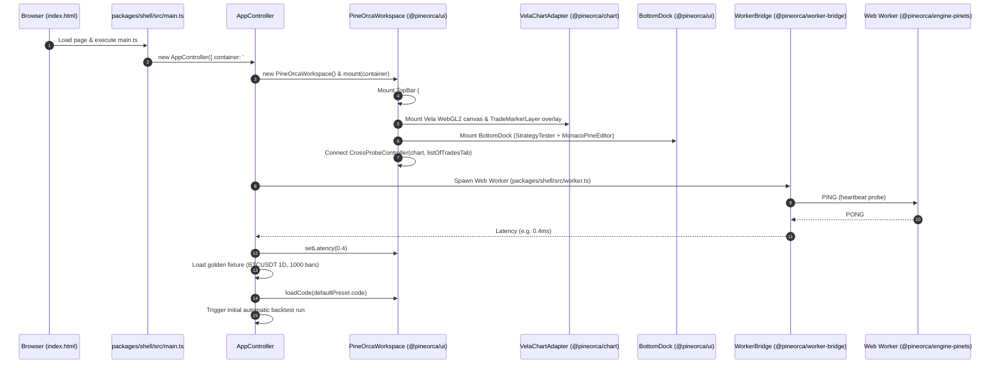
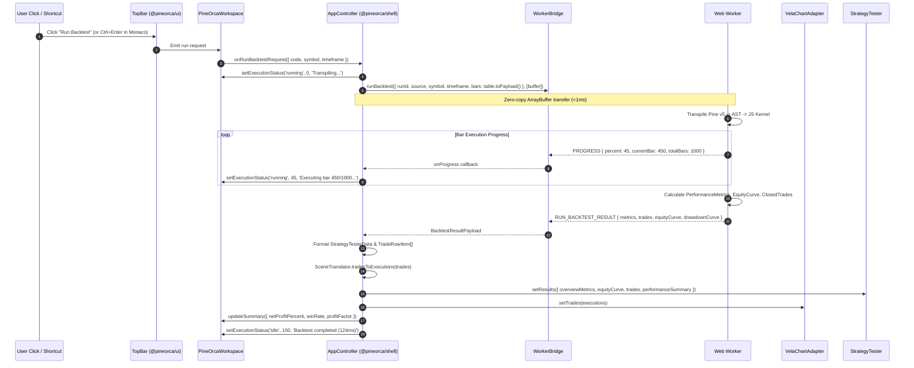
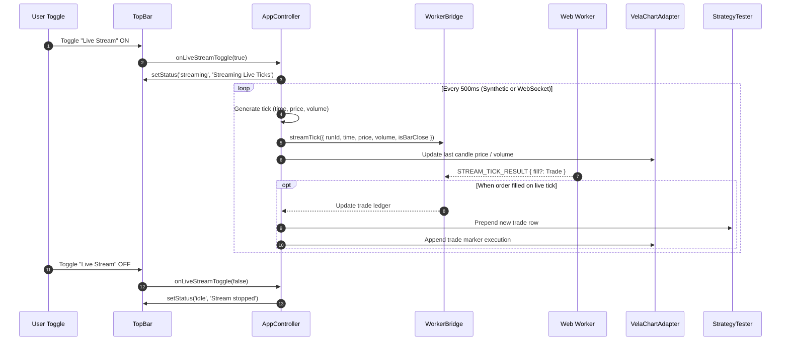
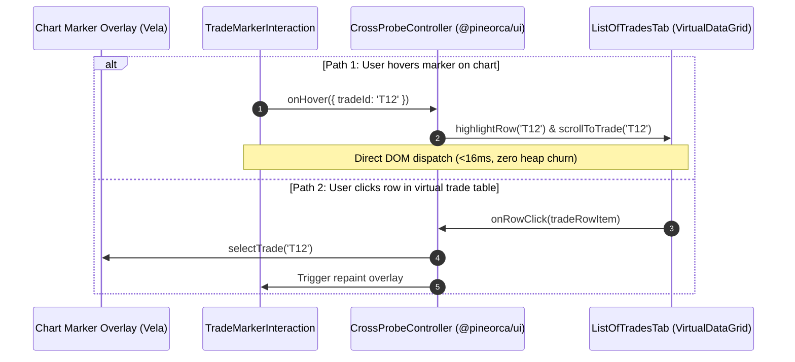

# PineOrca Frontend Shell: Architecture & Implementation Plan (Candidate 1)
**Focus: Clean Two-Tier Modularity between `@pineorca/ui` and `@pineorca/shell`**

---

## Executive Summary & System Vision

PineOrca is an institutional-grade, WebGL-accelerated financial charting and Pine Script (v5/v6) execution environment. This plan details the architectural design and phased construction of the complete frontend application: bringing together the existing transpiler engine, typed Web Worker RPC bridge, Vela WebGL chart adapter, and pure TypeScript UI components into a responsive, production-grade web application (`npm run dev`).

The design enforces a **strict two-tier modularity**:
1. **Tier 1: `@pineorca/ui` (Presentation & Layout)**: Framework-neutral, pure TypeScript DOM components with TradingView dark-theme styling (`#131722`), providing the `TopBar` control header and the `PineOrcaWorkspace` layout orchestrator. Strictly **Apache-2.0**, completely decoupled from Web Workers and transpiler internals.
2. **Tier 2: `@pineorca/shell` (Application, Orchestration, Worker Bridge & Runtime)**: The runnable Vite application package hosting `AppController`, worker lifecycle management, zero-copy `ArrayBuffer` transfer lists, deterministic market data fixtures, strategy presets, and the isolated Web Worker boundary under **AGPL-3.0**.

---

## 1. Architectural Foundation & Licensing Seam

### 1.1 The Licensing Seam (Host Apache-2.0 vs Worker AGPL-3.0)

```
+---------------------------------------------------------------------------------------+
| HOST THREAD (Apache-2.0)                                                              |
|                                                                                       |
|   +-------------------------------------------------------------------------------+   |
|   | @pineorca/shell (Vite Web Application)                                        |   |
|   |  - index.html, main.ts, AppController, FixtureManager, PresetManager           |   |
|   +-------------------------------------------------------------------------------+   |
|         |                                                      |                      |
|         v                                                      v                      |
|   +------------------------------------+             +----------------------------+   |
|   | @pineorca/ui                       |             | @pineorca/worker-bridge    |   |
|   |  - TopBar                          |             |  - WorkerBridge client     |   |
|   |  - PineOrcaWorkspace               |             |  - Typed RPC protocol      |   |
|   |  - BottomDock (Tester + Editor)    |             |  - Ping/Heartbeat          |   |
|   |  - CrossProbeController            |             +----------------------------+   |
|   +------------------------------------+                           |                  |
|         |                                                          |                  |
|         v                                                          | postMessage      |
|   +------------------------------------+                           | (Transferables)  |
|   | @pineorca/chart                    |                           |                  |
|   |  - VelaChartAdapter (@luxalgo/vela)|                           |                  |
|   |  - TradeMarkerLayer / Interaction  |                           |                  |
|   |  - SceneTranslator                 |                           |                  |
|   +------------------------------------+                           |                  |
+--------------------------------------------------------------------|------------------+
                                                                     |
======================= PROCESS ISOLATION BOUNDARY ==================|===================
                                                                     |
+--------------------------------------------------------------------|------------------+
| WEB WORKER THREAD (AGPL-3.0)                                       v                  |
|                                                                                       |
|   +-------------------------------------------------------------------------------+   |
|   | packages/shell/src/worker.ts (Isolated Worker Script)                         |   |
|   |  - imports @pineorca/engine-pinets/worker (handleWorkerCommand)               |   |
|   |  - ColumnarBarTable zero-copy buffer reconstitution                           |   |
|   |  - PineTranspiler (v5/v6 AST -> JS runtime)                                   |   |
|   |  - StrategyKernel broker simulation (FIFOLedger, IntrabarSimulator)           |   |
|   |  - PerformanceMetrics calculation & closedtrades generation                   |   |
|   +-------------------------------------------------------------------------------+   |
+---------------------------------------------------------------------------------------+
```

**Key Invariants:**
- **Zero Copyleft Leak**: `@pineorca/ui`, `@pineorca/chart`, `@pineorca/worker-bridge`, and the host bundle of `@pineorca/shell` contain zero imports from `@pineorca/engine-pinets`. Superfluous dependency declarations in `packages/ui/package.json` are cleanly removed.
- **Worker Isolation**: Vite bundles `packages/shell/src/worker.ts` into a separate chunk (`dist/assets/worker-[hash].js`) using `{ format: 'es' }`. The browser loads the worker via `new Worker(new URL('./worker.ts', import.meta.url), { type: 'module' })`.
- **Zero-Copy IPC**: OHLCV data transfers across the seam in $<1\text{ms}$ via `ArrayBuffer` transfer lists using `ColumnarBarTable.toPayload().buffer`.

---

## 2. Component Architecture & Two-Tier Modularity

### 2.1 Modularity Responsibility Matrix

| Feature / Responsibility | `@pineorca/ui` (Tier 1) | `@pineorca/shell` (Tier 2) |
|---|---|---|
| **Technology / Runtime** | Pure TypeScript DOM, CSS-in-JS/inline styles, no framework dependency | Vite 6, TypeScript 5.8, Web Workers, browser fetch/storage |
| **Licensing** | Apache-2.0 | Apache-2.0 (Host) / AGPL-3.0 (Worker script) |
| **TopBar Component** | Renders header UI: symbol selector, timeframe picker, presets, run button, live stream toggle, status badge, latency display | Supplies preset definitions, symbol list, feeds latency pings, handles click events |
| **Workspace Layout** | Orchestrates 3-pane layout (TopBar header, Chart center, BottomDock drawer), binds resize observers, handles split/collapse | Instantiates workspace, mounts to `#app`, supplies initial code & market data |
| **Chart & Markers** | Hosts `VelaChartAdapter` DOM container, manages resize recalculations | Passes PineRun indicator scenes and trade markers from worker results to chart adapter |
| **Dock & Tabs** | Hosts `BottomDock`, registers `StrategyTester` (Overview, Summary, Trades) and `MonacoPineEditor` | Formats raw worker trade/metrics output into `StrategyTesterData` |
| **Cross-Probe** | Wires `CrossProbeController` between `VelaChartAdapter` marker interaction and `ListOfTradesTab` virtual grid | Monitors probe events for telemetry if required |
| **Execution Coordination** | Emits `onRunBacktestRequest`, `onLiveStreamToggle`, `onEditorAction` | Executes `WorkerBridge.runBacktest()`, streams tick loop, sets workspace status |
| **Market Data Fixtures** | None (data agnostic) | Generates/loads deterministic OHLCV columnar tables (BTCUSDT, ETHUSDT, AAPL) |

---

## 3. End-to-End Execution & Data Flows

### 3.1 Flow A: Application Bootstrap & Initial Render


### 3.2 Flow B: Backtest Execution Pipeline


### 3.3 Flow C: Real-Time Live Tick Streaming Loop


### 3.4 Flow D: Sub-16ms Bi-Directional Cross-Probe


---

## 4. Phased Implementation Roadmap

```
+-----------------------------------------------------------------------+
| PHASE 1: @pineorca/ui — TopBar & Header Controls                      |
|  - TopBar component (Symbol, Timeframe, Presets, Run, Live, Status)   |
|  - Vitest headless DOM component tests in packages/ui/test            |
+-----------------------------------------------------------------------+
                                   |
                                   v
+-----------------------------------------------------------------------+
| PHASE 2: @pineorca/ui — Workspace Orchestrator & Cross-Probe Wiring  |
|  - PineOrcaWorkspace 3-pane layout & resizing                         |
|  - Wire CrossProbeController (VelaChartAdapter <-> StrategyTester)    |
|  - Licensing Seam cleanup in packages/ui/package.json                 |
+-----------------------------------------------------------------------+
                                   |
                                   v
+-----------------------------------------------------------------------+
| PHASE 3: @pineorca/shell — Architecture, Fixtures & AppController    |
|  - Scaffold packages/shell package.json & tsconfig.json               |
|  - Isolated AGPL worker script (packages/shell/src/worker.ts)         |
|  - Market data fixtures (ColumnarBarTable) & strategy presets library |
|  - AppController backtest & stream state coordinator                  |
|  - Licensing seam verification tests                                  |
+-----------------------------------------------------------------------+
                                   |
                                   v
+-----------------------------------------------------------------------+
| PHASE 4: @pineorca/shell — Vite Web App, Entry Point & Verification   |
|  - packages/shell/index.html & packages/shell/vite.config.ts          |
|  - packages/shell/src/main.ts bootstrap & root scripts                |
|  - End-to-end headless smoke tests & npm run dev verification         |
+-----------------------------------------------------------------------+
```

---

### Phase 1: `@pineorca/ui` — TopBar & Header Controls

#### 1.1 Goal & Scope
Implement `TopBar`: a high-density, TradingView-styled (`#131722`) header bar component in `@pineorca/ui` containing symbol selector, timeframe picker, strategy presets dropdown, prominent "Run Backtest" button with progress spinner, "Live Stream" toggle switch, execution status pill badge, and worker latency ping display.

#### 1.2 File Boundaries & Ownership
- **Created**:
  - `packages/ui/src/topbar/TopBar.ts`
  - `packages/ui/src/topbar/types.ts`
  - `packages/ui/src/topbar/index.ts`
  - `packages/ui/test/topbar.test.ts`
- **Modified**:
  - `packages/ui/src/index.ts` (export `TopBar` and associated types)

#### 1.3 Exact Symbols & Interfaces
```ts
// packages/ui/src/topbar/types.ts
export type ExecutionStatus = 'idle' | 'running' | 'streaming' | 'error';

export interface StrategyPresetOption {
    id: string;
    label: string;
    description?: string;
}

export interface TopBarOptions {
    initialSymbol?: string;
    initialTimeframe?: string;
    presets?: StrategyPresetOption[];
    initialPresetId?: string;
}

export type SymbolChangeCallback = (symbol: string) => void;
export type TimeframeChangeCallback = (timeframe: string) => void;
export type PresetChangeCallback = (presetId: string) => void;
export type RunBacktestCallback = () => void;
export type LiveStreamToggleCallback = (active: boolean) => void;

// packages/ui/src/topbar/TopBar.ts
export class TopBar {
    constructor(options?: TopBarOptions);
    mount(container: HTMLElement): void;
    destroy(): void;
    setSymbol(symbol: string): void;
    setTimeframe(timeframe: string): void;
    setPresets(presets: StrategyPresetOption[], activeId?: string): void;
    setStatus(status: ExecutionStatus, message?: string): void;
    setProgress(percent: number): void;
    setLatency(latencyMs: number): void;
    setLiveStreamActive(active: boolean): void;
    
    onSymbolChange(cb: SymbolChangeCallback): () => void;
    onTimeframeChange(cb: TimeframeChangeCallback): () => void;
    onPresetChange(cb: PresetChangeCallback): () => void;
    onRunBacktest(cb: RunBacktestCallback): () => void;
    onToggleLiveStream(cb: LiveStreamToggleCallback): () => void;
    
    getElement(): HTMLElement | null;
}
```

#### 1.4 Detailed Tasks
1. **DOM Construction**:
   - Create container element with style `height: 44px`, `background: #131722`, `border-bottom: 1px solid #2a2e39`, `display: flex`, `align-items: center`, `justify-content: space-between`, `padding: 0 12px`, `font-family: system-ui, -apple-system, sans-serif`.
   - **Left Group**:
     - Logo / Branding: PineOrca icon + title text (`#2962ff` blue accent, `font-weight: 700`, `font-size: 14px`).
     - Symbol Selector `<select>`: default options `BINANCE:BTCUSDT`, `BINANCE:ETHUSDT`, `NASDAQ:AAPL`, `NASDAQ:TSLA`, `FOREX:EURUSD`. Styled with `#1e222d` background, `#363a45` border, `#d1d4dc` text.
     - Timeframe Picker: Segmented buttons / dropdown for `1m`, `5m`, `15m`, `1h`, `4h`, `1D`, `1W`.
     - Strategy Presets `<select>`: Dynamic dropdown populated with preset strategies.
   - **Center Group**:
     - Execution Status Badge: Pill badge displaying current state.
       - `idle`: `#2a2e39` pill, `#787b86` text ("Ready").
       - `running`: `#1e3a8a` pill, `#60a5fa` text, animated CSS spinner ("Running 42%").
       - `streaming`: `#064e3b` pill, `#34d399` text, pulsing green dot indicator ("Live").
       - `error`: `#7f1d1d` pill, `#f87171` text ("Error").
   - **Right Group**:
     - Worker Latency Pill: Micro badge displaying RPC ping round-trip (`#1e222d` bg, `#787b86` text, e.g. `⚡ 0.4 ms`).
     - "Live Stream" Toggle Button: Pill toggle with toggle indicator, activating real-time tick injection.
     - "Run Backtest" Button: Prominent primary button (`background: #2962ff`, hover `#1e4bd8`, `color: #ffffff`, `font-weight: 600`, `border-radius: 4px`, `padding: 6px 14px`).
2. **State & Event Wiring**:
   - Bind click and change event listeners. Prevent memory leaks by cleaning up listeners in `destroy()`.
   - Implement `setProgress(percent)` to update progress percentage text dynamically without re-rendering the whole DOM tree.
3. **Exports**:
   - Re-export `TopBar` and its types in `packages/ui/src/index.ts`.
4. **Headless Unit Testing**:
   - Create `packages/ui/test/topbar.test.ts` using `setupTestDOM()` from `packages/ui/test/setup-dom.ts` (lines 178-248).
   - Test suite verifying:
     - Initialization with default options and custom options.
     - DOM tree generation and element styling classes.
     - Selection changes triggering callbacks (`onSymbolChange`, `onTimeframeChange`, `onPresetChange`).
     - Action button clicks triggering `onRunBacktest` and `onToggleLiveStream`.
     - Visual badge transitions across `idle`, `running`, `streaming`, and `error`.
     - Clean DOM removal and listener detachment on `destroy()`.

#### 1.5 Verification Commands
```bash
# Run TopBar unit tests
npx vitest run packages/ui/test/topbar.test.ts

# Ensure entire test baseline remains intact
npm test
```

---

### Phase 2: `@pineorca/ui` — Workspace Orchestrator & Cross-Probe Integration

#### 2.1 Goal & Scope
Implement `PineOrcaWorkspace`: the master DOM layout orchestrator in `@pineorca/ui`. It mounts `TopBar` at the top, `VelaChartAdapter` in the central viewport, and `BottomDock` (hosting `StrategyTester` and `MonacoPineEditor`) at the bottom. It wires `CrossProbeController` between `VelaChartAdapter` markers and `StrategyTester.getListOfTradesTab()`, manages responsive resize recalculations, and exposes high-level facade methods. Clean up `@pineorca/ui/package.json` to eliminate unused `@pineorca/engine-pinets` copyleft leak.

#### 2.2 File Boundaries & Ownership
- **Created**:
  - `packages/ui/src/workspace/PineOrcaWorkspace.ts`
  - `packages/ui/src/workspace/types.ts`
  - `packages/ui/src/workspace/index.ts`
  - `packages/ui/test/workspace.test.ts`
- **Modified**:
  - `packages/ui/package.json` (remove `@pineorca/engine-pinets` dependency)
  - `packages/ui/src/index.ts` (export `PineOrcaWorkspace`)

#### 2.3 Exact Symbols & Codebase Citations
- `BottomDock`: `packages/ui/src/dock/BottomDock.ts:32` (`mount:75`, `registerTab:157`, `onStateChange:167`, `onHeightChange:172`).
- `StrategyTester`: `packages/ui/src/tester/StrategyTester.ts:23` (`mount:42`, `setResults:63`, `getListOfTradesTab:97`).
- `MonacoPineEditor`: `packages/ui/src/editor/MonacoPineEditor.ts:214` (`mount:238`, `getCode:266`, `setCode:270`, `onAction:324`).
- `CrossProbeController`: `packages/ui/src/controller/CrossProbeController.ts:41` (`connect:52`, `disconnect:169`).
- `VelaChartAdapter`: `packages/chart/src/VelaChartAdapter.ts:24` (`mount:106`, `setTrades:267`, `requestMarkerRepaint:290`, `destroy:303`).

```ts
// packages/ui/src/workspace/types.ts
export interface WorkspaceOptions {
    initialSymbol?: string;
    initialTimeframe?: string;
    initialCode?: string;
    presets?: StrategyPresetOption[];
    initialPresetId?: string;
    chartOptions?: VelaChartAdapterOptions;
    dockOptions?: BottomDockOptions;
}

export interface WorkspaceRunRequest {
    code: string;
    symbol: string;
    timeframe: string;
}

// packages/ui/src/workspace/PineOrcaWorkspace.ts
export class PineOrcaWorkspace {
    constructor(options?: WorkspaceOptions);
    mount(container: HTMLElement): void;
    destroy(): void;
    
    // Sub-component Accessors
    getTopBar(): TopBar;
    getChartAdapter(): VelaChartAdapter;
    getDock(): BottomDock;
    getTester(): StrategyTester;
    getEditor(): MonacoPineEditor;
    getCrossProbeController(): CrossProbeController;
    
    // Facade APIs for AppController
    setExecutionStatus(status: ExecutionStatus, progress?: number, message?: string): void;
    setBacktestResults(data: StrategyTesterData, trades?: readonly TradeExecution[]): void;
    updateSummary(summary: Partial<DockSummaryData>): void;
    setLatency(latencyMs: number): void;
    loadCode(code: string): void;
    getCode(): string;
    
    // Event Subscriptions
    onRunBacktestRequest(cb: (req: WorkspaceRunRequest) => void): () => void;
    onLiveStreamToggle(cb: (active: boolean) => void): () => void;
    onSymbolChange(cb: (symbol: string) => void): () => void;
    onTimeframeChange(cb: (timeframe: string) => void): () => void;
    onPresetChange(cb: (presetId: string) => void): () => void;
    onEditorAction(cb: (action: EditorAction, code: string) => void): () => void;
}
```

#### 2.4 Detailed Tasks
1. **DOM Layout Structure**:
   - Root Container: `display: flex`, `flex-direction: column`, `width: 100%`, `height: 100%`, `overflow: hidden`, `background: #131722`.
   - Top Header Slot: Hosts `TopBar` (`height: 44px`, `flex-shrink: 0`).
   - Main Viewport (`pineorca-workspace-body`): `display: flex`, `flex-direction: column`, `flex: 1`, `position: relative`, `min-height: 0`.
     - Chart Host Slot (`pineorca-chart-slot`): `flex: 1`, `min-height: 100px`, `position: relative`, `overflow: hidden`. Mounts `VelaChartAdapter`.
     - Bottom Dock Slot: Mounts `BottomDock`.
2. **Tab Registration in BottomDock**:
   - In `BottomDock`, the default tabs are `'tester'` ("Strategy Tester") and `'editor'` ("Pine Editor") (`BottomDock.ts:70-73`).
   - Instantiate `StrategyTester` and mount into tab body for `'tester'`.
   - Instantiate `MonacoPineEditor` (with default initial Pine Script code) and mount into tab body for `'editor'`.
3. **Cross-Probe Controller Wiring**:
   - Instantiate `CrossProbeController`.
   - Connect chart probe target (`chartAdapter`) with trades table probe target (`tester.getListOfTradesTab()`) via `crossProbe.connect(chartAdapter, tester.getListOfTradesTab())`.
   - Verifies lines 52-60 in `CrossProbeController.ts`: automatically listens to hover/click on chart markers and table rows, achieving $<16\text{ms}$ cross-probe response.
4. **Dock Resizing & Layout Synchronization**:
   - Listen to `dock.onHeightChange()` and `dock.onStateChange()`:
     - When dock height changes or dock transitions between `collapsed` (36px), `split` (340px), and `maximized` (100%), immediately call `chartAdapter.requestMarkerRepaint()` and Vela resize recalculation.
     - Set up `ResizeObserver` on chart host slot to handle window resizing.
5. **Event Forwarding**:
   - Wire `topBar.onRunBacktest` -> gathers current Monaco editor code via `editor.getCode()`, current symbol, timeframe -> dispatches `onRunBacktestRequest`.
   - Wire `editor.onAction('addToChart' | 'updateStrategy')` -> dispatches `onRunBacktestRequest`.
   - Forward `onLiveStreamToggle`, `onSymbolChange`, `onTimeframeChange`, `onPresetChange`.
6. **Licensing Seam Clean-Up**:
   - Inspect `packages/ui/package.json`. Line 35 lists `"@pineorca/engine-pinets": "*"`.
   - Remove `"@pineorca/engine-pinets": "*"` from `packages/ui/package.json`.
   - Verify that `@pineorca/ui` builds cleanly with `tsc` without any references to `engine-pinets`.
7. **Headless Unit Testing**:
   - Create `packages/ui/test/workspace.test.ts` using `setupTestDOM()`.
   - Test suite verifying:
     - Workspace mounts sub-components: TopBar, Chart container, BottomDock, StrategyTester, MonacoPineEditor.
     - Facade methods (`loadCode`, `getCode`, `setExecutionStatus`, `setBacktestResults`, `updateSummary`) update child components.
     - Dock resize callbacks trigger chart marker repaints.
     - Editor action triggers run backtest request callback.
     - `destroy()` disconnects CrossProbeController and destroys all child components.

#### 2.5 Verification Commands
```bash
# Run Workspace unit tests
npx vitest run packages/ui/test/workspace.test.ts

# Typecheck monorepo packages to confirm licensing seam cleanup
npx tsc --build
```

---

### Phase 3: `@pineorca/shell` — Architecture, Fixtures & AppController

#### 3.1 Goal & Scope
Scaffold `@pineorca/shell` as an official npm workspace package. Create the isolated AGPL-3.0 Web Worker script (`packages/shell/src/worker.ts`), preloaded golden market data fixtures in continuous `ColumnarBarTable` format, a library of Pine v5 strategy presets, and `AppController`: the central orchestrator that wires `WorkerBridge` with `PineOrcaWorkspace`, manages backtest execution with zero-copy buffer transfer, streaming tick simulation, and RPC heartbeat telemetry. Add automated tests verifying backtest dispatching and the Apache-2.0 / AGPL-3.0 licensing seam.

#### 3.2 File Boundaries & Ownership
- **Created**:
  - `packages/shell/package.json`
  - `packages/shell/tsconfig.json`
  - `packages/shell/src/worker.ts` (AGPL-3.0 Web Worker entry point)
  - `packages/shell/src/fixtures/golden-bars.ts` (OHLCV columnar data fixtures)
  - `packages/shell/src/presets/strategy-presets.ts` (Pine v5 strategy presets)
  - `packages/shell/src/controller/AppController.ts` (Application controller)
  - `packages/shell/test/app-controller.test.ts` (Controller unit tests)
  - `packages/shell/test/licensing-seam.test.ts` (Licensing boundary tests)
- **Modified**:
  - `tsconfig.json` (root: register `{ "path": "./packages/shell" }` project reference)

#### 3.3 Exact Symbols & Interfaces
- `WorkerBridge`: `packages/worker-bridge/src/WorkerBridge.ts:46` (`runBacktest:115`, `streamTick:181`, `ping:204`).
- `ColumnarBarTable`: `packages/data/src/columnar/ColumnarBarTable.ts:8` (`allocate:31`, `fromBars:63`, `toPayload:144`, `transferables:175`).
- `handleWorkerCommand`: `packages/engine-pinets/src/worker/worker.ts:135`.
- `SceneTranslator`: `packages/chart/src/scene/SceneTranslator.ts:40` (`tradesToExecutions:52`).

```ts
// packages/shell/src/presets/strategy-presets.ts
export interface StrategyPreset {
    id: string;
    label: string;
    description: string;
    defaultSymbol: string;
    defaultTimeframe: string;
    code: string;
}

export const STRATEGY_PRESETS: StrategyPreset[];

// packages/shell/src/fixtures/golden-bars.ts
export interface MarketFixture {
    symbol: string;
    timeframe: string;
    table: ColumnarBarTable;
}

export class FixtureManager {
    static getFixture(symbol: string, timeframe: string): ColumnarBarTable;
    static generateSyntheticBars(symbol: string, timeframe: string, count?: number): ColumnarBarTable;
}

// packages/shell/src/controller/AppController.ts
export interface AppControllerOptions {
    container: HTMLElement | string;
    workerFactory?: () => Worker;
    initialSymbol?: string;
    initialTimeframe?: string;
    initialPresetId?: string;
    enableHeartbeat?: boolean;
}

export class AppController {
    constructor(options: AppControllerOptions);
    init(): Promise<void>;
    destroy(): void;
    
    getWorkspace(): PineOrcaWorkspace;
    getWorkerBridge(): WorkerBridge;
    
    runCurrentBacktest(): Promise<BacktestResultPayload | null>;
    toggleLiveStream(active?: boolean): void;
    switchSymbol(symbol: string): void;
    switchTimeframe(timeframe: string): void;
    loadPreset(presetId: string): void;
}
```

#### 3.4 Detailed Tasks
1. **Package Configuration (`packages/shell/package.json`)**:
   - `name`: `"@pineorca/shell"`, `version`: `"0.1.0"`, `private`: `true`, `type`: `"module"`, `license`: `"Apache-2.0"`.
   - `dependencies`:
     - `"@pineorca/data": "*"`
     - `"@pineorca/chart": "*"`
     - `"@pineorca/ui": "*"`
     - `"@pineorca/worker-bridge": "*"`
   - `devDependencies`:
     - `"@pineorca/engine-pinets": "*"` (solely for the separate worker entry point `src/worker.ts`)
     - `"vite": "^6.0.0"`
   - Update root `tsconfig.json` references to add `{ "path": "./packages/shell" }`.
2. **AGPL Worker Entry (`packages/shell/src/worker.ts`)**:
   - File header: `// SPDX-License-Identifier: AGPL-3.0-only`.
   - Import `handleWorkerCommand` from `@pineorca/engine-pinets/worker`.
   - Add message event listener to worker scope:
     ```ts
     const workerScope: any = typeof self !== 'undefined' ? self : globalThis;
     if (typeof workerScope.addEventListener === 'function') {
         workerScope.addEventListener('message', (event: MessageEvent) => {
             if (event.data) {
                 handleWorkerCommand(event.data, (res) => workerScope.postMessage(res));
             }
         });
     }
     ```
3. **Golden Market Data Fixtures (`packages/shell/src/fixtures/golden-bars.ts`)**:
   - Provide pre-generated or deterministic synthetic 1,000-bar OHLCV datasets for:
     - `BINANCE:BTCUSDT` (1D: base price 45,000, realistic volatility, volume).
     - `BINANCE:ETHUSDT` (1h: base price 2,800).
     - `NASDAQ:AAPL` (1D: base price 180).
   - Use continuous 64-byte aligned Float64Array SOAs via `ColumnarBarTable.allocate(length)`.
   - Ensure `transferables` returns `[table.toPayload().buffer]` for zero-copy postMessage IPC.
4. **Curated Strategy Presets (`packages/shell/src/presets/strategy-presets.ts`)**:
   - Provide 5 battle-tested Pine v5 strategies:
     1. `ema-cross`: Double EMA Crossover (14/28) with `strategy.entry("Long")` and `strategy.close("Long")`.
     2. `bollinger-break`: Bollinger Bands (20, 2.0) Breakout strategy.
     3. `rsi-reversion`: RSI (14) Mean Reversion (oversold $<30$, overbought $>70$).
     4. `macd-cross`: MACD (12, 26, 9) Signal Line Crossover.
     5. `supertrend`: SuperTrend volatility trend-following strategy.
5. **Application Controller (`packages/shell/src/controller/AppController.ts`)**:
   - Instantiate `WorkerBridge` passing the `workerFactory` (defaults to `() => new Worker(new URL('../worker.ts', import.meta.url), { type: 'module' })`).
   - Instantiate `PineOrcaWorkspace` and mount into target container.
   - Wire user events from `PineOrcaWorkspace`:
     - `onRunBacktestRequest` -> calls `runCurrentBacktest()`.
     - `onLiveStreamToggle` -> calls `toggleLiveStream()`.
     - `onSymbolChange` -> calls `switchSymbol()`.
     - `onTimeframeChange` -> calls `switchTimeframe()`.
     - `onPresetChange` -> calls `loadPreset()`.
   - **Backtest Execution Routine (`runCurrentBacktest`)**:
     1. Generate unique `runId` (`run-${Date.now()}`).
     2. Workspace status -> `running`, progress -> 0%.
     3. Retrieve current bar table from `FixtureManager`.
     4. Call `workerBridge.runBacktest({ runId, source: code, symbol, timeframe, bars: table.toPayload() }, onProgress)`.
        - `onProgress(p)` updates `workspace.setExecutionStatus('running', p.percent)`.
     5. On result:
        - Map `result.metrics` into KPI overview metrics.
        - Map `result.trades` via `SceneTranslator.tradesToExecutions` for chart markers (`chartAdapter.setTrades(executions)`).
        - Map `result.trades` into `TradeRowItem[]` for virtual grid (`ListOfTradesTab`).
        - Format equity curve points with timestamps from bar table.
        - Pass results to `workspace.setBacktestResults(data, executions)`.
        - Update dock summary pill: Net Profit %, Win Rate %, Total Trades.
        - Workspace status -> `idle` with execution duration (e.g. "Completed in 48ms").
     6. On error:
        - Workspace status -> `error` with error message.
        - Pass error line/column to Monaco editor diagnostics.
   - **Live Tick Streaming Routine (`toggleLiveStream`)**:
     - Maintain an active streaming timer or simulated tick generator.
     - On each tick, call `workerBridge.streamTick({ runId, time, price, volume, isBarClose })`.
     - Update chart adapter latest bar price.
   - **Heartbeat Telemetry Loop**:
     - Every 5,000ms, call `workerBridge.ping()`.
     - Update TopBar latency pill (`workspace.setLatency(latencyMs)`).
6. **Licensing Seam & Unit Testing**:
   - `packages/shell/test/app-controller.test.ts`:
     - Uses `MockWorker` conforming to `WorkerLike` (`packages/worker-bridge/src/WorkerBridge.ts:15`).
     - Tests full backtest flow, fixture loading, preset switching, error handling.
   - `packages/shell/test/licensing-seam.test.ts`:
     - Inspects imports in `packages/ui` and `packages/shell/src/controller/AppController.ts`.
     - Asserts that no host code directly imports from `@pineorca/engine-pinets`.
     - Confirms only `packages/shell/src/worker.ts` references the worker script.

#### 3.5 Verification Commands
```bash
# Run controller unit tests and licensing verification
npx vitest run packages/shell/test/app-controller.test.ts
npx vitest run packages/shell/test/licensing-seam.test.ts

# Ensure entire test suite passes
npm test
```

---

### Phase 4: `@pineorca/shell` — Vite Web Application Setup, Main Entry, & Verification

#### 4.1 Goal & Scope
Complete the web application setup: create `packages/shell/index.html`, `packages/shell/vite.config.ts`, and `packages/shell/src/main.ts`. Wire root npm scripts (`npm run dev`, `npm run build`), configure Vite for ES module Web Worker bundling, and verify complete browser functionality, responsiveness, and zero-config instant demonstration.

#### 4.2 File Boundaries & Ownership
- **Created**:
  - `packages/shell/index.html`
  - `packages/shell/vite.config.ts`
  - `packages/shell/src/main.ts`
  - `packages/shell/src/style.css`
  - `packages/shell/test/smoke.test.ts`
- **Modified**:
  - `package.json` (root: add `"dev": "npm --workspace=@pineorca/shell run dev"`)

#### 4.3 Detailed Tasks
1. **HTML Shell (`packages/shell/index.html`)**:
   - Dark theme background `#131722`, reset CSS margins/padding to 0, height 100vh.
   - Root mount div `<div id="app" style="width: 100vw; height: 100vh; overflow: hidden;"></div>`.
   - Script entry: `<script type="module" src="/src/main.ts"></script>`.
2. **Vite Configuration (`packages/shell/vite.config.ts`)**:
   - Configure ES module worker bundling: `worker: { format: 'es' }`.
   - Set dev server port: `5173`.
   - Monorepo package resolution: configure resolve aliases or rely on npm workspace symlinks.
   - Configure build options: output to `dist/`, sourcemaps enabled.
3. **Application Main Entry (`packages/shell/src/main.ts`)**:
   - Import `./style.css` (TradingView base reset, scrollbar styles `#2a2e39`).
   - Import `AppController` from `./controller/AppController.js`.
   - On `DOMContentLoaded` (or immediate execution):
     - Instantiate `app = new AppController({ container: '#app' })`.
     - Call `await app.init()`.
     - Automatically execute initial backtest on default preset (EMA Crossover on BTCUSDT 1D) so the chart immediately displays candlesticks, indicators, trade markers, and Strategy Tester metrics upon initial browser load.
4. **Root NPM Scripts (`package.json`)**:
   - Add `"dev": "npm --workspace=@pineorca/shell run dev"`.
   - Update `"build": "tsc --build && npm --workspace=@pineorca/shell run build"`.
5. **Interactive Smoke & Build Verification (`packages/shell/test/smoke.test.ts`)**:
   - Headless test verifying:
     - `index.html` contains `#app` mount target and valid script link.
     - `vite.config.ts` exports valid configuration with `worker.format: 'es'`.
     - Main entry point imports `AppController`.
     - Build verification: `npm run build` generates production bundle in `packages/shell/dist/`.
     - Inspect generated bundle files to ensure zero compile-time leakage of AGPL engine into main vendor/app chunk.

#### 4.4 Verification Commands
```bash
# Verify smoke tests
npx vitest run packages/shell/test/smoke.test.ts

# Test production build
npm run build

# Run all monorepo tests (should be >= 105 tests passing)
npm test
```

---

## 5. Risk Assessment & Mitigations

| Risk / Failure Mode | Likelihood | Impact | Severity | Mitigation Strategy |
|---|---|---|---|---|
| **Vite Web Worker Module Bundling Collision** (`import.meta.url` vs Webpack/Node syntax) | Medium | High | **High** | In `vite.config.ts`, explicitly set `worker: { format: 'es' }`. Instantiate worker using standard ES syntax `new Worker(new URL('./worker.ts', import.meta.url), { type: 'module' })`. Verified in Phase 4 build check. |
| **Monaco Editor Monarch Asset Loading in Dev / Prod** | Medium | Medium | **Medium** | `MonacoPineEditor` in `@pineorca/ui` (lines 228-235) is already designed with an graceful fallback to `<textarea>` if Monaco CDN / web runtime is absent in headless/test environments, and Monarch syntax is registered inline via `registerPineLanguage()` (`MonacoPineEditor.ts:199-208`). |
| **ArrayBuffer Detachment on Zero-Copy Transfer** | Low | High | **Medium** | In `AppController`, clone or re-read buffer when reusing fixtures across repeated backtests, because transferring an `ArrayBuffer` empties (`byteLength === 0`) the source buffer in the host thread. `ColumnarBarTable.clone()` preserves source data. |
| **Cross-Probe Hover Event Storms / UI Stutter** | Low | Medium | **Low** | `CrossProbeController.ts` (lines 80-140) uses timestamp throttling and direct canvas 2D repainting (`<16ms`), bypassing virtual DOM reconciliation. |
| **Licensing Copyleft Leakage** (Host bundle contaminated with AGPL code) | Medium | High | **High** | Phase 2 removes `@pineorca/engine-pinets` from `packages/ui/package.json`. Phase 3 enforces that only `packages/shell/src/worker.ts` imports engine code. Phase 3 includes an automated test (`licensing-seam.test.ts`) scanning AST/imports. |

---

## 6. Backwards Compatibility & Invariants

1. **Existing Test Suite Baseline**: All 15 existing test files and 95 unit tests in `@pineorca/data`, `@pineorca/engine-pinets`, `@pineorca/worker-bridge`, `@pineorca/chart`, and `@pineorca/ui` must pass cleanly without modification.
2. **Framework Neutrality**: `@pineorca/ui` remains 100% pure TypeScript DOM with zero React/Vue/Svelte dependencies.
3. **Data Memory Invariant**: OHLCV market data remains packed in continuous, 64-byte aligned Float64Array structures (`ColumnarBarTable`), transferring to Web Worker in $O(1)$ time with zero heap allocations.
4. **TradingView Design Parity**: Dark theme colors `#131722` (surface), `#181b24` (elevated surface), `#2a2e39` (borders), `#2962ff` (brand blue), `#22ab94` (bullish green), `#f23645` (bearish red), and `#d1d4dc` (text) are strictly maintained across all components.

---

## 7. Plan Verification & Success Criteria

- [ ] `packages/ui/src/topbar/TopBar.ts` implemented with symbol, timeframe, presets, run button, live stream toggle, status badge, latency display.
- [ ] `packages/ui/src/workspace/PineOrcaWorkspace.ts` implemented, orchestrating TopBar, VelaChartAdapter, and BottomDock (StrategyTester + MonacoPineEditor).
- [ ] `CrossProbeController` wired between `VelaChartAdapter` trade markers and `ListOfTradesTab` virtual data grid.
- [ ] `@pineorca/ui/package.json` cleaned of copyleft `@pineorca/engine-pinets` dependency.
- [ ] `packages/shell` created as runnable Vite application with Apache-2.0 host and isolated AGPL-3.0 worker script.
- [ ] Golden market data fixtures (`BTCUSDT`, `ETHUSDT`, `AAPL`) and 5 Pine v5 strategy presets available for instant zero-config backtesting.
- [ ] `AppController` coordinates backtesting via `WorkerBridge` with zero-copy `ArrayBuffer` transfer lists, live streaming tick loop, and latency telemetry.
- [ ] All new unit tests pass in Vitest headlessly; full test suite passes $\ge 105$ tests.
- [ ] `npm run build` succeeds across all monorepo packages without type errors or bundle collisions.
- [ ] Running `npm run dev` launches a functional, TradingView-grade financial workspace at `http://localhost:5173`.
