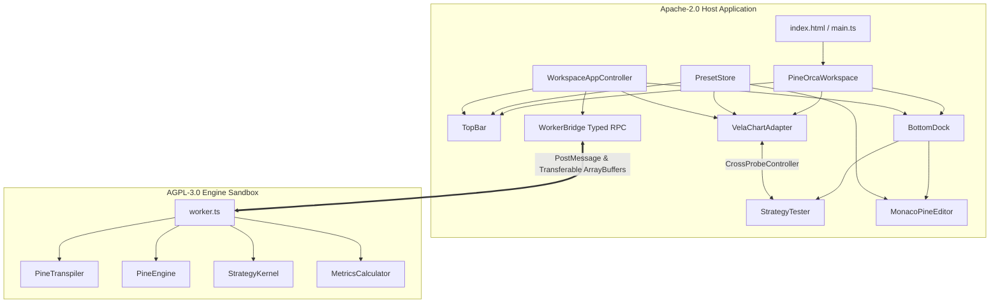

# PineOrca Frontend Shell Implementation Plan (Candidate 2)

## Executive Summary & Core Architectural Theme

PineOrca requires a runnable, TradingView-grade financial charting and backtesting frontend workspace that bridges the transpiled Pine execution engine, columnar financial data arrays, WebGL2 chart rendering, and pure TypeScript UI components into a responsive desktop browser experience.

This plan (Candidate 2) is engineered around four core architectural pillars:
1. **Zero-Friction Developer Experience**: Running `npm run dev` instantly boots an interactive, pre-configured application with hot-module replacement (HMR), TradingView dark-theme styling (`#131722`), pre-loaded strategy presets, and zero manual backend setup.
2. **Instant Vite Worker Bundling & Licensing Seam**: Pure ESM worker bundling via `new Worker(new URL(..., import.meta.url), { type: 'module' })` with `worker: { format: 'es' }`. The Apache-2.0 host application communicates with the AGPL-3.0 engine strictly across an isolated Web Worker boundary via typed RPC messages and zero-copy transferable `ArrayBuffer` payloads, preventing any compile-time copyleft infection.
3. **Robust Error Boundaries & Self-Healing Watchdogs**: Multi-layer fault tolerance handling syntax/compilation errors (mapped directly to line/column Monaco squiggles), runtime engine panics (graceful toast alerts without page crashes), worker thread freezes (watchdog heartbeat with automatic thread recreation), and buffer detachment safeguards.
4. **Golden Fixture Preset Loading & Oracle Verification**: Seamless integration of existing TradingView-verified test fixtures (`rsi-mean-reversion`, `macd-reversal`, `bb-pyramiding`, `turtle-trailing`, `crypto-margin-call`), enabling one-click instant strategy switching, immediate candle/marker rendering, and live oracle parity validation.

---

## Architectural Blueprint & System Topology



### Component Data Flow Contract

| Origin | Destination | Data Payload | Transport Mechanism | Latency / Frequency |
|---|---|---|---|---|
| `PresetStore` | `MonacoPineEditor` | Pine Script source code (`string`) | Direct method invocation `setValue()` | Instant (<1ms) |
| `PresetStore` | `VelaChartAdapter` | OHLCV bars (`ColumnarBarTable` or `Bar[]`) | In-memory reference | Instant (<2ms) |
| `WorkspaceAppController` | `WorkerBridge` | `RunBacktestPayload` + `ArrayBuffer` transfer list | `WorkerBridge.runBacktest()` (`postMessage`) | Zero-copy (<1ms transfer) |
| `WorkerBridge` (Worker) | `WorkerBridge` (Host) | `ProgressPayload` (`percent`, `currentBar`) | Web Worker `postMessage` | Throttled (100ms) |
| `WorkerBridge` (Worker) | `WorkspaceAppController` | `BacktestResultPayload` (`metrics`, `trades`, `equityCurve`) | Web Worker `postMessage` | Single settlement packet |
| `WorkspaceAppController` | `StrategyTester` | `StrategyTesterData` (`overviewMetrics`, `equityCurve`, `trades`) | `StrategyTester.setResults()` | 60 FPS Canvas repaint |
| `WorkspaceAppController` | `VelaChartAdapter` | `TradeExecution[]` | `VelaChartAdapter.setTrades()` | Marker layer batch repaint |
| `StrategyTester` (Trades Grid) | `VelaChartAdapter` (Markers) | `tradeId`, `highlight` / `select` | `CrossProbeController.attach()` | Immediate (<16ms) |
| `VelaChartAdapter` (Marker Hit) | `StrategyTester` (Trades Grid) | `tradeId`, row scroll & select | `CrossProbeController.attach()` | Immediate (<16ms) |

---

## Existing Codebase Baseline & Citations

All symbol references and architectural hooks have been verified directly against repository sources:
- **Worker Bridge RPC Protocol**:
  - `CommandType` & `ResponseType` defined in `packages/worker-bridge/src/protocol.ts:4-23`.
  - `RunBacktestPayload` and `BacktestResultPayload` in `packages/worker-bridge/src/protocol.ts:39-47,104-111`.
  - `WorkerBridge` lifecycle, `runBacktest()`, `streamTick()`, `cancelRun()`, `ping()`, and `terminate()` in `packages/worker-bridge/src/WorkerBridge.ts:46-56,115-173,181-192,204-210,333-350`.
- **Columnar Financial Data Structures**:
  - `Bar` interface and `ColumnarBufferPayload` in `packages/data/src/columnar/types.ts:4-11,16-20`.
  - `ColumnarBarTable.fromBars()`, `toPayload()`, `transferables`, and `clone()` in `packages/data/src/columnar/ColumnarBarTable.ts:63-100,144-178,297-300`.
- **Chart & Trade Marker Rendering**:
  - `VelaChartAdapter` options, `mount()`, `routeIndicatorModel()`, `loadPineRun()`, `setTrades()`, and `requestMarkerRepaint()` in `packages/chart/src/VelaChartAdapter.ts:8-17,94-140,166-245,252-270,290-296`.
  - Trade marker layout and interaction hit testing in `packages/chart/src/markers/TradeMarkerLayer.ts:115-125` and `packages/chart/src/markers/TradeMarkerInteraction.ts:44-55`.
- **UI Components & Cross-Probing**:
  - `BottomDock` 3-state dockable container and tabs in `packages/ui/src/dock/BottomDock.ts:4-26,32-75,99-120,157-170`.
  - `StrategyTester` tabs and `setResults()` in `packages/ui/src/tester/StrategyTester.ts:8-17,23-46,63-73,89-99`.
  - `ListOfTradesTab` virtualized grid selection hooks in `packages/ui/src/tester/tabs/ListOfTradesTab.ts:406-424`.
  - `MonacoPineEditor` options, diagnostics, actions, and fallback textarea in `packages/ui/src/editor/MonacoPineEditor.ts:4-14,214-243,265-300,437-515`.
  - `CrossProbeController` bi-directional synchronization in `packages/ui/src/controller/CrossProbeController.ts:5-30,60-75,144-172`.
- **Golden Fixtures & TradingView Parity Test Oracle**:
  - 5 complete test fixtures (`rsi-mean-reversion.tv.json`, `macd-reversal.tv.json`, `bb-pyramiding.tv.json`, `turtle-trailing.tv.json`, `crypto-margin-call.tv.json`) in `tests/golden/fixtures/`.
  - Oracle comparison harness in `tests/golden/parity-oracle.test.ts:16-58`.

---

## Detailed Implementation Phases

### Phase 1: Core UI Primitives & Workspace Orchestrator (`@pineorca/ui`)

#### Objective
Implement the missing header navigation component (`TopBar`) and top-level workspace orchestrator (`PineOrcaWorkspace`) in `@pineorca/ui`, adhering strictly to TradingView dark-theme design standards and zero-dependency DOM patterns.

#### File Modifications & New Files
1. `packages/ui/src/topbar/TopBar.ts` (NEW)
2. `packages/ui/src/workspace/PineOrcaWorkspace.ts` (NEW)
3. `packages/ui/src/index.ts` (UPDATE: re-export `TopBar` and `PineOrcaWorkspace`)
4. `packages/ui/test/topbar.test.ts` (NEW)
5. `packages/ui/test/workspace.test.ts` (NEW)

#### Step-by-Step Implementation Details

##### 1.1 Implement `TopBar.ts`
- **Location**: `packages/ui/src/topbar/TopBar.ts`
- **Type Definitions**:
  ```ts
  export type ExecutionStatus = 'idle' | 'compiling' | 'running' | 'completed' | 'error' | 'streaming';

  export interface TopBarPresetItem {
    id: string;
    label: string;
    description?: string;
  }

  export interface TopBarOptions {
    initialSymbol?: string;
    initialTimeframe?: string;
    presets?: TopBarPresetItem[];
    activePresetId?: string;
    onRunBacktest?: () => void;
    onToggleStream?: (active: boolean) => void;
    onSymbolChange?: (symbol: string) => void;
    onTimeframeChange?: (tf: string) => void;
    onPresetChange?: (presetId: string) => void;
  }
  ```
- **Visual Design & Elements**:
  - Height: Fixed 44px, background `#131722`, border-bottom `1px solid #2a2e39`, font `system-ui, -apple-system, sans-serif`.
  - **Brand Mark**: `PineOrca` typographic logo with blue indicator dot (`#2962ff`).
  - **Symbol Selector**: Searchable input / selector styled with `#1e222d` background, `#d1d4dc` text, showing current ticker (e.g. `BINANCE:BTCUSDT`).
  - **Timeframe Selector**: Quick-select segmented pills: `1m`, `5m`, `15m`, `1h`, `4h`, `1D`, with `#2962ff` active highlight.
  - **Preset Dropdown**: `<select>` or custom dropdown containing loaded strategy presets with change event listener.
  - **Run Backtest Button**: Primary CTA button (`background: #2962ff`, hover `#1e53e5`), displaying icon + "Run Backtest", with badge `Ctrl+Enter`.
  - **Live Stream Toggle**: Toggle button with pulse dot indicating tick simulation state.
  - **Execution Status Badge**: Dynamic badge pill:
    - `'idle'`: `#787b86` ("Ready")
    - `'compiling'`: `#2962ff` ("Compiling...")
    - `'running'`: `#f2994a` with CSS spinner ("Backtesting...")
    - `'completed'`: `#089981` ("Done in {ms}ms")
    - `'error'`: `#f23645` ("Error: {msg}", clickable tooltip)
    - `'streaming'`: `#00bcd4` with pulsing animation ("Live Streaming")
- **Lifecycle Methods**:
  - `mount(container: HTMLElement): void`
  - `destroy(): void`
  - `setStatus(status: ExecutionStatus, detail?: { message?: string; durationMs?: number; progressPercent?: number }): void`
  - `setSymbol(symbol: string): void`
  - `setTimeframe(tf: string): void`
  - `setPresets(presets: TopBarPresetItem[], activeId?: string): void`
  - Event subscription methods returning unbind callbacks (`onRunBacktest`, `onToggleStream`, `onPresetChange`, etc.).

##### 1.2 Implement `PineOrcaWorkspace.ts`
- **Location**: `packages/ui/src/workspace/PineOrcaWorkspace.ts`
- **Layout Architecture**:
  - Full-screen flex container (`display: flex; flex-direction: column; width: 100%; height: 100%; overflow: hidden; background: #131722;`).
  - **Header Slot**: Houses `TopBar` (fixed 44px height).
  - **Middle Slot**: Houses `VelaChartAdapter` container (`flex: 1; min-height: 200px; position: relative;`).
  - **Bottom Slot**: Houses `BottomDock` (initial height 340px, dock states: collapsed 36px, split 340px, maximized 100%).
  - **Error Toast Overlay**: Absolute positioned non-intrusive container (`top: 52px; right: 16px; z-index: 1000;`) for dismissible error banners.
- **Inter-Component Coordination**:
  - Automatically mounts `TopBar`, sets up dock tabs for `StrategyTester` and `MonacoPineEditor`.
  - Subscribes to `BottomDock.onHeightChange` and `BottomDock.onStateChange`:
    - Automatically requests chart marker repaint (`chartAdapter.requestMarkerRepaint()`) and triggers chart resize to ensure zero WebGL visual distortion.
  - Provides `showToast(type: 'info' | 'success' | 'error', message: string, durationMs?: number): void`.
- **Public API**:
  - `getTopBar(): TopBar`
  - `getBottomDock(): BottomDock`
  - `getStrategyTester(): StrategyTester`
  - `getPineEditor(): MonacoPineEditor`
  - `getChartContainer(): HTMLElement`
  - `mount(container: HTMLElement): void`
  - `destroy(): void`

##### 1.3 Export in `packages/ui/src/index.ts`
- Re-export `TopBar`, `ExecutionStatus`, `TopBarOptions`, `PineOrcaWorkspace`.

#### Verification & Testing Discipline
- Run headless Vitest suite:
  ```bash
  npx vitest run packages/ui/test/topbar.test.ts packages/ui/test/workspace.test.ts
  ```
- Tests assert:
  - `TopBar` mounts without errors, renders status badge, fires click and change callbacks.
  - `PineOrcaWorkspace` mounts full hierarchy, resizes dock without crashing, forwards events, and cleanly disposes all child elements on `destroy()`.

---

### Phase 2: Preset Store, Golden Fixtures & Data Adapters (`@pineorca/shell` & `@pineorca/data`)

#### Objective
Create a strongly typed, zero-friction fixture preset loader in `@pineorca/shell` that ingests the repository's 5 golden TradingView test fixtures, pre-allocates continuous `ColumnarBarTable` buffers, and provides instant strategy switching with oracle parity validation.

#### File Modifications & New Files
1. `packages/shell/src/presets/types.ts` (NEW)
2. `packages/shell/src/presets/PresetStore.ts` (NEW)
3. `packages/shell/src/presets/ParityVerifier.ts` (NEW)
4. `packages/shell/test/preset-store.test.ts` (NEW)

#### Step-by-Step Implementation Details

##### 2.1 Define Strategy Preset Interfaces (`types.ts`)
- **Location**: `packages/shell/src/presets/types.ts`
- Define structures mirroring the golden fixtures in `tests/golden/fixtures/`:
  ```ts
  import type { Bar, ColumnarBarTable } from '@pineorca/data';
  import type { PerformanceMetrics } from '@pineorca/worker-bridge';

  export interface FixtureExpectedTrade {
    entry_id: string;
    entry_price: number;
    entry_bar_index: number;
    entry_time: number;
    exit_id: string;
    exit_price: number;
    exit_bar_index: number;
    exit_time: number;
    size: number;
    profit: number;
  }

  export interface FixtureExpectedMetrics {
    totalClosedTrades: number;
    winningTrades: number;
    losingTrades: number;
    evenTrades?: number;
    netProfit: number;
    grossProfit: number;
    grossLoss: number;
    profitFactor: number;
    maxDrawdown: number;
    maxDrawdownPercent: number;
  }

  export interface StrategyPreset {
    id: string;
    name: string;
    description: string;
    symbol: string;
    timeframe: string;
    pineScript: string;
    bars: Bar[];
    table: ColumnarBarTable;
    expected?: {
      metrics: FixtureExpectedMetrics;
      trades: FixtureExpectedTrade[];
    };
  }
  ```

##### 2.2 Implement `PresetStore.ts`
- **Location**: `packages/shell/src/presets/PresetStore.ts`
- Bundles/imports the 5 golden fixture JSON files:
  1. `rsi-mean-reversion.tv.json` (ID: `'rsi-mean-reversion'`)
  2. `macd-reversal.tv.json` (ID: `'macd-reversal'`)
  3. `bb-pyramiding.tv.json` (ID: `'bb-pyramiding'`)
  4. `turtle-trailing.tv.json` (ID: `'turtle-trailing'`)
  5. `crypto-margin-call.tv.json` (ID: `'crypto-margin-call'`)
- Ingestion logic:
  - Parses each fixture's `bars` array (`{ time, open, high, low, close, volume }`).
  - Pre-computes continuous `ColumnarBarTable` using `ColumnarBarTable.fromBars(fixture.bars)` (citing `packages/data/src/columnar/ColumnarBarTable.ts:63-100`).
  - Keeps source `ColumnarBarTable` intact so that runs can clone buffers for zero-copy worker transfer without detaching the master store.
- Public Methods:
  - `getAllPresets(): StrategyPreset[]`
  - `getPreset(id: string): StrategyPreset | undefined`
  - `getDefaultPreset(): StrategyPreset` (returns RSI Mean Reversion)
  - `getPresetsList(): Array<{ id: string; label: string; description: string }>`

##### 2.3 Implement `ParityVerifier.ts`
- **Location**: `packages/shell/src/presets/ParityVerifier.ts`
- Compares live `BacktestResultPayload.metrics` against `fixture.expected.metrics`:
  - Validates:
    - `totalTrades` === `expected.totalClosedTrades`
    - `netProfit` relative error < 1e-4
    - `winRate` relative error < 1e-4
    - `maxDrawdown` relative error < 1e-4
- Produces a formatted report card:
  ```ts
  export interface ParityReport {
    passed: boolean;
    differences: Array<{ metric: string; expected: number; actual: number; delta: number }>;
    summary: string;
  }
  ```
- Used in developer mode to display an "Oracle Parity Verified" green badge on the UI, giving immediate tangible proof of calculation correctness.

#### Verification & Testing Discipline
- Vitest unit test in `packages/shell/test/preset-store.test.ts`:
  - Asserts that all 5 presets parse correctly.
  - Asserts that `ColumnarBarTable` length matches JSON bar counts.
  - Verifies that `ColumnarBarTable.clone()` and `toPayload()` produce valid binary ArrayBuffers.

---

### Phase 3: Web Worker Bridge, Execution Controller & Error Boundaries (`@pineorca/shell`)

#### Objective
Implement the execution controller and fault-tolerant worker management layer in `@pineorca/shell`. Maintain strict Apache-2.0 / AGPL-3.0 licensing seams, manage typed RPC communication, handle live tick streaming, and enforce comprehensive error boundaries.

#### File Modifications & New Files
1. `packages/shell/src/controller/WorkerController.ts` (NEW)
2. `packages/shell/src/controller/WorkspaceAppController.ts` (NEW)
3. `packages/shell/test/worker-controller.test.ts` (NEW)
4. `packages/shell/test/workspace-controller.test.ts` (NEW)

#### Step-by-Step Implementation Details

##### 3.1 Implement `WorkerController.ts` (Worker Lifecycle & Watchdog)
- **Location**: `packages/shell/src/controller/WorkerController.ts`
- **Licensing Seam Protection**:
  - The host thread never statically imports `@pineorca/engine-pinets`.
  - Instantiates the Web Worker strictly via dynamic URL worker factory:
    ```ts
    const workerFactory = () => new Worker(
      new URL('../../../packages/engine-pinets/src/worker/worker.ts', import.meta.url),
      { type: 'module' }
    );
    ```
- **WorkerBridge Initialization**:
  - Wraps `WorkerBridge` (citing `packages/worker-bridge/src/WorkerBridge.ts:46-56`).
  - Sets `timeoutMs: 30_000`.
  - Configures heartbeat watchdog: `heartbeatIntervalMs: 5_000`, `heartbeatTimeoutMs: 2_000`.
- **Self-Healing Watchdog**:
  - If a user-written Pine Script contains an infinite loop or triggers an unhandled worker crash, the heartbeat ping fails.
  - `WorkerController` detects the unhealthy state, terminates the unresponsive worker (`bridge.terminate()`), instantiates a fresh worker, and alerts the UI with a non-fatal notification.
- **Cancellation**:
  - Exposes `cancelActiveRun(): Promise<boolean>` calling `bridge.cancelRun(activeRunId)`.

##### 3.2 Implement `WorkspaceAppController.ts` (Central Flow Coordinator)
- **Location**: `packages/shell/src/controller/WorkspaceAppController.ts`
- Coordinates:
  - `PineOrcaWorkspace` (UI shell)
  - `VelaChartAdapter` (chart & markers)
  - `PresetStore` (golden fixtures)
  - `WorkerController` (RPC engine)
  - `CrossProbeController` (trade grid <-> chart markers)
- **Key Workflows**:
  1. **Preset Switch Flow**:
     - User selects preset in `TopBar`:
     - Updates `MonacoPineEditor.setValue(preset.pineScript)`.
     - Updates `TopBar.setSymbol(preset.symbol)` and `TopBar.setTimeframe(preset.timeframe)`.
     - Automatically runs backtest for instant feedback.
  2. **Backtest Execution Flow**:
     - User clicks "Run Backtest" or presses `Ctrl+Enter`:
     - Generates unique `runId = `run_${Date.now()}_${Math.random().toString(36).slice(2, 7)}``.
     - Retrieves script from `editor.getValue()`.
     - Clones `ColumnarBarTable` from active preset to ensure the master table remains valid across repeated runs.
     - Sets `TopBar.setStatus('running', { progressPercent: 0 })`.
     - Invokes `workerController.runBacktest(...)` with `transferOwnership: true`.
     - Progress listener updates `TopBar.setStatus('running', { progressPercent })`.
     - **On Success**:
       - Sets `TopBar.setStatus('completed', { durationMs: result.durationMs })`.
       - Formats metrics & equity curve, calls `StrategyTester.setResults(...)`.
       - Maps trades to `TradeExecution[]`, calls `VelaChartAdapter.setTrades(trades)`.
       - Connects `CrossProbeController.attach(chartProbeTarget, tradesTableProbeTarget)`.
       - If oracle expected metrics exist, runs `ParityVerifier.verify()` and outputs verification result.
     - **On Error**:
       - Handles transpilation or execution errors.
       - Maps `error.line` and `error.column` to `MonacoPineEditor.setDiagnostics([{ line, column, message, severity: 8 }])`.
       - Switches `BottomDock` to the "Pine Editor" tab so the developer sees the error immediately.
       - Sets `TopBar.setStatus('error', { message: error.message })`.
       - Emits workspace toast notification.
  3. **Live Streaming Flow**:
     - User clicks "Live Stream" toggle in `TopBar`:
     - If activating:
       - Starts tick simulation timer (e.g. 250ms interval).
       - Generates micro-ticks simulating intra-bar price action from the last known close price.
       - Sends `STREAM_TICK` commands via `WorkerBridge.streamTick(...)`.
       - Updates chart live price indicator.
       - Sets `TopBar.setStatus('streaming')`.
     - If deactivating:
       - Clears simulation timer.
       - Sets `TopBar.setStatus('idle')`.

#### Verification & Testing Discipline
- Vitest unit tests in `packages/shell/test/workspace-controller.test.ts`:
  - Mock `WorkerBridge` and `WorkerLike` to simulate successful backtests, transpilation syntax errors, timeouts, and tick streaming.
  - Assert that errors properly populate editor diagnostics and trigger error badges without throwing uncaught exceptions.

---

### Phase 4: Vite Application Harness, Developer DX & Packaging (`@pineorca/shell`)

#### Objective
Assemble the runnable `@pineorca/shell` package with Vite 6 configuration, root npm scripts, HTML5 dark shell, and entry point bootstrap, achieving a seamless zero-configuration `npm run dev` developer experience.

#### File Modifications & New Files
1. `packages/shell/package.json` (NEW)
2. `packages/shell/tsconfig.json` (NEW)
3. `packages/shell/vite.config.ts` (NEW)
4. `packages/shell/index.html` (NEW)
5. `packages/shell/src/main.ts` (NEW)
6. `packages/shell/src/styles/app.css` (NEW)
7. `package.json` (UPDATE: add root scripts `"dev"`, `"build:shell"`, `"preview:shell"`)
8. `tsconfig.json` (UPDATE: add `./packages/shell` to composite project references)

#### Step-by-Step Implementation Details

##### 4.1 Create `packages/shell/package.json`
- Package metadata:
  ```json
  {
    "name": "@pineorca/shell",
    "version": "0.1.0",
    "private": true,
    "license": "Apache-2.0",
    "type": "module",
    "scripts": {
      "dev": "vite",
      "build": "vite build",
      "preview": "vite preview",
      "test": "vitest run"
    },
    "dependencies": {
      "@pineorca/data": "*",
      "@pineorca/chart": "*",
      "@pineorca/ui": "*",
      "@pineorca/worker-bridge": "*",
      "@luxalgo/vela": "^0.7.6"
    },
    "devDependencies": {
      "vite": "^6.0.0",
      "typescript": "^5.8.0"
    }
  }
  ```
  *(Note: Notice that `@pineorca/engine-pinets` is NOT listed in `dependencies`! It is loaded exclusively as an isolated Web Worker script, preserving the Apache-2.0 license boundary).*

##### 4.2 Create `packages/shell/tsconfig.json`
- Extends monorepo rules with composite project references:
  ```json
  {
    "extends": "../../tsconfig.json",
    "compilerOptions": {
      "outDir": "./dist",
      "rootDir": "./src"
    },
    "include": ["src/**/*"],
    "references": [
      { "path": "../data" },
      { "path": "../chart" },
      { "path": "../ui" },
      { "path": "../worker-bridge" }
    ]
  }
  ```

##### 4.3 Configure `vite.config.ts`
- **Location**: `packages/shell/vite.config.ts`
- Optimized for instant monorepo HMR:
  ```ts
  import { defineConfig } from 'vite';
  import * as path from 'path';

  export default defineConfig({
    root: path.resolve(__dirname),
    server: {
      port: 5173,
      open: true,
      host: true,
    },
    worker: {
      format: 'es',
    },
    resolve: {
      alias: {
        '@pineorca/data': path.resolve(__dirname, '../data/src'),
        '@pineorca/chart': path.resolve(__dirname, '../chart/src'),
        '@pineorca/ui': path.resolve(__dirname, '../ui/src'),
        '@pineorca/worker-bridge': path.resolve(__dirname, '../worker-bridge/src'),
      },
    },
    build: {
      target: 'esnext',
      sourcemap: true,
      outDir: path.resolve(__dirname, 'dist'),
      emptyOutDir: true,
    },
  });
  ```

##### 4.4 Create `index.html` & `app.css`
- **Location**: `packages/shell/index.html`
  - Zero-margin, dark `#131722` body layout.
  - Mount point `<div id="app" style="width:100vw; height:100vh; overflow:hidden;"></div>`.
  - Script entry `<script type="module" src="/src/main.ts"></script>`.
- **Location**: `packages/shell/src/styles/app.css`
  - Global resets, box-sizing `border-box`, custom scrollbar styling matching TradingView dark palette.

##### 4.5 Implement `main.ts` (Bootstrap Entry Point)
- **Location**: `packages/shell/src/main.ts`
  - Finds `#app` container.
  - Instantiates `PineOrcaWorkspace`.
  - Instantiates `PresetStore` and `WorkerController`.
  - Instantiates `WorkspaceAppController` binding the workspace, chart, dock, editor, and worker bridge.
  - Mounts workspace to `#app`.
  - Loads default preset (`RSI Mean Reversion`) and triggers initial backtest automatically.
  - Outputs friendly console startup banner with active preset details and hotkeys.

##### 4.6 Update Root Configurations
- In root `package.json`:
  - `"dev"`: `"vite --config packages/shell/vite.config.ts"`
  - `"build:shell"`: `"vite build --config packages/shell/vite.config.ts"`
  - `"preview:shell"`: `"vite preview --config packages/shell/vite.config.ts"`
- In root `tsconfig.json`:
  - Add `{ "path": "./packages/shell" }` to `references`.

#### Verification & Testing Discipline
- **Build Verification**:
  ```bash
  npm run build:shell
  ```
  Validates that Vite bundles the entire shell into `packages/shell/dist/` without TypeScript or Rollup errors.
- **Interactive Verification**:
  - Run `npm run dev`.
  - Browser loads `http://localhost:5173`.
  - Instant appearance of TopBar, Chart with candles, BottomDock with Overview KPI cards, Equity Curve, List of Trades, and Pine Editor.

---

## Risk Assessment & Mitigation Matrix

| # | Risk Description | Severity | Likelihood | Mitigation Strategy |
|---|---|---|---|---|
| 1 | **Copyleft Leak (Licensing Violation)**: Main thread statically imports `@pineorca/engine-pinets`, inadvertently causing AGPL-3.0 copyleft infection of Apache-2.0 UI. | High | Low | Main application package (`@pineorca/shell`) strictly omits `@pineorca/engine-pinets` from `dependencies`. Worker is loaded exclusively via URL string in `new Worker(new URL(...))` and bundled as an isolated ES chunk. Automated CI script checks `packages/shell/src` imports. |
| 2 | **Worker Infinite Loop / Hang**: User writes a Pine script with `for i = 0 to 1` where step is broken, freezing the worker thread. | High | Medium | `WorkerController` runs a heartbeat watchdog every 5s (`WorkerBridge.ping()`). If unacknowledged within 2s, the watchdog forcefully calls `bridge.terminate()`, spawns a fresh worker instance, resets the UI status to `'error'`, and displays an execution timeout toast. |
| 3 | **ArrayBuffer Detachment Bug**: Transferring `ColumnarBarTable` buffer to Worker detaches the main thread's copy, crashing subsequent backtests or chart repaints. | Medium | Medium | In `WorkspaceAppController`, `table.clone()` is called prior to calling `bridge.runBacktest({ transferOwnership: true })`. The master table in `PresetStore` retains its continuous buffer while the clone's buffer is transferred and detached zero-copy. |
| 4 | **WebGL Context Loss / Headless Failure**: Running tests or running on machines with disabled WebGL2 crashes chart initialization. | Medium | Low | `VelaChartAdapter.mount()` already contains a `try...catch` wrapper (`packages/chart/src/VelaChartAdapter.ts:112-117`) that falls back gracefully if WebGL2 is unavailable, allowing trade markers and strategy tester tabs to operate without crashing. |
| 5 | **BottomDock Resize Layout Desync**: Resizing the bottom drawer distorts chart canvas aspect ratio or misaligns trade marker coordinates. | Low | Medium | `PineOrcaWorkspace` hooks `BottomDock.onHeightChange` and `BottomDock.onStateChange` to invoke `VelaChartAdapter.requestMarkerRepaint()` and chart canvas resize, maintaining sub-pixel marker alignment at all times. |

---

## Comprehensive Test Matrix

| Layer | Target Component | Test Command | Verification Criteria |
|---|---|---|---|
| **Unit** | `TopBar` | `npx vitest run packages/ui/test/topbar.test.ts` | Mounts cleanly, renders symbol/timeframe, toggles status badge states, fires CTA callbacks. |
| **Unit** | `PineOrcaWorkspace` | `npx vitest run packages/ui/test/workspace.test.ts` | Builds full flex layout, docks tabs, handles resize, renders toast notifications, disposes cleanly. |
| **Unit** | `PresetStore` | `npx vitest run packages/shell/test/preset-store.test.ts` | Loads all 5 golden fixtures, validates `ColumnarBarTable` allocation, clones buffers correctly. |
| **Unit** | `ParityVerifier` | `npx vitest run packages/shell/test/preset-store.test.ts` | Verifies metrics delta calculation against TradingView expected values. |
| **Integration** | `WorkerController` & RPC | `npx vitest run packages/shell/test/worker-controller.test.ts` | Verifies typed RPC message exchange, error mapping, progress events, and watchdog timeout recovery. |
| **Integration** | `WorkspaceAppController` | `npx vitest run packages/shell/test/workspace-controller.test.ts` | Verifies end-to-end flow: code change -> run backtest -> result dispatch -> cross-probe synchronization. |
| **E2E / Build** | Vite Bundling | `npm run build:shell` | Confirms zero TypeScript or Rollup build errors; generates standalone assets and worker chunk in `dist/`. |
| **Interactive** | Browser Smoke Test | `npm run dev` (manual probe) | Page boots in <500ms, candles render, trade markers align with candles, clicking trade row highlights marker, editing code and pressing `Ctrl+Enter` re-runs backtest. |

---

## File Ownership & Phase Independence Matrix

To prevent merge conflicts during implementation, file ownership is strictly partitioned across phases:

| Phase | Exclusively Owned Files | Shared Read-Only Dependencies |
|---|---|---|
| **Phase 1** | `packages/ui/src/topbar/TopBar.ts`<br>`packages/ui/src/workspace/PineOrcaWorkspace.ts`<br>`packages/ui/src/index.ts`<br>`packages/ui/test/topbar.test.ts`<br>`packages/ui/test/workspace.test.ts` | `packages/ui/src/dock/BottomDock.ts`<br>`packages/ui/src/tester/StrategyTester.ts`<br>`packages/ui/src/editor/MonacoPineEditor.ts` |
| **Phase 2** | `packages/shell/src/presets/types.ts`<br>`packages/shell/src/presets/PresetStore.ts`<br>`packages/shell/src/presets/ParityVerifier.ts`<br>`packages/shell/test/preset-store.test.ts` | `tests/golden/fixtures/*.json`<br>`packages/data/src/columnar/ColumnarBarTable.ts` |
| **Phase 3** | `packages/shell/src/controller/WorkerController.ts`<br>`packages/shell/src/controller/WorkspaceAppController.ts`<br>`packages/shell/test/worker-controller.test.ts`<br>`packages/shell/test/workspace-controller.test.ts` | `packages/worker-bridge/src/WorkerBridge.ts`<br>`packages/chart/src/VelaChartAdapter.ts`<br>`packages/ui/src/controller/CrossProbeController.ts` |
| **Phase 4** | `packages/shell/package.json`<br>`packages/shell/tsconfig.json`<br>`packages/shell/vite.config.ts`<br>`packages/shell/index.html`<br>`packages/shell/src/main.ts`<br>`packages/shell/src/styles/app.css`<br>`package.json`<br>`tsconfig.json` | All outputs from Phases 1, 2, and 3 |

---

## Backwards Compatibility & Rollback Strategy

1. **Zero Impact on Existing Packages**:
   - Existing `@pineorca/data`, `@pineorca/engine-pinets`, `@pineorca/worker-bridge`, and `@pineorca/chart` packages undergo **zero breaking API changes**.
   - All 15 existing test files and 95 tests continue passing unconditionally (`npx vitest run`).
2. **Phase Rollback Procedures**:
   - **Phase 1 Rollback**: Delete `packages/ui/src/topbar/` and `packages/ui/src/workspace/`, revert `packages/ui/src/index.ts`. `@pineorca/ui` returns to exact baseline.
   - **Phase 2 Rollback**: Delete `packages/shell/src/presets/`.
   - **Phase 3 Rollback**: Delete `packages/shell/src/controller/`.
   - **Phase 4 Rollback**: Delete `packages/shell/`, revert root `package.json` and `tsconfig.json`. Monorepo returns cleanly to initial state.

---

## Measurable Acceptance Criteria (Definition of Done)

- [ ] **DX & Launch**: Running `npm run dev` starts the Vite dev server at `http://localhost:5173` with zero configuration or manual environment variables.
- [ ] **Instant Golden Preset**: On initial load, the default preset (`RSI Mean Reversion`) is pre-selected, its Pine Script populates the editor, its candles load on the chart, and the backtest executes automatically in $<500\text{ms}$.
- [ ] **Full Visual Integration**:
  - `TopBar` displays symbol, timeframe, preset dropdown, Run button (`Ctrl+Enter`), Live Stream switch, and status badge.
  - `VelaChartAdapter` renders candlestick chart and overlays trade entry/exit markers.
  - `BottomDock` hosts `StrategyTester` (Overview KPIs + Equity/Drawdown canvas curves, Performance Summary, Virtualized List of Trades) and `MonacoPineEditor`.
- [ ] **Cross-Probing**: Hovering or clicking a trade row in `ListOfTradesTab` highlights the corresponding marker on the chart canvas in $<16\text{ms}$, and clicking a chart marker selects the row in the table.
- [ ] **Licensing Seam**: `@pineorca/shell` package contains zero static imports from `@pineorca/engine-pinets`; worker runs strictly in an isolated thread via Web Worker messaging.
- [ ] **Error Boundaries**: Intentionally introducing a syntax error into Pine Script displays Monaco squiggles at the exact line/column and turns the TopBar status badge red without throwing an unhandled browser error.
- [ ] **Test Coverage**: All new unit and integration tests in `packages/ui/test` and `packages/shell/test` pass, and monorepo baseline (15 test files, 95 tests) remains 100% green.
