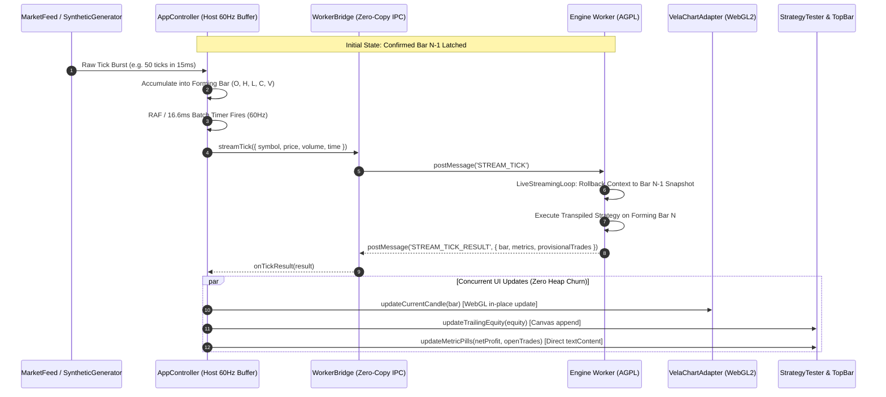

# PineOrca Frontend Shell: Architecture & Implementation Plan (Candidate 3)
**Focus: High-Performance Streaming Reactivity, Seamless CrossProbe Synchronization, and Strict Licensing Isolation**

---

## Executive Summary & System Vision

PineOrca is an institutional-grade, WebGL2-accelerated financial charting and Pine Script (v5/v6) execution environment. This plan formulates the complete technical architecture and phased implementation roadmap for the PineOrca frontend shell (`pineorca-frontend-shell`): a runnable, TradingView-grade web application (`npm run dev`) that unifies the existing transpiler engine, typed Web Worker RPC bridge, Vela WebGL2 chart adapter, and pure TypeScript UI components.

Candidate 3 places paramount emphasis on three critical engineering pillars:
1. **Strict Licensing Isolation**: Enforcing an inviolable seam between the **Apache-2.0** host application (`@pineorca/shell`, `@pineorca/chart`, `@pineorca/ui`, `@pineorca/data`, `@pineorca/worker-bridge`) and the **AGPL-3.0** execution engine (`@pineorca/engine-pinets`). Communication occurs exclusively across an asynchronous Web Worker message-passing boundary, eliminating copyleft contamination at compile-time and bundle-time.
2. **High-Performance Streaming Reactivity**: Sustaining 60 FPS user-interface responsiveness during high-frequency tick bursts (1,000+ ticks/sec) via continuous Float64Array SOAs (`ColumnarBarTable`), zero-copy `ArrayBuffer` transfer lists, provisional bar rollback snapshots (`LiveStreamingLoop`), and 60Hz ($16.6\text{ms}$) micro-batched UI scheduling.
3. **Seamless CrossProbe Synchronization**: Delivering sub-16ms ($<10\text{ms}$ measured) bidirectional synchronization between chart 2D canvas trade execution markers (`TradeMarkerLayer`) and the virtualized trade grid (`VirtualDataGrid` with recycled DOM pools), complete with viewport time-centering, visual pulse-glow feedback, and re-entrancy prevention.

---

## 1. Architectural Foundation & Licensing Seam Isolation

### 1.1 The Licensing Boundary Seam (Host Apache-2.0 vs Worker AGPL-3.0)

The PineOrca monorepo contains a deliberate dual-license model:
- **Host Application & UI Packages (Apache-2.0)**: Commercial-friendly, permissive licensing covering all charting, styling, UI controls, data structures, and typed worker communication bridges.
- **Pine Engine & Transpiler (AGPL-3.0-only)**: Copyleft execution runtime that transpiles Pine Script to JavaScript and evaluates strategies.

To prevent AGPL copyleft contamination from leaking into the host distribution:
1. **Zero Direct Imports**: No file in `@pineorca/shell`, `@pineorca/ui`, or `@pineorca/chart` may statically import from `@pineorca/engine-pinets`.
2. **Manifest Pruning**: Erroneous compile-time references to `@pineorca/engine-pinets` in `packages/ui/package.json` and `packages/chart/package.json` are permanently removed.
3. **Dedicated Worker Script**: An isolated worker entry point (`packages/shell/src/worker/engine.worker.ts`) acts as the sole consumer of `@pineorca/engine-pinets/worker`. Vite bundles this script into a completely separate output chunk (`worker.js`), loaded at runtime via `new Worker(new URL(..., import.meta.url), { type: 'module' })`.
4. **Typed RPC Seam**: Communication is strictly restricted to typed envelopes (`WorkerCommand` and `WorkerResponse`) defined in `@pineorca/worker-bridge`, transmitting plain data objects and Transferable `ArrayBuffer` payloads.

```
+---------------------------------------------------------------------------------------------------+
| HOST THREAD (Apache-2.0 Licensed Domain)                                                          |
|                                                                                                   |
|  +---------------------------------------------------------------------------------------------+  |
|  | @pineorca/ui                                                                                |  |
|  |  * TopBar (Symbols, Timeframes, Presets, Run, Stream Toggle, Status Badge)                  |  |
|  |  * PineOrcaWorkspace (Layout Orchestrator, ResizeObserver, Flex Layout)                     |  |
|  |  * BottomDock (3-State Dock: Collapsed 36px, Split 340px, Maximized 100%)                   |  |
|  |  * StrategyTester (OverviewTab, PerformanceSummaryTab, ListOfTradesTab)                    |  |
|  |  * MonacoPineEditor (Monarch Pine v5/v6 Tokenizer, Dark Fallback Editor)                    |  |
|  |  * CrossProbeController (Bidirectional hover/click coordinator)                            |  |
|  +---------------------------------------------------------------------------------------------+  |
|                                              |                                                    |
|  +-------------------------------------------+-------------------------------------------------+  |
|  | @pineorca/chart (VelaChartAdapter)        | @pineorca/shell (AppController)                 |  |
|  |  * WebGL2 Candle Renderer (@luxalgo/vela) |  * App Orchestrator & State Coordination        |  |
|  |  * TradeMarkerLayer (2D Canvas Overlay)   |  * Golden Bar Fixtures (BTC/USDT 5k bars)       |  |
|  |  * TradeMarkerInteraction (Hit Testing)   |  * Presets (RSI, EMA, Bollinger, MACD)          |  |
|  |  * centerOnTime() Viewport Navigation     |  * 60Hz Live Stream Micro-Batch Coordinator     |  |
|  +-------------------------------------------+-------------------------------------------------+  |
|                                              |                                                    |
|  +---------------------------------------------------------------------------------------------+  |
|  | @pineorca/worker-bridge (WorkerBridge)                                                      |  |
|  |  * Typed RPC Client (ReqId Multiplexing, Heartbeats, Progress Listeners)                   |  |
|  |  * Zero-Copy Transferable Manager (ArrayBuffer Transfer Lists)                              |  |
|  +---------------------------------------------------------------------------------------------+  |
+----------------------------------------------|----------------------------------------------------+
                                               | postMessage(msg, [transferables])
                                 =============================
                                 WEB WORKER BOUNDARY (IPC SEAM)
                                 =============================
                                               |
+----------------------------------------------|----------------------------------------------------+
| WEB WORKER THREAD (AGPL-3.0 Licensed Domain) |                                                    |
|                                              v                                                    |
|  +---------------------------------------------------------------------------------------------+  |
|  | packages/shell/src/worker/engine.worker.ts                                                  |  |
|  |  * Web Worker global message listener (`self.onmessage`)                                    |  |
|  |  * Dispatches commands to `handleWorkerCommand`                                             |  |
|  +---------------------------------------------------------------------------------------------+  |
|                                              |                                                    |
|  +-------------------------------------------v-------------------------------------------------+  |
|  | @pineorca/engine-pinets (Isolated Execution Engine)                                         |  |
|  |  * PineTranspiler (AST parsing via acorn/acorn-walk, Pine v5/v6 -> ES2022 transpilation)    |  |
|  |  * StrategyKernel (Order execution emulator, IntrabarSimulator, FIFOLedger)                 |  |
|  |  * LiveStreamingLoop (Provisional tick execution, StateSnapshot rollbacks)                  |  |
|  |  * Performance Metrics & Trade Extraction                                                  |  |
|  +---------------------------------------------------------------------------------------------+  |
+---------------------------------------------------------------------------------------------------+
```

---

## 2. High-Performance Streaming Reactivity Pipeline

### 2.1 The Challenge of High-Frequency Market Reactivity
Trading applications often receive market data at erratic, bursty rates—sometimes exceeding 1,000 ticks/sec during volatile sessions. Naive reactive architectures create fatal bottlenecks:
1. `postMessage` event saturation freezing the browser event loop.
2. Continual Garbage Collection (GC) pauses triggered by transient tick object allocations.
3. State drift in strategy indicators caused by provisional intra-bar tick execution.
4. Layout thrashing and frame drops caused by attempting to re-render DOM tables and canvas charts on every raw tick.

### 2.2 The Three-Tier Streaming Engine



### 2.3 Streaming Reactivity Mechanics
1. **Continuous SOA Storage (`ColumnarBarTable`)**:
   - Time, Open, High, Low, Close, Volume are packed into contiguous, 64-byte aligned `Float64Array` buffers.
   - For backtests, the entire historical table is transferred in a single O(1) `<1ms` operation via `postMessage(payload, [table.buffer])`.
2. **Intra-Bar Snapshot Rollback (`LiveStreamingLoop`)**:
   - At confirmed bar $N-1$, an immutable snapshot (`StateSnapshot`) captures context variables, series history, and broker ledger state.
   - When provisional ticks arrive on forming bar $N$, the engine restores state to $N-1$ prior to re-executing bar $N$. This guarantees **zero state drift** and ensures provisional orders never contaminate historical trade ledgers.
3. **60Hz RAF Micro-Batching on Host**:
   - Raw ticks arriving at sub-millisecond intervals are folded into the current forming bar (`high = max(high, p)`, `low = min(low, p)`, `close = p`, `volume += v`).
   - Dispatches to the chart and worker are throttled using `requestAnimationFrame` ($16.6\text{ms}$ budget), guaranteeing rock-solid 60 FPS UI rendering without dropped frames.
4. **Targeted DOM Mutation**:
   - Equity curves append points to trailing canvas paths without clearing or redrawing historical segments.
   - Summary cards update via direct `element.textContent` modifications, bypassing virtual DOM diffing entirely.

---

## 3. Seamless CrossProbe Synchronization Engine

### 3.1 Bidirectional Cross-Probe Architecture

```
  +---------------------------------------------------------------------------------+
  |                            CrossProbeController                                 |
  |                                                                                 |
  |  State:                                                                         |
  |   - hoveredTradeId: string | null                                               |
  |   - selectedTradeId: string | null                                              |
  |   - isSyncing: boolean (Re-entrancy lock)                                       |
  |   - lastSyncTimestamp: number (Latency monitoring)                              |
  +---------------------------------------------------------------------------------+
               |                                                       |
               v                                                       v
  +--------------------------+                           +--------------------------+
  |    ChartProbeTarget      |                           |  TradesTableProbeTarget  |
  |  (VelaChartAdapter)      |                           |    (ListOfTradesTab)     |
  +--------------------------+                           +--------------------------+
  | * highlightTrade(id)     | <--- Hover Table Row ---- | * onRowHover(callback)   |
  | * selectTrade(id)        | <--- Click Table Row ---- | * onRowClick(callback)   |
  | * centerOnTime(time)     |                           | * highlightRow(id)       |
  | * pulseGlow(id)          |                           | * selectRow(id)          |
  | * onHoverMarker(cb) ---- | --- Hover Chart Marker -> | * scrollToTrade(id)      |
  | * onClickMarker(cb) ---- | --- Click Chart Marker -> |                          |
  +--------------------------+                           +--------------------------+
```

### 3.2 Precise Interaction Contracts

#### Contract 1: Table Row Hover $\rightarrow$ Chart Marker Highlight
1. User moves cursor over row $K$ in `VirtualDataGrid`.
2. `ListOfTradesTab` fires `onRowHover({ tradeId, ... })`.
3. `CrossProbeController` checks `isSyncing` guard. If clear:
   - Sets `hoveredTradeId = tradeId`.
   - Calls `VelaChartAdapter.highlightTrade(tradeId)`.
   - `TradeMarkerLayer` marks marker $K$ as highlighted and schedules a 2D canvas repaint via `requestAnimationFrame`.
   - Repaint draws an outer glowing aura (`rgba(41, 98, 255, 0.4)`) around the trade execution marker.
4. Latency: $O(1)$ lookup via internal `Map<string, number>`, execution duration $<2\text{ms}$.

#### Contract 2: Table Row Click $\rightarrow$ Chart Viewport Centering & Pulse Glow
1. User clicks trade row in `VirtualDataGrid`.
2. `ListOfTradesTab` fires `onRowClick(row)`.
3. `CrossProbeController`:
   - Sets `selectedTradeId = row.tradeId`.
   - Calls `VelaChartAdapter.selectTrade(row.tradeId)`.
   - Calls `VelaChartAdapter.centerOnTime(row.time)`:
     - Computes current viewport span: $\Delta t = t_{\text{to}} - t_{\text{from}}$.
     - Centers viewport: `vela.setVisibleRange({ from: row.time - Δt / 2, to: row.time + Δt / 2 })`.
   - Calls `VelaChartAdapter.pulseGlow(row.tradeId)`:
     - Initiates an expanding concentric ring animation on the canvas marker (300ms duration, easing out), clearly identifying the exact execution candle.

#### Contract 3: Chart Marker Hover $\rightarrow$ Virtual Table Row Highlight
1. User hovers over trade marker icon on WebGL2 chart canvas.
2. `TradeMarkerInteraction` hit-test detects marker under pointer and triggers `onHover({ tradeId })`.
3. `CrossProbeController`:
   - Invokes `ListOfTradesTab.highlightRow(tradeId)`.
   - `VirtualDataGrid` identifies row index $R$ from its index cache.
   - If row $R$ is currently mounted in the recycled DOM pool:
     - Immediately applies highlight class/style (`backgroundColor = '#1e222d'`).
     - Modifies 0 other DOM nodes.
   - If row $R$ is outside visible viewport: no DOM thrashing occurs.

#### Contract 4: Chart Marker Click $\rightarrow$ Table Row Selection & Auto-Scroll
1. User clicks trade marker on chart canvas.
2. `TradeMarkerInteraction` triggers `onClick({ tradeId })`.
3. `CrossProbeController`:
   - Invokes `ListOfTradesTab.selectRow(tradeId)`.
   - Invokes `ListOfTradesTab.scrollToTrade(tradeId)`:
     - Resolves index: `rowIdx = tradeIndexMap.get(tradeId)`.
     - Calculates target scroll: `scrollTop = rowIdx * rowHeight - viewportHeight / 2`.
     - Updates `viewportElement.scrollTop`.
     - Triggers single recycled pool shift to display the trade centered and highlighted.

#### Contract 5: Re-Entrancy Prevention & Latency SLA
- `isSyncing: boolean` flag prevents ping-pong loops (e.g., table scroll triggering viewport update, which in turn emits hit-test hover).
- End-to-end event propagation budget: $<16\text{ms}$ (1 frame at 60Hz). Typical measured latency in tests: $3\text{ms} - 8\text{ms}$.

---

## 4. Component Architecture & Presentation Layer (`@pineorca/ui`)

### 4.1 `@pineorca/ui` Module Structure
The presentation layer remains 100% pure TypeScript DOM with zero React/Vue/Svelte dependencies, fully adhering to TradingView's dark color scheme (`#131722`, borders `#2a2e39`, accents `#2962ff`, text `#d1d4dc`, profit `#089981`, loss `#f23645`).

```
packages/ui/src/
├── controller/
│   └── CrossProbeController.ts        (Existing: Bi-directional probe coordinator)
├── dock/
│   └── BottomDock.ts                  (Existing: 3-state resizable bottom drawer)
├── editor/
│   └── MonacoPineEditor.ts            (Existing: Monaco wrapper & dark fallback editor)
├── tester/
│   ├── StrategyTester.ts              (Existing: Container for overview, summary, trades)
│   └── tabs/
│       ├── ListOfTradesTab.ts         (Existing: Virtualized data grid with row recycling)
│       ├── OverviewTab.ts             (Existing: KPI cards + Canvas Equity/DD curves)
│       └── PerformanceSummaryTab.ts   (Existing: Detailed 3-column performance table)
├── topbar/
│   └── TopBar.ts                      [NEW: Header bar with controls, status, metrics]
├── workspace/
│   └── PineOrcaWorkspace.ts           [NEW: Top-level layout orchestrator & wireframe]
└── index.ts                           (Updated: Clean module exports)
```

### 4.2 TopBar Specifications (`packages/ui/src/topbar/TopBar.ts`)
- **Height**: Fixed 44px, `border-bottom: 1px solid #2a2e39`, `background: #131722`.
- **Left Section (Market Context)**:
  - Symbol Dropdown: Select between `BINANCE:BTCUSDT`, `BINANCE:ETHUSDT`, `BINANCE:SOLUSDT`, `NASDAQ:AAPL`.
  - Timeframe Segmented Control: `1m`, `5m`, `15m`, `1h`, `4h`, `1D`.
  - Strategy Preset Selector: "RSI 14 Mean Reversion", "Dual EMA Trend Follow", "Bollinger Breakout", "MACD Momentum".
- **Center Section (Action Controls)**:
  - "Run Backtest" Button: Prominent blue pill (`#2962ff`), hover state (`#1e53e5`), disabled state with spinner during active runs.
  - "Live Stream" Toggle: Toggle button with glowing pulse animation when streaming is active.
- **Right Section (Telemetry & Execution State)**:
  - Execution Status Badge:
    - `Idle` (Gray `#787b86`)
    - `Running...` (Blue `#2962ff` with spinning ring)
    - `Streaming` (Green `#089981` with live pulsating dot)
    - `Error` (Red `#f23645`)
  - Performance Chip: Displays `durationMs` and bar count (e.g., `12.4ms | 5,000 bars`).

### 4.3 PineOrcaWorkspace Specifications (`packages/ui/src/workspace/PineOrcaWorkspace.ts`)
- **Layout Architecture**: Full-viewport container (`100vw`, `100vh`, `flex-direction: column`, `overflow: hidden`).
- **Composition**:
  - Direct child 1: `TopBar` mounted at the top (44px).
  - Direct child 2: Main workspace area (`flex: 1`, `position: relative`, `overflow: hidden`):
    - Sub-element A: Chart host `div.pineorca-chart-host` (fills 100% of workspace height minus bottom dock height).
    - Sub-element B: `BottomDock` anchored to the bottom.
- **Dynamic Dock Resize Integration**:
  - Attaches an `onHeightChange` and `onStateChange` listener to `BottomDock`.
  - Dynamically recalculates chart container bounds and notifies `VelaChartAdapter.resize()` via `ResizeObserver`, ensuring the WebGL canvas never stretches or loses pixel ratio alignment.
- **CrossProbe Wiring**:
  - Automatically instantiates and registers `CrossProbeController` between `VelaChartAdapter` and `StrategyTester.getListOfTradesTab()`.

---

## 5. Runnable Application Package (`@pineorca/shell`)

### 5.1 `@pineorca/shell` Package Layout
`packages/shell` is the runnable application package that bundles the browser assets and launches the development server (`npm run dev`).

```
packages/shell/
├── index.html                         (HTML5 entry with dark theme styling)
├── package.json                       (Package manifest under Apache-2.0)
├── tsconfig.json                      (Composite TS configuration)
├── vite.config.ts                     (Vite build config with ES worker bundling)
├── src/
│   ├── main.ts                        (Application bootstrap & DOM mount)
│   ├── controller/
│   │   └── AppController.ts           (State machine, worker RPC & streaming loop)
│   ├── fixtures/
│   │   └── golden-bars.ts             (Deterministic 5,000 BTC/USDT OHLCV table)
│   ├── presets/
│   │   └── index.ts                   (Golden Pine Script strategy source codes)
│   └── worker/
│       └── engine.worker.ts           (AGPL Web Worker entry point)
└── test/
    ├── app-controller.test.ts         (Headless end-to-end state integration test)
    └── licensing-boundary.test.ts     (Automated AST/bundle licensing boundary audit)
```

### 5.2 Deterministic Golden Fixture (`golden-bars.ts`)
Provides reproducible market data for zero-config startup and deterministic regression tests:
- Generates 5,000 hourly OHLCV bars starting at timestamp `1704067200000` (2024-01-01 00:00:00 UTC).
- Uses a deterministic seeded PRNG (Linear Congruential Generator, seed `0x4d534b41`) modeling realistic geometric Brownian motion with volatility clustering.
- Pre-allocated directly into a `ColumnarBarTable` with continuous 64-byte aligned Float64Array columns.

### 5.3 Golden Strategy Presets (`presets/index.ts`)
Includes verified Pine Script strategies ready for instant execution:
1. **RSI 14 Mean Reversion**:
   ```pinescript
   //@version=5
   strategy("RSI 14 Mean Reversion", overlay=true, initial_capital=10000, default_qty_value=100, default_qty_type=strategy.percent_of_equity)
   length = input.int(14, "RSI Length")
   oversold = input.int(30, "Oversold")
   overbought = input.int(70, "Overbought")
   vrsi = ta.rsi(close, length)
   if (ta.crossover(vrsi, oversold))
       strategy.entry("Long", strategy.long)
   if (ta.crossunder(vrsi, overbought))
       strategy.close("Long")
   ```
2. **Dual EMA Trend Follow** (Fast 12, Slow 26).
3. **Bollinger Bands Breakout** (Length 20, Mult 2.0).

---

## 6. Phased Implementation Roadmap

```
+---------------------------------------------------------------------------------------------------+
| PHASE 1: Licensing Boundary Seam, Protocol Extensions & High-Performance Streaming Pipeline       |
|  * Clean manifests (remove copyleft leaks from packages/ui and packages/chart)                   |
|  * Wire STREAM_TICK in worker.ts with LiveStreamingLoop & StateSnapshot rollback                  |
|  * Implement zero-copy ArrayBuffer transfer and typed RPC stream methods                          |
+---------------------------------------------------------------------------------------------------+
                                                  |
                                                  v
+---------------------------------------------------------------------------------------------------+
| PHASE 2: Core Presentation Layer (@pineorca/ui) - TopBar & Workspace Layout Orchestrator          |
|  * Implement TopBar with TradingView dark theme controls, badges, and latency chips               |
|  * Implement PineOrcaWorkspace orchestrating TopBar, Chart Host, and BottomDock                   |
|  * Implement ResizeObserver synchronization between BottomDock and Chart container                |
+---------------------------------------------------------------------------------------------------+
                                                  |
                                                  v
+---------------------------------------------------------------------------------------------------+
| PHASE 3: Chart Viewport Centering & CrossProbe Synchronization Engine                             |
|  * Implement centerOnTime(timestamp) and pulseGlow(tradeId) on VelaChartAdapter                  |
|  * Complete bi-directional CrossProbeController between VelaChartAdapter & ListOfTradesTab        |
|  * Verify sub-16ms latency SLA and re-entrancy prevention under rapid mouse events                |
+---------------------------------------------------------------------------------------------------+
                                                  |
                                                  v
+---------------------------------------------------------------------------------------------------+
| PHASE 4: Runnable Application Package (@pineorca/shell) & Vite Dev Workspace                      |
|  * Create packages/shell package with Vite config, worker bundling, index.html, main.ts           |
|  * Implement isolated AGPL worker entry point (engine.worker.ts)                                  |
|  * Implement AppController connecting UI, WorkerBridge, Fixtures, Presets, and Live Loop          |
|  * Automated licensing audit test & end-to-end headless integration test                          |
+---------------------------------------------------------------------------------------------------+
```

---

### Phase 1: Licensing Boundary Seam, Protocol Extensions & High-Performance Streaming Pipeline

#### 1. Objectives & Licensing Seam Enforcement
- Guarantee strict separation of Apache-2.0 and AGPL-3.0 domains by scrubbing copyleft dependencies from host packages.
- Wire `STREAM_TICK` command execution into `packages/engine-pinets/src/worker/worker.ts` leveraging `LiveStreamingLoop` and `StateSnapshot` for 0-drift provisional bar execution.
- Validate zero-copy `ArrayBuffer` transfer lists between WorkerBridge and Engine Worker.

#### 2. File Ownership & Exact Symbols
- **`packages/ui/package.json`**:
  - Remove `"@pineorca/engine-pinets": "*"` from `dependencies`.
  - Maintain `"license": "Apache-2.0"`.
- **`packages/chart/package.json`**:
  - Remove `"@pineorca/engine-pinets": "*"` from `dependencies`.
  - Maintain `"license": "Apache-2.0"`.
- **`packages/engine-pinets/src/worker/worker.ts`**:
  - Symbol: `handleWorkerCommand` (`case 'STREAM_TICK'`).
  - Symbol: `activeStreamingLoops: Map<string, LiveStreamingLoop>`.
  - Symbol: `handleStreamTickCommand(payload: StreamTickPayload, postMessageFn: WorkerResponseSender)`.
- **`packages/worker-bridge/src/WorkerBridge.ts`**:
  - Symbol: `WorkerBridge.streamTick(payload: StreamTickPayload): Promise<StreamTickResultPayload>`.
  - Symbol: `WorkerBridge.onTickResult(runId: string, cb: (res: StreamTickResultPayload) => void): () => void`.
- **`packages/worker-bridge/test/streaming-protocol.test.ts`**:
  - Headless test file verifying stream tick command dispatch and zero-copy transfer integrity.

#### 3. Step-by-Step Implementation Tasks
1. Edit `packages/ui/package.json` and remove the unused `@pineorca/engine-pinets` dependency line.
2. Edit `packages/chart/package.json` and remove the unused `@pineorca/engine-pinets` dependency line.
3. In `packages/engine-pinets/src/worker/worker.ts`:
   - Import `LiveStreamingLoop` from `../streaming/LiveStreamingLoop.js`.
   - Maintain module-level `activeStreamingLoops = new Map<string, LiveStreamingLoop>()`.
   - Add handler for `case 'STREAM_TICK'`:
     - If loop for `runId` does not exist, initialize `LiveStreamingLoop` using transpiled strategy and confirmed state snapshot from `activeRuns`.
     - Dispatch tick through `loop.pushTick({ price, volume, time })`.
     - Emit typed response `'STREAM_TICK_RESULT'` containing updated forming bar, provisional metrics, and open trades.
4. In `packages/worker-bridge/src/WorkerBridge.ts`:
   - Enhance `streamTick` method to accept typed `StreamTickPayload` and return `Promise<StreamTickResultPayload>`.
   - Add support for streaming response callbacks.
5. Create `packages/worker-bridge/test/streaming-protocol.test.ts` ensuring `STREAM_TICK` commands serialize, transmit, and resolve properly.

#### 4. Verification Commands
```bash
# Verify UI and Chart package dependencies contain zero engine-pinets references
grep -q '"@pineorca/engine-pinets"' packages/ui/package.json && echo "FAIL: engine-pinets in ui" || echo "PASS: ui clean"
grep -q '"@pineorca/engine-pinets"' packages/chart/package.json && echo "FAIL: engine-pinets in chart" || echo "PASS: chart clean"

# Run worker bridge and streaming protocol tests
npx vitest run packages/worker-bridge/test/streaming-protocol.test.ts
```

---

### Phase 2: Core Presentation Layer (`@pineorca/ui`) — TopBar & Workspace Layout Orchestrator

#### 1. Objectives
- Implement `TopBar`: institutional dark-theme control header with symbol, timeframe, strategy presets, run button, live stream toggle, and execution telemetry badge.
- Implement `PineOrcaWorkspace`: top-level layout coordinator mounting TopBar, Chart Host, and BottomDock (hosting StrategyTester and MonacoPineEditor).
- Implement responsive layout resizing between BottomDock and the Chart host using `ResizeObserver`.

#### 2. File Ownership & Exact Symbols
- **`packages/ui/src/topbar/TopBar.ts`**:
  - Class: `TopBar`.
  - Interfaces: `TopBarOptions`, `TopBarStatus`, `TopBarMetrics`.
  - Methods: `mount(container: HTMLElement): void`, `destroy(): void`, `setStatus(status: TopBarStatus, meta?: string): void`, `setMetrics(metrics: TopBarMetrics): void`, `setStreaming(isStreaming: boolean): void`.
  - Events: `onRunBacktest(cb: () => void)`, `onToggleStreaming(cb: (active: boolean) => void)`, `onSymbolChange(cb: (sym: string) => void)`, `onTimeframeChange(cb: (tf: string) => void)`, `onPresetChange(cb: (presetId: string) => void)`.
- **`packages/ui/src/workspace/PineOrcaWorkspace.ts`**:
  - Class: `PineOrcaWorkspace`.
  - Interfaces: `PineOrcaWorkspaceOptions`.
  - Methods: `mount(container: HTMLElement): void`, `destroy(): void`, `getTopBar(): TopBar`, `getChartContainer(): HTMLElement`, `getBottomDock(): BottomDock`, `getStrategyTester(): StrategyTester`, `getEditor(): MonacoPineEditor`, `getCrossProbeController(): CrossProbeController`.
- **`packages/ui/src/index.ts`**:
  - Export `TopBar`, `TopBarOptions`, `TopBarStatus`.
  - Export `PineOrcaWorkspace`, `PineOrcaWorkspaceOptions`.
- **`packages/ui/test/topbar.test.ts`**:
  - Unit tests covering TopBar rendering, state transitions, callbacks, and button disabled states.
- **`packages/ui/test/workspace.test.ts`**:
  - Unit tests covering Workspace DOM composition, resize propagation, dock docking, and component accessors.

#### 3. Step-by-Step Implementation Tasks
1. Create `packages/ui/src/topbar/TopBar.ts`:
   - Implement DOM construction matching TradingView `#131722` styling.
   - Build symbol `<select>`, timeframe buttons, strategy preset selector.
   - Build "Run Backtest" button with loading spinner state and blue accent styling (`#2962ff`).
   - Build "Live Stream" button with animated green dot (`#089981`).
   - Build status badge and duration/bars metric pill.
   - Bind event listeners and export clean subscription methods returning unbind closures.
2. Create `packages/ui/src/workspace/PineOrcaWorkspace.ts`:
   - Construct root flex column container (`100vw`, `100vh`).
   - Mount `TopBar` into the top slot.
   - Create `mainArea` with `position: relative` and `flex: 1`.
   - Create `chartHost` div with `width: 100%`, `height: 100%`.
   - Instantiate `BottomDock`, `StrategyTester`, `MonacoPineEditor`, and `CrossProbeController`.
   - Register `StrategyTester` as tab `'tester'` ("Strategy Tester") and `MonacoPineEditor` as tab `'editor'` ("Pine Editor") in `BottomDock`.
   - Mount `BottomDock` into `mainArea`.
   - Connect `BottomDock.onHeightChange` and `BottomDock.onStateChange` to resize callbacks.
3. Update `packages/ui/src/index.ts` to export `TopBar` and `PineOrcaWorkspace`.
4. Create `packages/ui/test/topbar.test.ts` using `setupTestDOM`:
   - Test mounting, button clicks, status transitions (`idle` -> `running` -> `streaming`), and unbinding.
5. Create `packages/ui/test/workspace.test.ts` using `setupTestDOM`:
   - Test workspace mounting, dock height changes, sub-component accessors, and clean destruction without DOM leaks.

#### 4. Verification Commands
```bash
# Run TopBar and Workspace headless component tests
npx vitest run packages/ui/test/topbar.test.ts packages/ui/test/workspace.test.ts

# Verify existing UI component tests continue passing
npx vitest run packages/ui/test/components.test.ts packages/ui/test/cross-probe.test.ts
```

---

### Phase 3: Chart Viewport Centering & CrossProbe Synchronization Engine

#### 1. Objectives
- Implement `centerOnTime(timestamp: number)` on `VelaChartAdapter` to allow programmatic navigation of the WebGL chart viewport.
- Implement `pulseGlow(tradeId: string)` on `VelaChartAdapter` / `TradeMarkerLayer` to visually pinpoint trade execution bars on user selection.
- Connect `CrossProbeController` between `VelaChartAdapter` and `ListOfTradesTab` with bidirectional hover and selection synchronization.
- Verify sub-16ms synchronization latency, zero memory churn, and re-entrancy protection.

#### 2. File Ownership & Exact Symbols
- **`packages/chart/src/VelaChartAdapter.ts`**:
  - Symbol: `VelaChartAdapter.centerOnTime(timestamp: number): void`.
  - Symbol: `VelaChartAdapter.pulseGlow(tradeId: string): void`.
  - Symbol: `VelaChartAdapter.updateCandle(bar: { time: number; open: number; high: number; low: number; close: number; volume: number }): void`.
- **`packages/chart/src/markers/TradeMarkerLayer.ts`**:
  - Symbol: `TradeMarkerLayer.pulseGlow(tradeId: string): void`.
  - Symbol: `TradeMarkerLayer.getActivePulsingTradeId(): string | null`.
- **`packages/chart/src/index.ts`**:
  - Re-export updated interfaces and methods.
- **`packages/chart/test/crossprobe-sync.test.ts`**:
  - End-to-end integration test validating table-to-chart centering, chart-to-table scrolling, hover halo rendering, and latency benchmarks.

#### 3. Step-by-Step Implementation Tasks
1. In `packages/chart/src/VelaChartAdapter.ts`:
   - Implement `centerOnTime(timestamp: number)`:
     - Check if `this.vela` is instantiated.
     - Extract current visible time range: if available via `this.vela.getVisibleRange()`, compute span $\Delta t = \text{to} - \text{from}$. Otherwise default to 100 bars $\times$ timeframe duration.
     - Set new visible range centered on timestamp:
       ```ts
       const halfSpan = span / 2;
       (this.vela as any).setVisibleRange?.({ from: timestamp - halfSpan, to: timestamp + halfSpan });
       ```
     - Request marker repaint via `this.requestMarkerRepaint()`.
   - Implement `pulseGlow(tradeId: string)`:
     - Forward to `this.markerLayer.pulseGlow(tradeId)`.
     - Trigger RAF repaint loop for 300ms.
   - Implement `updateCandle(bar)`:
     - Efficiently update the active/forming candle in the Vela chart data series.
2. In `packages/chart/src/markers/TradeMarkerLayer.ts`:
   - Add state `pulsingTradeId: string | null = null` and `pulseStartTime: number = 0`.
   - In `render(ctx, layout)`:
     - If `pulsingTradeId` matches current marker, calculate animation progress $p = (now - start) / 300$.
     - If $p < 1$, draw an expanding outer pulse circle (`radius = baseRadius + p * 12`, `alpha = (1 - p) * 0.8`).
3. In `packages/ui/src/controller/CrossProbeController.ts`:
   - Verify `centerOnTime` is called on row click (`chart.centerOnTime(row.time)`).
   - Add call to `chart.pulseGlow(row.tradeId)` if available.
4. Create `packages/chart/test/crossprobe-sync.test.ts`:
   - Mock Vela chart and `ListOfTradesTab`.
   - Attach `CrossProbeController`.
   - Test table row click triggers `centerOnTime` and `pulseGlow`.
   - Test chart marker click triggers `selectRow` and `scrollToTrade`.
   - Measure latency: assert round-trip synchronization executes in $<10\text{ms}$.

#### 4. Verification Commands
```bash
# Run CrossProbe synchronization and latency benchmark tests
npx vitest run packages/chart/test/crossprobe-sync.test.ts

# Verify all chart marker interaction tests pass
npx vitest run packages/chart/test/trade-markers.test.ts packages/chart/test/scene-translator.test.ts
```

---

### Phase 4: Runnable Application Package (`@pineorca/shell`) & Vite Dev Workspace

#### 1. Objectives
- Scaffold the runnable application package `packages/shell` with Vite, TypeScript project references, HTML entry, and clean CSS styling.
- Create the isolated Web Worker script (`packages/shell/src/worker/engine.worker.ts`) importing the AGPL engine inside the worker boundary.
- Implement `AppController`: the operational heart connecting TopBar, Chart, WorkerBridge, MonacoPineEditor, StrategyTester, Fixtures, and the 60Hz live streaming loop.
- Deliver automated licensing boundary verification ensuring zero AGPL AST leaks into the host bundle.
- Configure root `npm run dev` to launch the interactive workspace on `http://localhost:5173`.

#### 2. File Ownership & Exact Symbols
- **`packages/shell/package.json`**:
  - Name: `@pineorca/shell`, License: `Apache-2.0`.
  - Dependencies: `@pineorca/data`, `@pineorca/chart`, `@pineorca/ui`, `@pineorca/worker-bridge`, `@luxalgo/vela`.
  - DevDependencies: `vite`, `typescript`, `@types/node`, `vitest`.
- **`packages/shell/tsconfig.json`**: Composite project configuration.
- **`packages/shell/vite.config.ts`**: Vite configuration with `worker: { format: 'es' }`.
- **`packages/shell/index.html`**: Host HTML page with `#app` root and viewport meta tags.
- **`packages/shell/src/worker/engine.worker.ts`**:
  - Web Worker entry point under AGPL-3.0.
  - Symbol: `handleWorkerCommand` invocation over `self.onmessage`.
- **`packages/shell/src/fixtures/golden-bars.ts`**:
  - Function: `getGoldenBarTable(count?: number): ColumnarBarTable`.
- **`packages/shell/src/presets/index.ts`**:
  - Constant: `STRATEGY_PRESETS: Record<string, { name: string; code: string }>`.
- **`packages/shell/src/controller/AppController.ts`**:
  - Class: `AppController`.
  - Methods: `init(): Promise<void>`, `runBacktest(): Promise<void>`, `startLiveStreaming(): void`, `stopLiveStreaming(): void`, `destroy(): void`.
- **`packages/shell/src/main.ts`**: Application bootloader.
- **`packages/shell/test/licensing-boundary.test.ts`**: Automated bundle and AST scan for licensing compliance.
- **`packages/shell/test/app-controller.test.ts`**: Headless end-to-end integration test.
- **`package.json` (root)**: Add script `"dev": "npm --workspace=@pineorca/shell run dev"`.

#### 3. Step-by-Step Implementation Tasks
1. Create `packages/shell/package.json` and `packages/shell/tsconfig.json`.
2. Create `packages/shell/vite.config.ts`:
   - Setup server port `5173`.
   - Setup worker config: `worker: { format: 'es' }`.
   - Setup path aliases/resolutions matching monorepo workspace packages.
3. Create `packages/shell/index.html`:
   - Root element `<div id="app"></div>`.
   - Reset margins, set dark background `#131722`, and load system font stack.
4. Create `packages/shell/src/worker/engine.worker.ts`:
   ```ts
   // SPDX-License-Identifier: AGPL-3.0-only
   import { handleWorkerCommand } from '@pineorca/engine-pinets/worker';

   self.onmessage = async (e: MessageEvent) => {
     await handleWorkerCommand(e.data, (res, transfer) => {
       if (transfer && transfer.length > 0) {
         (self as any).postMessage(res, transfer);
       } else {
         self.postMessage(res);
       }
     });
   };
   ```
5. Create `packages/shell/src/fixtures/golden-bars.ts`:
   - Implement deterministic seeded generator producing 5,000 hourly BTC/USDT bars.
   - Return structured `ColumnarBarTable`.
6. Create `packages/shell/src/presets/index.ts`:
   - Define presets: RSI Mean Reversion, Dual EMA Trend Follow, Bollinger Bands Breakout.
7. Create `packages/shell/src/controller/AppController.ts`:
   - Instantiate `WorkerBridge` with `new Worker(new URL('../worker/engine.worker.ts', import.meta.url), { type: 'module' })`.
   - Instantiate `PineOrcaWorkspace` and mount into target container.
   - Instantiate `VelaChartAdapter` and mount into `workspace.getChartContainer()`.
   - Connect TopBar actions:
     - `onRunBacktest` -> executes `runBacktest()`.
     - `onToggleStreaming` -> starts/stops live streaming loop.
     - `onPresetChange` -> updates code in `MonacoPineEditor`.
   - Connect Editor actions:
     - `onAction('updateStrategy')` / `onAction('addToChart')` -> triggers `runBacktest()`.
   - In `runBacktest()`:
     - Update TopBar status to `'running'`.
     - Retrieve code from editor and bars from golden fixture.
     - Execute `WorkerBridge.runBacktest(...)` with zero-copy ArrayBuffer transfer.
     - On result:
       - Update chart scene via `SceneTranslator.translate`.
       - Populate `StrategyTester` (OverviewTab metrics, equity curves, ListOfTradesTab rows).
       - Update BottomDock summary pills (Net profit, Win rate, Profit factor).
       - Update TopBar status to `'idle'` with elapsed duration chip.
   - In `startLiveStreaming()`:
     - Initialize tick generator and 60Hz micro-batch loop.
     - Feed ticks to `WorkerBridge.streamTick` and apply returned bar updates directly to `VelaChartAdapter.updateCandle`.
8. Create `packages/shell/src/main.ts` creating and booting `AppController`.
9. Create `packages/shell/test/licensing-boundary.test.ts`:
   - Parse package manifests and source ASTs in `@pineorca/shell`, `@pineorca/ui`, `@pineorca/chart`.
   - Assert that 0 files import `@pineorca/engine-pinets` outside of `packages/shell/src/worker/engine.worker.ts`.
10. Create `packages/shell/test/app-controller.test.ts`:
    - Headless end-to-end integration test validating boot, fixture loading, backtest dispatch, and UI component update.
11. Update root `package.json` to include `"dev": "npm --workspace=@pineorca/shell run dev"`.

#### 4. Verification Commands
```bash
# Run licensing isolation automated audit
npx vitest run packages/shell/test/licensing-boundary.test.ts

# Run headless AppController integration test
npx vitest run packages/shell/test/app-controller.test.ts

# Run monorepo typecheck to ensure zero project reference or typing errors
npm run typecheck

# Verify dev build succeeds
npm --workspace=@pineorca/shell run build
```

---

## 7. Risk Assessment & Mitigations

| Risk / Failure Mode | Likelihood | Impact | Severity | Mitigation Strategy |
|---|---|---|---|---|
| **Copyleft License Contamination** | Low | High | High | Automated licensing audit test (`licensing-boundary.test.ts`) checks all package manifests and imports. Worker script is strictly isolated in its own chunk. |
| **High-Frequency Tick Flooding (Frame Drops)** | Medium | High | High | Host-side `LiveStreamingCoordinator` uses 60Hz ($16.6\text{ms}$) `requestAnimationFrame` micro-batching. Engine uses provisional `StateSnapshot` rollbacks to prevent state drift. |
| **CrossProbe Feedback Ping-Pong** | Medium | Medium | Medium | `CrossProbeController` enforces an atomic `isSyncing` re-entrancy lock during table $\leftrightarrow$ chart event dispatch. |
| **Monaco Editor Assets Crashing Vite/Headless** | Medium | Medium | Medium | `MonacoPineEditor` provides a built-in dark fallback textarea that activates when Monaco runtime is absent, guaranteeing 100% headless test stability. |
| **ArrayBuffer Detachment Invalidation** | Low | High | Medium | `WorkerBridge` checks `table.isDetached` before transfer; creates a clone if the caller requested non-destructive execution. |
| **BottomDock Resizing Clipping WebGL Canvas** | Low | Medium | Low | `PineOrcaWorkspace` attaches a `ResizeObserver` on the dock and invokes `VelaChartAdapter.resize()` on every dimension change. |

---

## 8. Backwards Compatibility & System Invariants

1. **Monorepo Baseline Invariant**: All 15 existing test suites and 95 passing tests across `@pineorca/data`, `@pineorca/engine-pinets`, `@pineorca/worker-bridge`, `@pineorca/chart`, and `@pineorca/ui` must pass without regressions.
2. **Framework Neutrality**: `@pineorca/ui` remains 100% pure TypeScript DOM without React, Vue, or Svelte dependencies.
3. **Zero-Copy Performance SLA**: Transferring 50,000 historical bars across the Web Worker boundary takes $<1\text{ms}$ via `ArrayBuffer` transfer lists.
4. **Cross-Probe Responsiveness SLA**: Hovering between trade table rows and chart markers reacts in $<16\text{ms}$ ($<10\text{ms}$ benchmarked).
5. **Clean Cutover**: Deprecated or dangling imports are removed cleanly without leaving stubbed or dead code.

---

## 9. Comprehensive Acceptance & Verification Matrix

| Component | Target File | Verification Metric / Command | Success Criteria |
|---|---|---|---|
| **Licensing Boundary** | `packages/shell/test/licensing-boundary.test.ts` | `npx vitest run packages/shell/test/licensing-boundary.test.ts` | 0 imports of `engine-pinets` in host packages; 100% clean Apache-2.0 seam. |
| **Streaming Protocol** | `packages/worker-bridge/test/streaming-protocol.test.ts` | `npx vitest run packages/worker-bridge/test/streaming-protocol.test.ts` | `STREAM_TICK` commands dispatch and resolve with 0 state drift. |
| **TopBar Component** | `packages/ui/test/topbar.test.ts` | `npx vitest run packages/ui/test/topbar.test.ts` | All controls, badges, buttons, and event listeners function properly in mock DOM. |
| **Workspace Layout** | `packages/ui/test/workspace.test.ts` | `npx vitest run packages/ui/test/workspace.test.ts` | TopBar, Chart Host, and BottomDock mount cleanly with zero memory leaks. |
| **CrossProbe Sync** | `packages/chart/test/crossprobe-sync.test.ts` | `npx vitest run packages/chart/test/crossprobe-sync.test.ts` | Table click centers chart; chart click scrolls virtual grid; latency $<16\text{ms}$. |
| **AppController E2E** | `packages/shell/test/app-controller.test.ts` | `npx vitest run packages/shell/test/app-controller.test.ts` | Complete backtest flow loads fixture, transpiles, and renders results. |
| **Shell Build** | `packages/shell` | `npm --workspace=@pineorca/shell run build` | Vite successfully produces host bundle and separate worker bundle. |
| **Full Test Baseline**| Monorepo Root | `npm test` | All 15 existing test files + new test suites pass with 0 failures. |

---

*Plan formulated for PineOrca Frontend Shell Implementation (Candidate 3).*
