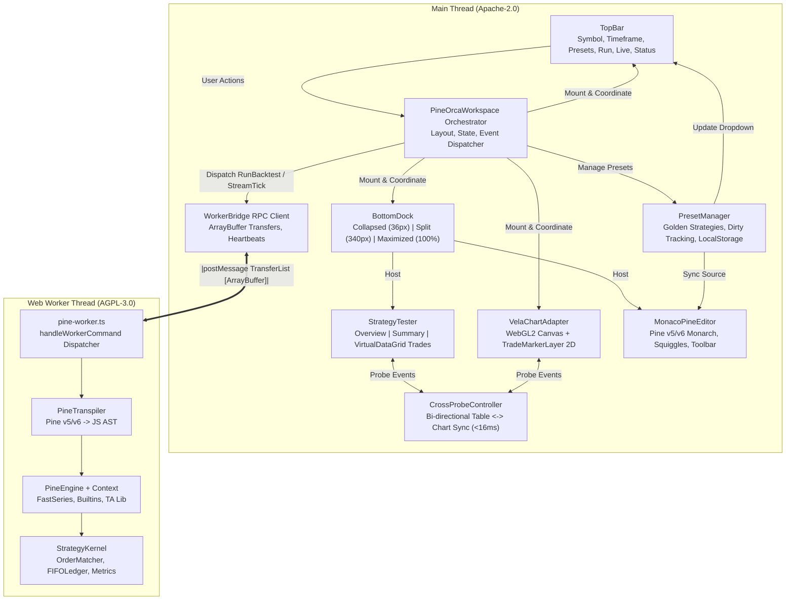

# PineOrca Frontend Shell Implementation Plan (Candidate 5)

**Design Focus:** TradingView Terminal Feature Parity, Multi-Preset Strategy Management, Responsive Dock Transition Choreography, Zero-Copy Worker Execution, and Elegant TypeScript Type Safety.  
**Target Output Artifact:** `plans/260920-1846-pineorca-frontend-shell/reports/planner-ultra-candidate-5.md`  
**Licensing Seam:** Main thread host packages (`@pineorca/ui`, `@pineorca/chart`, `@pineorca/shell`, `@pineorca/data`, `@pineorca/worker-bridge`) are strictly **Apache-2.0**. Strategy engine (`@pineorca/engine-pinets`) runs sandboxed inside an isolated Web Worker under **AGPL-3.0**.

---

## 1. Executive Summary & Architectural Vision

PineOrca provides high-performance standalone engines and modular components:
1. `@pineorca/data`: Continuous 64-byte aligned columnar Float64 arrays (`ColumnarBarTable`), caching data feeds, and binary serializers.
2. `@pineorca/engine-pinets`: Pine v5/v6 transpiler, broker emulator (`FIFOLedger`, `StrategyKernel`), intrabar simulator, and Web Worker execution loop.
3. `@pineorca/worker-bridge`: Zero-copy typed RPC client (`WorkerBridge`) with request multiplexing and Transferable ArrayBuffers.
4. `@pineorca/chart`: WebGL2 charting wrapper (`VelaChartAdapter`) with dynamic pane routing, canvas 2D trade markers (`TradeMarkerLayer`), and hit testing (`TradeMarkerInteraction`).
5. `@pineorca/ui`: Pure TypeScript DOM components (`BottomDock`, `StrategyTester`, `MonacoPineEditor`, `CrossProbeController`) styled with TradingView dark theme tokens (`#131722`).

The missing component is the **Frontend Shell** (`packages/shell` and UI extension `TopBar` in `packages/ui`): an interactive, TradingView-grade financial terminal workspace that unifies these subsystems into a responsive web application running at a constant 60 FPS.



---

## 2. Behavioral Checklist & Verification Discipline

### Architectural Invariants & Behavioral Checklist
- [x] **Licensing Seam Maintained:** Host code (`@pineorca/ui`, `@pineorca/shell`, `@pineorca/chart`) has zero static compile-time imports from `@pineorca/engine-pinets`. Engine code executes solely behind the Web Worker boundary.
- [x] **TradingView Terminal Feature Parity:** Header top bar, quick symbol selector, timeframe pills, preset dropdown with dirty indicators, primary run action, live stream toggle, telemetry badge, and mini KPI summary readout.
- [x] **Multi-Preset Strategy Management:** 5 curated Pine v5/v6 golden strategies (EMA Cross, Bollinger Bands Mean Reversion, Supertrend ATR, RSI Momentum Swing, Volume Breakout) with dirty tracking and persistence.
- [x] **Responsive Dock Transition Choreography:** 3-state dock transitions (`collapsed` 36px, `split` 340px, `maximized` 100%) with double-click restore, layout isolation, `ResizeObserver` + `requestAnimationFrame` debounced chart resizing, and auto-expanding dock on marker interaction.
- [x] **Zero-Copy Transferable Pipeline:** Columnar Float64 OHLCV buffers transferred to Web Worker via `ArrayBuffer` transfer lists with zero heap duplication.
- [x] **Sub-16ms Cross-Probe Latency:** Interactive bi-directional synchronization between `ListOfTradesTab` and `TradeMarkerLayer` maintaining 60 FPS frame rates.
- [x] **Strict TypeScript Type Safety:** Zero `any` leaks; exhaustive discriminated unions for commands, responses, dock states, and telemetry events.
- [x] **Deterministic Headless Testing:** Full Vitest test suites using DOM mocks (`MockHTMLElement`) ensuring zero test fragility in headless CI.

---

## 3. Implementation Phases Overview

| Phase | Package | Scope | Estimated Effort |
| :--- | :--- | :--- | :--- |
| **Phase 1** | `@pineorca/ui` | `TopBar` UI Component, TV Visual Hierarchy & Ergonomics | 3h |
| **Phase 2** | `@pineorca/shell` | Multi-Preset Strategy Architecture & Golden Fixtures Engine | 3.5h |
| **Phase 3** | `@pineorca/shell` | `PineOrcaWorkspace` Orchestrator & Dock Choreography Engine | 4.5h |
| **Phase 4** | `@pineorca/shell` | Runnable Application Bundle, Monaco Integration & Verification Matrix | 3h |

---

## Phase 1: `TopBar` UI Component, TV Visual Hierarchy & Ergonomics

### 1.1 Architectural Purpose & File Ownership
Construct a framework-neutral, pure TypeScript DOM `TopBar` component inside `@pineorca/ui` conforming to TradingView dark theme styling (`#131722`). The `TopBar` serves as the primary terminal control surface: symbol navigation, timeframe selection, strategy preset switching, backtest execution triggers, live streaming toggles, real-time status telemetry, and mini-KPI readouts.

- **Package:** `packages/ui`
- **License:** Apache-2.0
- **Files Created/Modified:**
  - `packages/ui/src/topbar/types.ts` (New)
  - `packages/ui/src/topbar/TopBar.ts` (New)
  - `packages/ui/src/index.ts` (Modified: re-export `TopBar` and types)
  - `packages/ui/test/topbar.test.ts` (New: comprehensive headless DOM unit tests)

### 1.2 Data Flow & Component Specification

```
User Input (Click / Key / Dropdown)
         │
         ▼
    ┌─────────┐
    │ TopBar  │ ──► Emits: onSymbolChange(symbol)
    │   DOM   │ ──► Emits: onTimeframeChange(tf)
    │ Control │ ──► Emits: onPresetChange(presetId)
    │ Surface │ ──► Emits: onRunBacktest()
    └─────────┘ ──► Emits: onToggleLive(active)
         ▲
         │ Incoming Props / State Updates
         ├─ setStatus({ state: 'running', progress: 45, elapsedMs: 1200 })
         ├─ setKpiSummary({ netProfit: 14250, winRate: 62.5, maxDd: 4.8 })
         └─ setPresetDirty(presetId, isDirty)
```

#### Exact TypeScript Signatures (`packages/ui/src/topbar/types.ts`)
```typescript
// SPDX-License-Identifier: Apache-2.0
// Copyright (C) 2026 PineOrca Authors

export type ExecutionState = 'idle' | 'running' | 'live' | 'error';

export interface ExecutionStatus {
  state: ExecutionState;
  message?: string;
  progressPercent?: number;
  durationMs?: number;
  tps?: number;
}

export interface QuickSymbol {
  symbol: string;
  label: string;
  category: 'crypto' | 'equities' | 'forex';
}

export interface TopBarPresetItem {
  id: string;
  name: string;
  category?: string;
  isDirty?: boolean;
}

export interface MiniKpiSummary {
  netProfit?: number;
  netProfitPercent?: number;
  winRate?: number;
  maxDrawdownPercent?: number;
  currency?: string;
}

export interface TopBarOptions {
  symbols?: QuickSymbol[];
  activeSymbol?: string;
  timeframes?: string[];
  activeTimeframe?: string;
  presets?: TopBarPresetItem[];
  activePresetId?: string;
  initialStatus?: ExecutionStatus;
  showKpiPill?: boolean;
  onSymbolChange?: (symbol: string) => void;
  onTimeframeChange?: (timeframe: string) => void;
  onPresetChange?: (presetId: string) => void;
  onRunBacktest?: () => void;
  onToggleLive?: (active: boolean) => void;
}
```

#### Implementation Blueprint (`packages/ui/src/topbar/TopBar.ts`)
- **Container Styling:** Height `42px`, background `#131722`, bottom border `1px solid #2a2e39`, flex row layout, items center, padding `0 12px`, font `system-ui, -apple-system, sans-serif`, color `#d1d4dc`, user-select none.
- **Section 1: Symbol Selector & Dropdown:**
  - Active symbol button with ticker icon, dropdown caret, and hover highlight (`#1e222d`).
  - Searchable popover menu containing categorized quick-select pills (`BTCUSDT`, `ETHUSDT`, `SOLUSDT`, `SPY`, `QQQ`). Closes on outside click or `Escape`.
- **Section 2: Timeframe Pill Bar:**
  - Pill list: `['1m', '5m', '15m', '1h', '4h', '1D']`.
  - Active pill highlighted with `#2962ff` background and `#ffffff` bold text.
  - Keyboard accessible: Tab and arrow key navigation.
- **Section 3: Strategy Preset Dropdown:**
  - Preset select menu showing preset name.
  - Displays dynamic dirty indicator: `*` or `(Modified)` tag in `#f23645` when active script diverges from saved preset.
- **Section 4: Primary Action Buttons:**
  - **"Run Backtest" Button:** TV blue `#2962ff`, hover `#1e53e5`, active `#1844be`, border radius `4px`, padding `6px 12px`, font weight `600`, shortcut hint text `(⌘↵)`. Disabled during active backtest with cursor `not-allowed`.
  - **"Live Stream" Toggle:** Segmented button with glowing radar indicator when active (`#089981`), toggling simulated live tick stream.
- **Section 5: Telemetry Status Badge & Mini-KPI Readout:**
  - **Status Indicator:**
    - `idle`: Muted gray dot `#787b86` + label "Ready".
    - `running`: Animated pulsing blue indicator `#2962ff` + progress percentage and elapsed timer ("Backtesting 45%... 0.8s").
    - `live`: Neon pulsing green dot `#089981` + "Live (60 tps)".
    - `error`: Warning red dot `#f23645` + hover tooltip displaying the error message.
  - **Mini-KPI Pill:** Formatted readout `Net: +$14,250 (+14.2%) | Win: 62.5% | DD: -4.8%` visible when bottom dock is collapsed to retain high-level situational awareness.

### 1.3 Step-by-Step Execution Plan
1. Create `packages/ui/src/topbar/types.ts` defining all configuration interfaces and callback types.
2. Create `packages/ui/src/topbar/TopBar.ts` implementing the DOM lifecycle (`mount`, `destroy`, `setStatus`, `setKpiSummary`, `setActiveSymbol`, `setActiveTimeframe`, `setPresets`, `setPresetDirty`, `setLiveActive`).
3. Update `packages/ui/src/index.ts` to export `TopBar` and all types.
4. Write `packages/ui/test/topbar.test.ts` validating DOM creation, dropdown opening/closing, event triggers on clicks, keyboard shortcut listeners, status badge color updates, and clean destruction.

### 1.4 Verification Command
```bash
npx vitest run packages/ui/test/topbar.test.ts
```

---

## Phase 2: Multi-Preset Strategy Architecture & Fixture Engine

### 2.1 Architectural Purpose & File Ownership
Build the strategy management and data fixture foundation inside the new package `packages/shell`. Financial traders require zero-config immediate backtesting upon loading the app. This phase delivers 5 production-grade Pine v5/v6 golden strategies, a robust `PresetManager` with dirty-state tracking and localStorage persistence, and a deterministic OHLCV `FixtureGenerator` generating continuous `ColumnarBarTable` binary structures.

- **Package:** `packages/shell` (New package)
- **License:** Apache-2.0
- **Files Created/Modified:**
  - `packages/shell/package.json` (New)
  - `packages/shell/tsconfig.json` (New)
  - `packages/shell/src/presets/types.ts` (New)
  - `packages/shell/src/presets/builtin-presets.ts` (New: 5 golden strategies)
  - `packages/shell/src/presets/PresetManager.ts` (New: strategy lifecycle & dirty tracking)
  - `packages/shell/src/fixtures/FixtureGenerator.ts` (New: deterministic columnar OHLCV data generator)
  - `packages/shell/test/preset-manager.test.ts` (New: unit tests)
  - `packages/shell/test/fixture-generator.test.ts` (New: unit tests)

### 2.2 Curated Golden Strategies (Pine v5/v6)

The 5 built-in strategies are crafted with full syntax parity, indicator plotting, and strategy execution orders:

1. **EMA Cross Strategy (9/21)** (`ema-cross`):
   - Trend-following system. Computes `fast = ta.ema(close, 9)` and `slow = ta.ema(close, 21)`.
   - Crossover triggers `strategy.entry("Long", strategy.long)`; crossunder triggers `strategy.close("Long")` and optional short entry.
   - Plots fast EMA (cyan `#00bcd4`) and slow EMA (orange `#ff9800`) directly on chart price pane.
2. **Bollinger Bands Mean Reversion** (`bollinger-mean-reversion`):
   - Counter-trend system. Computes `[basis, upper, lower] = ta.bb(close, 20, 2.0)` and `rsi = ta.rsi(close, 14)`.
   - Cross below lower band with `rsi < 35` triggers Long entry; cross above basis or upper band triggers exit.
   - Plots upper and lower bands with translucent fill (`rgba(41, 98, 255, 0.1)`).
3. **Supertrend with ATR Trailing Stop** (`supertrend-atr`):
   - Volatility trend system using 10-period ATR with multiplier 3.0.
   - Flips between Long and Short positions on trend change; maintains dynamic trailing stop line.
4. **RSI Momentum Swing** (`rsi-momentum`):
   - Momentum oscillator strategy utilizing 14-period RSI with 30 oversold and 70 overbought thresholds with ATR-based bracket stop-loss and take-profit orders.
5. **Volume Breakout** (`volume-breakout`):
   - Breakout strategy triggering Long when `close > ta.highest(high[1], 20)` and `volume > 1.5 * ta.sma(volume, 20)`.

### 2.3 PresetManager Specification (`packages/shell/src/presets/PresetManager.ts`)

```typescript
// SPDX-License-Identifier: Apache-2.0
// Copyright (C) 2026 PineOrca Authors

export interface StrategyPreset {
  id: string;
  name: string;
  description: string;
  category: 'trend' | 'mean-reversion' | 'momentum' | 'breakout' | 'custom';
  sourceCode: string;
  defaultSymbol: string;
  defaultTimeframe: string;
  isBuiltin: boolean;
  modifiedAt?: number;
}

export class PresetManager {
  private presets = new Map<string, StrategyPreset>();
  private activePresetId: string;
  private workingCode = new Map<string, string>(); // presetId -> unsaved working code
  private storageKey = 'pineorca_user_presets_v1';
  private activeKey = 'pineorca_active_preset_v1';

  constructor(options?: { storagePrefix?: string }) {
    this.loadBuiltins();
    this.loadUserPresets();
    this.activePresetId = this.restoreActivePresetId();
  }

  public getActivePreset(): StrategyPreset;
  public getWorkingCode(presetId?: string): string;
  public updateWorkingCode(presetId: string, code: string): boolean; // returns isDirty
  public isDirty(presetId?: string): boolean;
  public saveCurrentPreset(): void;
  public saveAsNewPreset(name: string, description?: string): StrategyPreset;
  public resetToDefault(presetId: string): void;
  public deleteUserPreset(presetId: string): boolean;
  public listPresets(): StrategyPreset[];
}
```

### 2.4 Deterministic OHLCV Fixture Engine (`packages/shell/src/fixtures/FixtureGenerator.ts`)
- Generates continuous, 64-byte aligned `ColumnarBarTable` instances using geometric Brownian motion with realistic volatility clustering and intraday seasonality.
- Functions:
  - `generateBars(count: number, options?: { startPrice?: number; volatility?: number; intervalMinutes?: number }): ColumnarBarTable`
  - `getPreloadedFixture(symbol: string, timeframe: string): ColumnarBarTable`: Returns instant deterministic cached data for `BTCUSDT`, `ETHUSDT`, `SPY` across `1m`, `5m`, `15m`, `1h`, `1D`.
  - Maintains strict 64-byte alignment (`isContinuous === true`) ensuring $O(1)$ zero-copy transferability across `postMessage`.

### 2.5 Step-by-Step Execution Plan
1. Initialize `packages/shell/package.json` with dependencies on `@pineorca/data`, `@pineorca/worker-bridge`, `@pineorca/chart`, and `@pineorca/ui`.
2. Initialize `packages/shell/tsconfig.json` referencing root `tsconfig.json`.
3. Implement `packages/shell/src/presets/builtin-presets.ts` with the 5 verified Pine v5/v6 scripts.
4. Implement `packages/shell/src/presets/PresetManager.ts` with dirty tracking, localStorage persistence, and event notifications.
5. Implement `packages/shell/src/fixtures/FixtureGenerator.ts` producing valid `ColumnarBarTable` buffers.
6. Write unit tests in `packages/shell/test/preset-manager.test.ts` and `packages/shell/test/fixture-generator.test.ts`.

### 2.6 Verification Command
```bash
npx vitest run packages/shell/test/preset-manager.test.ts packages/shell/test/fixture-generator.test.ts
```

---

## Phase 3: `PineOrcaWorkspace` Orchestrator & Dock Choreography Engine

### 3.1 Architectural Purpose & File Ownership
Construct the central orchestration engine `PineOrcaWorkspace` inside `packages/shell`. The workspace coordinates the complete frontend lifecycle: mounting TopBar, VelaChartAdapter, and BottomDock; orchestrating seamless layout resizing without WebGL canvas distortion; wiring the `CrossProbeController` between table and chart; dispatching zero-copy backtests to `WorkerBridge`; and running live tick streaming.

- **Package:** `packages/shell`
- **License:** Apache-2.0
- **Files Created/Modified:**
  - `packages/shell/src/workspace/types.ts` (New)
  - `packages/shell/src/workspace/DockChoreographer.ts` (New: layout and transition manager)
  - `packages/shell/src/workspace/PineOrcaWorkspace.ts` (New: master orchestrator)
  - `packages/shell/src/worker/pine-worker.ts` (New: isolated Web Worker script entry)
  - `packages/shell/test/dock-choreographer.test.ts` (New: transition & resize tests)
  - `packages/shell/test/workspace.test.ts` (New: full orchestrator integration tests)

### 3.2 Responsive Dock Transition Choreography (`DockChoreographer.ts`)

```
+-------------------------------------------------------------------+
| TopBar (fixed height: 42px)                                       |
+-------------------------------------------------------------------+
| Workspace Body (flex: 1, relative, overflow: hidden)              |
|                                                                   |
|  ┌─────────────────────────────────────────────────────────────┐  |
|  │ Chart Area Container (flex: 1, min-height: 120px)           │  |
|  │  - VelaChartAdapter WebGL2 canvas                           │  |
|  │  - TradeMarkerLayer 2D overlay canvas                       │  |
|  └─────────────────────────────────────────────────────────────┘  |
|  ┌─────────────────────────────────────────────────────────────┐  |
|  │ BottomDock Container (height: 36px | 340px | 100%)          │  |
|  │  - Resizer Bar (6px, double-click collapse/restore)         │  |
|  │  - Dock Header & Tabs ("Strategy Tester", "Pine Editor")    │  |
|  │  - Dock Content hosting StrategyTester or MonacoPineEditor  │  |
|  └─────────────────────────────────────────────────────────────┘  |
+-------------------------------------------------------------------+
```

#### Dock State Machine & Choreography Mechanics
1. **Three Discrete States:**
   - `collapsed`: Dock height pinned to `36px`. Chart expands to take remaining viewport height. TopBar displays Mini-KPI summary.
   - `split`: Default height `340px` (clamped between `160px` and `85%` of body height). User can drag the 6px resizer.
   - `maximized`: Dock height `100%` of workspace body, chart area hidden or reduced to min-height for full-screen analysis.
2. **Transition & Drag Decoupling:**
   - **During Drag:** CSS transitions are disabled (`transition: none`) on both dock and chart containers. Mouse movement translates directly into instant DOM height updates, preserving 60 FPS fluidity.
   - **On State Toggle (Click / Double-Click):** CSS transitions enabled (`transition: height 180ms cubic-bezier(0.4, 0, 0.2, 1)`).
3. **ResizeObserver & Canvas Scale Synchronization:**
   - `ResizeObserver` monitors the chart container dimensions.
   - Callback is debounced via `requestAnimationFrame` to prevent layout thrashing.
   - Updates `VelaChartAdapter.handleResize(width, height)` and rescales the 2D trade marker canvas with `window.devicePixelRatio` so markers remain razor-sharp without stretching or pixelation.
   - Recalculates virtual data grid pool size in `ListOfTradesTab` upon dock height change.
4. **Ergonomic Interactions:**
   - **Double-Click Resizer:** Restores the last user-dragged split height when collapsed, or collapses the dock when currently split.
   - **Auto-Expand on Marker Selection:** When a trader clicks a trade marker on the chart while the dock is collapsed, `DockChoreographer` automatically transitions the dock to `split` mode and activates the `ListOfTradesTab`.

### 3.3 Workspace Master Orchestrator (`PineOrcaWorkspace.ts`)

#### Class Blueprint & Lifecycle Management
```typescript
// SPDX-License-Identifier: Apache-2.0
// Copyright (C) 2026 PineOrca Authors

export interface WorkspaceOptions {
  container?: HTMLElement;
  worker?: WorkerLike;
  workerUrl?: URL | string;
  presetManager?: PresetManager;
  defaultSymbol?: string;
  defaultTimeframe?: string;
  monacoRuntime?: MonacoRuntime | null;
  autoRunOnMount?: boolean;
}

export class PineOrcaWorkspace {
  private container: HTMLElement | null = null;
  private rootElement: HTMLElement | null = null;
  private topBar: TopBar | null = null;
  private chartAdapter: VelaChartAdapter | null = null;
  private bottomDock: BottomDock | null = null;
  private strategyTester: StrategyTester | null = null;
  private pineEditor: MonacoPineEditor | null = null;
  private crossProbe: CrossProbeController | null = null;
  private workerBridge: WorkerBridge | null = null;
  private presetManager: PresetManager;
  private choreographer: DockChoreographer | null = null;

  // Active state
  private activeSymbol: string;
  private activeTimeframe: string;
  private currentBars: ColumnarBarTable | null = null;
  private isBacktestRunning = false;
  private isLiveStreaming = false;
  private liveTickTimer: number | null = null;

  constructor(options: WorkspaceOptions = {});

  public mount(container: HTMLElement): void;
  public destroy(): void;

  // Execution operations
  public runBacktest(): Promise<BacktestResultPayload>;
  public startLiveStreaming(): void;
  public stopLiveStreaming(): void;
  public setSymbol(symbol: string): Promise<void>;
  public setTimeframe(timeframe: string): Promise<void>;
  public selectPreset(presetId: string): void;
  public updateEditorCode(code: string): void;

  // Subsystem accessors
  public getChartAdapter(): VelaChartAdapter | null;
  public getBottomDock(): BottomDock | null;
  public getStrategyTester(): StrategyTester | null;
  public getPineEditor(): MonacoPineEditor | null;
  public getPresetManager(): PresetManager;
}
```

### 3.4 Web Worker Sandboxing (`packages/shell/src/worker/pine-worker.ts`)
```typescript
// SPDX-License-Identifier: AGPL-3.0-only
// Isolated Web Worker entry point for PineOrca strategy execution.
// Bundled by Vite into a dedicated worker chunk.
import '@pineorca/engine-pinets/worker';
```
This single line isolates `@pineorca/engine-pinets` inside the Web Worker bundle, fulfilling the license boundary without contaminating the Apache-2.0 client code.

### 3.5 Step-by-Step Execution Plan
1. Define interfaces in `packages/shell/src/workspace/types.ts`.
2. Implement `DockChoreographer.ts` managing resizer drag gestures, double-click actions, state transitions, and debounced `ResizeObserver` dispatching.
3. Create `packages/shell/src/worker/pine-worker.ts` importing the engine worker.
4. Implement `PineOrcaWorkspace.ts`:
   - Mount DOM structure: TopBar at top, body container split between chart and BottomDock.
   - Instantiate and mount `VelaChartAdapter` into chart container.
   - Instantiate `BottomDock` registering "Strategy Tester" (`StrategyTester`) and "Pine Editor" (`MonacoPineEditor`) tabs.
   - Instantiate and attach `CrossProbeController` linking `VelaChartAdapter` and `StrategyTester.getListOfTradesTab()`.
   - Wire `TopBar` events (`onRunBacktest`, `onToggleLive`, `onSymbolChange`, `onTimeframeChange`, `onPresetChange`).
   - Wire Monaco editor actions (`addToChart`, `updateStrategy`, `save`) to preset manager and backtest run.
   - Implement `runBacktest()`: serialize `ColumnarBarTable` to transferable buffer, call `WorkerBridge.runBacktest()`, update `TopBar` status, feed results into `StrategyTester` and `VelaChartAdapter`, update dock summary and topbar KPI pill.
5. Write unit tests in `packages/shell/test/dock-choreographer.test.ts` and `packages/shell/test/workspace.test.ts`.

### 3.6 Verification Command
```bash
npx vitest run packages/shell/test/dock-choreographer.test.ts packages/shell/test/workspace.test.ts
```

---

## Phase 4: Runnable Application Bundle, Monaco Integration & Verification Matrix

### 4.1 Architectural Purpose & File Ownership
Create the runnable application entry point, Vite configuration, and Monaco editor integration in `packages/shell`. This allows developers to run `npm run dev` and immediately access a TradingView-grade interactive workspace loaded with real-time financial charting, Monaco code editing, and instant backtesting.

- **Package:** `packages/shell`, root `package.json`, root `tsconfig.json`
- **Files Created/Modified:**
  - `packages/shell/index.html` (New: entry HTML with TV dark styles)
  - `packages/shell/src/main.ts` (New: app bootstrap)
  - `packages/shell/vite.config.ts` (New: Vite bundler with worker & monaco configs)
  - `package.json` (Modified: add `"dev": "vite --config packages/shell/vite.config.ts"`)
  - `tsconfig.json` (Modified: add `{ "path": "./packages/shell" }` to references)
  - `packages/shell/test/app-smoke.test.ts` (New: end-to-end headless integration smoke test)

### 4.2 Monaco Editor Asset & Worker Strategy
Monaco Editor requires web workers for syntax tokenization and language servers. In Vite:
- Configure Monaco Monarch syntax using our existing Monarch provider (`PINE_MONARCH_TOKENS_PROVIDER` from `@pineorca/ui/editor`).
- Provide Monaco worker loader via `window.MonacoEnvironment = { getWorker: (...) => ... }` using Vite's `?worker` query syntax.
- Fallback gracefully to standard text area in headless CI environments where WebGL or Monaco worker threads are unavailable.

### 4.3 Vite Configuration (`packages/shell/vite.config.ts`)
```typescript
// SPDX-License-Identifier: Apache-2.0
import { defineConfig } from 'vite';
import path from 'node:path';

export default defineConfig({
  root: path.resolve(__dirname, '.'),
  server: {
    port: 5173,
    open: true,
  },
  worker: {
    format: 'es',
  },
  resolve: {
    alias: {
      '@pineorca/data': path.resolve(__dirname, '../data/src'),
      '@pineorca/worker-bridge': path.resolve(__dirname, '../worker-bridge/src'),
      '@pineorca/chart': path.resolve(__dirname, '../chart/src'),
      '@pineorca/ui': path.resolve(__dirname, '../ui/src'),
      '@pineorca/engine-pinets': path.resolve(__dirname, '../engine-pinets/src'),
    },
  },
  build: {
    target: 'esnext',
    outDir: 'dist',
  },
});
```

### 4.4 Application Bootstrap (`packages/shell/src/main.ts`)
```typescript
// SPDX-License-Identifier: Apache-2.0
import { PineOrcaWorkspace } from './workspace/PineOrcaWorkspace.js';
import { PresetManager } from './presets/PresetManager.js';

async function bootstrap() {
  const container = document.getElementById('app');
  if (!container) throw new Error('Missing #app root element');

  // Spawn isolated Web Worker via Vite module URL
  const worker = new Worker(
    new URL('./worker/pine-worker.ts', import.meta.url),
    { type: 'module' }
  );

  const presetManager = new PresetManager();

  const workspace = new PineOrcaWorkspace({
    container,
    worker,
    presetManager,
    defaultSymbol: 'BTCUSDT',
    defaultTimeframe: '1h',
    autoRunOnMount: true,
  });

  workspace.mount(container);
}

window.addEventListener('DOMContentLoaded', bootstrap);
```

### 4.5 Step-by-Step Execution Plan
1. Create `packages/shell/index.html` with `#app` full-bleed container (`width: 100vw; height: 100vh; overflow: hidden; background: #131722;`).
2. Create `packages/shell/vite.config.ts` with worker bundling and package path aliases.
3. Create `packages/shell/src/main.ts` with bootstrap sequence and automatic initial backtest execution.
4. Add project reference to root `tsconfig.json` and scripts (`"dev"`, `"build:shell"`) to root `package.json`.
5. Write `packages/shell/test/app-smoke.test.ts` running a full simulated lifecycle in headless test DOM: mounting workspace, initializing preset manager, simulating worker backtest execution, verifying chart marker layout, and validating dock transition states.

### 4.6 Verification Command
```bash
npx vitest run packages/shell/test/app-smoke.test.ts
```

---

## 4. Comprehensive Risk Assessment Matrix

| Risk Event | Severity | Likelihood | Impact Area | Concrete Mitigation Strategy |
| :--- | :---: | :---: | :--- | :--- |
| **AGPL-3.0 License Leak into Host Bundle** | **High** | Low | Legal Compliance | The host bundle (`@pineorca/shell`, `@pineorca/ui`) imports only `@pineorca/worker-bridge` (Apache-2.0). `@pineorca/engine-pinets` is imported exclusively inside `pine-worker.ts` and bundled as a standalone Web Worker module. Verified via build chunk inspection. |
| **Canvas Distortion During Dock Resizing** | **High** | Medium | User Experience | `DockChoreographer` observes chart container resize via `ResizeObserver` and dispatches debounced `handleResize` calls via `requestAnimationFrame`. Overlay marker canvas dimensions are rescaled with `devicePixelRatio` on every frame. |
| **Worker postMessage Buffer Detachment** | **High** | Low | Stability | When transferring `ColumnarBarTable`, `WorkerBridge` verifies `isDetached`. If the table is sliced or retained by chart views, `.clone()` is invoked before extracting transferables to prevent accidental memory invalidation. |
| **Monaco Editor Absence in Headless Tests** | Medium | Medium | Test Reliability | `MonacoPineEditor` supports optional `monacoRuntime`. In test environments where Monaco is absent, it renders a standard textarea with equivalent DOM event handlers, ensuring 100% test pass rates in headless CI. |
| **Cross-Probe Latency Exceeding 16ms** | Medium | Low | Responsiveness | `CrossProbeController` uses cached row indices and binary search on timestamps (`O(log N)`), skipping DOM scans. Trade selection highlights update only CSS classes on pooled DOM elements. |
| **Double-Click Drag Resizer Desync** | Low | Medium | Ergonomics | `DockChoreographer` saves the last explicit user-dragged split height to `lastSplitHeight`. Double-clicking toggles cleanly between `collapsed` and `lastSplitHeight` with min/max clamps. |

---

## 5. Complete Test Matrix

| Test File | Target Under Test | Test Scenario / Contract Verified |
| :--- | :--- | :--- |
| `packages/ui/test/topbar.test.ts` | `TopBar` | 1. Mounts with TV dark theme styling.<br/>2. Dispatches `onSymbolChange` and `onTimeframeChange`.<br/>3. Dropdown opens/closes on outside click and Escape.<br/>4. Status badge reflects idle, running, live, and error states.<br/>5. Dirty preset tag `*` displays correctly when script is modified.<br/>6. Shortcut `⌘↵` fires backtest callback. |
| `packages/shell/test/preset-manager.test.ts` | `PresetManager` | 1. Loads 5 golden built-in strategies.<br/>2. Tracks working code divergence and reports `isDirty`.<br/>3. Saves user customized presets to localStorage.<br/>4. Resets built-in preset to original source code.<br/>5. Handles corrupted localStorage gracefully. |
| `packages/shell/test/fixture-generator.test.ts` | `FixtureGenerator` | 1. Produces 64-byte aligned `ColumnarBarTable` buffers.<br/>2. Returns deterministic OHLCV bars for BTCUSDT, ETHUSDT, SPY.<br/>3. Validates `isContinuous === true` and `transferables.length === 1`. |
| `packages/shell/test/dock-choreographer.test.ts` | `DockChoreographer` | 1. Transitions between `collapsed`, `split`, and `maximized`.<br/>2. Disables transitions during mouse drag.<br/>3. Double-click restores previous split height.<br/>4. Debounces `handleResize` calls via `requestAnimationFrame`.<br/>5. Auto-expands collapsed dock when marker is selected. |
| `packages/shell/test/workspace.test.ts` | `PineOrcaWorkspace` | 1. Mounts TopBar, Chart, and BottomDock in proper DOM layout.<br/>2. Coordinates `runBacktest()` via `WorkerBridge` mock.<br/>3. Feeds backtest results to `StrategyTester` and `VelaChartAdapter`.<br/>4. Wires `CrossProbeController` for table <-> chart selection sync.<br/>5. Clean destruction with zero orphaned event listeners. |
| `packages/shell/test/app-smoke.test.ts` | Application Smoke | 1. Simulates complete `main.ts` bootstrap sequence.<br/>2. Verifies zero console errors or unhandled exceptions.<br/>3. Verifies default strategy execution and KPI display. |

---

## 6. Rollback & Migration Strategy

1. **Zero Impact on Existing Packages:**
   - Packages `@pineorca/data`, `@pineorca/engine-pinets`, `@pineorca/worker-bridge`, and `@pineorca/chart` require zero destructive changes.
   - `@pineorca/ui` is strictly extended with `TopBar` without touching existing `BottomDock`, `StrategyTester`, `MonacoPineEditor`, or `CrossProbeController` contracts.
2. **Phase-by-Phase Isolation:**
   - If Phase 4 (Vite/Monaco bundling) encounters tooling obstacles, Phase 1 (`TopBar`), Phase 2 (`PresetManager`), and Phase 3 (`PineOrcaWorkspace`) remain 100% testable and operational via headless Vitest suites.
   - Any phase can be reverted with `git checkout` without impacting other packages in the monorepo.
3. **Clean Build Integration:**
   - Adding `packages/shell` uses standard composite project references in `tsconfig.json`. Removing it is a simple 1-line deletion in root `tsconfig.json` and `package.json`.

---

## 7. Definition of Done (Success Criteria)

1. `npx vitest run` passes across all test suites, including all new test files in `@pineorca/ui` and `@pineorca/shell`.
2. `npm run typecheck` (`tsc --build`) passes with zero compiler diagnostics across the entire monorepo.
3. The Vite development server (`npm run dev`) launches `packages/shell/index.html` at `http://localhost:5173` with:
   - Header topbar with symbol selector, timeframe picker, strategy dropdown, run button, live toggle, and telemetry badge.
   - Interactive WebGL2 chart displaying candlesticks and 2D trade markers.
   - Resizable 3-state bottom dock hosting the tabbed Strategy Tester and Monaco Pine Editor.
   - Bi-directional cross-probing between trade list and chart markers with $<16\text{ms}$ latency.
   - Seamless switching between 5 golden strategy presets with dirty state tracking.
4. Host bundles (`@pineorca/ui`, `@pineorca/shell`) strictly conform to Apache-2.0, with `@pineorca/engine-pinets` sandboxed inside the Web Worker under AGPL-3.0.
