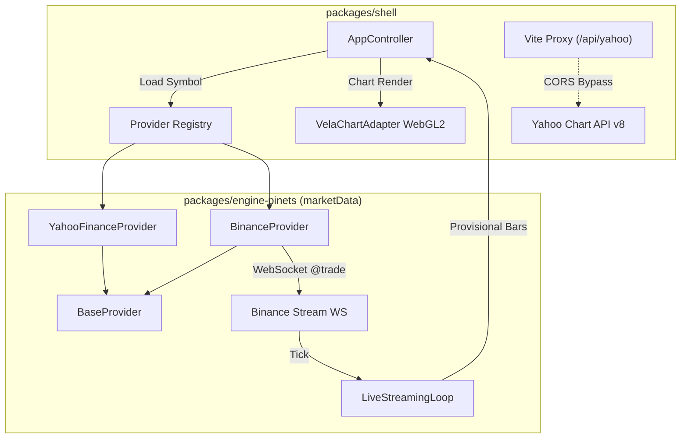

# Binance and Yahoo Finance Market Data Integration

## Overview

Integrate real-world market data feeds into PineOrca, replacing synthetic fixtures with live and historical data:
1. **`YahooFinanceProvider`**: A new market data provider implementing `IProvider` / `BaseProvider` to ingest historical OHLCV bars for US stocks (`AAPL`, `TSLA`), global indices (`^GSPC`, `^DJI`), commodities (`GC=F`), and forex pairs (`EURUSD=X`) using Yahoo Chart API v8.
2. **`BinanceProvider` Live Streaming**: Upgrades the existing Binance provider with WebSocket trade streaming (`@trade` / `@aggTrade`) to feed provisional ticks directly into `LiveStreamingLoop` and the shell's WebGL2 chart.
3. **Shell Wiring & CORS Bypass**: Configures Vite dev proxy for Yahoo Finance and connects both providers to `AppController` in `packages/shell`.
4. **Test Suite**: Verifies data normalization, interval mapping, error resilience, and engine compatibility.

## Goals

| # | Goal | Priority |
|---|------|----------|
| 1 | Create `YahooFinanceProvider` conforming to `IProvider` with auto-aggregation | P1 |
| 2 | Add WebSocket live trade streaming to `BinanceProvider` for `LiveStreamingLoop` | P1 |
| 3 | Configure Vite dev proxy and wire real data loading into `packages/shell/AppController` | P2 |
| 4 | Comprehensive unit/integration tests verifying OHLCV schema and stream lifecycle | P1 |

## Architecture

## Phases

| # | Phase | File | Status |
|---|-------|------|--------|
| 1 | Yahoo Finance Provider Implementation | [phase-01-yahoo-finance-provider.md](./phase-01-yahoo-finance-provider.md) | Completed |
| 2 | Binance WebSocket Live Streaming | [phase-02-binance-websocket-streaming.md](./phase-02-binance-websocket-streaming.md) | Completed |
| 3 | Shell Wiring & Dev Proxy | [phase-03-shell-market-data-wiring.md](./phase-03-shell-market-data-wiring.md) | Completed |
| 4 | Verification & Contract Tests | [phase-04-verification-tests.md](./phase-04-verification-tests.md) | Completed |

## Risks & Mitigations

- **Risk 1 (Yahoo CORS in Browser):** Yahoo API does not supply `Access-Control-Allow-Origin: *`.
  - *Mitigation:* Configure `baseUrl` option in `YahooFinanceProviderConfig` defaulting to direct endpoint (for Node.js/tests), configurable to `/api/yahoo` when run inside Vite shell.
- **Risk 2 (Yahoo Rate Limiting / 429):** High-frequency queries trigger rate limits.
  - *Mitigation:* Integrate `CacheManager` with a 5-minute TTL and mandatory `User-Agent` header.
- **Risk 3 (WebSocket Reconnects):** Network interruptions drop Binance live tick streams.
  - *Mitigation:* Implement exponential backoff reconnect logic with unsubscribe cleanup handlers.

## Success Criteria

- [x] `YahooFinanceProvider` successfully fetches and converts daily/intraday bars into normalized `Kline[]`.
- [x] `BinanceProvider` streams real-time trade ticks over WebSocket and formats them into `Tick` objects.
- [x] `AppController` in `packages/shell` can load real candles from either provider and render them on the Vela chart.
- [x] All vitest test suites in `packages/engine-pinets` pass without regressions.
